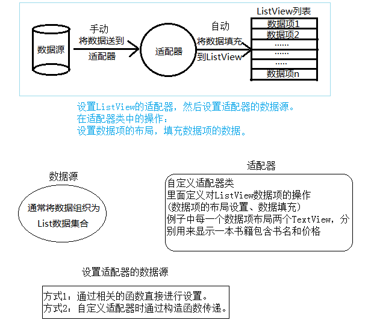

# ListView与适配器

## ListView是什么

​	ListView是一个以垂直方式在项目中显示视图的列表（即在一个窗口里可以滚动查看数据，比如说查看聊天记录），是一种不能实现确定视图中的内容的适配器视图（adapter view）。数据和视图的绑定，需要通过继承ListViewAdapter接口的适配器实现。确保当上下滚动的时候，能够动态刷新视图内容。通常我们都会自定义一个继承自BaseAdapter(已继承ListViewAdapter)，ArrayAdapter(继承自BaseAdapter),SimpleAdapter(继承自BaseAdapter)的类，并重写getView()方法，实现自己想要的功能。


## 适配器是什么

​	适配器是一个连接数据和AdapterView（ListView就是一个典型的AdapterView）的桥梁，通过它能有效地实现数据与AdapterView的分离设置，使AdapterView与数据的绑定更加简便，修改更加方便。简单地来说就是把一些数据给弄得适当，以便于在View上显示。



### 常用的适配器：

```java
//1.BaseAdapter

//BaseAdapter是最基本的适配器。它实际上就是一个抽象类，它有四种抽象方法

    public int getCount()                  得到Item的总数

    public Object getItem(int position)    根据position得到某个Item的对象

    public long getItemId (int position)     根据position得到某个ItemId

    public View getView(int position, View convertView, ViewGroup parent)     //得到相应position对应的Item视图，position当前Item的位置，convertView复用的View对象

//2.ArrayAdapter

//ArrayAdapter是BaseAdapter的子类，与SimpleAdapter相同，ArrayAdapter也不是抽象类，与下面的SimpleA的用法类似，开发者要在构造方法里传入相应的参数即可适配数据，尝适配于TextView。

    public ArrayAdapter（Context context，int resource，int textViewResourceId,T[] objects//需要适配的数据数组）;

//3.SimpleAdapter

//SimpleAdapter继承自BaseAdapter，实现了BaseAdapter的四个抽象方法。开发者需要在创建SimpleAdapter实例时，在构造方法里传入相应的参数即可。要注意的是SimpleAdapter只能适配于Checkable，TextView，ImageView，其中Checkable是一个接口，CheckBox控件就实现了该接口。

    public SimpleAdapter(Context context，List<? extends Map<String, ?>>data,int resource,String[] from,int[] to);
```
#### 1.BaseAdapter

子项布局

```xml
<?xml version="1.0" encoding="utf-8"?>
 <RelativeLayout xmlns:android="http://schemas.android.com/apk/res/android" 
	android:layout_height="fill_parent"
	android:layout_width="fill_parent"> 
 
	<Button
	    android:layout_alignParentRight="true" 
	    android:layout_width="wrap_content"
	    android:layout_height="wrap_content" 
	    android:id="@+id/ItemButton"
	    android:text="按钮"
	    android:focusable="false"/> 
 
	<TextView 
	    android:id="@+id/ItemTitles" 
	    android:layout_height="wrap_content" 
		android:layout_width="fill_parent" 
		android:textSize="20sp"/>
 
 	<TextView
 	    android:id="@+id/ItemTexts" 
 	    android:layout_height="wrap_content" 
		android:layout_width="fill_parent" 
		android:layout_below="@+id/ItemTitles"/> 
</RelativeLayout>
```

MainActivity

```java
public class ListViewBaseAdapter extends Activity {
	private ListView lv;
    /*定义一个动态数组*/     
	ArrayList<HashMap<String, Object>> listItem;
 
	@Override
	public void onCreate(Bundle savedInstanceState) {
		super.onCreate(savedInstanceState);
        setContentView(R.layout.activity_list_view_base_adapter);
        lv = (ListView) findViewById(R.id.base_lv);
        MyAdapter mAdapter = new MyAdapter(this);//得到一个MyAdapter对象
        lv.setAdapter(mAdapter);//为ListView绑定Adapter /*为ListView添加点击事件*/ 
        lv.setOnItemClickListener(new OnItemClickListener() {
            @Override
            public void onItemClick(AdapterView<?> arg0, View arg1, int arg2,
                    long arg3) {
            	Log.v("MyListViewBase", "你点击了ListView条目" + arg2);//在LogCat中输出信息
            }
        });
    }
    /*添加一个得到数据的方法，方便使用*/ 
	private ArrayList<HashMap<String, Object>> getDate(){
    	ArrayList<HashMap<String, Object>> listItem = new ArrayList<HashMap<String,Object>>();
    /*为动态数组添加数据*/     
    	for(int i=0;i<30;i++)  {  
             HashMap<String, Object> map = new HashMap<String, Object>();  
             map.put("ItemTitle", "第"+i+"行");  
             map.put("ItemText", "这是第"+i+"行");  
             listItem.add(map);  
         } 
        return listItem;
    
    }/*      
    * 新建一个类继承BaseAdapter，实现视图与数据的绑定
     */ 
	private class MyAdapter extends BaseAdapter {
		private LayoutInflater mInflater;//得到一个LayoutInfalter对象用来导入布局 /*构造函数*/ 
		public MyAdapter(Context context) {
			this.mInflater = LayoutInflater.from(context);
        }
 
        @Override
        public int getCount() {
            
            return getDate().size();//返回数组的长度        
        }
 
        @Override
        public Object getItem(int position) {
            return null;
        }
 
        @Override
        public long getItemId(int position) {
            return 0;
        }
        /*书中详细解释该方法*/         
        @Override
        public View getView(final int position, View convertView, ViewGroup parent) {
             ViewHolder holder;
            //观察convertView随ListView滚动情况             
 
             Log.v("MyListViewBase", "getView " + position + " " + convertView);
            if (convertView == null) {
                    convertView = mInflater.inflate(R.layout.base_adapter_item,null);
                    holder = new ViewHolder();
                    /*得到各个控件的对象*/                    
                    holder.title = (TextView) convertView.findViewById(R.id.ItemTitles);
                    holder.text = (TextView) convertView.findViewById(R.id.ItemTexts);
                    holder.bt = (Button) convertView.findViewById(R.id.ItemButton);
                    convertView.setTag(holder);//绑定ViewHolder对象                   
            }else{
                    holder = (ViewHolder)convertView.getTag();//取出ViewHolder对象                  
            }
            /*设置TextView显示的内容，即我们存放在动态数组中的数据*/             
            holder.title.setText(getDate().get(position).get("ItemTitle").toString());
            holder.text.setText(getDate().get(position).get("ItemText").toString());
            
            /*为Button添加点击事件*/              
            holder.bt.setOnClickListener(new OnClickListener() {
                @Override
                public void onClick(View v) {
                	Log.v("MyListViewBase", "你点击了按钮" + position);//打印Button的点击信息
                }
            });     
            return convertView;
        }
    }/*存放控件*/ 
	public final class ViewHolder{
		public TextView title;
		public TextView text;
		public Button bt;
    }
}
```

#### 2.ArrayAdapter

新建类Fruit，作为ListView适配器的适配类型

```java
package com.example.listviewtest;

public class Fruit {

    private String name;
    private int imageId;

    public Fruit(String name, int imageId) {
        this.name = name;
        this.imageId = imageId;
    }

    public String getName() {
        return name;
    }

    public int getImageId() {
        return imageId;
    }

}
```

为ListView的子项指定一个我们自定义的布局，在layout目录下新建fruit_item.xml

```xml
<?xml version="1.0" encoding="utf-8"?>
<LinearLayout xmlns:android="http://schemas.android.com/apk/res/android"
	android:orientation="horizontal"
	android:layout_width="match_parent"
	android:layout_height="match_parent">

	<ImageView
		android:id="@+id/fruit_image"
		android:layout_width="wrap_content"
		android:layout_height="wrap_content" />

	<TextView
		android:id="@+id/fruit_name"
		android:layout_width="wrap_content"
		android:layout_height="wrap_content"
		android:layout_gravity="center_vertical"
		android:layout_marginLeft="10dp" />

</LinearLayout>
```

创建一个自定义的适配器FruitAdapter

```java
public class FruitAdapter extends ArrayAdapter<Fruit> {

    private int resourceId;
    //重写父类的构造函数
    //将上下文、ListView子项布局的id和数据都传递进来
    public FruitAdapter(Context context, int textViewResourceId,
                        List<Fruit> objects) {
        super(context, textViewResourceId, objects);
        resourceId = textViewResourceId;
    }

    @Override
    public View getView(int position, View convertView, ViewGroup parent) {
        // 获取当前项的Fruit实例
        Fruit fruit = getItem(position); 
        //LayoutInflater.from(this);  获取LayoutInflater实例
        //使用LayoutInflater为子项加载我们传入的布局
        //inflate的三个参数：要转换的xml布局、给加载好的布局再添加一个父布局、
        //是否让父布局的layout属性失效
        View view = LayoutInflater.from(getContext()).inflate(resourceId, parent, false);
        TextView fruitName = view.findViewById(R.id.fruit_name);
        ImageView fruitImage = view.findViewById(R.id.fruit_image);
        fruitName.setText(fruit.getFruitName());
        fruitImage.setImageResource(fruit.getImageId());
        return view;
}
```

修改MainActivity

```java
public class MainActivity extends AppCompatActivity {

    private List<Fruit> fruitList = new ArrayList<>();

    @Override
    protected void onCreate(Bundle savedInstanceState) {
        super.onCreate(savedInstanceState);
        setContentView(R.layout.activity_main);
        //初始化水果数据
        initFruits();
        FruitAdapter adapter = new FruitAdapter(
                MainActivity.this, R.layout.fruit_item,fruitList
        );
        ListView listView = (ListView) findViewById(R.id.list_view);
        listView.setAdapter(adapter);
    }

    private void initFruits() {
        //初始化水果数据的操作:比如
        /*Fruit apple = new Fruit("Apple", R.drawable.apple_pic);
         *fruitList.add(apple);
         *Fruit banana = new Fruit("Banana", R.drawable.banana_pic);
         *fruitList.add(banana);
        */
}
```

#### 3.SimpleAdapter

sample_adapter_item.xml

```xml
<?xml version="1.0" encoding="utf-8"?>
 <RelativeLayout xmlns:android="http://schemas.android.com/apk/res/android" 
	android:layout_height="fill_parent"
	android:layout_width="fill_parent"> 
	<ImageView
	    android:layout_alignParentRight="true" 
	    android:layout_width="wrap_content"
	    android:layout_height="wrap_content" 
	    android:id="@+id/ItemImage"/> 
	<TextView 
	    android:id="@+id/ItemTitle" 
	    android:layout_height="wrap_content" 
		android:layout_width="fill_parent" 
		android:textSize="20sp"/>
 	<TextView
 	    android:id="@+id/ItemText" 
 	    android:layout_height="wrap_content" 
		android:layout_width="fill_parent" 
		android:layout_below="@+id/ItemTitle"/> 
</RelativeLayout>
```

MainActivity

```java
private ListView lv;

@Override
public void onCreate(Bundle savedInstanceState) {
	super.onCreate(savedInstanceState);
	setContentView(R.layout.activity_list_view_simple_adapter);
	lv = (ListView) findViewById(R.id.lv2);/*定义一个动态数组*/          

	ArrayList<HashMap<String, Object>> listItem = new ArrayList <HashMap<String,Object>>();/*在数组中存放数据*/

	for(int i=0;i<10;i++)  
		{  
			HashMap<String, Object> map = new HashMap<String, Object>();  
			map.put("ItemImage", R.drawable.ic_launcher);//加入图片            
			map.put("ItemTitle", "第"+i+"行");  
			map.put("ItemText", "这是第"+i+"行");  
			listItem.add(map);  
	}
	//new String  数据来源， new int 数据到哪去
	SimpleAdapter mSimpleAdapter = new SimpleAdapter(this,listItem,R.layout.simple_adapter_item,
										new String[] {"ItemImage","ItemTitle", "ItemText"},   
										new int[] {R.id.ItemImage,R.id.ItemTitle,R.id.ItemText});
	lv.setAdapter(mSimpleAdapter);//为ListView绑定适配器 
	lv.setOnItemClickListener(new OnItemClickListener() {
		@Override
		public void onItemClick(AdapterView<?> arg0, View arg1, int arg2,
				long arg3) {
			setTitle("你点击了第"+arg2+"行");//设置标题栏显示点击的行                
		}
	});
}
```

