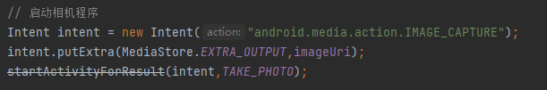

# 关于startActivityForResult()方法被弃用的解决方案

背景：使用`startActivityForResult()`方法时，代码出现划线，显示该方法已被弃用



**`startActivityForResult()`** 方法是一种用于在 Android 应用程序中启动另一个活动（Activity）并期望在被启动的活动完成后接收结果的机制。

通过调用 `startActivityForResult()` 方法，你可以传递一个 Intent 对象来启动目标活动，并指定一个整数参数作为请求码（requestCode），用于标识这个请求。这个请求码在后续的结果处理中起到唯一标识的作用，以便你知道是哪个请求返回了结果。

被启动的活动可以通过调用 `setResult()` 方法来设置其结果。这个结果可以是一个表示成功、失败或其他状态的结果代码，还可以携带额外的数据作为结果的一部分。被启动的活动在完成后会被销毁，然后会返回到调用活动（即发起 `startActivityForResult()` 方法的活动）。

调用 `startActivityForResult()` 方法后，你可以通过重写调用活动的 `onActivityResult()` 方法来处理返回的结果。在 `onActivityResult()` 方法中，你可以检查请求码，并根据请求码来确定是哪个请求返回了结果，然后处理相应的逻辑。

这种机制通常用于实现活动之间的交互和数据传递，比如从一个活动中获取用户输入或选择的结果，在另一个活动中展示或处理这些结果。

下面是一个使用了`startActivityForResult()` 方法的简单示例

在调用活动（发起请求的活动）中：

```java
public class MainActivity extends AppCompatActivity {
    private static final int REQUEST_CODE = 1; // 请求码

    @Override
    protected void onCreate(Bundle savedInstanceState) {
        super.onCreate(savedInstanceState);
        setContentView(R.layout.activity_main);

        Button startButton = findViewById(R.id.start_button);
        startButton.setOnClickListener(new View.OnClickListener() {
            @Override
            public void onClick(View v) {
                Intent intent = new Intent(MainActivity.this, SecondActivity.class);
                startActivityForResult(intent, REQUEST_CODE);
            }
        });
    }

    @Override
    protected void onActivityResult(int requestCode, int resultCode, Intent data) {
        super.onActivityResult(requestCode, resultCode, data);

        if (requestCode == REQUEST_CODE) {
            if (resultCode == RESULT_OK) {
                String result = data.getStringExtra("result");
                Toast.makeText(this, "Received result: " + result, Toast.LENGTH_SHORT).show();
            } else if (resultCode == RESULT_CANCELED) {
                Toast.makeText(this, "Activity canceled", Toast.LENGTH_SHORT).show();
            }
        }
    }
}
```

在被调用活动中：

```java
public class SecondActivity extends AppCompatActivity {
    private EditText inputEditText;

    @Override
    protected void onCreate(Bundle savedInstanceState) {
        super.onCreate(savedInstanceState);
        setContentView(R.layout.activity_second);

        inputEditText = findViewById(R.id.input_edit_text);

        Button doneButton = findViewById(R.id.done_button);
        doneButton.setOnClickListener(new View.OnClickListener() {
            @Override
            public void onClick(View v) {
                String result = inputEditText.getText().toString();

                Intent resultIntent = new Intent();
                resultIntent.putExtra("result", result);
                setResult(RESULT_OK, resultIntent);
                finish();
            }
        });

        Button cancelButton = findViewById(R.id.cancel_button);
        cancelButton.setOnClickListener(new View.OnClickListener() {
            @Override
            public void onClick(View v) {
                setResult(RESULT_CANCELED);
                finish();
            }
        });
    }
}
```

在上述示例中，MainActivity 是调用活动，SecondActivity 是被调用活动。当用户点击 startButton 按钮时，MainActivity 会启动 SecondActivity 并传递一个请求码（REQUEST_CODE）。在 SecondActivity 中，用户可以输入一些文本，并点击 doneButton 按钮将输入的文本作为结果返回给 MainActivity，或者点击 cancelButton 按钮取消操作。

在 MainActivity 的 `onActivityResult()` 方法中，我们检查返回的结果，并根据结果码（REQUEST_CODE）处理逻辑。如果结果码为 RESULT_OK，则表示操作成功，我们从返回的 Intent 中获取结果数据并显示一个 Toast。如果结果码为 RESULT_CANCELED，则表示操作被取消。

但是，`startActivityForResult()` 方法在较新的 Android 版本中已被弃用，**解决方案是使用**  `startActivityForResult(Intent, int, Bundle)` **方法来代替**。该方法允许你向要启动的活动传递附加数据。通过将 Bundle 对象作为第三个参数传递，你可以在发送给活动的 Intent 中包含额外的数据。

以下是使用 `startActivityForResult(Intent, int, Bundle)` 方法的示例：

```java
// 创建一个新的 Intent 对象
Intent intent = new Intent(this, MyActivity.class);

// 创建一个 Bundle 对象来存储数据
Bundle extras = new Bundle();
extras.putString("key", "value");

// 将 Bundle 作为第三个参数传递给 startActivityForResult()
startActivityForResult(intent, REQUEST_CODE, extras);
```

注意，REQUEST_CODE 参数是一个整数，你可以定义它来标识活动的结果。当活动结束时，它将返回结果给调用活动，同时返回 REQUEST_CODE。你可以使用该代码确定哪个活动返回了结果。

在接收活动中，你可以这样获取到发起活动传来的数据：

```java
extras = getIntent().getExtras();
if (extras != null) {
    String value = extras.getString("key");
}
```

在接收活动中，通过 `getIntent()` 方法可以获取到启动它的 Intent 对象。然后，通过调用 `getExtras()` 方法，你可以获取到传递给目标活动的附加数据的 Bundle 对象。

