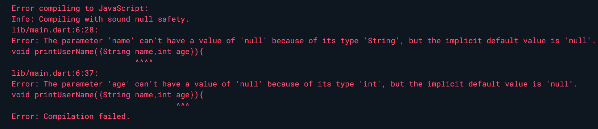

# The parameter 'xxx' can't have a value of 'null' because of its type 'xxx', but the implicit default value is 'null'.

## 错误代码

在Dart中，定义带有可选参数的函数时，使用下面这种写法代码提示错误

```dart
void printUser({String name,int age}){
   print('$name, $age');
}

void main() {
  printUser(name:'li');
}
```

## 报错信息

报错信息如下：



The parameter 'name' can't have a value of 'null' because of its type 'String', but the implicit default value is 'null'.
由于参数name是String类型，值不能为null，但隐式的默认值是null。

The parameter 'age' can't have a value of 'null' because of its type 'int', but the implicit default value is 'null'.
由于参数age是int类型，值不能为null，但隐式的默认值是null。

## 报错原因

发生这种情况的原因是，Dart启用了空安全，不可空的参数因子或键就不能为空。

Dart在2.12版本之后开始支持空安全（Null Safety）：空安全是一种对可能为空的变量在编译期就进行校验的一种审查机制，有了空安全，原本处于运行时的空值引用错误将变为编辑时的分析错误。这种检查机制对所有变量的默认值也进行了改变，以前默认为null，而使用空安全后，代码中的类型将默认是非空的，意味着除非你声明它们可空，否则它们的值都不能为空并且会报错。

## **解决方法**

1.声明**可空参数**

创建变量时，如果想要一个变量可为null，需要显式声明为可空的类型，具体就是使用“**?**”进行声明。比如String?、int?等，表示变量是一个可空类型，可以赋值为空。

```dart
void printUser({String? name,int? age}){
  print('$name, $age');
}

void main() {
  printUser(name:'Li');  //输出Li, null
}

```

2.给参数赋**默认值**

给参数设置默认值。如果参数有默认值，在调用函数时如果不对参数传值，则使用默认值。

```dart
void printUser({String name="", int age=0}) {
  print('$name, $age');
}
 
void main() {
  printUser(name: 'Li'); // Li, 0
}
```

3.使用**required**标记

```dart
import 'package:meta/meta.dart';
void printUser({required String name, required int age}) {
  print('$name, $age');
}
void main() {
  // printUser(name: 'Gavi'); // Error: Required named parameter 'age' must be provided.
  printUser(name: 'Gavi', age: 18); // Gavi, 18
}
```

