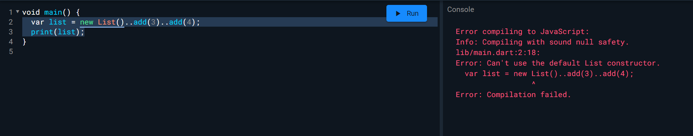
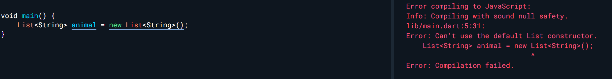
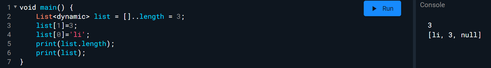
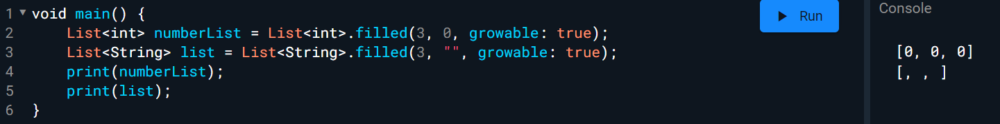

# Can't use the default List constructor.



这是由于 Dart 中包含了一项名为“**Null Safety**”的安全检查，该功能使得变量不能具有“null”值。

解决方案：

```dart
void main() {
  var list = []..add(3)..add(4);
  print(list);
}
```

在Flutter2.1.2后，new List()方法已弃用



替换方案

```dart
List<String> list = [];
```

或

```dart
List<String> list = List.empty(growable: true);
```

growable 为 false 是为 固定长度列表，为 true 是为 长度可变列表

**创建给定长度的列表**

要创建具有给定长度的可增长列表，对于可为空元素类型，只需在创建后立即分配长度：

```dart
void main() {
    List<dynamic> list = []..length = 3;
    list[1]=3;
    list[0]='li';
    print(list.length);
    print(list);
}
```



对于不可为空的元素类型，替代方法如下：

```
List<int> growableList = List<int>.filled(3, 0, growable: true);
List<String> list = List<String>.filled(3, "", growable: true);
```


