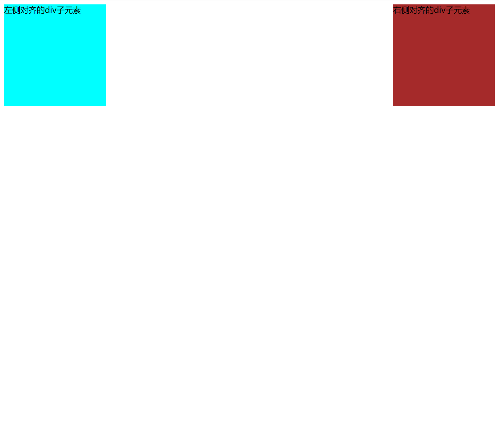

# flex布局中的一个子元素单独右侧对齐

在 `Flex`布局中，我们经常需要对子元素进行对齐操作。使用 `justify-content` 和 `align-items` 可以轻松地对所有子元素进行对齐，但是当我们需要对某个子元素进行单独的对齐时，我们应该怎么做呢？

我们可能会在 `Flexbox`容器中使用 `justify-self` 属性来实现子元素的水平对齐。但是，需要注意的是，`justify-self` 在 `Flex`布局中是无效的。（原因暂时还没有了解到）

那么常见的做法是将子元素的 `margin-left` 设置为 `auto`。当您将一个子元素的 `margin-left` 设置为 `auto` 时，该元素将被推到容器的最右边，同时保持其他元素的左对齐。这是因为在 `Flex` 布局中，剩余的可用空间会平均地分配给所有子元素，而将一个子元素的 `margin-left` 设置为 `auto` 可以使该元素占据剩余的空间。

下面是一个示例，展示了如何使用 `margin-left: auto` 将一个子元素向右对齐：

```html
<div class="container">
    <div class="left-align">左侧对齐的div子元素</div>
    <div class="right-align">右侧对齐的div子元素</div>
</div>
```

```css
.container {
  display: flex;
}
.left-align{
  width: 200px;
  height: 200px;
  background-color: aqua;
}
.right-align {
  width: 200px;
  height: 200px;
  margin-left: auto;
  background-color: brown;
}
```

效果如下图所示：



那么通过浏览器的开发工具，我个人的看法是当我们将一个子元素的 `margin-left` 设置为 `auto` 时,渲染树会将该节点的`margin-left`的值设置到最大，大到什么程度呢：让该子元素紧靠屏幕右侧（即右侧对齐的位置）。