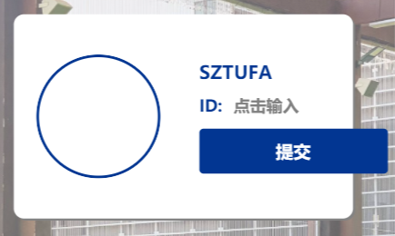
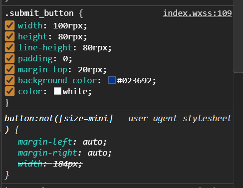
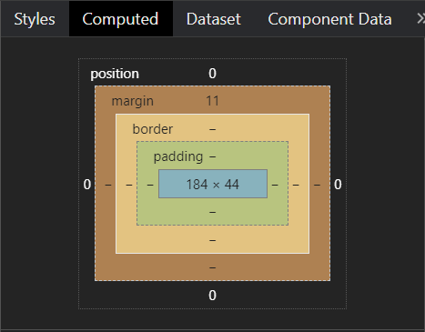

# button按钮设置宽度无效

## 背景：

在开发小程序的过程中，遇到了button按钮设置宽度无效的问题

微信客户端 7.0 开始，UI 界面进行了大改版。小程序也进行了基础组件的样式升级，涉及的组件有 button,icon,radio,checkbox,switch,slider。app.json 中配置 “style”: “v2” 表明启用新版的组件样式。因此我们的button是有默认样式的。当我们想要自定义按钮样式时，需要在wxss中编写按钮的样式来覆盖默认样式。

先贴原来的代码

```html
<view class="personalInfo_right">
  <form catchsubmit="formSubmit" class="personal_form">
    <view class="title">
      <text>SZTUFA</text>
    </view>
    <view class="ID">
      <text class="ID_title">ID:</text>
      <view class="nickName">
        <input type="nickname" class="nickName_input" name="input" placeholder="点击输入" placeholder-class="placeholderStyle" />
      </view>
    </view>
    <button class="submit_button" formType="submit" style="">提交</button>
  </form>
</view>
```

```css
.submit_button {
  width: 100rpx;
  height: 80rpx;
  line-height: 80rpx;
  padding: 0;
  margin-top: 20rpx;
  background-color: #023692;
  color: white;
}
```



可以看到，我在wxss中给按钮自定义的宽度是没有生效的。

但是查看调试器，我看到了非常不可思议的事情。





正如上图所示，我自定义的宽度其实是覆盖了按钮的默认样式的，但在Computed视图中我们的button宽度仍为184。这就让我很疑惑了。因为我自己写了个demo是能正常覆盖的，这里却不行，当时我怀疑是开发者工具出bug了。

demo代码如下：

```html
<form catchsubmit="formSubmit" class="button_wrapper">
    <button formType="submit">我是按钮</button>
</form>
```

```css
.button_wrapper {
  display: flex;
  width: 90%;
  height: 200rpx;
  background-color: #fff;
  margin: 0 auto;
  margin-top: 100rpx;
}

.button_wrapper button {
  padding: 0;
  height: 100rpx;
  line-height: 100rpx;
  width: 140rpx;
  background-color: green;
}
```


## 解决方案

在查阅了一些网上资料的资料后，有三种解决方案：

1. 删除app.json的配置"style": “v2”（不推荐）

   如果采用此方法会导致其他新版的组件样式不可用

2. 使用内联样式

   ```html
   <button type="primary" style="width:100%">按钮1</button>
   <button type="primary" style="width:120rpx">按钮2</button>
   ```

3. 不要直接在button的类名下编写它的样式

   听起来好像不太好理解，其实就是不要像下面这样写

   ```css
   .submit_button {
     width: 100rpx;
   }
   ```

   正确写法如下：

   ```css
   .button_wrapper button {
     padding: 0;
     height: 100rpx;
     line-height: 100rpx;
     width: 140rpx;
     background-color: green;
   }
   ```

   或者

   ```css
   .personal_form .submit_button {
     width: 100rpx;
   }
   ```

   注意这里选择器的写法，这也是为什么我的demo里面能够设置按钮宽度的原因。
