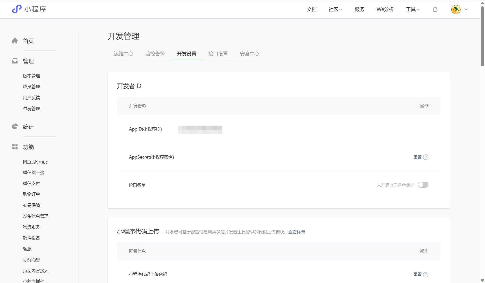

# 微信小程序登录的最佳实践

## 官方文档的介绍

小程序可以通过微信官方提供的登录能力方便地获取微信提供的用户身份标识，快速建立小程序内的用户体系。

### 登录流程时序


### 说明

调用 wx.login() 获取 临时登录凭证code ，并回传到开发者服务器。
调用 auth.code2Session 接口，换取 用户唯一标识 OpenID 、 用户在微信开放平台帐号下的唯一标识UnionID（若当前小程序已绑定到微信开放平台帐号） 和 会话密钥 session_key。
之后开发者服务器可以根据用户标识来生成自定义登录态，用于后续业务逻辑中前后端交互时识别用户身份。

### 注意事项

会话密钥 session_key 是对用户数据进行 加密签名 的密钥。为了应用自身的数据安全，开发者服务器不应该把会话密钥下发到小程序，也不应该对外提供这个密钥。
临时登录凭证 code 只能使用一次

### 实际应用

那么在实际的项目中我们是怎么实现登录的呢？

常见的一种做法是自己做一个表单，要求客户输入用户名和密码。当用户提交表单后，将这些数据加密后传递给后端，后端解密后将数据存放到数据库中。在这种方法中，用户名就是用户的唯一标识（前提是设置了用户名是唯一字段）。

显然，在实际应用中，很多时候用户是有相同的用户名的，所以这种方法存在缺陷。因此我们使用微信官方提供的登录能力去获取微信提供的用户身份标识，这有助于快速建立小程序内的用户体系。

首先，我先解释一下微信官方展示的登录流程时序图

1. 调用 wx.login() 获取 临时登录凭证code ; 

   ```javascript
   wx.login({
   	success: (res) => {
   		console.log(res.code);
   	}
   })
   ```

   [微信官方文档wx.login接口的说明](https://developers.weixin.qq.com/miniprogram/dev/api/open-api/login/wx.login.html)

2. 拿到这个code之后，我们发起一个请求去访问 auth.code2Session 接口，代码如下：

   ```javascript
   wx.request({
       url: "https://api.weixin.qq.com/sns/jscode2session?appid=" + appid + "&secret=" + secret + "&js_code=" + code + "&grant_type=authorization_code",
       method: 'POST',
       data: {
         code: code //登录凭证code
       },
       header: {
         'content-type': 'application/json;charset=UTF-8'
       },
       success: (res) => {
   		console.log(res);
       	//获取到sessionKey,openid,unionid...
   	}
   })
   ```

   - 这里的appid，即为你小程序的appid，可以去微信公众平台查看

     

   - 这里的secret，即为你小程序的秘钥，也是在微信公众平台查看（出于安全考虑，AppSecret不再被明文保存，忘记密钥需点击重置）

   - 这里的code，即为你第一步中调用wx.login()返回的code

​		如果访问成功，则会返回如下字段

​		

​		[微信官方文档code2Session接口的说明](https://developers.weixin.qq.com/miniprogram/dev/OpenApiDoc/user-login/code2Session.html)

那么拿到这些数据之后，如果你是使用了服务器的，你可以像这篇[博客](https://blog.csdn.net/weixin_52203618/article/details/127130032)一样，自定义登录态（生成一个token）。

因为我在开发中使用了云开发，这里我讲述一下我是如何处理的。

1.首先我在云数据库创建了一张名为user的表

2.在前端的js代码中调用Collection.add()方法添加数据，同时将用户数据存储到本地缓存中

```javascript
wx.request({
    url: "https://api.weixin.qq.com/sns/jscode2session?appid=" + appid + "&secret=" + secret + "&js_code=" + code + "&grant_type=authorization_code",
    method: 'POST',
    data: {
      code: code //登录凭证code
    },
    header: {
      'content-type': 'application/json;charset=UTF-8'
    },
    success: (res) => {
		let orginData = {
          nickName: "xxx"
          avatarUrl: 'cloud://xxx.jpg',  //存储在云存储的图片资源
        }
        orginData['session_key'] = res.data.session_key;
        orginData['openid'] = res.data.openid;
        let userInfo = orginData;
        wx.cloud.database().collection('user')
            .add({
              data: userInfo
            })
            .then(res => {
              console.log('创建新用户信息成功', res)
              //刷新userInfo缓存
              wx.setStorageSync('userInfo', userInfo);
            })
            .catch(err => {
              console.log('创建新用户信息失败', err)
            })
    }
})
```

那么如何判断登录态是否过期，这里微信提供了另外一个接口：[wx.checkSession](https://developers.weixin.qq.com/miniprogram/dev/api/open-api/login/wx.checkSession.html)

部分代码如下：

```javascript
wx.checkSession({
  success () {
    //session_key 未过期，并且在本生命周期一直有效
  },
  fail () {
    // session_key 已经失效，需要重新执行登录流程
    //重新登录，然后更新数据库和本地缓存
    wx.login({
        success: (res) => {
            wx.request({
    		url: "https://api.weixin.qq.com/sns/jscode2session?appid=" + appid + "&secret=" + secret + "&js_code=" + code + "&grant_type=authorization_code",
    		method: 'POST',
    		data: {
      			code: code //登录凭证code
    		},
            header: {
              'content-type': 'application/json;charset=UTF-8'
            },
            success: (res) => {
                let user = wx.getStorageSync('userInfo');
                user['session_key'] = res.data.session_key;
                wx.setStorageSync('userInfo', user);
                wx.cloud.database().collection('user').where({
                    _openid: user['_openid']
                  })
                  .update({
                    data: {
                      session_key: user['session_key']
                    },
                  })
    		}
		})
        },
        fail:(err)=>{
        	console.log(err);
	    }
    })
  }
})
```

