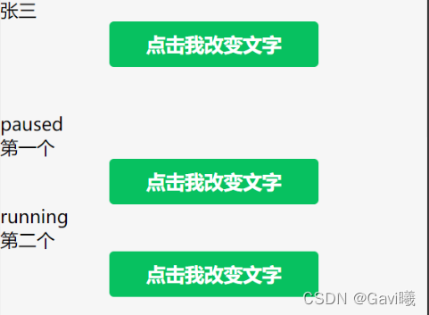

# 微信小程序setData 赋值对象属性

关于setData方法的使用

首先说一下赋值对象属性的两种方法

1.修改data下的对象

```javascript
this.setData({
	'params.name':'李四'
})
```

2.修改data下的对象数组

```javascript
this.setData({
	'example[1].text':"清零"
})
```

如果要给对象数组中某一个对象的某个属性赋值，可以采用以下两种方式：

```javascript
var temp1 = 'example['+order+'].state'
var temp2 = `example[${order}].text`
```

**然后通过[temp1]:'runnning'这样的方式来进行赋值**

下面是代码示例

wxml

```html
<view class="container1">
    <viwe>{{params.name}}</viwe>
    <button type="primary" bindtap="changetext1"> 点击我改变文字</button>
</view>

<view class="container2">
    <view class="container-content" wx:for="{{example}}">
        <view>{{item.state}}
        </view>
        <view>{{item.text}}
        </view>
        <button type="primary" bindtap="changetext2" data-index="{{index}}"> 点击我改变文字</button>
    </view>
</view>
```

js

```javascript
data: {
        params: {
            name: '张三',
            age: '18',
            gender: 1
          },
          example: [{
            id: '1',
            state:"paused",
            text:"第一个"
          },
          {
            id: '2',
            state:"running",
            text:"第二个"
          }
        ]
    },

    changetext1:function(){
        console.log(1)
        this.setData({
            'params.name':'李四'
        })
    },

    changetext2:function(e){
        var order = e.target.dataset.index
        console.log(e.target.dataset.index)
        var temp1 = 'example['+order+'].state'
        var temp2 = `example[${order}].text`
        this.setData({
            [temp1]:'down',
            [temp2]:'清零'
        })
    },
```

 效果图

before



after点击


