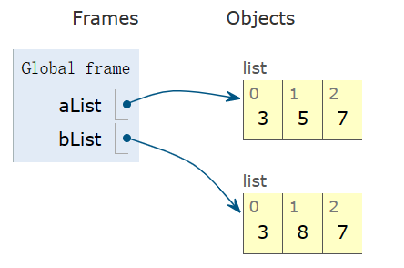
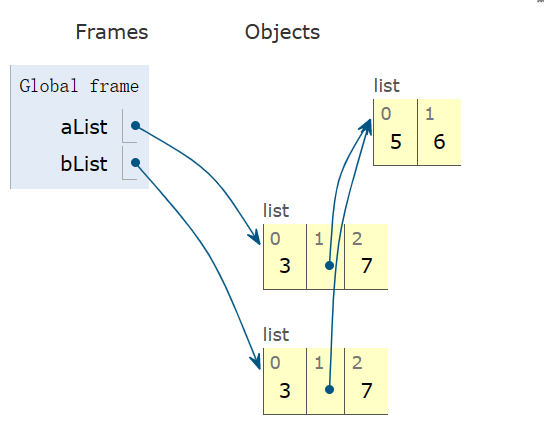
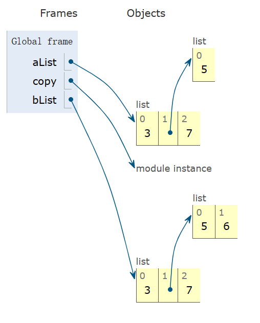

# Python中的浅复制与深复制

首先我们引入切片的概念。

切片适用于列表、元组、字符串、range对象等类型，但作用于列表时功能最强大。可以使用切片来截取列表中的任何部分，得到一个新列表。

举几个例子：

```python
>>> aList = [3, 4, 5, 6, 7, 9, 11, 13, 15, 17]
>>> aList[::]                            #返回包含所有元素的新列表
[3, 4, 5, 6, 7, 9, 11, 13, 15, 17]
>>> aList[::-1]                          #逆序的所有元素
[17, 15, 13, 11, 9, 7, 6, 5, 4, 3]
>>> aList[::2]                           #偶数位置，隔一个取一个
[3, 5, 7, 11, 15]
>>> aList[1::2]                          #奇数位置，隔一个取一个
[4, 6, 9, 13, 17]
>>> aList[3::]                           #从下标3开始的所有元素
[6, 7, 9, 11, 13, 15, 17]
>>> aList[3:6]                           #下标在[3, 6)之间的所有元素
[6, 7, 9]
```

切片返回的是**浅复制**。所谓浅复制，是指生成一个新的列表，并且把原列表中所选元素的引用都复制到新列表中。

如果原列表中只包含整数、实数、复数等基本类型或元组、字符串这样的不可变类型的数据，一般是没有问题的。除了切片之外，“+”运算符，“*”运算符还有一些内置函数也会生成新列表。



但是如果原列表中包含列表之类的可变数据类型，由于浅复制时只是把子列表的引用复制到新列表中，这样的话修改任何一个都会影响另外一个。

```python
>>> aList = [3, [5], 7]        #列表aList中包含可变的列表对象
>>> bList = aList[:]           #切片
>>> bList[1].append(6)         #调用子列表的append()方法，这个方法是原地操作的
>>> bList
[3, [5, 6], 7]
>>> aList                      #aList受到影响
[3, [5, 6], 7]
```



为了解决上述这个问题，我们使用标准库copy中的deepcopy()函数实现深复制。所谓深复制，是指对原列表中的元素进行递归，把所有的值都复制到新列表中，对嵌套的子列表不再是复制引用。新列表和原列表是互相独立，修改任何一个都不会影响另外一个。

```python
>>> aList = [3, [5], 7]
>>> import copy
>>> bList = copy.deepcopy(aList) #深赋值，递归复制，直到遇到可哈希对象
                           #aList和bList完全独立，互相不影响
>>> aList == bList
True
>>> aList is bList
False
>>> bList[1].append(6)         #修改bList不会影响aList
>>> bList
[3, [5, 6], 7]
>>> aList
[3, [5], 7]
```

