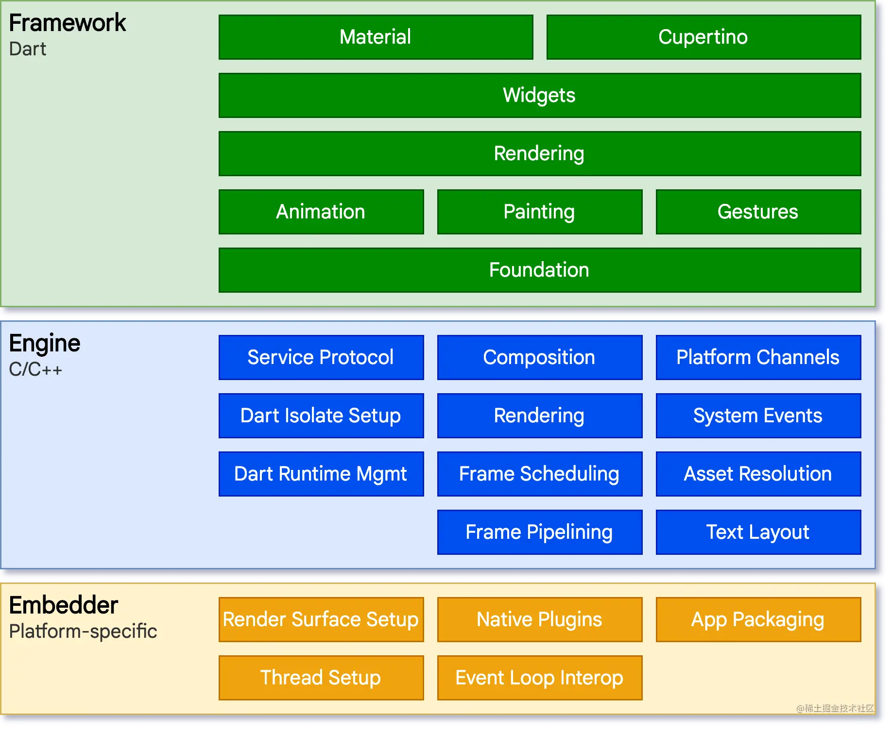

# 第一章习题

## 1.Flutter的技术特性

​	Flutter是Google开发的开源移动应用开发框架，具有以下技术特性：

1. 高性能：Flutter使用自己的渲染引擎Skia，可以直接将代码编译为本地代码，不需要像React Native一样依赖JavaScript Bridge，因此性能更好。
2. 跨平台：Flutter可以在多个平台上运行，包括Android、iOS、Web、桌面应用等，可以实现一次编写多端运行。
3. 响应式编程模型：Flutter采用响应式编程模型，可以在UI元素的状态发生变化时及时更新UI，从而减少手动管理UI的工作量。
4. 自定义UI：Flutter提供了一套自定义UI组件框架，可以轻松地实现自定义UI，而且UI效果非常流畅。
5. 热重载：Flutter的热重载可以快速地预览UI效果，可以大大缩短开发周期。
6. Dart语言：Flutter使用Dart语言，它是一种快速、现代、面向对象的语言，可以在不同的平台上运行，并且有一套完整的库支持。
7. 统一开发体验：Flutter提供了一套完整的开发工具链，包括Flutter SDK、Flutter插件、Flutter开发工具，可以提供一致的开发体验。

## 2.Flutter的架构 & 架构中每层的功能

Flutter的架构图

我们先来看下Flutter的架构图：

从上图中，我们可以看到Flutter的架构可以分为三部分，从下到上分别是embedder,Engine和Framework。

### embedder

embedder可以称为嵌入器，这是和底层的操作系统进行交互的部分。因为flutter最终要将程序打包到对应的平台中，所以这个嵌入器需要和底层的平台接口进行交互。

具体而言，对于Android平台使用的是Java和C++，对于iOS和macOS平台，使用的是Objective-C/Objective-C++，对应Windows平台和Linux平台的是C++。

回到embedder,为什么叫做嵌入器呢？这是因为Flutter打包的程序，可以作为整个应用程序，也可以作为现有程序的一部分被嵌入使用。

### engine

engine也叫做flutter engine（引擎层），它是flutter中最核心的部分，主要负责渲染UI。

Flutter engine基本上使用C++写的。engine的存在是为了支持Dart Framework的运行。它提供了Flutter的核心API，包括作图、、网络访问、文件I/O、dart运行时环境等核心功能。

engine主要是通过dart:ui暴露给Flutter framework层的。

### Flutter framework

Flutter的框架层是整个Flutter架构的核心，这一层是用户编程的接口，我们的应用程序需要和Flutter framework进行交互，最终构建出一个应用程序。框架层提供了UI框架、动画框架、布局框架等基础功能。

Flutter框架层是基于Dart语言实现的，它提供了一套完整的Widget体系，可以方便地构建UI。框架层还提供了一些基础的服务，比如路由、动画、手势识别、状态管理等，以及许多常用的Widget，比如按钮、文本框、图片等。

## 3.说明开发人员进行Flutter开放时主要用到的目录有哪些，编写的代码文件保存到哪个目录下

在使用Flutter进行应用程序开发时，开发人员主要会用到以下几个目录：

1. lib目录：这个目录下是应用程序的源代码，包括各种dart文件，比如主界面代码、业务逻辑代码、网络请求代码等。
2. test目录：这个目录下是应用程序的测试代码，包括各种测试用例和测试工具。
3. assets目录：这个目录下是应用程序的资源文件，比如图片、字体、配置文件等。
4. android目录：这个目录下是针对Android平台的配置文件和代码，比如gradle构建脚本、AndroidManifest.xml、Java代码等。
5. ios目录：这个目录下是针对iOS平台的配置文件和代码，比如Xcode项目文件、Info.plist、Objective-C代码等。
6. build目录：这个目录是Flutter构建工具生成的临时目录，包括编译后的应用程序和各种构建工具的中间文件。

在Flutter中，编写的代码文件主要保存在lib目录下。这个目录下的代码会被编译成二进制代码，然后被打包到最终的应用程序中。其他的目录主要用于配置和管理应用程序的资源和构建流程。

## 4.如何通过命令行的方式创建一个名为"flutter_demo"的项目

1. 打开命令行终端。
2. 进入想要创建项目的目录，比如进入桌面目录：`cd ~/Desktop`
3. 运行Flutter的`create`命令创建项目：`flutter create flutter_demo`
4. 等待命令执行完毕，这时会在当前目录下创建一个名为"flutter_demo"的文件夹，里面包含了新建Flutter项目的所有文件和目录。

以上步骤会创建一个默认的Flutter项目，包括一个主界面和一些示例代码。可以进入`flutter_demo`目录，运行`flutter run`命令来启动应用程序并在模拟器或真机上运行。同时也可以使用Android Studio、Visual Studio Code等集成开发环境来打开并编辑项目。

## 5.如何通过Android Studio的可视化界面创建一个名为"flutter_demo"的项目

1. 打开Android Studio。
2. 点击"File" -> "New" -> "New Flutter Project"。
3. 在弹出的对话框中选择"Flutter Application"，然后点击"Next"。
4. 输入项目名称"flutter_demo"，选择存放项目的路径，然后点击"Finish"。
5. Android Studio会自动为您创建一个名为"flutter_demo"的Flutter项目，并在项目中生成一些默认的代码和文件。
6. 如果需要在模拟器或真机上运行应用程序，可以选择一个设备，然后点击Android Studio的运行按钮或使用快捷键"Shift+F10"启动应用程序。

通过以上步骤，就可以通过Android Studio的可视化界面创建一个名为"flutter_demo"的Flutter项目。在创建过程中，您可以根据需要选择不同的模板、添加插件和依赖库，以及对项目进行自定义配置。