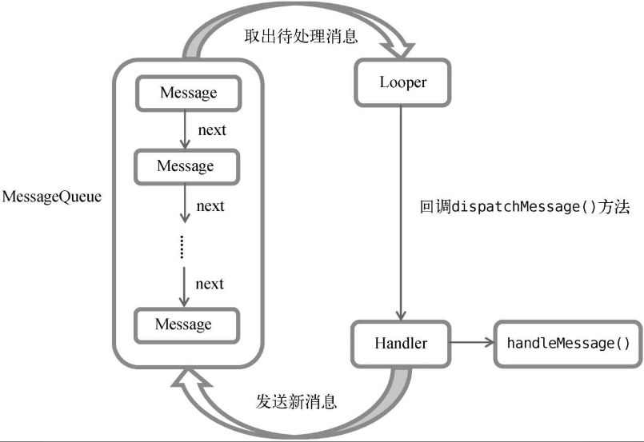

# 第10章 探究服务

以前，全球的手机市场是由诺基亚统治着的。诺基亚的Symbian操作系统做得特别出色，因为比起一般的手机，它可以支持后台功能。

而如今，Symbian早已风光不再，Android和iOS几乎占据了智能手机全部的市场份额。在这两大移动操作系统中，iOS一开始是不支持后台的，后来逐渐意识到这个功能的重要性，才加入了后台功能。而Android则是沿用了Symbian的老习惯，从一开始就支持后台功能，这使得应用程序即使在关闭的情况下仍然可以在后台继续运行。

## 服务是什么

**服务**（Service）是Android中实现程序后台运行的解决方案，它非常适合去执行那些不需要和用户交互而且还要求长期运行的任务。服务的运行不依赖于任何用户界面，即使程序被切换到后台，或者用户打开了另外一个应用程序，服务仍然能够保持正常运行。

需要注意的是，服务并不是运行在一个独立的进程当中的，而是依赖于创建服务时所在的应用程序进程。当某个应用程序进程被杀掉时，所有依赖于该进程的服务也会停止运行。

另外，也不要被服务的后台概念所迷惑，实际上服务并不会自动开启线程，所有的代码都是默认运行在主线程当中的。也就是说，我们需要在服务的内部手动创建子线程，并在这里执行具体的任务，否则就有可能出现主线程被阻塞住的情况。

## Android多线程编程

当我们需要执行一些耗时操作，比如说发起一条网络请求时，考虑到网速等其他原因，服务器未必会立刻响应我们的请求，如果不将这类操作放在子线程里去运行，就会导致主线程被阻塞住，从而影响用户对软件的正常使用。

### 线程的基本用法

Android多线程编程其实并不比Java多线程编程特殊，基本都是使用相同的语法。比如说，定义一个线程只需要新建一个类继承自Thread，然后重写父类的`run()`方法，并在里面编写耗时逻辑即可，如下所示：

```java
class MyThread extends Thread {
    @Override
    public void run() {
        //处理具体的逻辑
    }
} 
```

启动线程

```java
new MyThread().start();
```

当然，使用继承的方式耦合性有点高，更多的时候我们都会选择使用实现Runnable接口的方式来定义一个线程，如下所示：

```java
class MyThread implements Runnable {
    @Override
    public void run() {
        //处理具体逻辑
    }
}
```

如果使用了这种写法，启动线程的方法也需要进行相应的改变，如下所示：

```java
MyThread myThread = new MyThread();
new Thread(myThread).start();
```

当然，如果你不想专门再定义一个类去实现Runnable接口，也可以使用匿名类的方式，这种写法更为常见，如下所示：

```java
new Thread(new Runnable() {
    @Override
    public void run() {
        //处理具体的逻辑
    }
}).start();
```

下面我们来看一下Android多线程编程与Java多线程编程不同的地方。

### 在子线程中更新UI

和许多其他的GUI库一样，Android的UI也是线程不安全的。也就是说，如果想要更新应用程序里的UI元素，则必须在主线程中进行，否则就会出现异常。

新建一个AndroidThreadTest项目，然后修改activity_main.xml中的代码，如下所示：

```xml
<?xml version="1.0" encoding="utf-8"?>
<RelativeLayout xmlns:android="http://schemas.android.com/apk/res/android"
    android:layout_width="match_parent"
    android:layout_height="match_parent">
    <Button
        android:layout_width="match_parent"
        android:layout_height="wrap_content"
        android:id="@+id/change_text"
        android:text="Change Text"/>
    <TextView
        android:layout_width="wrap_content"
        android:layout_height="wrap_content"
        android:id="@+id/text"
        android:layout_centerInParent="true"
        android:text="Hello World"
        android:textSize="20sp"/>
</RelativeLayout>
```

布局文件中定义了两个控件，TextView用于在屏幕的正中央显示一个Helloworld字符串，Button用于改变TextView中显示的内容，我们希望在点击Button后可以把TextView中显示的字符串改成Nice to meet you。接下来修改MainActivity中的代码，如下所示：

```java
public class MainActivity extends AppCompatActivity implements View.OnClickListener {
    private TextView text;
    @Override
    protected void onCreate(Bundle savedInstanceState) {
        super.onCreate(savedInstanceState);
        setContentView(R.layout.activity_main);
        text = (TextView) findViewById(R.id.text);
        Button changeText = (Button) findViewById(R.id.change_text);
        changeText.setOnClickListener(this);
    }

    @Override
    public void onClick(View view) {
        switch (view.getId()) {
            case R.id.change_text:
                new Thread(new Runnable() {
                    @Override
                    public void run() {
                        text.setText("Nice to meet you!");
                    }
                }).start();
                break;
            default:
                break;
        }
    }
}
```

可以看到，在Change Text按钮的点击事件里面开启了一个子线程，然后在子线程中调用TextView的`setText()`方法将显示的字符串改成Nice to meet you。

这里我们是在子线程中更新UI的。运行一下程序，并点击Change Text按钮，你会发现程序崩溃了。

观察logcat中的错误日志，可以看出是由于在子线程中更新UI所导致的，

> android.view.ViewRootImpl$CalledFromWrongThreadException: Only the original thread that created a view hierarchy can touch its views.

由此证实了Android确实是不允许在子线程中进行UI操作的。但是有些时候，我们必须在子线程里去执行一些耗时任务，然后根据任务的执行结果来更新相应的UI控件，这该如何做呢？

对于这种情况，Android提供了一套**异步消息处理机制**，完美地解决了在子线程中进行UI操作的问题。本小节中我们先来学习一下异步消息处理的使用方法，下一小节中再去分析它的原理。修改MainActivity中的代码，如下所示：

```java
public class MainActivity extends AppCompatActivity implements View.OnClickListener {
    
    public static final int UPDATE_TEXT =1;
    private TextView text;
    
    private Handler handler = new Handler() {
        public void handleMessage(Message msg) {
            switch (msg.what) {
                case UPDATE_TEXT:
                    //这里可以进行UI操作
                    text.setText("Nice to meet you!");
                    break;
                default:
                    break;
            }
        }
    };
    @Override
    protected void onCreate(Bundle savedInstanceState) {
        super.onCreate(savedInstanceState);
        setContentView(R.layout.activity_main);
        text = (TextView) findViewById(R.id.text);
        Button changeText = (Button) findViewById(R.id.change_text);
        changeText.setOnClickListener(this);
    }

    @Override
    public void onClick(View view) {
        switch (view.getId()) {
            case R.id.change_text:
                new Thread(new Runnable() {
                    @Override
                    public void run() {
                        Message message = new Message();
                        message.what = UPDATE_TEXT;
                        handler.sendMessage(message);//将Message对象发送出去
                    }
                }).start();
                break;
            default:
                break;
        }
    }
}
```

我们先是定义了一个整型常量UPDATE_TEXT，用于表示更新TextView这个动作。然后新增一个Handler对象，并重写父类的`handleMessage()`方法，在这里对具体的Message进行处理。如果发现Message的what字段的值等于UPDATE_TEXT，就将TextView显示的内容改成Nice to meet you。

下面再来看一下Change Text按钮的点击事件中的代码。可以看到，这次我们并没有在子线程里直接进行UI操作，而是创建了一个Message（android.os.Message）对象，并将它的what字段的值指定为UPDATE_TEXT，然后调用Handler的`sendMessage()`方法将这条Message发送出去。

Handler就会收到这条Message，并在`handleMessage()`方法中对它进行处理。注意此时`handleMessage()`方法中的代码就是在主线程当中运行的了，所以我们可以放心地在这里进行UI操作。接下来对Message携带的what字段的值进行判断，如果等于UPDATE_TEXT，就将TextView显示的内容改成Nice to meet you。

### 解析异步消息处理机制

Android中的异步消息处理主要由4个部分组成：**Message、Handler、MessageQueue和Looper**。其中Message和Handler在上一小节中我们已经接触过了，而MessageQueue和Looper对于你来说还是全新的概念，下面我就对这4个部分进行一下简要的介绍。

1. **Message**

   Message是在线程之间传递的消息，它可以在内部携带少量的信息，用于在不同线程之间交换数据。上一小节中我们使用到了Message的what字段，除此之外还可以使用arg1和arg2字段来携带一些整型数据，使用obj字段携带一个Object对象。

2. **Handler**

   Handler顾名思义也就是处理者的意思，它主要是用于发送和处理消息的。发送消息一般是使用Handler的`sendMessage()`方法，而发出的消息经过一系列地辗转处理后，最终会传递到Handler的`handleMessage()`方法中。

3. **MessageQueue**

   MessageQueue是消息队列的意思，它主要用于存放所有通过Handler发送的消息。这部分消息会一直存在于消息队列中，等待被处理。每个线程中只会有一个MessageQueue对象。

4. Looper

   Looper是每个线程中的MessageQueue的管家，调用Looper的`loop()`方法后，就会进入到一个无限循环当中，然后每当发现MessageQueue中存在一条消息，就会将它取出，并传递到Handler的`handleMessage()`方法中。每个线程中也只会有一个Looper对象。

了解了Message、Handler、MessageQueue以及Looper的基本概念后，我们再来把异步消息处理的整个流程梳理一遍。

- 首先，需要在主线程当中创建一个Handler对象，并重写handleMessage()方法。
- 然后，当子线程中需要进行UI操作时，就创建一个Message对象，并通过Handler将这条消息发送出去。
- 之后，这条消息会被添加到MessageQueue的队列中等待被处理，而Looper则会一直尝试从MessageQueue中取出待处理消息。
- 最后分发回Handler的`handleMessage()`方法中。

由于Handler是在主线程中创建的，所以此时`handleMessage()`方法中的代码也会在主线程中运行，于是我们在这里就可以安心地进行UI操作了。整个异步消息处理机制的流程示意图如图：



一条Message经过这样一个流程的辗转调用后，也就从子线程进入到了主线程，从不能更新UI变成了可以更新UI，整个异步消息处理的核心思想也就是如此。

而我们在9.2.1小节中使用到的`runOnUiThread()`方法：

```java
... 
private void showResponse(final String response) {
        runOnUiThread(new Runnable() {
            @Override
            public void run() {
                //在这里进行Ui操作，将结果显示到界面
                responseText.setText(response);
            }
        });
    }
```

其实就是一个异步消息处理机制的接口封装，它虽然表面上看起来用法更为简单，但其实背后的实现原理和上图的描述是一模一样的。

### 使用AsyncTask

为了更加方便我们在子线程中对UI进行操作，Android还提供了另外一些好用的工具，比如**AsyncTask**。

首先来看一下AsyncTask的基本用法，由于AsyncTask是一个抽象类，所以如果我们想使用它，就必须要创建一个子类去继承它。在继承时我们可以为AsyncTask类指定3个泛型参数，这3个参数的用途如下：

- **Params**。在执行AsyncTask时需要传入的参数，可用于在后台任务中使用。
- **Progress**。后台任务执行时，如果需要在界面上显示当前的进度，则使用这里指定的泛型作为进度单位。
- **Result**。当任务执行完毕后，如果需要对结果进行返回，则使用这里指定的泛型作为返回值类型。

因此，一个最简单的自定义AsyncTask就可以写成如下方式：

```java
class DownloadTask extends AsyncTask<Void,Integer,Boolean> {
    ...
}
```

这里我们把AsyncTask的第一个泛型参数指定为Void，表示在执行AsyncTask的时候不需要传入参数给后台任务。第二个泛型参数指定为Integer，表示使用整型数据来作为进度显示单位。第三个泛型参数指定为Boolean，则表示使用布尔型数据来反馈执行结果。

当然，目前我们自定义的DownloadTask还是一个空任务，并不能进行任何实际的操作，我们还需要去重写AsyncTask中的几个方法才能完成对任务的定制。经常需要去重写的方法有以下4个。

1. **onPreExecute()**

   这个方法会在后台任务开始执行之前调用，用于进行一些界面上的初始化操作，比如显示一个进度条对话框等。

2. **doInBackground(Params...)**

   这个方法中的所有代码都会在子线程中运行，我们应该在这里去处理所有的耗时任务。任务一旦完成就可以通过return语句来将任务的执行结果返回，如果AsyncTask的第三个泛型参数指定的是Void，就可以不返回任务执行结果。

   注意，在这个方法中是不可以进行UI操作的，如果需要更新UI元素，比如说反馈当前任务的执行进度，可以调用`publishProgress (Progress...)`方法来完成。

3. **onProgressUpdate(Progress...)**

   当在后台任务中调用了`publishProgress(Progress...)`方法后，`onProgressUpdate (Progress...)`方法就会很快被调用，该方法中携带的参数就是在后台任务中传递过来的。在这个方法中可以对UI进行操作，利用参数中的数值就可以对界面元素进行相应的更新。

4. **onPostExecute(Result)**

   当后台任务执行完毕并通过return语句进行返回时，这个方法就很快会被调用。返回的数据会作为参数传递到此方法中，可以利用返回的数据来进行一些UI操作，比如说提醒任务执行的结果，以及关闭掉进度条对话框等。

一个比较完整的自定义AsyncTask就可以写成如下方式：

```java
class DownloadTask extends AsyncTask <Void,Integer,Boolean>{
    @Override
    protected void onPreExecute() {
        progressDialog.show();//显示进度对话框
    }
    @Override
    protected Boolean doInBackground(Void...params) {
        try {
            while (true) {
                int downloadPercent = doDownload();//这是一个虚构的方法
                publishProgress(downloadPercent);
                if (downloadPercent >= 100) {
                    break;
                }
            }
        } catch (Exception e) {
            return false;
        }
        return true;
    }

    @Override
    protected void onProgressUpdate(Integer...values) {
        //在这里更新下载进度
        progressDialog.setMessage("Downloaded " + values[0] + "%");
    }
    @Override
    protected void onPostExecute(Boolean result) {
        progressDialog.dismiss();//关闭进度对话框
        //这里显示下载结果
        if (result) {
            Toast.makeText(context,"Download succeded",Toast.LENGTH_SHORT).show();
        } else {
            Toast.makeText(context,"Download failed",Toast.LENGTH_SHORT).show();
        }
    }
}
```

在这个DownloadTask中，我们在`doInBackground()`方法里去执行具体的下载任务。这个方法里的代码都是在子线程中运行的，因而不会影响到主线程的运行。

注意，这里虚构了一个`doDownload()`方法，这个方法用于计算当前的下载进度并返回，我们假设这个方法已经存在了。在得到了当前的下载进度后，下面就该考虑如何把它显示到界面上了，由于`doInBackground()`方法是在子线程中运行的，在这里肯定不能进行UI操作，所以我们可以调用`publishProgress()`方法并将当前的下载进度传进来，这样`onProgressUpdate()`方法就会很快被调用，在这里就可以进行UI操作了。

当下载完成后，`doInBackground()`方法会返回一个布尔型变量，这样`onPostExecute()`方法就会很快被调用，这个方法也是在主线程中运行的。然后在这里我们会根据下载的结果来弹出相应的Toast提示，从而完成整个DownloadTask任务。

如果想要启动这个任务，只需编写以下代码即可：

```java
new DownloadTask().execute();
```

以上就是AsyncTask的基本用法，我们并不需要去考虑什么异步消息处理机制，也不需要专门使用一个Handler来发送和接收消息，只需要调用一下publishProgress()方法，就可以轻松地从子线程切换到UI线程了。

## 服务的基本用法

下面我们来学习一下Android四大组件之一——服务的使用。

### 定义一个服务

新建一个ServiceTest项目，然后右击com.example.servicetest→New→Service→Service，我们将服务命名为MyService，Exported属性表示是否允许除了当前程序之外的其他程序访问这个服务，Enabled属性表示是否启用这个服务。将两个属性都勾中，点击Finish完成创建。观察MyService中的代码，如下所示：

```java
package com.example.servicetest;

import android.app.Service;
import android.content.Intent;
import android.os.IBinder;

public class MyService extends Service {
    public MyService() {
    }

    @Override
    public IBinder onBind(Intent intent) {
        // TODO: Return the communication channel to the service.
        throw new UnsupportedOperationException("Not yet implemented");
    }
}
```

MyService是继承自Service类的，说明这是一个服务。`onBind()`方法是Service中唯一的一个抽象方法，所以必须要在子类里实现。我们会在后面的小节中使用到`onBind()`方法，目前可以暂时将它忽略掉。

既然是定义一个服务，自然应该在服务中去处理一些事情，那处理事情的逻辑应该写在哪里呢？这时就可以重写Service中的另外一些方法了，如下所示：

```java
package com.example.servicetest;

import android.app.Service;
import android.content.Intent;
import android.os.IBinder;

public class MyService extends Service {
    public MyService() {
    }

    @Override
    public IBinder onBind(Intent intent) {
        // TODO: Return the communication channel to the service.
        throw new UnsupportedOperationException("Not yet implemented");
    }

    @Override
    public void onCreate() {
        super.onCreate();
    }

    @Override
    public int onStartCommand(Intent intent, int flags, int startId) {
        return super.onStartCommand(intent, flags, startId);
    }

    @Override
    public void onDestroy() {
        super.onDestroy();
    }
}
```

这里我们又重写了onCreate()、onStartCommand()和onDestroy()这3个方法，它们是每个服务中最常用到的3个方法了。

- onCreate() 方法会在服务创建的时候调用。
- onStartCommand() 方法会在每次服务启动的时候调用。
- onDestroy() 方法会在服务销毁的时候调用。

通常情况下，如果希望服务一旦启动就立刻去执行某个动作，就可以将逻辑写在`onStartCommand()`方法里。而当服务销毁时，又应该在`onDestroy()`方法中去回收那些不再使用的资源。另外需要注意，每一个服务都需要在AndroidManifest.xml文件中进行注册才能生效，这是Android四大组件共有的特点。而Android Studio已自动帮我们将这一步完成了。打开AndroidManifest.xml文件查看，代码如下所示：

```xml
<?xml version="1.0" encoding="utf-8"?>
<manifest xmlns:android="http://schemas.android.com/apk/res/android"
    package="com.example.servicetest">

    <application
        android:allowBackup="true"
        android:icon="@mipmap/ic_launcher"
        android:label="@string/app_name"
        android:roundIcon="@mipmap/ic_launcher_round"
        android:supportsRtl="true"
        android:theme="@style/Theme.ServiceTest">

        <service
            android:name=".MyService"
            android:enabled="true"
            android:exported="true" />

        <activity
            android:name=".MainActivity"
            android:exported="true">
            <intent-filter>
                <action android:name="android.intent.action.MAIN" />

                <category android:name="android.intent.category.LAUNCHER" />
            </intent-filter>
        </activity>
    </application>

</manifest>
```

至此一个服务已经完全定义好了。

### 启动和停止服务

定义好了服务之后，接下来就应该考虑如何去启动以及停止这个服务。启动和停止的方法主要是借助Intent来实现的。下面让我们在ServiceTest项目中尝试去启动以及停止MyService这个服务。首先修改activity_main.xml中的代码，如下所示：

```xml
<?xml version="1.0" encoding="utf-8"?>
<LinearLayout xmlns:android="http://schemas.android.com/apk/res/android"
    android:orientation="vertical"
    android:layout_width="match_parent"
    android:layout_height="match_parent">

    <Button
        android:id="@+id/start_service"
        android:layout_width="match_parent"
        android:layout_height="wrap_content"
        android:text="Start Service" />

    <Button
        android:id="@+id/stop_service"
        android:layout_width="match_parent"
        android:layout_height="wrap_content"
        android:text="Stop Service" />

</LinearLayout>
```

这里我们在布局文件中加入了两个按钮，分别用于启动服务和停止服务。然后修改MainActivity中的代码，如下所示：

```java
package com.example.servicetest;

public class MainActivity extends AppCompatActivity implements View.OnClickListener {

    @Override
    protected void onCreate(Bundle savedInstanceState) {
        super.onCreate(savedInstanceState);
        setContentView(R.layout.activity_main);
        Button startService = (Button) findViewById(R.id.start_service);
        Button stopService = (Button) findViewById(R.id.stop_service);
        startService.setOnClickListener(this);
        stopService.setOnClickListener(this);
    }

    @Override
    public void onClick(View view) {
        switch (view.getId()) {
            case R.id.start_service:
                Intent startIntent = new Intent(this,MyService.class);
                startService(startIntent);//启动服务
                break;
            case R.id.stop_service:
                Intent stopIntent = new Intent(this,MyService.class);
                stopService(stopIntent);//暂停服务
                break;
            default:
                break;
        }
    }
}
```

可以看到，这里在`onCreate()`方法中分别获取到了Start Service按钮和StopService按钮的实例，并给它们注册了点击事件。然后在Start Service按钮的点击事件里，我们构建出了一个Intent对象，并调用`startService()`方法来启动MyService这个服务。在Stop Serivce按钮的点击事件里，我们同样构建出了一个Intent对象，并调用`stopService()`方法来停止MyService这个服务。

`startService()`和`stopService()`方法都是定义在Context类中的，所以在活动里可以直接调用这两个方法。注意，这里完全是由活动来决定服务何时停止的，如果没有点击Stop Service按钮，服务就会一直处于运行状态。那服务有没有什么办法让自已停止下来呢？只需要在MyService的任何一个位置调用`stopSelf()`方法就能让这个服务停止下来了。

那么接下来我们如何才能证实服务已经成功启动或者停止了呢？最简单的方法就是在MyService的几个方法中加入打印日志，如下所示：

```java
package com.example.servicetest;

public class MyService extends Service {
    public MyService() {
    }

    @Override
    public IBinder onBind(Intent intent) {
        // TODO: Return the communication channel to the service.
        throw new UnsupportedOperationException("Not yet implemented");
    }

    @Override
    public void onCreate() {
        super.onCreate();
        Log.d("MyService","onCreate executed");
    }

    @Override
    public int onStartCommand(Intent intent, int flags, int startId) {
        Log.d("MyService","onStartCommand executed");
        return super.onStartCommand(intent, flags, startId);
    }

    @Override
    public void onDestroy() {
        Log.d("MyService","onDestroy executed");
        super.onDestroy();
    }
}
```

运行程序,点击Start Service按钮，观察logcat中的打印日志

```
onCreate executed
onStartCommand executed
```

MyService中的`onCreate()`和`onStartCommand()`方法都执行了，说明这个服务已经启动成功了，并且你还可以在Settings→Developeroptions（开发人员选项）→Running services（正在运行的服务）中找到它。

然后，再点击Stop Service按钮，观察logcat中的打印日志：

```
onDestroy executed
```

`onCreate()`方法和`onStartCommand()`方法的区别：

`onCreate()`方法是在服务第一次创建的时候调用的，而`onStartCommand()`方法则在每次启动服务的时候都会调用，由于刚才我们是第一次点击Start Service按钮，服务此时还未创建过，所以两个方法都会执行，之后如果你再连续多点击几次Start Service按钮，就会发现只有`onStartCommand()`方法可以得到执行了。

### 活动和服务进行通信

上一小节中，我们在活动里调用了`startService()`方法来启动MyService这个服务，然后MyService的`onCreate()`和`onStartCommand()`方法就会得到执行。之后服务会一直处于运行状态，但具体运行的是什么逻辑，活动就控制不了了。

如果我们想在活动中指挥服务去干什么，服务就去干什么，那么我们就需要借助onBind()方法了。

比如说，目前我们希望在MyService里提供一个下载功能，然后在活动中可以决定何时开始下载，以及随时查看下载进度。实现这个功能的思路是创建一个专门的Binder对象来对下载功能进行管理，修改MyService中的代码，如下所示：

```java
public class MyService extends Service {
	
    private DownloadBinder mBinder = new DownloadBinder();
    
	public MyService() {
    }
    
    class DownloadBinder extends Binder {

        public void startDownload() {
            Log.d("MyService", "startDownload executed");
        }

        public int getProgress() {
            Log.d("MyService", "getProgress executed");
            return 0;
        }

    }
    @Override
    public IBinder onBind(Intent intent) {
        // TODO: Return the communication channel to the service.
        return mBinder;
    }

   ...
}
```

这里我们新建了一个DownloadBinder类，并让它继承自Binder，然后在它的内部提供了开始下载以及查看下载进度的方法。当然这只是两个模拟方法，并没有实现真正的功能，我们在这两个方法中分别打印了一行日志。

接着，在MyService中创建了DownloadBinder的实例，然后在`onBind()`方法里返回了这个实例，这样MyService中的工作就全部完成了。

接下来我们就要在活动中去调用服务里的这些方法了。首先需要在布局文件里新增两个按钮，修改activity_main.xml中的代码，如下所示：

```xml
<?xml version="1.0" encoding="utf-8"?>
<LinearLayout xmlns:android="http://schemas.android.com/apk/res/android"
    android:orientation="vertical"
    android:layout_width="match_parent"
    android:layout_height="match_parent">
	...
    <Button
        android:layout_width="match_parent"
        android:layout_height="wrap_content"
        android:id="@+id/bind_service"
        android:text="Bind Service"/>
    <Button
        android:layout_width="match_parent"
        android:layout_height="wrap_content"
        android:id="@+id/unbind_service"
        android:text="Unbind Service"/>
</LinearLayout>
```

这两个按钮分别是用于绑定服务和取消绑定服务的，我们要将活动和服务绑定。**当一个活动和服务绑定了之后，就可以调用该服务里的Binder提供的方法了**。修改MainActivity中的代码，如下所示：

```java
public class MainActivity extends AppCompatActivity implements View.OnClickListener {
    
    private MyService.DownloadBinder downloadBinder;
    private ServiceConnection connection = new ServiceConnection() {
        @Override
        public void onServiceConnected(ComponentName componentName, IBinder iBinder) {
            downloadBinder = (MyService.DownloadBinder) iBinder;
            downloadBinder.startDownload();
            downloadBinder.getProgress();
        }

        @Override
        public void onServiceDisconnected(ComponentName componentName) {

        }
    };
    @Override
    protected void onCreate(Bundle savedInstanceState) {
        super.onCreate(savedInstanceState);
        setContentView(R.layout.activity_main);
        Button startService = (Button) findViewById(R.id.start_service);
        Button stopService = (Button) findViewById(R.id.stop_service);
        startService.setOnClickListener(this);
        stopService.setOnClickListener(this);

        Button bindService = (Button) findViewById(R.id.bind_service);
        Button unbindService = (Button) findViewById(R.id.unbind_service);
        bindService.setOnClickListener(this);
        unbindService.setOnClickListener(this);
    }

    @Override
    public void onClick(View view) {
        switch (view.getId()) {
            ...
            case R.id.bind_service:
                Intent bindIntent = new Intent(this,MyService.class);
                bindService(bindIntent,connection,BIND_AUTO_CREATE);//绑定服务
                break;
            case R.id.unbind_service:
                unbindService(connection);//解绑服务
                break;
            default:
                break;
        }
    }
}
```

这里我们首先创建了一个ServiceConnection的匿名类，在里面重写了`onServiceConnected()`方法和`onServiceDisconnected()`方法，这两个方法分别会在活动与服务**成功绑定**以及活动与服务的**连接断开**的时候调用。在`onServiceConnected()`方法中，又通过向下转型得到了DownloadBinder的实例，有了这个实例，活动和服务之间的关系就变得非常紧密了。

现在可以在活动中根据具体的场景来调用DownloadBinder中的任何public方法，即实现了指挥服务干什么服务就去干什么的功能。这里我们只是在`onServiceConnected()`方法中调用了DownloadBinder的`startDownload()`和`getProgress()`方法。

在Bind Service按钮的点击事件里，我们构建出了一个Intent对象，然后调用`bindService()`方法将MainActivity和MyService进行绑定。

`bindService()`方法接收3个参数：

- 第一个参数就是刚刚构建出的Intent对象；
- 第二个参数是前面创建出的ServiceConnection的实例；
- 第三个参数则是一个标志位；

（这里传入BIND_AUTO_CREATE表示在活动和服务进行绑定后自动创建服务。这会使得MyService中的`onCreate()`方法得到执行，但`onStartCommand()`方法不会执行。）

然后，如果我们想解除活动和服务之间的绑定，调用一下`unbindService()`方法就可以了，这也是Unbind Service按钮的点击事件里实现的功能。现在让我们重新运行一下程序，点击一下Bind Service按钮，然后观察logcat中的打印日志

```
onCreate executed
startDownload executed
getProgress executed
```

可以看到，首先是MyService的`onCreate()`方法得到了执行，然后`startDownload()`和`getProgress()`方法都得到了执行，说明我们已经在活动里成功调用了服务里提供的方法了。

另外需要注意，任何一个服务在整个应用程序范围内都是通用的，即MyService不仅可以和MainActivity绑定，还可以和任何一个其他的活动进行绑定，而且在绑定完成后它们都可以获取到**相同的DownloadBinder实例**。

## 服务的生命周期

服务也有自己的生命周期，前面我们使用到的onCreate()、onStartCommand()、onBind()和onDestroy()等方法都是在服务的生命周期内可能回调的方法。

一旦在项目的任何位置调用了Context的`startService()`方法，相应的服务就会启动起来，并回调`onStartCommand()`方法。如果这个服务之前还没有创建过，`onCreate()`方法会先于`onStartCommand()`方法执行。服务启动了之后会一直保持运行状态，直到`stopService()`或`stopSelf()`方法被调用。

**注意，虽然每调用一次startService()方法，onStartCommand()就会执行一次，但实际上每个服务都只会存在一个实例。所以不管你调用了多少次startService()方法，只需调用一次stopService()或stopSelf()方法，服务就会停止下来了。**

另外，还可以调用Context的`bindService()`来获取一个服务的持久连接，这时就会回调服务中的`onBind()`方法。类似地，如果这个服务之前还没有创建过，`onCreate()`方法会先于`onBind()`方法执行。之后，调用方可以获取到`onBind()`方法里返回的IBinder对象的实例，这样就能自由地和服务进行通信了。只要调用方和服务之间的连接没有断开，服务就会一直保持运行状态。

当调用了`startService()`方法后，又去调用`stopService()`方法，这时服务中的`onDestroy()`方法就会执行，表示服务已经销毁了。类似地，当调用了`bindService()`方法后，又去调用`unbindService()`方法，`onDestroy()`方法也会执行。

需要注意，我们是完全有可能对一个服务既调用了`startService()`方法，又调用了`bindService()`方法的，这种情况下该如何才能让服务销毁掉呢？**根据Android系统的机制，一个服务只要被启动或者被绑定了之后，就会一直处于运行状态，必须要让以上两种条件同时不满足，服务才能被销毁。所以，这种情况下要同时调用stopService()和unbindService()方法，onDestroy()方法才会执行。**

## 服务的更多技巧

### 使用前台服务

服务几乎都是在后台运行的，一直以来它都是默默地做着辛苦的工作。但是，服务的系统优先级还是比较低的，当系统出现内存不足的情况时，就有可能会回收掉正在后台运行的服务。如果你希望服务可以一直保持运行状态，而不会由于系统内存不足的原因导致被回收，就可以考虑使用前台服务。

前台服务和普通服务最大的区别就在于，它会一直有一个正在运行的图标在系统的状态栏显示，下拉状态栏后可以看到更加详细的信息，非常类似于通知的效果。当然有时候你也可能不仅仅是为了防止服务被回收掉才使用前台服务的，有些项目由于特殊的需求会要求必须使用前台服务，比如说彩云天气这款天气预报应用，它的服务在后台更新天气数据的同时，还会在系统状态栏一直显示当前的天气信息。

那么我们就来学习一下如何创建一个前台服务，修改MyService中的代码，如下所示：

```java
public class MyService extends Service {
    ...
    @Override
    public void onCreate() {
        super.onCreate();
        Log.d("MyService","onCreate executed");
        Intent intent = new Intent(this,MainActivity.class);
        PendingIntent pi = PendingIntent.getActivity(this,0,intent,0);
        NotificationManager manager = (NotificationManager)getSystemService(NOTIFICATION_SERVICE);
        if (Build.VERSION.SDK_INT >= Build.VERSION_CODES.O) {
            String channelId = "default";
            String channelName = "默认通知";
            //new NotificationChannel(channelId, channelName, NotificationManager.IMPORTANCE_HIGH)
            manager.createNotificationChannel(new NotificationChannel(channelId, channelName, NotificationManager.IMPORTANCE_HIGH));
        }
        Notification notification = new NotificationCompat.Builder(MyService.this,"default")
                .setContentTitle("This is content title")
                .setContentText("This is content text")
                .setWhen(System.currentTimeMillis())
                .setSmallIcon(R.drawable.small_icon)
                .setLargeIcon(BitmapFactory.decodeResource(getResources(),
                        R.drawable.large_icon)).build();
        manager.notify(1,notification);
    }
    ...
}
```

可以看到，这里只是修改了`onCreate()`方法中的代码.。修改部分的代码就是在第8章中学习的创建通知的方法。只不过这次在构建出Notification对象后并没有使用NotificationManager来将通知显示出来，而是调用了`startForeground()`方法。这个方法接收两个参数，第一个参数是通知的id，类似于`notify()`方法的第一个参数，第二个参数则是构建出的Notification对象。调用`startForeground()`方法后就会让MyService变成一个前台服务，并在状态栏显示出来。

### 使用IntentService

在本章一开始的时候我们就已经知道，服务中的代码都是默认运行在主线程当中的，如果直接在服务里去处理一些耗时的逻辑，就很容易出现ANR（Application Not Responding）的情况。

所以，这个时候就需要用到Android多线程编程的技术，我们应该在服务的每个具体的方法里开启一个子线程，然后在这里去处理那些耗时的逻辑。因此，一个比较标准的服务就可以写成如下形式：

```java
public class MyService extends Service {
    ...
    @Override
    public int onStartCommand(Intent intent, int flags, int startId) {
        new Thread(new Runnable() {
            @Override
            public void run() {
                //处理具体逻辑
                stopSelf();
            }
        }).start();
        return super.onStartCommand(intent, flags, startId);
    }
}
```

但是，这种服务一旦启动之后，就会一直处于运行状态，必须调用`stopService()`或者`stopSelf()`方法才能让服务停止下来。所以，如果想要实现让一个服务在执行完毕后自动停止的功能，就可以这样写：

```java
public class MyService extends Service {
    ...
    @Override
    public int onStartCommand(Intent intent, int flags, int startId) {
        new Thread(new Runnable() {
            @Override
            public void run() {
                //处理具体逻辑
                stopSelf();
            }
        }).start();
        return super.onStartCommand(intent, flags, startId);
    }
	...
}
```

虽说这种写法并不复杂，但是总会有一些程序员会忘记开启线程，或者忘记调用`stopSelf()`方法。为了可以简单地创建一个异步的、会自动停止的服务，Android专门提供了一个**IntentService**类。

下面我们就来学习一下它的用法。新建一个MyIntentService类继承自IntentService，代码如下所示：

```java
package com.example.servicetest;

import android.app.IntentService;
import android.content.Intent;
import android.util.Log;

import androidx.annotation.Nullable;

public class MyIntentService extends IntentService {
    public MyIntentService() {
        super("MyIntentService");//调用父类的有参构造函数
    }

    @Override
    protected void onHandleIntent(@Nullable Intent intent) {
        //打印当前线程的id
        Log.d("MyIntentService","This id is " + Thread.currentThread().getId());
    }

    @Override
    public void onDestroy() {
        super.onDestroy();
        Log.d("MyIntentService","onDestroy executed");
    }
}
```

这里首先要提供一个无参的构造函数，并且必须在其内部调用父类的有参构造函数。然后要在子类中去实现`onHandleIntent()`这个抽象方法，在这个方法中可以去处理一些具体的逻辑，而且不用担心ANR的问题，因为这个方法已经是在子线程中运行的了。这里为了证实一下，我们在`onHandleIntent()`方法中打印了当前线程的id。另外根据IntentService的特性，这个服务在运行结束后应该是会自动停止的，所以我们又重写了`onDestroy()`方法，在这里也打印了一行日志，以证实服务是不是停止掉了。

接下来修改activity_main.xml中的代码，加入一个用于启动MyIntentService这个服务的按钮，如下所示：

```xml
<?xml version="1.0" encoding="utf-8"?>
<LinearLayout xmlns:android="http://schemas.android.com/apk/res/android"
    android:orientation="vertical"
    android:layout_width="match_parent"
    android:layout_height="match_parent">
    ...
    <Button
        android:layout_width="match_parent"
        android:layout_height="wrap_content"
        android:id="@+id/start_intent_service"
        android:text="Start IntentService"/>
</LinearLayout>
```

然后修改MainActivity中的代码，如下所示：

```java
public class MainActivity extends AppCompatActivity implements View.OnClickListener {
    ...
    @Override
    protected void onCreate(Bundle savedInstanceState) {
        super.onCreate(savedInstanceState);
        setContentView(R.layout.activity_main);
        Button startService = (Button) findViewById(R.id.start_service);
        Button stopService = (Button) findViewById(R.id.stop_service);
        startService.setOnClickListener(this);
        stopService.setOnClickListener(this);

        Button bindService = (Button) findViewById(R.id.bind_service);
        Button unbindService = (Button) findViewById(R.id.unbind_service);
        bindService.setOnClickListener(this);
        unbindService.setOnClickListener(this);

        Button startIntentService = (Button) findViewById(R.id.start_intent_service);
        startIntentService.setOnClickListener(this);
    }

    @Override
    public void onClick(View view) {
        switch (view.getId()) {
            ...
            case R.id.start_intent_service:
                // 打印主线程的id
                Log.d("MainActivity","Thread id is " + Thread.currentThread().getId());
                Intent intentService = new Intent(this,MyIntentService.class);
                startService(intentService);
                break;
            default:
                break;
        }
    }
}
```

我们在Start IntentService按钮的点击事件里面去启动MyIntentService这个服务，并在这里打印了一下主线程的id，稍后用于和IntentService进行比对。你会发现，其实IntentService的用法和普通的服务没什么两样。最后不要忘记，服务都是需要在AndroidManifest.xml里注册的，如下所示：

```xml
<?xml version="1.0" encoding="utf-8"?>
<manifest xmlns:android="http://schemas.android.com/apk/res/android"
    package="com.example.servicetest">

    <application
        android:allowBackup="true"
        android:icon="@mipmap/ic_launcher"
        android:label="@string/app_name"
        android:roundIcon="@mipmap/ic_launcher_round"
        android:supportsRtl="true"
        android:theme="@style/Theme.ServiceTest">
        
        <service android:name=".MyIntentService"/>
        ...
</manifest>
```

当然，你也可以使用Android Studio提供的快捷方式来创建IntentService，不过这样会自动生成一些我们用不到的代码。

现在重新运行一下程序，点击Start IntentService按钮后，观察logcat中的打印日志

可以看到，不仅MyIntentService和MainActivity所在的线程id不一样，而且onDestroy()方法也得到了执行，说明MyIntentService在运行完毕后确实自动停止了。

## 服务的最佳实践——完整版的下载示例

下面我们就来综合运用一下，尝试实现一个在服务中经常会使用到的功能——下载。

本节中我们将要编写一个完整版的下载示例，其中会涉及第7章、第8章、第9章和第10章的部分内容。

创建一个ServiceBestPractice项目。首先我们需要将项目中会使用到的依赖库添加好，编辑app/build.gradle文件，在dependencies闭包中添加如下内容：

```xml
dependencies {
	implementation("com.squareup.okhttp3:okhttp:4.9.3")
}
```

只需添加一个OkHttp的依赖就行了，待会儿在编写网络相关的功能时，我们将使用OkHttp来进行实现。

接下来需要定义一个回调接口，用于对下载过程中的各种状态进行监听和回调。新建一个DownloadListener接口，代码如下所示：

```java
package com.example.servicebestpractice;

public interface DownloadListener {
    //用于通知当前的下载进度
    void onProgress(int progress);
    //用于通知下载成功事件
    void onSuccess();
    //用于通知下载失败事件
    void onFailed();
    //用于通知下载暂停事件
    void onPaused();
    //用于通知下载取消事件
    void onCanceled();
}
```

回调接口定义好了之后，下面我们就可以开始编写下载功能了。这里使用本章中刚学的AsyncTask来进行实现，新建一个DownloadTask继承自AsyncTask，代码如下所示：

```java
package com.example.servicebestpractice;

import android.content.Intent;
import android.os.AsyncTask;
import android.os.Environment;
import android.util.Log;

import java.io.File;
import java.io.IOException;
import java.io.InputStream;
import java.io.RandomAccessFile;

import okhttp3.OkHttpClient;
import okhttp3.Request;
import okhttp3.Response;

/**
 * 在AsyncTask中的3个泛型参数：
 * 第一个泛型参数指定为String，表示在执行AsyncTask的时候需要传入一个字符串参数给后台任务；
 * 第二个泛型参数指定为Integer，表示使用整型数据来作为进度显示单位；
 * 第三个泛型参数指定为Integer，则表示使用整型数据来反馈执行结果。
 */
public class DownloadTask extends AsyncTask<String ,Integer, Integer> {
    //执行结果标志
    public static final int TYPE_SUCCESS = 0;	//下载成功
    public static final int TYPE_FAILED = 1;	//下载失败
    public static final int TYPE_PAUSED = 2; 	//暂停下载
    public static final int TYPE_CANCELED = 3;	//取消下载


    private DownloadListener listener;
    private boolean isCanceled = false;
    private boolean isPaused = false;
    private int lastProgress;
	
    // 在DownloadTask的构造函数中要求传入一个刚刚定义的DownloadListener参数，待会就会将下载的状态通过这个参数进行回调。
    public DownloadTask(DownloadListener listener){
        this.listener = listener;
    }
	
    /**
     * 用于在后台执行具体的下载逻辑。
     * doInBackground()方法：
     * 首先从参数中获取到了下载的URL地址，并根据URL地址解析出了下载的文件名；
     * 然后指定将文件下载到Environment.DIRECTORY_DOWNLOADS目录下，也就是SD卡的Download目录；
     */
    @Override
    protected Integer doInBackground(String... params){
        InputStream is = null;
        RandomAccessFile savedFile = null;
        File file = null;
        try{
            long downloadedLength = 0;  //记录已下载的文件长度
            String downloadUrl = params[0];
            String fileName = downloadUrl.substring(downloadUrl.lastIndexOf("/"));
            String directory = Environment.getExternalStoragePublicDirectory(Environment.DIRECTORY_DOWNLOADS).getPath();
            file = new File(directory + fileName);
            // 还要判断一下Download目录中是不是已经存在要下载的文件了，
            // 如果已经存在的话则读取已下载的字节数，这样就可以在后面启用断点续传的功能。
            if (file.exists()){
                downloadedLength = file.length();
            }
            // 先是调用了getContentLength()方法来获取待下载文件的总长度，
            // 如果文件长度等于0则说明文件有问题，直接返回TYPE_FAILED，
            // 如果文件长度等于已下载文件长度，那么就说明文件已经下载完了，直接返回TYPE_SUCCESS即可
            long contentLength = getContentLength(downloadUrl);
            if(contentLength == 0){
                return TYPE_FAILED;
            }else if(contentLength ==downloadedLength){
                return TYPE_SUCCESS;
            }
            // 使用OkHttp来发送一条网络请求，需要注意的是，这里在请求中添加了一个header，
            // 用于告诉服务器我们想要从哪个字节开始下载，因为已下载过的部分就不需要再重新下载了。
            OkHttpClient client = new OkHttpClient();
            Request request = new Request.Builder()
                    //断点下载，指定从哪个字节开始下载
                    .addHeader("RANGE","bytes=" + downloadedLength + "-")
                    .url(downloadUrl)
                    .build();
            Response response = client.newCall(request).execute();
            //使用Java的文件流方式，不断从网络上读取数据，不断写入到本地，一直到文件全部下载完成为止。
            if(response != null){
                is = response.body().byteStream();
                savedFile = new RandomAccessFile(file,"rw");
                //跳过已经下载的字节
                savedFile.seek(downloadedLength);
                byte[] b = new byte[1024];
                int total = 0;
                int len;
                //在这个过程中，我们还要判断用户有没有触发暂停或者取消的操作，
                // 如果有的话则返回TYPE_PAUSED或TYPE_CANCELED来中断下载，
                // 如果没有的话则实时计算当前的下载进度，然后调用publishProgress()方法进行通知。
                // 暂停和取消操作都是使用一个布尔型的变量来进行控制的，调用pauseDownload()或cancelDownload()方法即可更改变量的值。
                while ((len = is.read(b)) != -1){
                    if(isCanceled){
                        return TYPE_CANCELED;
                    }else if(isPaused){
                        return TYPE_PAUSED;
                    }else{
                        total += len;
                        savedFile.write(b,0,len);
                        //计算已下载的百分比
                        int progress = (int) ((total + downloadedLength) * 100 / contentLength);
                        publishProgress(progress);
                    }
                }
                response.body().close();
                return TYPE_SUCCESS;
            }
        }catch (Exception e){
            e.printStackTrace();
        }
        finally {
            try{
                if(is != null){
                    is.close();
                }
                if(savedFile != null){
                    savedFile.close();
                }
                if(isCanceled && file != null){
                    file.delete();
                }
            }catch (Exception e){
                e.printStackTrace();
            }
        }
        return TYPE_FAILED;
    }
	
    /**
     * onProgressUpdate()方法：
     * 它首先从参数中获取到当前的下载进度，然后和上一次的下载进度进行对比，
     * 如果有变化的话则调用DownloadListener的onProgress()方法来通知下载进度更新。
     */
    @Override
    protected void onProgressUpdate(Integer... values) {
        int progress = values[0];
        if (progress > lastProgress) {
            Log.d("onProgressUpdate",""+progress);
            listener.onProgress(progress);
            lastProgress = progress;
        }
    }
	
     /**
     * onPostExecute()方法:是根据参数中传入的下载状态来进行回调。
     * 下载成功就调用DownloadListener的onSuccess()方法，
     * 下载失败就调用onFailed()方法，暂停下载就调用onPaused()方法，
     * 取消下载就调用onCanceled()方法。
     */
    @Override
    protected void onPostExecute(Integer status) {
        switch (status) {
            case TYPE_SUCCESS:
                listener.onSuccess();
                break;
            case TYPE_FAILED:
                listener.onFailed();
                break;
            case TYPE_PAUSED:
                listener.onPaused();
                break;
            case TYPE_CANCELED:
                listener.onCanceled();
            default:
                break;
        }
    }

    public void pauseDownload() {
        isPaused = true;
    }

    public void cancelDownload() {
        isCanceled = true;
    }

    private long getContentLength(String downloadUrl) throws IOException {
        OkHttpClient client = new OkHttpClient();
        Request request = new Request.Builder()
                .url(downloadUrl)
                .build();
        Response response = client.newCall(request).execute();
        if (response != null && response.isSuccessful()) {
            long contentLength = response.body().contentLength();
            response.close();
            return contentLength;
        }
        return 0;
    }
}
```

代码解释见上面的代码注释，这样我们就把具体的下载功能完成了。

为了保证DownloadTask可以一直在后台运行，还需要创建一个下载的服务。右击com.example.servicebestpractice→New→Service→Service，新建DownloadService，然后修改其中的代码，如下所示：

```java
package com.example.servicebestpractice;

import android.app.Notification;
import android.app.NotificationManager;
import android.app.PendingIntent;
import android.app.Service;
import android.content.Intent;
import android.graphics.BitmapFactory;
import android.os.Binder;
import android.os.Environment;
import android.os.IBinder;
import android.widget.Toast;

import androidx.core.app.NotificationCompat;

import java.io.File;

public class DownloadService extends Service {
    private DownloadTask downloadTask;
    private String downloadUrl;
    // 首先这里创建了一个DownloadListener的匿名类实例，
    // 并在匿名类中实现了onProgress()、onSuccess()、onFailed()、onPaused()和onCanceled()这5个方法。
    private DownloadListener listener = new DownloadListener() {
        @Override
        public void onProgress(int progress) {
            //在onProgress()方法中，调用getNotification()方法构建了一个用于显示下载进度的通知，
            //然后调用NotificationManager的notify()方法去触发这个通知，这样就可以在下拉状态栏中实时看到当前下载的进度了。
            getNotificationManager().notify(1,getNotification("Downloading...",progress));
        }
        @Override
        public void onSuccess() {
            //在onSuccess()方法中，首先是将正在下载的前台通知关闭，然后创建一个新的通知用于告诉用户下载成功了。
            //其他几个方法也都是类似的，分别用于告诉用户下载失败、暂停和取消这几个事件。
            downloadTask = null;
            //下载成功时将前台服务通知关闭，并创建一个下载成功的通知
            stopForeground(true);
            getNotificationManager().notify(1,getNotification("Download Success",-1));
            Toast.makeText(DownloadService.this,"Download Success",Toast.LENGTH_SHORT).show();
        }
        @Override
        public void onFailed() {
            downloadTask = null;
            //下载失败时将前台服务通知关闭，并创建一个下载失败的通知。
            stopForeground(true);
            getNotificationManager().notify(1,getNotification("Download Failed",-1));
            Toast.makeText(DownloadService.this,"Download Failed",Toast.LENGTH_SHORT).show();
        }
        @Override
        public void onPaused() {
            downloadTask = null;
            Toast.makeText(DownloadService.this,"Paused",Toast.LENGTH_SHORT).show();
        }
        @Override
        public void onCanceled() {
            downloadTask = null;
            stopForeground(true);
            Toast.makeText(DownloadService.this,"Canceled",Toast.LENGTH_SHORT).show();
        }
    };
    //为了要让DownloadService可以和活动进行通信，又创建了一个DownloadBinder。
    private DownloadBinder mBinder = new DownloadBinder();
    @Override
    public IBinder onBind(Intent intent) {
        // TODO: Return the communication channel to the service.
        //throw new UnsupportedOperationException("Not yet implemented");
        return mBinder;
    }

    // DownloadBinder中提供了startDownload()、pauseDownload()和cancelDownload()这3个方法。
    class DownloadBinder extends Binder {
        public void startDownload(String url) {
            if (downloadTask == null) {
                downloadUrl = url;
                //创建了一个DownloadTask的实例，把刚才的DownloadListener作为参数传入，
                //然后调用execute()方法开启下载，并将下载文件的URL地址传入到execute()方法中。
                downloadTask = new DownloadTask(listener);
                downloadTask.execute(downloadUrl);
                //为了让这个下载服务成为一个前台服务，还调用了startForeground()方法，这样就会在系统状态栏中创建一个持续运行的通知了。
                startForeground(1,getNotification("Downloading...",0));
                Toast.makeText(DownloadService.this,"Downloading...",Toast.LENGTH_SHORT).show();
            }
        }
        public void pauseDownload() {
            if (downloadTask != null ) {
                downloadTask.pauseDownload();
            }
        }
        public void cancelDownload() {
            if (downloadTask != null ) {
                downloadTask.cancelDownload();
            }
            if (downloadUrl != null ) {
                //取消下载时需要将文件删除，并将通知关闭
                String fileName = downloadUrl.substring(downloadUrl.lastIndexOf("/"));
                String directory = Environment.getExternalStoragePublicDirectory(Environment.DIRECTORY_DOWNLOADS).getPath();
                File file = new File(directory + fileName);
                if (file.exists()) {
                    file.delete();
                }
                getNotificationManager().cancel(1);
                stopForeground(true);
                Toast.makeText(DownloadService.this,"Canceled",Toast.LENGTH_SHORT).show();
            }
        }
    }

    private NotificationManager getNotificationManager() {
        return (NotificationManager) getSystemService(NOTIFICATION_SERVICE);
    }
    private Notification getNotification(String title,int progress) {
        Intent intent = new Intent(this,MainActivity.class);
        PendingIntent pendingIntent = PendingIntent.getActivity(this,0,intent,0);
        NotificationCompat.Builder builder = new NotificationCompat.Builder(this);
        builder.setSmallIcon(R.mipmap.ic_launcher);
        builder.setLargeIcon(BitmapFactory.decodeResource(getResources(),R.mipmap.ic_launcher));
        builder.setContentIntent(pendingIntent);
        builder.setContentTitle(title);
        if (progress >=0 ) {
            //当progress 大于或等于0时才需要显示下载进度
            builder.setContentText(progress + "%");
            //setProgress()方法接收3个参数，第一个参数传入通知的最大进度，第二个参数传入通知的当前进度，第三个参数表示是否使用模糊进度条，这里传入false。
            //设置完setProgress()方法，通知上就会有进度条显示出来了。
            builder.setProgress(100,progress,false);
        }
        return builder.build();
    }
}
```

代码解释见上面的代码注释，现在下载的服务也已经成功实现，后端的工作基本都完成了。

接下来我们开始编写前端的部分。修改activity_main.xml中的代码，如下所示：

```xml
<?xml version="1.0" encoding="utf-8"?>
<LinearLayout xmlns:android="http://schemas.android.com/apk/res/android"
    android:orientation="vertical"
    android:layout_width="match_parent"
    android:layout_height="match_parent">
 
    <Button
        android:layout_width="match_parent"
        android:layout_height="wrap_content"
        android:id="@+id/start_download"
        android:text="Start Download"/>
    <Button
        android:layout_width="match_parent"
        android:layout_height="wrap_content"
        android:id="@+id/pause_download"
        android:text="Pause Download"/>
    <Button
        android:layout_width="match_parent"
        android:layout_height="wrap_content"
        android:id="@+id/cancel_download"
        android:text="Cancel Download"/>
</LinearLayout>
```

在LinearLayout中放置了3个按钮，分别用于开始下载、暂停下载和取消下载。然后修改MainActivity中的代码，如下所示：

```java
package com.example.servicebestpractice;
... 
public class MainActivity extends AppCompatActivity implements View.OnClickListener {
    private DownloadService.DownloadBinder downloadBinder;
    //首先创建了一个ServiceConnection的匿名类，然后在onServiceConnected()方法中获取到DownloadBinder的实例，
    //有了这个实例，就可以在活动中调用服务提供的各种方法了。
    private ServiceConnection connection = new ServiceConnection() {
        @Override
        public void onServiceConnected(ComponentName componentName, IBinder iBinder) {
            downloadBinder = (DownloadService.DownloadBinder) iBinder;
        }
        @Override
        public void onServiceDisconnected(ComponentName componentName) {
        }
    };
    @Override
    protected void onCreate(Bundle savedInstanceState) {
        super.onCreate(savedInstanceState);
        setContentView(R.layout.activity_main);
        //对各个按钮都进行了初始化操作并设置了点击事件
        Button startDownload = (Button) findViewById(R.id.start_download);
        Button pauseDownload = (Button) findViewById(R.id.pause_download);
        Button cancelDownload = (Button) findViewById(R.id.cancel_download);
        startDownload.setOnClickListener(this);
        pauseDownload.setOnClickListener(this);
        cancelDownload.setOnClickListener(this);
        Intent intent = new Intent(this,DownloadService.class);
        //分别调用了startService()和bindService()方法来启动和绑定服务。
        //这一点至关重要，因为启动服务可以保证DownloadService一直在后台运行，
        //绑定服务则可以让MainActivity和DownloadService进行通信，因此两个方法调用都必不可少。
        startService(intent);//启动服务
        bindService(intent,connection,BIND_AUTO_CREATE);//绑定服务
        //进行了WRITE_EXTERNAL_STORAGE的运行时权限申请，
        //因为下载文件是要下载到SD卡的Download目录下的，如果没有这个权限的话，整个程序都无法正常工作。
        if (ContextCompat.checkSelfPermission(MainActivity.this, Manifest.permission.WRITE_EXTERNAL_STORAGE) != PackageManager.PERMISSION_GRANTED) {
            ActivityCompat.requestPermissions(MainActivity.this,new String[] { Manifest.permission.WRITE_EXTERNAL_STORAGE},1);
        }
    }
    @Override
    public void onClick(View view) {
        if (downloadBinder == null) {
            return;
        }
        switch (view.getId()) {
            case R.id.start_download:
                //别整太小的文件，不然进度条0%，刷的一下就下载完了。看不到进入条慢慢增长的状态。哈哈
                String url = "https://raw.githubusercontent.com/guolindev/eclipse/master/eclipse-inst-win64.exe";
                downloadBinder.startDownload(url);
                break;
            case R.id.pause_download:
                downloadBinder.pauseDownload();
                break;
            case R.id.cancel_download:
                downloadBinder.cancelDownload();
                break;
            default:
                break;
        }
    }
 
    @Override
    public void onRequestPermissionsResult(int requestCode, @NonNull String[] permissions, @NonNull int[] grantResults) {
        super.onRequestPermissionsResult(requestCode, permissions, grantResults);
        switch (requestCode) {
            case 1:
                if (grantResults.length > 0 && grantResults[0] != PackageManager.PERMISSION_GRANTED) {
                    Toast.makeText(this,"拒绝权限将无法使用程序",Toast.LENGTH_SHORT).show();
                    finish();
                }
                break;
            default:
        }
    }
 
    @Override
    protected void onDestroy() {
        super.onDestroy();
        //需要注意，如果活动被销毁了，那么一定要记得对服务进行解绑，不然就有可能会造成内存泄漏。
        unbindService(connection);
    }
}
```

只差最后一步了，我们还需要在AndroidManifest.xml文件中声明使用到的权限。当然除了权限之外，MainActivity和DownloadService也是需要声明的，不过Android Studio应该早就帮我们将这两个组件声明好了，如下所示：

```xml
<manifest xmlns:android="http://schemas.android.com/apk/res/android"
    xmlns:tools="http://schemas.android.com/tools">
 
    <uses-permission android:name="android.permission.INTERNET" />
    <uses-permission android:name="android.permission.ACCESS_WIFI_STATE"/>
    <uses-permission android:name="android.permission.ACCESS_NETWORK_STATE"/>
    <uses-permission android:name="android.permission.POST_NOTIFICATIONS" />
    <uses-permission android:name="android.permission.WRITE_EXTERNAL_STORAGE" />
 
    <application
        android:allowBackup="true"
        android:dataExtractionRules="@xml/data_extraction_rules"
        android:fullBackupContent="@xml/backup_rules"
        android:icon="@mipmap/ic_launcher"
        android:label="@string/app_name"
        android:supportsRtl="true"
        android:theme="@style/Theme.ServiceBestPractice"
        tools:targetApi="31"
        android:usesCleartextTraffic="true"
        android:networkSecurityConfig="@xml/network_security_config">
        <service
            android:name=".DownloadService"
            android:enabled="true"
            android:exported="true"></service>
        <activity
            android:name=".MainActivity"
            android:exported="true">
            <intent-filter>
                <action android:name="android.intent.action.MAIN" />
 
                <category android:name="android.intent.category.LAUNCHER" />
            </intent-filter>
        </activity>
        </application>
</manifest>
```

除此之外我们还要添加运行前台的权限（安卓9.0之后）

> `<uses-permission android:name="android.permission.FOREGROUND_SERVICE"/>`

 运行程序，仍然可能报错：**android.app.RemoteServiceException: Bad notification for startForeground**

原因：安卓版本问题，在Android8.0以上的通知要设置渠道，否则就无法显示。

解决办法：修改DownloadService类中的`getNotification()`方法

```java
private Notification getNotification(String title,int progress){
    Intent intent = new Intent(this, MainActivity.class);
    PendingIntent pi = PendingIntent.getActivity(this,0,intent,0);
    NotificationManager manager =                 
        (NotificationManager)getSystemService(NOTIFICATION_SERVICE);
    NotificationCompat.Builder notification;
    if (Build.VERSION.SDK_INT >= Build.VERSION_CODES.O) {
            String channelId = "default";
            String channelName = "默认通知";
            manager.createNotificationChannel(new NotificationChannel(channelId, 
                channelName, NotificationManager.IMPORTANCE_HIGH));
    }
    notification = new NotificationCompat.Builder(DownloadService.this,"default")
                .setSmallIcon(R.mipmap.ic_launcher)
                .setLargeIcon(BitmapFactory.decodeResource(getResources(),
                    R.mipmap.ic_launcher))
                .setContentIntent(pi)
                .setContentTitle(title);
    if(progress>=0){
        //当progress大于等于0时才需要显示下载进度
        notification.setContentText(progress + "%");
        notification.setProgress(100,progress,false);
    }
    return notification.build();
}
```

修改后运行程序，如果出现这个报错：**D/NetworkSecurityConfig: No Network Security Config specified, using platform default**

解决办法：

首先给app添加网络访问权限

> `<uses-permission android:name="android.permission.ACCESS_WIFI_STATE"/>`
> `<uses-permission android:name="android.permission.ACCESS_NETWORK_STATE"/>`

新建 network_security_config.xml，路径为res/xml/network_security_config.xml

```xml
<?xml version="1.0" encoding="utf-8"?>
<network-security-config>
    <domain-config>
        <domain includeSubdomains="true">example.com</domain>
        <pin-set expiration="2018-01-01">
            <pin digest="SHA-256">7HIpactkIAq2Y49orFOOQKurWxmmSFZhBCoQYcRhJ3Y=</pin>
            <!-- backup pin -->
            <pin digest="SHA-256">fwza0LRMXouZHRC8Ei+4PyuldPDcf3UKgO/04cDM1oE=</pin>
        </pin-set>
    </domain-config>
</network-security-config>    
```

在AndroidManifest.xml中添加

```xml
<application
    android:allowBackup="true"
    android:icon="@mipmap/ic_launcher"
    android:label="@string/app_name"
    android:networkSecurityConfig="@xml/network_security_config"  //添加这行
    android:roundIcon="@mipmap/ic_launcher_round"
    android:supportsRtl="true"
    android:theme="@style/AppTheme">

</application>
```

此时再运行程序，成功运行下载示例。

tip：如果没有科学上网工具。当网速较慢时，可以尝试该[链接](https://dtapp-pub.dingtalk.com/dingtalk-desktop/win_downloader/dingtalk_downloader.exe )（钉钉的apk，大小为5m）测试