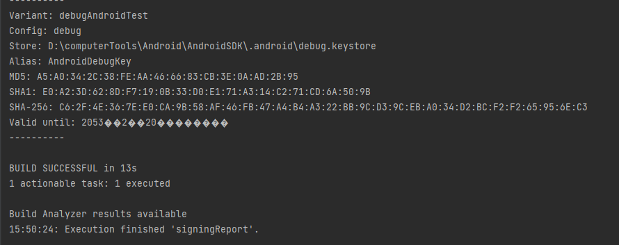
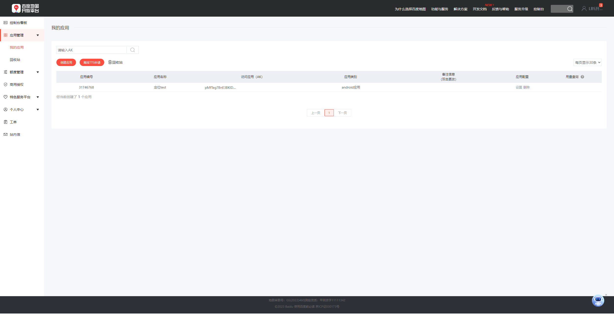

# 第11章  基于位置的服务

在本章中，我们将要学习一些全新的Android技术，这些技术有别于传统的PC或Web领域的应用技术，是只有在移动设备上才能实现的。

基于位置的服务（Location Based Service）。由于移动设备相比于电脑可以随身携带，我们通过地理定位的技术就可以随时得知自己所在的位置，从而围绕这一点开发出很多有意思的应用。

## 基于位置的服务简介

基于位置的服务简称LBS，其实它本身并不是什么时髦的技术，主要的工作原理就是**利用无线电通讯网络或GPS等定位方式来确定出移动设备所在的位置**，而这种定位技术早在很多年前就已经出现了。

在过去移动设备的功能极其有限，即使定位到了设备所在的位置，也就仅仅只是定位到了而已，我们并不能在位置的基础上进行一些其他的操作。而现在就大大不同了，有了Android系统作为载体，可以利用定位出的位置进行许多丰富多彩的操作。比如说天气预报程序可以根据用户所在的位置自动选择城市，发微博的时候我们可以向朋友们晒一下自己在哪里，不认识路的时候随时打开地图就可以查询路线，等等。

**基于位置的服务所围绕的核心是要先确定出用户所在的位置。**

通常有两种技术方式可以实现，一种是通过**GPS定位**，一种是通过**网络定位**：

- GPS定位的工作原理是基于手机内置的GPS硬件直接和卫星交互来获取当前的经纬度信息，这种定位方式精确度非常高，但缺点是只能在室外使用，室内基本无法接收到卫星的信号。
- 网络定位的工作原理是根据手机当前网络附近的三个基站进行测速，以此计算出手机和每个基站之间的距离，再通过三角定位确定出一个大概的位置，这种定位方式精确度一般，但优点是在室内室外都可以使用。

Android对这两种定位方式都提供了相应的API支持，但是由于一些特殊原因，Google的网络服务在中国不可访问，从而导致网络定位方式的API失效。而GPS定位虽然不需要网络，但是必须要在室外才可以使用，因此你在室内开发的时候很有可能会遇到不管使用哪种定位方式都无法成功定位的情况。

基于以上原因，本书中不再讲解Android原生定位API的用法了，而是使用一些国内第三方公司的SDK。目前国内在这一领域做得比较好的一个是百度，一个是高德，本章我们就来学习一下百度在LBS方面提供的丰富多彩的功能。

## 申请API Key

现在的申请步骤和书上的内容不太一样，我就不在这里详述了。大家可以参考书上的步骤到百度的LBS官网进行申请[百度地图开放平台 | 百度地图API SDK | 地图开发 (baidu.com)](https://lbsyun.baidu.com/)

创建应用的过程中需要我们填写开发版和发布版的SHA1。这是我们申请API Key 所必须填写的一个字段，它指的是打包程序是所用的签名文件的SHA1指纹，你可以通过Android Studio查看到。打开Android Studio中的任意一个项目，点击右侧工具栏的Gradle->项目名->:app->Task->android由于我们目前只是学习定位的使用，所以你两个空可以填同一个SHA1指纹。如果后面出错了，可以参考书中的内容创建一个发布版的SHA1指纹。



创建应用成功后会如下图所示



其中，访问应用（AK）下面的值就是我们申请到的API Key，有了它我们就可以进行后续的LBS开发工作了。

## 使用百度定位 

新建一个LBSTest项目，包名应该就会自动被命名为com.example.lbstest。另外需要注意，本章中所写的代码建议都在手机上运行，虽然模拟器中也提供了模拟地理位置的功能，但在手机上可以得到真实的位置数据。

### 准备LBS SDK

在开始编码之前，我们还需要先将百度LBS开放平台的SDK准备好，目前百度地图Android地图SDK境内服务对非商业目的使用的开发者不收取任何费用，开发者可自行下载：`http://lbsyun.baidu.com/index.php?title=androidsdk/sdkandev-download`，放心使用。

本章中，我们会用到基础地图和定位功能这两个SDK，将它们勾选上，在开发包格式中选择JAR包，然后点击“开发包”下载按钮即可。下载完成后对该压缩包解压，其中会有一个libs目录，这里面的内容就是我们所需要的一切了。

libs目录下的内容又分为两部分，BaiduLBS_Android.jar这个文件是Java层要使用到的，其他子目录下的so文件是Native层要用到的。so文件是用C/C++语言进行编写，然后再用NDK编译出来的。当然这里我们并不需要去编写C/C++的代码，因为百度都已经做好了封装，但是我们需要将libs目录下的每一个文件都放置到正确的位置。

首先，观察一下当前的项目结构，会发现app模块下面有一个libs目录，这里就是用来存放所有的Jar包的，我们将BaiduLBS_Android.jar复制到这里。

接下来展开src/main目录，右击该目录→New→Directory，再创建一个名为jniLibs的目录，这里就是专门用来存放so文件的，然后把压缩包里的其他所有目录直接复制到这里。

另外，虽然所有新创建的项目中，app/build.gradle文件都会默认配置以下这段声明

```xml
dependencies {
    implementation fileTree(include: ['*.jar'], dir: 'libs')
}
```

这表示会将libs目录下所有以.jar结尾的文件添加到当前项目的引用中。但是由于我们是直接将Jar包复制到libs目录下的，并没有修改gradle文件，因此不会弹出我们平时熟悉的Sync Now提示。这个时候必须手动点击一下Android Studio顶部工具栏中的Sync按钮，不然项目将无法引用到Jar包中提供的任何接口。

点击Sync按钮之后，libs目录下的jar文件就会多出一个向右的箭头，这就表示项目已经能引用到这些Jar包了。

###  确定自己位置的经纬度

首先修改activity_main.xml中的代码，如下所示：

```xml
<?xml version="1.0" encoding="utf-8"?>
<LinearLayout xmlns:android="http://schemas.android.com/apk/res/android"
    android:orientation="vertical"
    android:layout_width="match_parent"
    android:layout_height="match_parent">
    <TextView
        android:id="@+id/position_text_view"
        android:layout_width="wrap_content"
        android:layout_height="wrap_content"/>
</LinearLayout>
```

TextView控件用于稍后显示当前位置的经纬度。

然后，修改AndroidManifest.xml文件中的代码，如下所示：

```xml
<?xml version="1.0" encoding="utf-8"?>
<manifest xmlns:android="http://schemas.android.com/apk/res/android"
    xmlns:tools="http://schemas.android.com/tools"
    package="com.example.lbstest">
    <!-- 这个权限用于进行网络定位-->
    <uses-permission android:name="android.permission.ACCESS_COARSE_LOCATION"/>
    <!-- 这个权限用于访问GPS定位-->
    <uses-permission android:name="android.permission.ACCESS_FINE_LOCATION"/>
    <!-- 用于访问wifi网络信息，wifi信息会用于进行网络定位-->
    <uses-permission android:name="android.permission.ACCESS_WIFI_STATE"/>
    <!-- 获取运营商信息，用于支持提供运营商信息相关的接口-->
    <uses-permission android:name="android.permission.ACCESS_NETWORK_STATE"/>
    <!-- 这个权限用于获取wifi的获取权限，wifi信息会用来进行网络定位-->
    <uses-permission android:name="android.permission.CHANGE_WIFI_STATE"/>
    <uses-permission android:name="android.permission.READ_PHONE_STATE" />
    <!-- 写入扩展存储，向扩展卡写入数据，用于写入离线定位数据-->
    <uses-permission android:name="android.permission.WRITE_EXTERNAL_STORAGE"/>
    <!-- 访问网络，网络定位需要上网-->
    <uses-permission android:name="android.permission.INTERNET"/>
    <uses-permission android:name="android.permission.MOUNT_UNMOUNT_FILESYSTEMS"
        tools:ignore="ProtectedPermissions" />
    <uses-permission android:name="android.permission.WAKE_LOCK" />
    <!-- 读取外置存储。如果开发者使用了so动态加载功能并且把so文件放在了外置存储区域，则需要申请该权限，否则不需要 -->
	<uses-permission android:name="android.permission.READ_EXTERNAL_STORAGE" />
    <application
        android:allowBackup="true"
        android:icon="@mipmap/ic_launcher"
        android:label="@string/app_name"
        android:roundIcon="@mipmap/ic_launcher_round"
        android:supportsRtl="true"
        android:theme="@style/Theme.LBSTest">

        <!-- meta-data中android:value=在11.2节申请到的API Key 这里大家注意不要直接复制我的Key-->
        <meta-data
            android:name="com.baidu.lbsapi.API_KEY"
            android:value="pMfTeg7BnE3BKlDz79oHqfHGMGGcr..." />
        <activity
            android:name=".MainActivity"
            android:exported="true">
            <intent-filter>
                <action android:name="android.intent.action.MAIN" />

                <category android:name="android.intent.category.LAUNCHER" />
            </intent-filter>
        </activity>
        <service
            android:name="com.baidu.location.f"
            android:enabled="true"
            android:process=":remote">
        </service>
    </application>

</manifest>
```

这里我们首先添加了很多行权限声明，每一个权限都是百度LBS SDK内部要用到的。然后，在`<application>`标签的内部添加了一个`<meta-data>`标签，这个标签的android:name部分是固定的，必须填`com.baidu.lbsapi.API_KEY`,android:value部分则应该填入我们在11.2节申请到的API Key。最后，还需要再注册一个LBS SDK中的服务，不用对这个服务的名字感到疑惑，因为百度LBS SDK中的代码都是混淆过的。

接下来修改MainActivity中的代码，如下所示：

```java
package com.example.lbstest;

import androidx.annotation.NonNull;
import androidx.appcompat.app.AppCompatActivity;
import androidx.core.app.ActivityCompat;
import androidx.core.content.ContextCompat;

import android.Manifest;
import android.content.pm.PackageManager;
import android.os.Bundle;
import android.widget.TextView;
import android.widget.Toast;

import com.baidu.location.BDLocation;
import com.baidu.location.BDLocationListener;
import com.baidu.location.LocationClient;

import java.util.ArrayList;
import java.util.List;

public class MainActivity extends AppCompatActivity {
    public LocationClient mLocationClient;
    private TextView positionText;
    @Override
    protected void onCreate(Bundle savedInstanceState) {
        super.onCreate(savedInstanceState);
        //没有它，会报错：`Please recheck the setAgreePrivacy interface`
        mLocationClient.setAgreePrivacy(true);
        try {
            //首先创建了一个LocationClient的实例，LocationClient的构建函数接收一个Context参数，
            //这里调用getApplicationContext()方法来获取一个全局的Context参数并传入。
            mLocationClient = new LocationClient(getApplicationContext());
        } catch (Exception e) {
                e.printStackTrace();
        }
        //然后调用LocationClient的registerLocationListener()方法来注册一个定位监听器，当获取到位置信息的时候，就会回调这个定位监听器。
        mLocationClient.registerLocationListener(new MyLocationListener());
        setContentView(R.layout.activity_main);
        positionText = (TextView) findViewById(R.id.position_text_view);
        //怎样才能在运行时一次性申请3个权限呢?
        //创建一个空的List集合，然后依次判断这3个权限有没有被授权，
        //如果没被授权就添加到List集合中，最后将List转换成数组，
        //再调用ActivityCompat.requestPermissions()方法一次性申请。
        List<String> permissionList = new ArrayList<>();
        if (ContextCompat.checkSelfPermission(MainActivity.this, Manifest.permission.ACCESS_FINE_LOCATION) != PackageManager.PERMISSION_GRANTED) {
            permissionList.add(Manifest.permission.ACCESS_FINE_LOCATION);
        }
        if (ContextCompat.checkSelfPermission(MainActivity.this,Manifest.permission.READ_PHONE_STATE) != PackageManager.PERMISSION_GRANTED) {
            permissionList.add(Manifest.permission.READ_PHONE_STATE);
        }
        if (ContextCompat.checkSelfPermission(MainActivity.this,Manifest.permission.WRITE_EXTERNAL_STORAGE) != PackageManager.PERMISSION_GRANTED) {
            permissionList.add(Manifest.permission.WRITE_EXTERNAL_STORAGE);
        }
        if (! permissionList.isEmpty()) {
            String [] permissions = permissionList.toArray(new String[permissionList.size()]);
            ActivityCompat.requestPermissions(MainActivity.this,permissions,1);
        } else {
            requestLocation();
        }
}
private void requestLocation() {
    mLocationClient.start();
}

@Override
public void onRequestPermissionsResult(int requestCode, @NonNull String[] permissions, @NonNull int[] grantResults) {
    super.onRequestPermissionsResult(requestCode, permissions, grantResults);
    switch (requestCode) {
        case 1:
            if (grantResults.length > 0) {
                for (int result : grantResults) {
                    if (result != PackageManager.PERMISSION_GRANTED) {
                        Toast.makeText(this,"必须同意所有权限才能使用本程序",Toast.LENGTH_SHORT).show();
                        finish();
                        return;
                    }
                }
                requestLocation();
            } else {
                Toast.makeText(this,"发生未知错误",Toast.LENGTH_SHORT).show();
                finish();
            }
            break;
        default:
    }
}

public class MyLocationListener implements BDLocationListener {
    /**
     * MyLocationListener的onReceiveLocation()方法中:
     * 通过BDLocation的getLatitude()方法获取当前位置的纬度,
     * 通过getLongitude()方法获取当前位置的经度，
     * 通过getLocType()方法获取当前的定位方式，最终将结果组装成一个字符串，显示到TextView上面。
     */
    @Override
    public void onReceiveLocation(BDLocation bdLocation) {
        runOnUiThread(new Runnable() {
            @Override
            public void run() {
                StringBuilder currentPosition = new StringBuilder();
                currentPosition.append("纬度：").append(bdLocation.getLatitude()).append("\n");
                currentPosition.append("经度：").append(bdLocation.getLongitude()).append("\n");
                currentPosition.append("定位方式：");
                if (bdLocation.getLocType() == BDLocation.TypeGpsLocation) {
                    currentPosition.append("GPS");
                } else if (bdLocation.getLocType() == BDLocation.TypeNetWorkLocation) {
                    currentPosition.append("网络");
                }
                positionText.setText(currentPosition);
            }
        });
    }
}
}
```

`onRequestPermissionsResult()`方法中对权限申请结果的逻辑处理和之前有所不同，这次我们通过一个循环将申请的每个权限都进行了判断，如果有任何一个权限被拒绝，那么就直接调用`finish()`方法关闭当前程序，只有当所有权限都被用户同意了，才会调用requestLocation()方法开始地理位置定位。

`requestLocation()`方法中的代码比较简单，只是调用了一下LocationClient的`start()`方法就能开始定位了。定位的结果会回调到我们前面注册的监听器当中，也就是MyLocationListener。

运行一下程序，毫无疑问，打开程序首先就会弹出运行时权限的申请对话框。这里我们全部点击允许，然后就会立刻开始定位了。

不过，在默认情况下，调用LocationClient的start()方法只会定位一次，如果我们正在快速移动中，怎样才能实时更新当前的位置呢？为此，百度LBS SDK提供了一系列的设置方法，来允许我们更改默认的行为，修改MainActivity中的代码，如下所示：

```java
public class MainActivity extends AppCompatActivity {
    ...
    private void requestLocation() {
        initLocation();
        mLocationClient.start();
    }
    private void initLocation() {
        LocationClientOption option = new LocationClientOption();
        // 表示每5秒钟会更新一下当前的位置
        option.setScanSpan(5000);
        mLocationClient.setLocOption(option);
    }
    @Override
    protected void onDestroy() {
        super.onDestroy();
        mLocationClient.stop();
    }
    ...
}
```

这里增加了一个`initLocation()`方法，在`initLocation()`方法中我们创建了一个LocationClientOption对象，然后调用它的`setScanSpan()`方法来设置更新的间隔。

最后要记得，在活动被销毁的时候一定要调用LocationClient的`stop()`方法来停止定位，不然程序会持续在后台不停地进行定位，从而严重消耗手机的电量。

重新运行程序，拿着手机随处移动，界面上的经纬度信息也会跟着一起变化。

### 选择定位模式

Android中主要有两种：一种是通过GPS定位，一种是通过网络定位。

在上一小节中的例子中，我们使用的网络定位。本小节我们就来学习一下GPS定位。首先，GPS定位功能必须要由用户主动去启用才行，不然任何应用程序都无法使用GPS获取到手机当前的位置信息。进入手机的设置→位置信息，打开”访问我的位置信息“。同时要选择高精度模式，不同手机厂商的界面也不一样，像华为就是打开高精度GNSS开关。

开启了GPS定位功能之后，再回来看一下代码。我们可以在`initLocation()`方法中对百度LBS SDK的定位模式进行指定，一共有3种模式可选：Hight_Accuracy、Battery_Saving和Device_Sensors。

- Hight_Accuracy 表示高精确度模式，会在GPS信号正常的情况下优先使用GPS定位，在无法接收GPS信号的时候使用网络定位。
- Battery_Saving 表示节电模式，只会使用网络进行定位。
- Device_Sensors 表示传感器模式，只会使用GPS进行定位。

Hight_Accuracy是默认的模式，也就是说，我们即使不修改任何代码，只要拿着手机走到室外去，让手机可以接收到GPS信号，就会自动切换到GPS定位模式了。

当然我们也可以强制指定只使用GPS进行定位，修改MainActivity中的代码，如下所示：

```java
public class MainActivity extends AppCompatActivity {
   ...
    private void initLocation() {
        LocationClientOption option = new LocationClientOption();
        // 表示每5秒钟会更新一下当前的位置
        option.setScanSpan(5000);
       // 调用了setLocationMode()方法来将定位模式指定成传感器模式，也就是说只能使用GPS进行定位
        option.setLocationMode(LocationClientOption.LocationMode.Device_Sensors);
        mLocationClient.setLocOption(option);
    }
    @Override
    protected void onDestroy() {
        super.onDestroy();
        mLocationClient.stop();
    }
	...
}
```

这里调用了`setLocationMode()`方法来将定位模式指定成传感器模式，也就是说只能使用GPS进行定位。重新运行一下程序，然后拿着手机走到室外去，界面上的经纬度即为GPS定位所得到的。

### 看得懂的位置信息

虽然我们成功获取到了设备当前位置的经纬度信息，但一般人看不懂这种经纬度信息。

为了能够更加直观地阅读，我们还需要学习一下如何获取看得懂的位置信息。百度LBS SDK在这方面提供了非常好的支持，我们只需要进行一些简单的接口调用就能得到当前位置各种丰富的地址信息。

修改MainActivity中的代码，如下所示：

```java
public class MainActivity extends AppCompatActivity {
    ...
    private void initLocation() {
        LocationClientOption option = new LocationClientOption();
        // 表示每5秒钟会更新一下当前的位置
        option.setScanSpan(5000);
        // 调用了LocationClientOption的setIsNeedAddress()方法，并传入true，表示需要获取当前位置详细的地址信息。
        option.setIsNeedAddress(true);
        // 调用了setLocationMode()方法来将定位模式指定成传感器模式，也就是说只能使用GPS进行定位
        option.setLocationMode(LocationClientOption.LocationMode.Device_Sensors);
        mLocationClient.setLocOption(option);
    }
    ...
    public class MyLocationListener implements BDLocationListener {
        @Override
        public void onReceiveLocation(BDLocation bdLocation) {
            runOnUiThread(new Runnable() {
                @Override
                public void run() {
                    StringBuilder currentPosition = new StringBuilder();
                    currentPosition.append("纬度：").append(bdLocation.getLatitude()).append("\n");
                    currentPosition.append("经度：").append(bdLocation.getLongitude()).append("\n");
                    currentPosition.append("国家：").append(bdLocation.getCountry()).append("\n");
                    currentPosition.append("省：").append(bdLocation.getProvince()).append("\n");
                    currentPosition.append("市：").append(bdLocation.getCity()).append("\n");
                    currentPosition.append("区：").append(bdLocation.getDistrict()).append("\n");
                    currentPosition.append("街道：").append(bdLocation.getStreet()).append("\n");
                    currentPosition.append("定位方式：");
                    if (bdLocation.getLocType() == BDLocation.TypeGpsLocation) {
                        currentPosition.append("GPS");
                    } else if (bdLocation.getLocType() == BDLocation.TypeNetWorkLocation) {
                        currentPosition.append("网络");
                    }
                    positionText.setText(currentPosition);
                }
            });
        }
    }
}
```

在MyLocationListener的`onReceiveLocation()`方法可以获取到各种丰富的地址信息.

调用`getCountry()`方法可以得到当前所在国家，调用`getProvince()`方法可以得到当前所在省份，以此类推。

需要注意，**由于获取地址信息一定需要用到网络，因此即使我们将定位模式指定成了Device_Sensors，也会自动开启网络定位功能。**

## 使用百度地图

手机地图能够随时随地进行查看，并且轻松构建出行路线，使用起来明显更加地方便。应用程序里也是可以加入地图功能的，比如优步中使用的就是百度地图。本节我们就来学习一下这方面的知识。

### 让地图显示出来

我们直接在LBSTest项目的基础上进行开发，修改activity_main.xml中的代码，如下所示：

```xml
<?xml version="1.0" encoding="utf-8"?>
<LinearLayout xmlns:android="http://schemas.android.com/apk/res/android"
    android:orientation="vertical"
    android:layout_width="match_parent"
    android:layout_height="match_parent" >

    <TextView
        android:id="@+id/position_text_view"
        android:layout_width="wrap_content"
        android:layout_height="wrap_content"
        android:visibility="gone"/>

    <com.baidu.mapapi.map.MapView
        android:id="@+id/bmapView"
        android:layout_width="match_parent"
        android:layout_height="match_parent"
        android:clickable="true" />

</LinearLayout>
```

我们在布局文件中新建了一个MapView控件，并让它填充满整个屏幕。注意这个MapView是由百度提供的自定义控件，所以在使用它的时候需要将完整的包名加上。另外，之前用于显示定位信息的TextView现在暂时用不到了，我们将它的visibility属性指定成gone，让它在界面上隐藏起来。

接下来修改MainActivity中的代码，如下所示：

```java
public class MainActivity extends AppCompatActivity {
	...

    private MapView mapView;

    @Override
    protected void onCreate(Bundle savedInstanceState) {
        super.onCreate(savedInstanceState);
        try {
            mLocationClient = new LocationClient(getApplicationContext());
        } catch (Exception e) {
            throw new RuntimeException(e);
        }
        mLocationClient.registerLocationListener(new MyLocationListener());
        //没有它，会报错：Please recheck the setAgreePrivacy interface
        SDKInitializer.setAgreePrivacy(getApplicationContext(),true);
        SDKInitializer.initialize(getApplicationContext());
        setContentView(R.layout.activity_main);
        mapView = (MapView) findViewById(R.id.bmapView);
        ...
    }

    @Override
    protected void onResume() {
        super.onResume();
        mapView.onResume();
    }

    @Override
    protected void onPause() {
        super.onPause();
        mapView.onPause();
    }

    @Override
    protected void onDestroy() {
        super.onDestroy();
        mLocationClient.stop();
        mapView.onDestroy();
    }

    ...
}
```

这里我们首先调用SDKInitializer的`initialize()`来进行初始化操作，`initialize()`方法接收一个Context参数，这里我们调用`getApplicationContext()`来获取一个全局的Context参数并传入。注意初始化操作一定要在`setContentView()`方法前调用，不然的话会出错。

另外还要重写onResume()、onPause()、onDestroy()这3个方法，在这里对MapView进行管理，以保证资源能够及时地得到释放。

运行程序，百度地图就应该成功显示出来了。

### 移动到我的位置

但是目前显示的是默认的地图，显示的是北京市中心的位置，而你可能希望看到更加精细的地图信息，比如说自己所在位置的周边环境。显然，通过缩放和移动的方式来慢慢找到自己的位置是一种很愚蠢的做法。那么本小节我们就来学习一下，如何才能在地图中快速移动到自己的位置。

百度LBS SDK的API中提供了一个BaiduMap类，它是地图的总控制器，调用MapView的`getMap()`方法就能获取到BaiduMap的实例，如下所示：

```java
BaiduMap baiduMap = mapView.getMap();
```

有了BaiduMap后，我们就能对地图进行各种各样的操作了，比如设置地图的缩放级别以及将地图移动到某一个经纬度上。

百度地图将缩放级别的取值范围限定在3到19之间，其中小数点位的值也是可以取的，值越大，地图显示的信息就越精细。比如我们想要将缩放级别设置成12.5，就可以这样写：

```java
MapStatusUpdate update = MapStatusUpdateFactory.zoomTo(12.5f);
baiduMap.animateMapStatus(update);
```

其中MapStatusUpdateFactory的`zoomTo()`方法接收一个float型的参数，就是用于设置缩放级别的，这里我们传入12.5f。`zoomTo()`方法返回一个MapStatusUpdate对象，我们把这个对象传入BaiduMap的`animateMapStatus()`方法当中即可完成缩放功能。

那么怎样才能让地图移动到某一个经纬度上呢？

这就需要借助**LatLng类**。它的构造方法接收两个参数，第一个参数是纬度值，第二个参数是经度值。之后调用MapStatusUpdateFactory的`newLatLng()`方法将LatLng对象传入，`newLatLng()`方法返回的也是一个MapStatusUpdate对象，我们再把这个对象传入BaiduMap的`animateMapStatus()`方法当中，就可以将地图移动到指定的经纬度上了，写法如下：

```java
LatLng ll = new LatLng(39.915,116.404);
MapStatusUpdate update = MapStatusUpdateFactory.newLatLng(ll);
baiduMap.animateMapStatus(update);
```

上述代码就实现了将地图移动到北纬39.915度、东经116.404度这个位置的功能。

接下来我们去实现将地图快速移动到自己位置的功能。

继续完善LBSTest这个项目，加入“移动到我的位置”这个功能。修改MainActivity中的代码，如下所示：

```java
public class MainActivity extends AppCompatActivity {
	
    ...
    private BaiduMap baiduMap;

    private boolean isFirstLocate = true;

    @Override
    protected void onCreate(Bundle savedInstanceState) {
        super.onCreate(savedInstanceState);
        try {
            mLocationClient = new LocationClient(getApplicationContext());
        } catch (Exception e) {
            throw new RuntimeException(e);
        }
        mLocationClient.registerLocationListener(new MyLocationListener());
        SDKInitializer.setAgreePrivacy(getApplicationContext(),true);
        SDKInitializer.initialize(getApplicationContext());
        setContentView(R.layout.activity_main);
        mapView = (MapView) findViewById(R.id.bmapView);
        baiduMap = mapView.getMap();
        ...
    }

    private void navigateTo(BDLocation location) {
        if (isFirstLocate) {
            Toast.makeText(this, "nav to " + location.getAddrStr(), Toast.LENGTH_SHORT).show();
            LatLng ll = new LatLng(location.getLatitude(), location.getLongitude());
            MapStatusUpdate update = MapStatusUpdateFactory.newLatLng(ll);
            baiduMap.animateMapStatus(update);
            update = MapStatusUpdateFactory.zoomTo(16f);
            baiduMap.animateMapStatus(update);
            isFirstLocate = false;
        }
    }

   
    public class MyLocationListener extends BDAbstractLocationListener {

    @Override
    public void onReceiveLocation(BDLocation location) {

        if (location.getLocType() == BDLocation.TypeGpsLocation
                || location.getLocType() == BDLocation.TypeNetWorkLocation) {
            navigateTo(location);
        }
    }
}
```

这里我们加入了一个`navigateTo()`方法。这个方法，先是将BDLocation对象中的地理位置信息取出并封装到LatLng对象中，然后调用MapStatusUpdateFactory的`newLatLng()`方法并将LatLng对象传入，接着将返回的MapStatusUpdate对象作为参数传入到BaiduMap的`animateMapStatus()`方法当中。

并且，这里为了让地图信息可以显示得更加丰富一些，我们将缩放级别设置成了16。需要注意，上述代码当中我们使用了一个isFirstLocate变量，这个变量的作用是为了防止多次调用`animateMapStatus()`方法，因为将地图移动到我们当前的位置只需要在程序第一次定位的时候调用一次就可以了。

另外，当定位到设备当前位置的时候，我们在`onReceiveLocation()`方法中直接把BDLocation对象传给`navigateTo()`方法，这样就能够让地图移动到设备所在的位置了.

### 让“我”显示在地图上

现在我们已经可以让地图显示我们周边的环境了。通常情况下手机地图上应该都会有一个小光标，用于显示设备当前所在的位置，并且如果设备正在移动的话，那么这个光标也会跟着一起移动。那么我们现在就继续对现有代码进行扩展，让“我”能够显示在地图上。

百度LBS SDK当中提供了一个MyLocationData.Builder类，这个类是用来封装设备当前所在位置的，我们只需将经纬度信息传入到这个类的相应方法当中就可以了，如下所示：

```java
MyLocationData.Builder locationBuilder = new MyLocationData.Builder();
locationBuilder.latitude(39.915);
locationBuilder.longitude(116.404);
```

MyLocationData.Builder类还提供了一个`build()`方法，当我们把要封装的信息都设置完成之后，只需要调用它的`build()方法`，就会生成一个MyLocationData的实例，然后再将这个实例传入到BaiduMap的`setMyLocationData()`方法当中，就可以让设备当前的位置显示在地图上了，写法如下：

```java
MyLocationData locationData = locationBuilder.build();
baiduMap.setMyLocationData(locationData);
```

下面我们开始来实现一下，修改MainActivity中的代码，如下所示：

```java
public class MainActivity extends AppCompatActivity {
	
    ...

    @Override
    protected void onCreate(Bundle savedInstanceState) {
        super.onCreate(savedInstanceState);
        mLocationClient.setAgreePrivacy(true);
        try {
            mLocationClient = new LocationClient(getApplicationContext());
        } catch (Exception e) {
            throw new RuntimeException(e);
        }
        mLocationClient.registerLocationListener(new MyLocationListener());
        SDKInitializer.setAgreePrivacy(getApplicationContext(),true);
        SDKInitializer.initialize(getApplicationContext());
        setContentView(R.layout.activity_main);
        mapView = (MapView) findViewById(R.id.bmapView);
        baiduMap = mapView.getMap();
        //根据百度地图的限制，想要使用这一功能，一定要事先调用BaiduMap的setMyLocationEnabled()方法将此功能开启，否则设备的位置将无法在地图上显示。
        baiduMap.setMyLocationEnabled(true);
        ...
    }

    private void navigateTo(BDLocation location) {
        if (isFirstLocate) {
            Toast.makeText(this, "nav to " + location.getAddrStr(), Toast.LENGTH_SHORT).show();
            LatLng ll = new LatLng(location.getLatitude(), location.getLongitude());
            MapStatusUpdate update = MapStatusUpdateFactory.newLatLng(ll);
            baiduMap.animateMapStatus(update);
            update = MapStatusUpdateFactory.zoomTo(16f);
            baiduMap.animateMapStatus(update);
            isFirstLocate = false;
        }
        MyLocationData.Builder locationBuilder = new MyLocationData.Builder();
        locationBuilder.latitude(location.getLatitude());
        locationBuilder.longitude(location.getLongitude());
        MyLocationData locationData = locationBuilder.build();
        baiduMap.setMyLocationData(locationData);
    }
    
  	@Override
    protected void onDestroy() {
        super.onDestroy();
        mLocationClient.stop();
        mMapView.onDestroy();
        //在程序退出的时候，也要记得将BaiduMap的setMyLocationEnabled()方法功能给关闭掉
        baiduMap.setMyLocationEnabled(false);
    }
}
```

在`navigateTo()`方法中，添加了MyLocationData的构建逻辑，将Location中包含的经度和纬度分别封装到了MyLocationData.Builder当中，最后把MyLocationData设置到了BaiduMap的`setMyLocationData()`方法当中。

注意：这段逻辑必须写在isFirstLocate这个if条件语句的外面，因为让地图移动到我们当前的位置只需要在第一次定位的时候执行，但是设备在地图上显示的位置却应该是随着设备的移动而实时改变的。

运行程序，界面上能清晰地看到自己当前是在哪里。