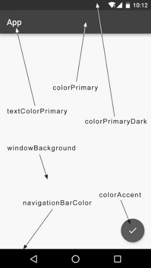

# 第12章  Material Design实战

其实长久以来，大多数人都认为Android系统的UI并不算美观，至少没有iOS系统的美观。以至于很多IT公司在进行应用界面设计的时候，为了保证双平台的统一性，强制要求Android端的界面风格必须和iOS端一致。

这种情况在现实工作当中实在是太常见了，虽然这是不太合理的。因为对于一般用户来说，他们不太可能会在两个操作系统上分别去使用同一个应用，但是却必定会在同一个操作系统上使用不同的应用。因此，同一个操作系统中各个应用之间的界面统一性要远比一个应用在双平台的界面统一性重要得多，只有这样，才能给使用者带来更好的用户体验。

但问题在于，Android标准的界面设计风格并不是特别被大众所接受，很多公司都觉得自己完全可以设计出更加好看的界面，从而**导致Android平台的界面风格长期难以得到统一**。为了解决这个问题，谷歌也是祭出了杀手锏，在2014年Google I/O大会上重磅推出了一套全新的界面设计语言——**MaterialDesign**。

本章我们就将对Material Design进行一次深入的学习。

## 什么是Material Design

**Material Design**是由谷歌的设计工程师们基于传统优秀的设计原则，结合丰富的创意和科学技术所发明的一套全新的界面设计语言，包含了视觉、运动、互动效果等特性。那么谷歌凭什么认为Material Design就能解决Android平台界面风格不统一的问题呢？一言以蔽之，好看！

谷歌从Android 5.0系统开始，就将所有内置的应用都使用Material Design风格来进行设计。

不过，在重磅推出之后，Material Design的普及程度却不能说是特别理想。因为这只是一个推荐的设计规范，主要是面向UI设计人员的，而不是面向开发者的。很多开发者可能根本就搞不清楚什么样的界面和效果才叫Material Design，就算搞清楚了，实现起来也会很费劲，因为不少Material Design的效果是很难实现的，而Android中却几乎没有提供相应的API支持，一切都要靠开发者自己从零写起。

谷歌当然也意识到了这个问题，于是在2015年的Google I/O大会上推出了一个Design Support库，这个库将Material Design中最具代表性的一些控件和效果进行了封装，使得开发者在即使不了解Material Design的情况下也能非常轻松地将自己的应用Material化。

本章中我们就将对Design Support这个库进行深入的学习，并且配合一些其他的控件来完成一个优秀的MaterialDesign应用。新建一个MaterialTest项目来用作学习。

## Toolbar

回忆一下，我们曾经在3.4.1小节为了使用一个自定义的标题栏，而把系统原生的ActionBar隐藏掉。每个活动最顶部的那个标题栏其实就是ActionBar，之前我们编写的所有程序里一直都有ActionBar的身影。

不过，ActionBar由于其设计的原因，被限定只能位于活动的顶部，从而不能实现一些Material Design的效果，因此官方现在已经不再建议使用ActionBar了。那么接下来我们学习一下现在更加推荐使用的Toolbar。

Toolbar的强大之处在于，它不仅继承了ActionBar的所有功能，而且灵活性很高，可以配合其他控件来完成一些Material Design的效果。

首先你要知道，任何一个新建的项目，默认都是会显示ActionBar的。那么这个ActionBar到底是从哪里来的呢？其实这是根据项目中指定的主题来显示的，打开AndroidManifest.xml文件看一下，如下所示：

```xml
<application
        android:allowBackup="true"
        android:icon="@mipmap/ic_launcher"
        android:label="@string/app_name"
        android:roundIcon="@mipmap/ic_launcher_round"
        android:supportsRtl="true"
        android:theme="@style/Theme.MaterialTest">
    ...
</application>
```

可以看到，这里使用`android:theme`属性指定了一个Theme.MaterialTest的主题。那么这个Theme.MaterialTest又是在哪里定义的呢？打开res/values/themes.xml文件，代码如下所示：

```xml
<resources xmlns:tools="http://schemas.android.com/tools">
    <!-- Base application theme. -->
    <style name="Theme.MaterialTest" parent="Theme.MaterialComponents.DayNight.DarkActionBar">
        <!-- Primary brand color. -->
        <item name="colorPrimary">@color/purple_500</item>
        <item name="colorPrimaryVariant">@color/purple_700</item>
        <item name="colorOnPrimary">@color/white</item>
        <!-- Secondary brand color. -->
        <item name="colorSecondary">@color/teal_200</item>
        <item name="colorSecondaryVariant">@color/teal_700</item>
        <item name="colorOnSecondary">@color/black</item>
        <!-- Status bar color. -->
        <item name="android:statusBarColor" tools:targetApi="l">?attr/colorPrimaryVariant</item>
        <!-- Customize your theme here. -->
    </style>
</resources>
```

这里定义了一个叫Theme.MaterialTest的主题，然后指定它的parent主题是Theme.MaterialComponents.DayNight.DarkActionBar。这个DarkActionBar是一个深色的ActionBar主题，我们之前所有的项目中自带的ActionBar就是因为指定了这个主题才出现的。

现在准备使用Toolbar来替代ActionBar，因此需要指定一个不带ActionBar的主题，通常有两种主题可选：

Theme.AppCompat.NoActionBar表示深色主题，它会将界面的主体颜色设成深色，陪衬颜色设成淡色。

Theme.AppCompat.Light.NoActionBar表示淡色主题，它会将界面的主体颜色设成淡色，陪衬颜色设成深色。

这里我就选用淡色主题了，如下所示：

```xml
<style name="Theme.MaterialTest" parent="Theme.AppCompat.Light.NoActionBar">
```

下面看一下一些属性是代表什么位置的颜色



colorAccent这个属性比较难理解，它不只是用来指定这样一个按钮的颜色，而是更多表达了一个强调的意思，比如一些控件的选中状态也会使用colorAccent的颜色。

现在，我们已经将ActionBar隐藏起来了，那么接下来看一看如何使用Toolbar来替代ActionBar。修改activity_main.xml中的代码，如下所示：

```xml
<?xml version="1.0" encoding="utf-8"?>
<FrameLayout xmlns:android="http://schemas.android.com/apk/res/android"
    xmlns:app="http://schemas.android.com/apk/res-auto"
    android:layout_width="match_parent"
    android:layout_height="match_parent">
    <androidx.appcompat.widget.Toolbar
        android:layout_width="match_parent"
        android:layout_height="?attr/actionBarSize"
        android:id="@+id/toolbar"
        android:background="?colorPrimary"
        android:theme="@style/ThemeOverlay.AppCompat.Dark.ActionBar"
        app:popupTheme="@style/ThemeOverlay.AppCompat.Light"/>
</FrameLayout>
```

首先，我们使用xmlns:app指定了一个新的命名空间。正是由于每个布局文件都会使用xmlns:android来指定一个命名空间，因此我们才能一直使用android:id、android:layout_width等写法，那么这里指定了xmlns:app，也就是说现在可以使用app:attribute这样的写法了。

但是为什么这里要指定一个xmlns:app的命名空间呢？这是由于Material Design是在Android 5.0系统中才出现的，而很多的Material属性在5.0之前的系统中并不存在，那么为了能够兼容之前的老系统，我们就不能使用android:attribute这样的写法了，而是应该使用app:attribute。

接下来定义了一个Toolbar控件，给Toolbar指定了一个id，将它的宽度设置为match_parent，高度设置为actionBar的高度，背景色设置为colorPrimary。

不过下面的部分就稍微有点难理解了，由于我们刚才在themes.xml中将程序的主题指定成了淡色主题，因此Toolbar现在也是淡色主题，而Toolbar上面的各种元素就会自动使用深色系，这是为了和主体颜色区别开。但是这个效果看起来就会很差，之前使用ActionBar时文字都是白色的，现在变成黑色的会很难看。

那么为了能让Toolbar单独使用深色主题，这里我们使用android:theme属性，将Toolbar的主题指定成了ThemeOverlay.AppCompat.Dark.ActionBar。但是这样指定完了之后又会出现新的问题，如果Toolbar中有菜单按钮（我们在2.2.5小节中学过），那么弹出的菜单项也会变成深色主题，这样就再次变得十分难看，于是这里使用了app:popupTheme属性单独将弹出的菜单项指定成了淡色主题。之所以使用app:popupTheme，是因为popupTheme这个属性是在Android 5.0系统中新增的，我们使用app:popupTheme的话就可以兼容Android 5.0以下的系统了。

写完了布局，接下来我们修改MainActivity，代码如下所示：

```java
public class MainActivity extends AppCompatActivity {

    @Override
    protected void onCreate(Bundle savedInstanceState) {
        super.onCreate(savedInstanceState);
        setContentView(R.layout.activity_main);
        Toolbar toolbar = (Toolbar) findViewById(R.id.toolbar);
        setSupportActionBar(toolbar);
    }
}
```

调用`setSupportActionBar()`方法并将Toolbar的实例传入。

这个标题栏虽然看上去和之前的标题栏没什么两样，但其实它已经是Toolbar而不是ActionBar了。因此它现在也具备了实现Material Design效果的能力，这个我们在后面就会学到。

接下来我们再学习一些Toolbar比较常用的功能吧，比如修改标题栏上显示的文字内容。这段文字内容是在AndroidManifest.xml中指定的，如下所示：

```xml
...
<application
        android:allowBackup="true"
        android:icon="@mipmap/ic_launcher"
        android:label="@string/app_name"
        android:roundIcon="@mipmap/ic_launcher_round"
        android:supportsRtl="true"
        android:theme="@style/Theme.MaterialTest">
        <activity
            android:name=".MainActivity"
            android:label="Fruits"
            ...
    </application>
    ...
```

给activity增加了一个android:label属性，用于指定在Toolbar中显示的文字内容，如果没有指定的话，会默认使用application中指定的label内容，也就是我们的应用名称。

只有一个标题的Toolbar看起来太单调了，还可以再添加一些action按钮来让Toolbar更加丰富一些，这里我提前准备了几张图片来作为按钮的图标，将它们放在了drawable-xxhdpi目录下。现在右击res目录→New→Directory，创建一个menu文件夹。然后右击menu文件夹→New→Menu resource file，创建一个toolbar.xml文件，并编写如下代码：

```xml
<?xml version="1.0" encoding="utf-8"?>
<menu xmlns:android="http://schemas.android.com/apk/res/android"
    xmlns:app="http://schemas.android.com/apk/res-auto">
    <item
        android:id="@+id/backup"
        android:icon="@drawable/ic_backup"
        android:title="Backup"
        app:showAsAction="always"/>
    <item
        android:id="@+id/delete"
        android:icon="@drawable/ic_delete"
        android:title="Delete"
        app:showAsAction="ifRoom"/>
    <item
        android:id="@+id/settings"
        android:icon="@drawable/ic_settings"
        android:title="Settings"
        app:showAsAction="never"/>
</menu>
```

我们通过`<item>`标签来定义action按钮，android:id用于指定按钮的id, android:icon用于指定按钮的图标，android:title用于指定按钮的文字。

接着使用app:showAsAction来指定按钮的显示位置，之所以这里再次使用了app命名空间，同样是为了能够**兼容**低版本的系统。showAsAction主要有以下几种值可选：

- always表示永远显示在Toolbar中，如果屏幕空间不够则不显示；
- ifRoom表示屏幕空间足够的情况下显示在Toolbar中，不够的话就显示在菜单当中；
- never则表示永远显示在菜单当中。

**注意，Toolbar中的action按钮只会显示图标，菜单中的action按钮只会显示文字**。接下来的做法就和2.2.5小节中的完全一致了，修改MainActivity中的代码，如下所示：

```java
public class MainActivity extends AppCompatActivity {

    ...
    public boolean onCreateOptionsMenu(Menu menu) {
        getMenuInflater().inflate(R.menu.toolbar,menu);
        return true;
    }

    @Override
    public boolean onOptionsItemSelected(@NonNull MenuItem item) {
        switch (item.getItemId()) {
            case R.id.backup:
                Toast.makeText(this, "You clicked Backup", Toast.LENGTH_SHORT).show();
                break;
            case R.id.delete:
                Toast.makeText(this, "You clicked Delete", Toast.LENGTH_SHORT).show();
                break;
            case R.id.settings:
                Toast.makeText(this, "You clicked Settings", Toast.LENGTH_SHORT).show();
                break;
            default:
        }
        return true;
    }
}
```

我们在`onCreateOptionsMenu()`方法中加载了toolbar.xml这个菜单文件，然后在`onOptionsItemSelected()`方法中处理各个按钮的点击事件。重新运行一下程序，可以看到，Toolbar上面现在显示了两个action按钮，这是因为Backup按钮指定的显示位置是always, Delete按钮指定的显示位置是ifRoom，而现在屏幕空间很充足，因此两个按钮都会显示在Toolbar中。

另外一个Settings按钮由于指定的显示位置是never，所以不会显示在Toolbar中，点击一下最右边的菜单按钮来展开菜单项，就能找到Settings按钮了(菜单中的action按钮只会显示文字)。

## 滑动菜单

滑动菜单可以说是Material Design中最常见的效果之一了，在许多著名的应用（如Gmail、Google+等）中，都有滑动菜单的功能。虽说这个功能看上去好像挺复杂的，不过借助谷歌提供的各种工具，我们可以很轻松地实现非常炫酷的滑动菜单效果。

### DrawerLayout

所谓的滑动菜单就是将一些菜单选项隐藏起来，而不是放置在主屏幕上，然后可以通过滑动的方式将菜单显示出来。这种方式既节省了屏幕空间，又实现了非常好的动画效果，是Material Design中推荐的做法。

不过，如果我们全靠自己去实现上述功能的话，难度恐怕就很大了。幸运的是，谷歌提供了一个DrawerLayout控件，借助这个控件，实现滑动菜单简单又方便。

**DrawerLayout的用法，首先它是一个布局，在布局中允许放入两个直接子控件，第一个子控件是主屏幕中显示的内容，第二个子控件是滑动菜单中显示的内容**。因此，我们就可以对activity_main.xml中的代码做如下修改：

```xml
<?xml version="1.0" encoding="utf-8"?>
<androidx.drawerlayout.widget.DrawerLayout xmlns:android="http://schemas.android.com/apk/res/android"
    xmlns:app="http://schemas.android.com/apk/res-auto"
    android:id="@+id/drawer_layout"
    android:layout_width="match_parent"
    android:layout_height="match_parent">
    <FrameLayout
        android:layout_width="match_parent"
        android:layout_height="match_parent">
        <androidx.appcompat.widget.Toolbar
            android:id="@+id/toolbar"
            android:layout_width="match_parent"
            android:layout_height="?attr/actionBarSize"
            android:background="?attr/colorPrimary"
            android:theme="@style/ThemeOverlay.AppCompat.Dark.ActionBar"
            android:popupTheme="@style/ThemeOverlay.AppCompat.Light"/>
    </FrameLayout>
    <TextView
        android:layout_width="match_parent"
        android:layout_height="match_parent"
        android:gravity="start"
        android:text="This is menu"
        android:textSize="30sp"
        android:background="#FFF"/>
</androidx.drawerlayout.widget.DrawerLayout>
```

DrawerLayout中放置了两个直接子控件：

- 第一个子控件是FrameLayout，用于作为主屏幕中显示的内容，里面还有我们刚刚定义的Toolbar。
- 第二个子控件这里使用了一个TextView，用于作为滑动菜单中显示的内容，其实使用什么都可以，DrawerLayout并没有限制只能使用固定的控件。

第二个子控件有一点需要注意，`android:gravity="start"`这个属性是必须指定的，因为我们需要告诉DrawerLayout滑动菜单是在屏幕的左边还是右边:

- 指定left表示滑动菜单在左边;
- 指定right表示滑动菜单在右边；
- 指定start，表示会根据系统语言进行判断；如果系统语言是从左往右的，比如英语、汉语，滑动菜单就在左边，如果系统语言是从右往左的，比如阿拉伯语，滑动菜单就在右边。

重新运行一下程序，然后在屏幕的左侧边缘向右拖动，就可以让滑动菜单显示出来了。然后向左滑动菜单，或者点击一下菜单以外的区域，就可以让滑动菜单关闭，从而回到主界面。无论是展示还是隐藏滑动菜单，都是有非常流畅的动画过渡的。

不过现在的滑动菜单还有点问题，因为只有在屏幕的左侧边缘进行拖动时才能将菜单拖出来，而很多用户可能根本就不知道有这个功能，那么该怎么提示他们呢？

Material Design建议的做法是在Toolbar的最左边加入一个导航按钮，点击了按钮也会将滑动菜单的内容展示出来。这样就相当于给用户提供了两种打开滑动菜单的方式，防止一些用户不知道屏幕的左侧边缘是可以拖动的。

下面，我们开始来实现这个功能。首先准备一张导航按钮的图标ic_menu.png，将它放在了drawable-xxhdpi目录下。然后修改MainActivity中的代码，如下所示：

```java
public class MainActivity extends AppCompatActivity {
    private DrawerLayout mDrawerLayout;
    @Override
    protected void onCreate(Bundle savedInstanceState) {
        super.onCreate(savedInstanceState);
        setContentView(R.layout.activity_main);
        Toolbar toolbar = (Toolbar) findViewById(R.id.toolbar);
        setSupportActionBar(toolbar);
        mDrawerLayout = (DrawerLayout) findViewById(R.id.drawer_layout);
        ActionBar actionBar = getSupportActionBar();
        if (actionBar != null) {
            actionBar.setDisplayHomeAsUpEnabled(true);
            actionBar.setHomeAsUpIndicator(R.drawable.ic_menu);
        }
    }
    ...
    @Override
    public boolean onOptionsItemSelected(@NonNull MenuItem item) {
        switch (item.getItemId()) {
            case R.id.backup:
                ...
            case android.R.id.home:
                mDrawerLayout.openDrawer(GravityCompat.START);
                break;
            default:
        }
        return true;
    }
}
```

首先我们调用`findViewById()`方法得到了DrawerLayout的实例，然后调用`getSupportActionBar()`方法得到了ActionBar的实例，虽然这个ActionBar的具体实现是由Toolbar来完成的。接着调用ActionBar的`setDisplayHomeAsUpEnabled()`方法让导航按钮显示出来，又调用了`setHomeAsUpIndicator()`方法来设置一个导航按钮图标。

实际上，Toolbar最左侧的这个按钮就叫作HomeAsUp按钮，它默认的图标是一个返回的箭头，含义是返回上一个活动。很明显，这里我们将它默认的样式和作用都进行了修改。

接下来在`onOptionsItemSelected()`方法中对HomeAsUp按钮的点击事件进行处理，**HomeAsUp按钮的id永远都是android.R.id.home**。然后调用DrawerLayout的`openDrawer()`方法将滑动菜单展示出来，注意`openDrawer()`方法要求传入一个Gravity参数，为了保证这里的行为和XML中定义的一致，我们传入了GravityCompat.START。

### NavigationView

目前我们已经成功实现了滑动菜单功能，其中滑动功能已经做得非常好了，但是菜单却还很丑，毕竟菜单页面仅仅使用了一个TextView，非常单调。尽管我们可以在滑动菜单页面定制任意的布局，但是谷歌给我们提供了一种更好的方法——使用**NavigationView**。NavigationView是Design Support库中提供的一个控件，它不仅是严格按照Material Design的要求来进行设计的，而且还可以将滑动菜单页面的实现变得非常简单。接下来我们就学习一下NavigationView的用法。

首先，既然这个控件是Design Support库中提供的，那么我们就需要将这个库引入到项目中才行。打开app/build.gradle文件，在dependencies闭包中添加如下内容：

```
dependencies {
    implementation 'com.google.android.material:material:1.8.0'
    implementation 'de.hdodenhof:circleimageview:3.1.0'
}
```

注意，这里和书中的内容不一样。书中的写法`implementation 'com.android.support:design:28.0.0'`会爆红！你可以使用androidx下的库，也可以像我这样写。

CircleImageView是一个开源项目，它可以用来轻松实现图片圆形化的功能，我们待会就会用到它。

在开始使用NavigationView之前，我们还需要提前准备好两个东西：menu和headerLayout。menu是用来在NavigationView中显示具体的菜单项的，headerLayout则是用来在NavigationView中显示头部布局的。

我们先来准备menu，这里我事先找了几张图片来作为按钮的图标，并将它们放在了drawable-xxhdpi目录下。然后右击menu文件夹→New→Menuresource file，创建一个nav_menu.xml文件，并编写如下代码：

```xml
<?xml version="1.0" encoding="utf-8"?>
<menu xmlns:android="http://schemas.android.com/apk/res/android">
    <group android:checkableBehavior="single">
        <item
            android:id="@+id/nav_call"
            android:icon="@drawable/nav_call"
            android:title="Call" />
        <item
            android:id="@+id/nav_friends"
            android:icon="@drawable/nav_friends"
            android:title="Friends"/>
        <item
            android:id="@+id/nav_location"
            android:icon="@drawable/nav_location"
            android:title="Location"/>
        <item
            android:id="@+id/nav_mail"
            android:icon="@drawable/nav_mail"
            android:title="Mail"/>
        <item
            android:id="@+id/nav_task"
            android:icon="@drawable/nav_tasks"
            android:title="Tasks"/>
    </group>
</menu>
```

我们首先在`<menu>`中嵌套了一个`<group>`标签，然后将group的checkableBehavior属性指定为single。group表示一个组，checkableBehavior指定为single表示组中的所有菜单项只能单选。

group中一共定义了5个item，分别使用android:id属性指定菜单项的id, android:icon属性指定菜单项的图标，android:title属性指定菜单项显示的文字。

接下来，我们准备headerLayout。我们将在headerLayout中放置头像、用户名、邮箱地址这3项内容。所以我们需要再准备一张图片，并把它放在了drawable-xxhdpi目录下。另外这张图片最好是一张正方形图片，因为待会我们会把它圆形化。然后右击layout文件夹→New→Layout resourcefile，创建一个nav_header.xml文件。修改其中的代码，如下所示：

```xml
<?xml version="1.0" encoding="utf-8"?>
<RelativeLayout xmlns:android="http://schemas.android.com/apk/res/android"
    android:layout_width="match_parent"
    android:layout_height="180dp"
    android:padding="10dp"
    android:background="?attr/colorPrimary">
    <de.hdodenhof.circleimageview.CircleImageView
        android:layout_width="70dp"
        android:layout_height="70dp"
        android:id="@+id/icon_image"
        android:src="@drawable/nav_icon"
        android:layout_centerInParent="true"/>
    <TextView
        android:layout_width="wrap_content"
        android:layout_height="wrap_content"
        android:id="@+id/mail"
        android:layout_alignParentBottom="true"
        android:text="342165437@qq.com"
        android:textColor="#FFF"
        android:textSize="14sp"/>
    <TextView
        android:layout_width="wrap_content"
        android:layout_height="wrap_content"
        android:id="@+id/username"
        android:layout_above="@id/mail"
        android:text="Li Hua"
        android:textColor="#FFF"
        android:textSize="14sp"/>
</RelativeLayout>
```

布局文件的最外层是一个RelativeLayout，将它的宽度设为match_parent，高度设为180dp，这是一个NavigationView比较适合的高度，然后指定它的背景色为colorPrimary。

在RelativeLayout中我们放置了3个控件，CircleImageView是一个用于将图片圆形化的控件，它的用法基本和ImageView是完全一样的，这里给它指定了一张图片作为头像，然后设置为居中显示。另外两个TextView分别用于显示用户名和邮箱地址，它们都用到了一些RelativeLayout的定位属性。

现在menu和headerLayout都准备好了，我们可以使用NavigationView了。修改activity_main.xml中的代码，如下所示：

```xml
<?xml version="1.0" encoding="utf-8"?>
<androidx.drawerlayout.widget.DrawerLayout xmlns:android="http://schemas.android.com/apk/res/android"
    xmlns:app="http://schemas.android.com/apk/res-auto"
    android:id="@+id/drawer_layout"
    android:layout_width="match_parent"
    android:layout_height="match_parent">
    <FrameLayout
        android:layout_width="match_parent"
        android:layout_height="match_parent">
        <androidx.appcompat.widget.Toolbar
            android:id="@+id/toolbar"
            android:layout_width="match_parent"
            android:layout_height="?attr/actionBarSize"
            android:background="?attr/colorPrimary"
            android:theme="@style/ThemeOverlay.AppCompat.Dark.ActionBar"
            android:popupTheme="@style/ThemeOverlay.AppCompat.Light"/>
    </FrameLayout>
    <com.google.android.material.navigation.NavigationView
        android:layout_width="match_parent"
        android:layout_height="match_parent"
        android:id="@+id/nav_view"
        android:layout_gravity="start"
        app:menu="@menu/nav_menu"
        app:headerLayout="@layout/nav_header"/>
</androidx.drawerlayout.widget.DrawerLayout>
```

我们将之前的TextView换成了NavigationView，这样滑动菜单中显示的内容也就变成NavigationView了。这里又通过app:menu和app:headerLayout属性将我们刚才准备好的menu和headerLayout设置了进去，这样NavigationView就定义完成了。

NavigationView虽然定义完成了，但是我们还要去处理菜单项的点击事件才行。修改MainActivity中的代码，如下所示：

```java
public class MainActivity extends AppCompatActivity {
    private DrawerLayout mDrawerLayout;
    @Override
    protected void onCreate(Bundle savedInstanceState) {
        super.onCreate(savedInstanceState);
        setContentView(R.layout.activity_main);
        Toolbar toolbar = (Toolbar) findViewById(R.id.toolbar);
        setSupportActionBar(toolbar);
        mDrawerLayout = (DrawerLayout) findViewById(R.id.drawer_layout);
        //获取NavigationView的实例
        NavigationView navigationView = (NavigationView) findViewById(R.id.nav_view);
        ActionBar actionBar = getSupportActionBar();
        if (actionBar != null) {
            actionBar.setDisplayHomeAsUpEnabled(true);
            actionBar.setHomeAsUpIndicator(R.drawable.ic_menu);
        }
        navigationView.setCheckedItem(R.id.nav_call);
        navigationView.setNavigationItemSelectedListener(new NavigationView.OnNavigationItemSelectedListener() {
            @Override
            public boolean onNavigationItemSelected(@NonNull MenuItem item) {
                mDrawerLayout.closeDrawers();
                return true;
            }
        });
    }
    public boolean onCreateOptionsMenu(Menu menu) {
        getMenuInflater().inflate(R.menu.toolbar,menu);
        return true;
    }
    ...
}
```

在onCreate()方法中，我们首先获取到了NavigationView的实例，然后调用它的`setCheckedItem()`方法将Call菜单项设置为默认选中。

接着调用了`setNavigationItemSelectedListener()`方法来设置一个菜单项选中事件的监听器，当用户点击了任意菜单项时，就会回调到`onNavigationItemSelected()`方法中。我们可以在这个方法中写相应的逻辑处理，不过这里我并没有附加任何逻辑，只是调用了DrawerLayout的`closeDrawers()`方法将滑动菜单关闭。

## 悬浮按钮和可交互提示

**立面设计**是Material Design中一条非常重要的设计思想，也就是说，按照Material Design的理念，应用程序的界面不仅仅只是一个平面，而应该是有立体效果的。在官方给出的示例中，最简单且最具代表性的立面设计就是悬浮按钮了，这种按钮不属于主界面平面的一部分，而是位于另外一个维度的，因此就会给人一种悬浮的感觉。

本节中我们会对这个悬浮按钮的效果进行学习，另外还会学习一种可交互式的提示工具。关于提示工具，我们之前一直都是使用的Toast，但是Toast只能用于告知用户某某事情已经发生了，用户却不能对此做出任何的响应，那么今天我们就将在这一方面进行扩展。

### FloatingActionButton

FloatingActionButton是Design Support库中提供的一个控件，这个控件可以帮助我们比较轻松地实现悬浮按钮的效果。它默认会使用colorAccent来作为按钮的颜色，我们还可以通过给按钮指定一个图标来表明这个按钮的作用是什么。

下面开始来具体实现。首先仍然需要提前准备好一个图标，这里我放置了一张ic_done.png到drawable-xxhdpi目录下。然后修改activity_main.xml中的代码，如下所示：

```xml
<?xml version="1.0" encoding="utf-8"?>
<androidx.drawerlayout.widget.DrawerLayout xmlns:android="http://schemas.android.com/apk/res/android"
    xmlns:app="http://schemas.android.com/apk/res-auto"
    android:id="@+id/drawer_layout"
    android:layout_width="match_parent"
    android:layout_height="match_parent">
    <FrameLayout
        android:layout_width="match_parent"
        android:layout_height="match_parent">
        <androidx.appcompat.widget.Toolbar
            android:id="@+id/toolbar"
            android:layout_width="match_parent"
            android:layout_height="?attr/actionBarSize"
            android:background="?attr/colorPrimary"
            android:theme="@style/ThemeOverlay.AppCompat.Dark.ActionBar"
            android:popupTheme="@style/ThemeOverlay.AppCompat.Light"/>
    </FrameLayout>
    <com.google.android.material.floatingactionbutton.FloatingActionButton
        android:layout_width="wrap_content"
        android:layout_height="wrap_content"
        android:id="@+id/fab"
        android:layout_gravity="bottom|end"
        android:layout_margin="16dp"
        android:src="@drawable/ic_done"/>
    <com.google.android.material.navigation.NavigationView
        android:layout_width="match_parent"
        android:layout_height="match_parent"
        android:id="@+id/nav_view"
        android:layout_gravity="start"
        app:menu="@menu/nav_menu"
        app:headerLayout="@layout/nav_header"/>
</androidx.drawerlayout.widget.DrawerLayout>
```

在主屏幕布局中加入了一个FloatingActionButton。

- layout_width和layout_height属性都指定成wrap_content。

- layout_gravity属性指定将这个控件放置于屏幕的右下角。

  其中end的工作原理和之前的start是一样的，即如果系统语言是从左往右的，那么end就表示在右边，如果系统语言是从右往左的，那么end就表示在左边。

- layout_margin属性给控件的四周留点边距，紧贴着屏幕边缘肯定是不好看的。

- src属性给FloatingActionButton设置了一个图标。

运行程序，一个漂亮的悬浮按钮就在屏幕的右下方出现了。

仔细观察的话，会发现这个悬浮按钮的下面还有一点阴影，因为FloatingActionButton是悬浮在当前界面上的，既然是悬浮，那么就理所应当会有投影，Design Support库连这种细节都帮我们考虑到了。说到悬浮，其实我们还可以指定FloatingActionButton的悬浮高度，如下所示：

```xml
<com.google.android.material.floatingactionbutton.FloatingActionButton
        android:layout_width="wrap_content"
        android:layout_height="wrap_content"
        android:id="@+id/fab"
        android:layout_gravity="bottom|end"
        android:layout_margin="16dp"
        android:src="@drawable/ic_done"
        app:elevation="8dp"/>
```

这里我们使用app:elevation属性来给FloatingActionButton指定一个高度值，高度值越大，投影范围也越大，但是投影效果越淡，高度值越小，投影范围也越小，但是投影效果越浓。个人感觉使用默认的FloatingActionButton效果就已经足够了。

接下来我们学习一下FloatingActionButton是如何处理点击事件的。修改MainActivity中的代码，如下所示：

```java
public class MainActivity extends AppCompatActivity {
    private DrawerLayout mDrawerLayout;
    @Override
    protected void onCreate(Bundle savedInstanceState) {
        super.onCreate(savedInstanceState);
        setContentView(R.layout.activity_main);
        ...
        FloatingActionButton fab = (FloatingActionButton) findViewById(R.id.fab);
        fab.setOnClickListener(new View.OnClickListener() {
            @Override
            public void onClick(View view) {
                Toast.makeText(MainActivity.this, "FAB clicked", Toast.LENGTH_SHORT).show();
            }
        });
        ...
    }
    ...
}
```

FloatingActionButton和普通的Button其实没什么两样，都是调用setOnClickListener()方法来注册一个监听器，当点击按钮时，就会执行监听器中的onClick()方法，这里我们在onClick()方法中弹出了一个Toast。

### Snackbar

在上一小节处理点击事件中，我们仍然是使用Toast来作为提示工具的，本小节中就来学习一个Design Support库提供的更加先进的提示工具——Snackbar。

首先要明确，**Snackbar并不是Toast的替代品，它们两者之间有着不同的应用场景**。

- Toast的作用是告诉用户现在发生了什么事情，但同时用户只能被动接收这个事情，因为没有什么办法能让用户进行选择。
- Snackbar则在这方面进行了扩展，它允许在提示当中加入一个可交互按钮，当用户点击按钮的时候可以执行一些额外的逻辑操作。

打个比方，如果我们在执行删除操作的时候只弹出一个Toast提示，那么用户要是误删了某个重要数据的话肯定会十分抓狂吧，但是如果我们增加一个Undo按钮，就相当于给用户提供了一种弥补措施，从而大大降低了事故发生的概率，提升了用户体验。

Snackbar的用法也非常简单，它和Toast是基本相似的，只不过可以额外增加一个按钮的点击事件。修改MainActivity中的代码，如下所示：

```java
public class MainActivity extends AppCompatActivity {
    private DrawerLayout mDrawerLayout;
    @Override
    protected void onCreate(Bundle savedInstanceState) {
        super.onCreate(savedInstanceState);
        setContentView(R.layout.activity_main);
        ...
        FloatingActionButton fab = (FloatingActionButton) findViewById(R.id.fab);
        fab.setOnClickListener(new View.OnClickListener() {
            @Override
            public void onClick(View view) {
                //Toast.makeText(MainActivity.this, "FAB clicked", Toast.LENGTH_SHORT).show();
                Snackbar.make(view,"Data delete",Snackbar.LENGTH_SHORT).setAction("Undo", new View.OnClickListener() {
                    @Override
                    public void onClick(View view) {
                        Toast.makeText(MainActivity.this, "Data restored", Toast.LENGTH_SHORT).show();
                    }
                }).show();
            }
        });
    }
    ...
}
```

这里我们首先调用了Snackbar的`make()`方法来创建一个Snackbar对象，`make()`方法的第一个参数需要传入一个View，只要是当前界面布局的任意一个View都可以，Snackbar会使用这个View来自动查找最外层的布局，用于展示Snackbar。第二个参数就是Snackbar中显示的内容，第三个参数是Snackbar显示的时长。这些和Toast都是类似的。

接着又调用了一个`setAction()`方法来设置一个动作，从而让Snackbar不仅仅是一个提示，而是可以和用户进行交互的。简单起见，我们在动作按钮的点击事件里面弹出一个Toast提示。最后调用`show()`方法让Snackbar显示出来。

重新运行一下程序，并点击悬浮按钮。可以看到，Snackbar从屏幕底部出现了，上面有我们所设置的提示文字，还有一个Undo按钮，按钮是可以点击的。过一段时间后Snackbar会自动从屏幕底部消失。不管是出现还是消失，Snackbar都是带有动画效果的，因此视觉体验也会比较好。

不过，这个Snackbar将我们的悬浮按钮给遮挡住了。虽说也不是什么重大的问题，因为Snackbar过一会儿就会自动消失，但这种用户体验总归是不友好的。所以下面我们来学习一下借助CoordinatorLayout解决这个问题。

### CoordinatorLayout

CoordinatorLayout可以说是一个加强版的FrameLayout，这个布局也是由Design Support库提供的。它在普通情况下的作用和FrameLayout基本一致。而它的魔力在于**可以监听其所有子控件的各种事件，然后自动帮助我们做出最为合理的响应**。举个简单的例子，刚才弹出的Snackbar提示将悬浮按钮遮挡住了，而如果我们能让CoordinatorLayout监听到Snackbar的弹出事件，那么它会自动将内部的FloatingActionButton向上偏移，从而确保不会被Snackbar遮挡到。

修改activity_main.xml中的代码，如下所示：

```xml
<?xml version="1.0" encoding="utf-8"?>
<androidx.drawerlayout.widget.DrawerLayout xmlns:android="http://schemas.android.com/apk/res/android"
    xmlns:app="http://schemas.android.com/apk/res-auto"
    android:id="@+id/drawer_layout"
    android:layout_width="match_parent"
    android:layout_height="match_parent">
    <androidx.coordinatorlayout.widget.CoordinatorLayout
        android:layout_width="match_parent"
        android:layout_height="match_parent">
        <androidx.appcompat.widget.Toolbar
            android:id="@+id/toolbar"
            android:layout_width="match_parent"
            android:layout_height="?attr/actionBarSize"
            android:background="?attr/colorPrimary"
            android:theme="@style/ThemeOverlay.AppCompat.Dark.ActionBar"
            android:popupTheme="@style/ThemeOverlay.AppCompat.Light"/>
    
    <com.google.android.material.floatingactionbutton.FloatingActionButton
        android:layout_width="wrap_content"
        android:layout_height="wrap_content"
        android:id="@+id/fab"
        android:layout_gravity="bottom|end"
        android:layout_margin="16dp"
        android:src="@drawable/ic_done"
        app:elevation="8dp"/>
    </androidx.coordinatorlayout.widget.CoordinatorLayout>
    <com.google.android.material.navigation.NavigationView
        android:layout_width="match_parent"
        android:layout_height="match_parent"
        android:id="@+id/nav_view"
        android:layout_gravity="start"
        app:menu="@menu/nav_menu"
        app:headerLayout="@layout/nav_header"/>
</androidx.drawerlayout.widget.DrawerLayout>
```

我们将原来的FrameLayout替换成CoordinatorLayout。由于CoordinatorLayout本身就是一个加强版的FrameLayout，因此这种替换不会有任何的副作用。

重新运行一下程序，并点击悬浮按钮。可以看到，悬浮按钮自动向上偏移了Snackbar的同等高度，从而确保不会被遮挡住，当Snackbar消失的时候，悬浮按钮会自动向下偏移回到原来位置。

另外，悬浮按钮的向上和向下偏移也是伴随着动画效果的，且和Snackbar完全同步，整体效果看上去特别赏心悦目。不过我们回过头来再思考一下，刚才说的是CoordinatorLayout可以监听其所有子控件的各种事件，但是Snackbar好像并不是CoordinatorLayout的子控件吧，为什么它却可以被监听到呢？

还记得我们在Snackbar的make()方法中传入的第一个参数吗？这个参数就是用来指定Snackbar是基于哪个View来触发的，刚才我们传入的是FloatingActionButton本身，而FloatingActionButton是CoordinatorLayout中的子控件，因此这个事件就理所应当能被监听到了。

你可以自己再做个试验，如果给Snackbar的make()方法传入一个DrawerLayout，那么Snackbar就会再次遮挡住悬浮按钮，因为DrawerLayout不是CoordinatorLayout的子控件，CoordinatorLayout也就无法监听到Snackbar的弹出和隐藏事件了。

## 卡片式布局

现在界面上最主要的一块区域还处于空白状态。这块区域通常都是用来放置应用的主体内容的，我们准备使用一些精美的水果图片来填充这部分区域。

那么，为了要让水果图片也能Material化，本节中我们将会学习如何实现卡片式布局的效果。卡片式布局也是Materials Design中提出的一个新的概念，它可以让页面中的元素看起来就像在卡片中一样，并且还能拥有圆角和投影。

### CardView

CardView是用于实现卡片式布局的重要控件，它实际上也是一个FrameLayout，只是额外提供了圆角和阴影等效果，看上去会有立体的感觉。先来看一下CardView的基本用法，如下所示：

```xml
<androidx.cardview.widget.CardView
    android:layout_width="match_parent"
    android:layout_height="wrap_content"
    app:cardCornerRadius="4dp"
    app:cardElevation="5dp">
    <TextView
        android:layout_width="match_parent"
        android:layout_height="wrap_content"
        android:id="@+id/info_text"/>
</androidx.cardview.widget.CardView>
```

这里定义了一个CardView布局，可以通过`app:cardCornerRadius`属性指定卡片圆角的弧度，数值越大，圆角的弧度也越大。

另外，还可以通过`app:cardElevation`属性指定卡片的高度，高度值越大，投影范围也越大，但是投影效果越淡，高度值越小，投影范围也越小，但是投影效果越浓，这一点和FloatingActionButton是一致的。

然后，我们在CardView布局中放置了一个TextView，那么这个TextView就会显示在一张卡片当中了，CardView的用法就是这么简单。但是我们显然不可能在如此宽阔的一块空白区域内只放置一张卡片，为了能够充分利用屏幕的空间，这里使用RecyclerView来填充MaterialTest项目的主界面部分。

既然是要实现水果列表，那么首先肯定需要准备许多张水果图片，这里我们需要从网上挑选了一些精美的水果图片，将它们复制到项目当中。然后由于我们还需要用到RecyclerView、CardView这几个控件，因此必须在app/build.gradle文件中声明这些库的依赖才行：

```
dependencies {
    implementation 'androidx.recyclerview:recyclerview:1.1.0'
    implementation 'androidx.cardview:cardview:1.0.0'
    implementation 'com.github.bumptech.glide:glide:4.13.0'
    annotationProcessor 'com.github.bumptech.glide:compiler:4.13.0'
	implementation "androidx.swiperefreshlayout:swiperefreshlayout:1.0.0"
}
```

注意上述声明，这里添加了一个Glide库的依赖。**Glide**是一个超级强大的图片加载库，它不仅可以用于加载本地图片，还可以加载网络图片、GIF图片、甚至是本地视频。

最重要的是，Glide的用法非常简单，只需一行代码就能轻松实现复杂的图片加载功能，因此这里我们准备用它来加载水果图片。

接下来开始具体的代码实现，修改activity_main.xml中的代码，如下所示：

```xml
<?xml version="1.0" encoding="utf-8"?>
<androidx.drawerlayout.widget.DrawerLayout xmlns:android="http://schemas.android.com/apk/res/android"
    xmlns:app="http://schemas.android.com/apk/res-auto"
    android:id="@+id/drawer_layout"
    android:layout_width="match_parent"
    android:layout_height="match_parent">
    <androidx.coordinatorlayout.widget.CoordinatorLayout
        android:layout_width="match_parent"
        android:layout_height="match_parent">
        <androidx.appcompat.widget.Toolbar
            android:id="@+id/toolbar"
            android:layout_width="match_parent"
            android:layout_height="?attr/actionBarSize"
            android:background="?attr/colorPrimary"
            android:theme="@style/ThemeOverlay.AppCompat.Dark.ActionBar"
            android:popupTheme="@style/ThemeOverlay.AppCompat.Light"/>
        <androidx.recyclerview.widget.RecyclerView
            android:layout_width="match_parent"
            android:layout_height="match_parent"
            android:id="@+id/recycler_view"/>

        <com.google.android.material.floatingactionbutton.FloatingActionButton
            android:layout_width="wrap_content"
            android:layout_height="wrap_content"
            android:id="@+id/fab"
            android:layout_gravity="bottom|end"
            android:layout_margin="16dp"
            android:src="@drawable/ic_done"
            app:elevation="8dp"/>
    </androidx.coordinatorlayout.widget.CoordinatorLayout>
    <com.google.android.material.navigation.NavigationView
        android:layout_width="match_parent"
        android:layout_height="match_parent"
        android:id="@+id/nav_view"
        android:layout_gravity="start"
        app:menu="@menu/nav_menu"
        app:headerLayout="@layout/nav_header"/>
</androidx.drawerlayout.widget.DrawerLayout>
```

这里我们在CoordinatorLayout中添加了一个RecyclerView，给它指定一个id，然后将宽度和高度都设置为match_parent，这样RecyclerView就会占满整个布局的空间。接着定义一个实体类Fruit，代码如下所示：

```java
package com.example.materialtest;

public class Fruit {
    private String name;
    private int imageId;

    public Fruit(String name, int imageId) {
        this.name = name;
        this.imageId = imageId;
    }

    public String getName() {
        return name;
    }

    public int getImageId() {
        return imageId;
    }
}
```

Fruit类中只有两个字段，name代表水果的名字，imageId表示水果对应照片的资源id。

然后需要为RecyclerView的子项指定一个我们自定义的布局，在layout目录下新建fruit_item. xml，代码如下所示：

```xml
<?xml version="1.0" encoding="utf-8"?>
<androidx.cardview.widget.CardView
    xmlns:android="http://schemas.android.com/apk/res/android"
    xmlns:app="http://schemas.android.com/apk/res-auto"
    android:layout_width="match_parent"
    android:layout_height="wrap_content"
    android:layout_margin="5dp"
    app:cardCornerRadius="4dp">
    <LinearLayout
        android:layout_width="match_parent"
        android:layout_height="wrap_content"
        android:orientation="vertical">
        <ImageView
            android:layout_width="match_parent"
            android:layout_height="100dp"
            android:id="@+id/fruit_image"
            android:scaleType="centerCrop"/>
        <TextView
            android:layout_width="wrap_content"
            android:layout_height="wrap_content"
            android:id="@+id/fruit_name"
            android:layout_gravity="center_horizontal"
            android:layout_margin="5dp"
            android:textSize="16sp"/>
    </LinearLayout>
</androidx.cardview.widget.CardView>
```

这里使用了CardView来作为子项的最外层布局，从而使得RecyclerView中的每个元素都是在卡片当中的。CardView由于是一个FrameLayout，因此它没有什么方便的定位方式，这里我们只好在CardView中再嵌套一个LinearLayout，然后在LinearLayout中放置具体的内容。

内容中，定义了一个ImageView用于显示水果的图片，又定义了一个TextView用于显示水果的名称，并让TextView在水平方向上居中显示。

注意：在ImageView中我们使用了一个**scaleType属性**，这个属性可以指定图片的缩放模式。由于各张水果图片的长宽比例可能都不一致，为了让所有的图片都能填充满整个ImageView，这里使用了centerCrop模式，它可以让图片保持原有比例填充满ImageView，并将超出屏幕的部分裁剪掉。

接下来，需要为RecyclerView准备一个适配器，新建FruitAdapter类，让这个适配器继承自RecyclerView.Adapter，并将泛型指定为FruitAdapter.ViewHolder，代码如下所示：

```java
public class FruitAdapter extends RecyclerView.Adapter<FruitAdapter.ViewHolder> {
    private Context mContext;
    private List<Fruit> mFruitList;
    static class ViewHolder extends RecyclerView.ViewHolder{
        CardView cardView;
        ImageView fruitImage;
        TextView fruitName;
        public ViewHolder(@NonNull View itemView) {
            super(itemView);
            cardView = (CardView) itemView;
            fruitImage = (ImageView) itemView.findViewById(R.id.fruit_image);
            fruitName = (TextView) itemView.findViewById(R.id.fruit_name);
        }
    }
    public FruitAdapter(List<Fruit> fruitList) {
        mFruitList = fruitList;
    }
    @NonNull
    @Override
    public ViewHolder onCreateViewHolder(@NonNull ViewGroup parent, int viewType) {
        if (mContext == null) {
            mContext = parent.getContext();
        }
        ("ResourceType") View view = LayoutInflater.from(mContext).inflate(R.layout.fruit_item,parent,false);
        return new ViewHolder(view);
    }

    @Override
    public void onBindViewHolder(@NonNull ViewHolder holder, int position) {
        Fruit fruit = mFruitList.get(position);
        holder.fruitName.setText(fruit.getName());
        Glide.with(mContext).load(fruit.getImageId()).into(holder.fruitImage);
    }

    @Override
    public int getItemCount() {
        return mFruitList.size();
    }
}
```

上述代码，和第3章中编写的FruitAdapter几乎一样。唯一需要注意的是，在`onBindViewHolder()`方法中我们使用了Glide来加载水果图片。

Glide的用法：首先调用`Glide.with()`方法并传入一个Context、Activity或Fragment参数，然后调用`load()`方法去加载图片，可以是一个URL地址，也可以是一个本地路径，或者是一个资源id，最后调用`into()`方法将图片设置到具体某一个ImageView中就可以了。

那么我们为什么要使用Glide而不是传统的设置图片方式呢？

因为这次我们从网上找的这些水果图片像素都非常高，如果不进行压缩就直接展示的话，很容易就会引起**内存溢出**。而使用Glide就完全不需要担心这回事，因为Glide在内部做了许多非常复杂的逻辑操作，其中就包括了图片压缩，我们只需要安心按照Glide的标准用法去加载图片就可以了。

这样我们就将RecyclerView的适配器也准备好了，最后修改MainActivity中的代码，如下所示：

```java
public class MainActivity extends AppCompatActivity {
    private DrawerLayout mDrawerLayout;
    
    private Fruit[] fruits = {new Fruit("Apple",R.drawable.apple),new Fruit("Banana",R.drawable.banana),
    new Fruit("Orange",R.drawable.orange),new Fruit("Watermelon",R.drawable.watermelon),
    new Fruit("Pear",R.drawable.pear),new Fruit("Grape",R.drawable.grape),
    new Fruit("Pineapple",R.drawable.pineapple),new Fruit("Strawberry",R.drawable.strawberry),
    new Fruit("Cherry",R.drawable.cherry),new Fruit("Mango",R.drawable.mango)};
    
    private List<Fruit> fruitList = new ArrayList<>();
    private FruitAdapter adapter;
    @Override
    protected void onCreate(Bundle savedInstanceState) {
        super.onCreate(savedInstanceState);
        setContentView(R.layout.activity_main);
        ...
        initFruits();
        RecyclerView recyclerView = (RecyclerView) findViewById(R.id.recycler_view);
        GridLayoutManager layoutManager = new GridLayoutManager(this,2);
        recyclerView.setLayoutManager(layoutManager);
        adapter = new FruitAdapter(fruitList);
        recyclerView.setAdapter(adapter);
    }
    private void initFruits() {
        fruitList.clear();
        for (int i = 0; i < 50; i++) {
            Random random = new Random();
            int index = random.nextInt(fruits.length);
            fruitList.add(fruits[index]);
        }
    }
    public boolean onCreateOptionsMenu(Menu menu) {
        getMenuInflater().inflate(R.menu.toolbar,menu);
        return true;
    }

    @Override
    public boolean onOptionsItemSelected(@NonNull MenuItem item) {
        switch (item.getItemId()) {
            case R.id.backup:
                Toast.makeText(this, "You clicked Backup", Toast.LENGTH_SHORT).show();
                break;
            case R.id.delete:
                Toast.makeText(this, "You clicked Delete", Toast.LENGTH_SHORT).show();
                break;
            case R.id.settings:
                Toast.makeText(this, "You clicked Settings", Toast.LENGTH_SHORT).show();
                break;
            case android.R.id.home:
                mDrawerLayout.openDrawer(GravityCompat.START);
                break;
            default:
        }
        return true;
    }
}
```

在MainActivity中首先定义了一个数组，数组里面存放了很多个Fruit的实例，每个实例都代表着一种水果。然后在initFruits()方法中，先是清空了一下fruitList中的数据，接着使用一个随机函数，从刚才定义的Fruit数组中随机挑选一个水果放入到fruitList当中，这样每次打开程序看到的水果数据都会是不同的。另外，为了让界面上的数据多一些，这里使用了一个循环，随机挑选50个水果。

之后的用法就是RecyclerView的标准用法了，不过这里使用了GridLayoutManager这种布局方式。在第3章中我们已经学过了LinearLayoutManager和StaggeredGridLayoutManager，现在终于将所有的布局方式都补齐了。GridLayoutManager的用法也没有什么特别之处，它的构造函数接收两个参数，第一个是Context，第二个是列数，这里我们希望每一行中会有两列数据。重新运行一下程序，水果图片成功展示出来了。每个水果都是在一张单独的卡片当中的，并且还拥有圆角和投影。另外，由于我们是使用随机的方式来获取水果数据的，因此界面上会有一些重复的水果出现，这属于正常现象。

但是，toolbar被RecyclerView给挡住了。为了解决这个问题，我们需要借助到另外一个工具——**AppBarLayout**。

### AppBarLayout

我们先来分析一下为什么RecyclerView会把Toolbar给遮挡住。

由于RecyclerView和Toolbar都是放置在CoordinatorLayout中的，而前面已经说过，CoordinatorLayout就是一个加强版的FrameLayout，那么FrameLayout中的所有控件在不进行明确定位的情况下，默认都会摆放在布局的左上角，从而也就产生了遮挡的现象。

那么该如何解决呢？传统情况下，使用偏移是唯一的解决办法，即让RecyclerView向下偏移一个Toolbar的高度，从而保证不会遮挡到Toolbar。不过我们使用的并不是普通的FrameLayout，而是CoordinatorLayout，因此自然会有一些更加巧妙的解决办法。

这里我们准备使用Design Support库中提供的另外一个工具——AppBarLayout。AppBarLayout实际上是一个垂直方向的LinearLayout，它在内部做了很多滚动事件的封装，并应用了一些Material Design的设计理念。

解决前面的覆盖问题只需要两步：第一步将Toolbar嵌套到AppBarLayout中，第二步给RecyclerView指定一个布局行为。修改activity_main.xml中的代码，如下所示：

```xml
<?xml version="1.0" encoding="utf-8"?>
<androidx.drawerlayout.widget.DrawerLayout xmlns:android="http://schemas.android.com/apk/res/android"
    xmlns:app="http://schemas.android.com/apk/res-auto"
    android:id="@+id/drawer_layout"
    android:layout_width="match_parent"
    android:layout_height="match_parent">
    <androidx.coordinatorlayout.widget.CoordinatorLayout
        android:layout_width="match_parent"
        android:layout_height="match_parent">
        <com.google.android.material.appbar.AppBarLayout
            android:layout_width="match_parent"
            android:layout_height="wrap_content">
            <androidx.appcompat.widget.Toolbar
                android:id="@+id/toolbar"
                android:layout_width="match_parent"
                android:layout_height="?attr/actionBarSize"
                android:background="?attr/colorPrimary"
                android:theme="@style/ThemeOverlay.AppCompat.Dark.ActionBar"
                android:popupTheme="@style/ThemeOverlay.AppCompat.Light"/>
        </com.google.android.material.appbar.AppBarLayout>
        <androidx.recyclerview.widget.RecyclerView
            android:layout_width="match_parent"
            android:layout_height="match_parent"
            android:id="@+id/recycler_view"
            app:layout_behavior="@string/appbar_scrolling_view_behavior"/>

        <com.google.android.material.floatingactionbutton.FloatingActionButton
            android:layout_width="wrap_content"
            android:layout_height="wrap_content"
            android:id="@+id/fab"
            android:layout_gravity="bottom|end"
            android:layout_margin="16dp"
            android:src="@drawable/ic_done"
            app:elevation="8dp"/>
    </androidx.coordinatorlayout.widget.CoordinatorLayout>
    <com.google.android.material.navigation.NavigationView
        android:layout_width="match_parent"
        android:layout_height="match_parent"
        android:id="@+id/nav_view"
        android:layout_gravity="start"
        app:menu="@menu/nav_menu"
        app:headerLayout="@layout/nav_header"/>
</androidx.drawerlayout.widget.DrawerLayout>
```

可以看到布局文件并没有什么太大的变化。我们首先定义了一个AppBarLayout，并将Toolbar放置在了AppBarLayout里面，然后在RecyclerView中使用app:layout_behavior属性指定了一个布局行为。其中`appbar_scrolling_view_behavior`这个字符串也是由Design Support库提供的。

虽说使用AppBarLayout已经成功解决了RecyclerView遮挡Toolbar的问题，但是刚才有提到过，说AppBarLayout中应用了一些Material Design的设计理念，好像从上面的例子完全体现不出来。事实上，当RecyclerView滚动的时候就已经将滚动事件都通知给AppBarLayout了，只是我们还没进行处理而已。那么下面就让我们来进一步优化，看看AppBarLayout到底能实现什么样的Material Design效果。

当AppBarLayout接收到滚动事件的时候，它内部的子控件其实是可以指定如何去影响这些事件的，通过app:layout_scrollFlags属性就能实现。修改activity_main.xml中的代码，如下所示：

```xml
<?xml version="1.0" encoding="utf-8"?>
<androidx.drawerlayout.widget.DrawerLayout xmlns:android="http://schemas.android.com/apk/res/android"
    xmlns:app="http://schemas.android.com/apk/res-auto"
    android:id="@+id/drawer_layout"
    android:layout_width="match_parent"
    android:layout_height="match_parent">
    <androidx.coordinatorlayout.widget.CoordinatorLayout
        android:layout_width="match_parent"
        android:layout_height="match_parent">
        <com.google.android.material.appbar.AppBarLayout
            android:layout_width="match_parent"
            android:layout_height="wrap_content">
        <androidx.appcompat.widget.Toolbar
            android:id="@+id/toolbar"
            android:layout_width="match_parent"
            android:layout_height="?attr/actionBarSize"
            android:background="?attr/colorPrimary"
            android:theme="@style/ThemeOverlay.AppCompat.Dark.ActionBar"
            android:popupTheme="@style/ThemeOverlay.AppCompat.Light"
            app:layout_scrollFlags="scroll|enterAlways|snap"/>
        </com.google.android.material.appbar.AppBarLayout>
        ...
    </androidx.coordinatorlayout.widget.CoordinatorLayout>
    ...
</androidx.drawerlayout.widget.DrawerLayout>
```

Toolbar中添加了一个`app:layout_scrollFlags`属性，属性的值指定成了scroll|enterAlways|snap：

- scroll表示当RecyclerView向上滚动的时候，Toolbar会跟着一起向上滚动并实现隐藏；
- enterAlways表示当RecyclerView向下滚动的时候，Toolbar会跟着一起向下滚动并重新显示；
- snap表示当Toolbar还没有完全隐藏或显示的时候，会根据当前滚动的距离，自动选择是隐藏还是显示。

重新运行一下程序，并向上滚动RecyclerView。可以看到，随着我们向上滚动RecyclerView, Toolbar消失了，而向下滚动RecyclerView, Toolbar又会重新出现。这其实也是Material Design中的一项重要设计思想，因为当用户在向上滚动RecyclerView的时候，其注意力肯定是在RecyclerView的内容上面的，这个时候如果Toolbar还占据着屏幕空间，就会在一定程度上影响用户的阅读体验，而将Toolbar隐藏则可以让阅读体验达到最佳状态。当用户需要操作Toolbar上的功能时，只需要轻微向下滚动，Toolbar就会重新出现。

这种设计方式，既保证了用户的最佳阅读效果，又不影响任何功能上的操作，Material Design考虑得就是这么细致入微。

## 下拉刷新

几乎所有的应用里都会有下拉刷新这个功能。不过市面上现有的下拉刷新功能在风格上都各不相同，并且和MaterialDesign还有些格格不入的感觉。因此，谷歌为了让Android的下拉刷新风格能有一个统一的标准，于是在Material Design中制定了一个官方的设计规范。当然，我们并不需要去深入了解这个规范到底是什么样的，因为谷歌早就提供好了现成的控件，我们只需要在项目中直接使用就可以了。

**SwipeRefreshLayout**就是用于实现下拉刷新功能的核心类。我们把想要实现下拉刷新功能的控件放置到SwipeRefreshLayout中，就可以迅速让这个控件支持下拉刷新。那么在MaterialTest项目中，应该支持下拉刷新功能的控件自然就是RecyclerView了。

SwipeRefreshLayout的用法比较简单，下面我们来学习一下如何使用它。修改activity_main.xml中的代码，如下所示：

```xml
<androidx.swiperefreshlayout.widget.SwipeRefreshLayout
            android:layout_width="match_parent"
            android:layout_height="match_parent"
            android:id="@+id/swipe_refresh"
            app:layout_behavior="@string/appbar_scrolling_view_behavior">
        <androidx.recyclerview.widget.RecyclerView
            android:layout_width="match_parent"
            android:layout_height="match_parent"
            android:id="@+id/recycler_view"/>
</androidx.swiperefreshlayout.widget.SwipeRefreshLayout>
```

我们在RecyclerView的外面又嵌套了一层SwipeRefreshLayout，这样RecyclerView就自动拥有下拉刷新功能了。另外需要注意，由于RecyclerView现在变成了SwipeRefreshLayout的子控件，因此之前使用app:layout_behavior声明的布局行为现在也要移到SwipeRefreshLayout中才行。

现在RecyclerView已经支持下拉刷新功能了，但是我们还要在代码中处理具体的刷新逻辑才行。修改MainActivity中的代码，如下所示：

```java
public class MainActivity extends AppCompatActivity {
    ...
    private SwipeRefreshLayout swipeRefreshLayout;
    ...
    @Override
    protected void onCreate(Bundle savedInstanceState) {
        super.onCreate(savedInstanceState);
        setContentView(R.layout.activity_main);
        ...
        swipeRefreshLayout = (SwipeRefreshLayout) findViewById(R.id.swipe_refresh);
        swipeRefreshLayout.setColorSchemeColors(com.google.android.material.R.color.design_default_color_primary);
        swipeRefreshLayout.setOnRefreshListener(new SwipeRefreshLayout.OnRefreshListener() {
            @Override
            public void onRefresh() {
                refreshFruits();
            }
        });
    }
    private void refreshFruits() {
        new Thread(new Runnable() {
            @Override
            public void run() {
                try {
                    Thread.sleep(2000);
                } catch (InterruptedException e) {
                    e.printStackTrace();
                }
                runOnUiThread(new Runnable() {
                    @Override
                    public void run() {
                        initFruits();
                        adapter.notifyDataSetChanged();
                        swipeRefreshLayout.setRefreshing(false);
                    }
                });
            }
        }).start();
    }
...
}
```

首先通过`findViewById()`方法拿到SwipeRefreshLayout的实例，然后调用`setColorSchemeResources()`方法来设置下拉刷新进度条的颜色，这里就使用主题中的colorPrimary作为进度条的颜色了。接着调用`setOnRefreshListener()`方法来设置一个下拉刷新的监听器，当触发了下拉刷新操作的时候就会回调这个监听器的`onRefresh()`方法，然后我们在这里去处理具体的刷新逻辑就可以了。

通常情况下，`onRefresh()`方法中应该是去网络上请求最新的数据，然后再将这些数据展示出来。这里简单起见，我们就不和网络进行交互了，而是调用一个`refreshFruits()`方法进行本地刷新操作。`refreshFruits()`方法中先是开启了一个线程，然后将线程沉睡两秒钟。之所以这么做，是因为本地刷新操作速度非常快，如果不将线程沉睡的话，刷新立刻就结束了，从而看不到刷新的过程。沉睡结束之后，这里使用了`runOnUiThread()`方法将线程切换回主线程，然后调用`initFruits()`方法重新生成数据，接着再调用FruitAdapter的`notifyDataSetChanged()`方法通知数据发生了变化，最后调用SwipeRefreshLayout的`setRefreshing()`方法并传入false，用于表示刷新事件结束，并隐藏刷新进度条。

重新运行一下程序，在屏幕的主界面向下拖动，会有一个下拉刷新的进度条出现，松手后就会自动进行刷新。下拉刷新的进度条只会停留两秒钟，之后就会自动消失，界面上的水果数据也会随之更新。

## 可折叠式标题栏

虽说我们现在的标题栏是使用Toolbar来编写的，不过它看上去和传统的ActionBar其实没什么两样，只不过可以响应RecyclerView的滚动事件来进行隐藏和显示。而Material Design中并没有限定标题栏必须是长这个样子的，事实上，我们可以根据自己的喜好随意定制标题栏的样式。那么本节中我们就借助CollapsingToolbarLayout这个工具来实现一个可折叠式标题栏的效果。

### CollapsingToolbarLayout

CollapsingToolbarLayout是一个作用于Toolbar基础之上的布局，它也是由Design Support库提供的。CollapsingToolbarLayout可以让Toolbar的效果变得更加丰富，不仅仅是展示一个标题栏，而是能够实现非常华丽的效果。

不过，CollapsingToolbarLayout是不能独立存在的，它在设计的时候就被限定只能作为AppBarLayout的直接子布局来使用。而AppBarLayout又必须是CoordinatorLayout的子布局，因此本节中我们要实现的功能其实需要综合运用前面所学的各种知识。

首先，需要一个额外的活动来作为水果的详情展示界面，右击com.example.materialtest包→New→Activity→Empty Activity，创建一个FruitActivity，并将布局名指定成activity_fruit.xml，然后我们开始编写水果详情展示界面的布局。

由于整个布局文件比较复杂，这里我准备采用分段编写的方式。activity_fruit.xml中的内容主要分为两部分，一个是水果标题栏，一个是水果内容详情，我们来一步步实现。首先实现标题栏部分，这里使用CoordinatorLayout来作为最外层布局，如下所示：

```xml
<?xml version="1.0" encoding="utf-8"?>
<androidx.coordinatorlayout.widget.CoordinatorLayout xmlns:android="http://schemas.android.com/apk/res/android"
    xmlns:app="http://schemas.android.com/apk/res-auto"
    android:layout_width="match_parent"
    android:layout_height="match_parent">
</androidx.coordinatorlayout.widget.CoordinatorLayout>
```

**注意：始终记得要定义一个xmlns:app的命名空间**，在Material Design的开发中会经常用到它。接着我们在CoordinatorLayout中嵌套一个AppBarLayout，如下所示：

```xml
<?xml version="1.0" encoding="utf-8"?>
<androidx.coordinatorlayout.widget.CoordinatorLayout xmlns:android="http://schemas.android.com/apk/res/android"
    xmlns:app="http://schemas.android.com/apk/res-auto"
    android:layout_width="match_parent"
    android:layout_height="match_parent">
    <com.google.android.material.appbar.AppBarLayout
        android:layout_width="match_parent"
        android:layout_height="250dp"
        android:id="@+id/appBar">
    </com.google.android.material.appbar.AppBarLayout>
</androidx.coordinatorlayout.widget.CoordinatorLayout>
```

给AppBarLayout定义一个id，将它的宽度指定为match_parent，高度指定为250dp。接下来在AppBarLayout中再嵌套一个CollapsingToolbarLayout，如下所示：

```xml
<?xml version="1.0" encoding="utf-8"?>
<androidx.coordinatorlayout.widget.CoordinatorLayout xmlns:android="http://schemas.android.com/apk/res/android"
    xmlns:app="http://schemas.android.com/apk/res-auto"
    android:layout_width="match_parent"
    android:layout_height="match_parent">
    <com.google.android.material.appbar.AppBarLayout
        android:layout_width="match_parent"
        android:layout_height="250dp"
        android:id="@+id/appBar">
        <com.google.android.material.appbar.CollapsingToolbarLayout
            android:layout_width="match_parent"
            android:layout_height="match_parent"
            android:id="@+id/collapsing_toolbar"
            android:theme="@style/ThemeOverlay.AppCompat.Dark.ActionBar"
            app:contentScrim="?attr/colorPrimary"
            app:layout_scrollFlags="scroll|exitUntilCollapsed">
        </com.google.android.material.appbar.CollapsingToolbarLayout>
    </com.google.android.material.appbar.AppBarLayout>
</androidx.coordinatorlayout.widget.CoordinatorLayout>
```

这里使用了新的布局CollapsingToolbarLayout：

- android:theme属性指定了一个ThemeOverlay.AppCompat.Dark.ActionBar的主题，之前在activity_main.xml中给Toolbar指定的也是这个主题，只不过这里要实现更加高级的Toolbar效果，因此需要将这个主题的指定提到上一层来。
- app:contentScrim属性用于指定CollapsingToolbarLayout在趋于折叠状态以及折叠之后的背景色，其实CollapsingToolbarLayout在折叠之后就是一个普通的Toolbar，那么背景色肯定应该是colorPrimary了。
- app:layout_scrollFlags属性，之前是给Toolbar指定的，现在也移到外面来了。
  - scroll表示CollapsingToolbarLayout会随着水果内容详情的滚动一起滚动;
  - exitUntilCollapsed表示当CollapsingToolbarLayout随着滚动完成折叠之后就保留在界面上，不再移出屏幕。

接下来，我们在CollapsingToolbarLayout中定义标题栏的具体内容，如下所示：

```xml
<?xml version="1.0" encoding="utf-8"?>
<androidx.coordinatorlayout.widget.CoordinatorLayout xmlns:android="http://schemas.android.com/apk/res/android"
    xmlns:app="http://schemas.android.com/apk/res-auto"
    android:layout_width="match_parent"
    android:layout_height="match_parent">
    <com.google.android.material.appbar.AppBarLayout
        android:layout_width="match_parent"
        android:layout_height="250dp"
        android:id="@+id/appBar">
        <com.google.android.material.appbar.CollapsingToolbarLayout
            android:layout_width="match_parent"
            android:layout_height="match_parent"
            android:id="@+id/collapsing_toolbar"
            android:theme="@style/ThemeOverlay.AppCompat.Dark.ActionBar"
            app:contentScrim="?attr/colorPrimary"
            app:layout_scrollFlags="scroll|exitUntilCollapsed">
            <ImageView
                android:layout_width="match_parent"
                android:layout_height="match_parent"
                android:id="@+id/fruit_image_view"
                android:scaleType="centerCrop"
                app:layout_collapseMode="parallax"/>
            <androidx.appcompat.widget.Toolbar
                android:layout_width="match_parent"
                android:layout_height="?attr/actionBarSize"
                android:id="@+id/toolbar"
                app:layout_collapseMode="pin"/>
        </com.google.android.material.appbar.CollapsingToolbarLayout>
    </com.google.android.material.appbar.AppBarLayout>
</androidx.coordinatorlayout.widget.CoordinatorLayout>
```

可以看到，我们在CollapsingToolbarLayout中定义了一个ImageView和一个Toolbar，也就意味着，这个高级版的标题栏将是由普通的标题栏加上图片组合而成的。

app:layout_collapseMode用于指定当前控件在CollapsingToolbarLayout折叠过程中的折叠模式。Toolbar指定成pin，表示在折叠的过程中位置始终保持不变；ImageView指定成parallax，表示会在折叠的过程中产生一定的错位偏移，这种模式的视觉效果会非常好。

这样我们就将水果标题栏的界面编写完成了，下面开始编写水果内容详情部分。继续修改activity_fruit.xml中的代码，如下所示：

```xml
<?xml version="1.0" encoding="utf-8"?>
<androidx.coordinatorlayout.widget.CoordinatorLayout xmlns:android="http://schemas.android.com/apk/res/android"
    xmlns:app="http://schemas.android.com/apk/res-auto"
    android:layout_width="match_parent"
    android:layout_height="match_parent">
    <com.google.android.material.appbar.AppBarLayout
        android:layout_width="match_parent"
        android:layout_height="250dp"
        android:id="@+id/appBar">
        <com.google.android.material.appbar.CollapsingToolbarLayout
            android:layout_width="match_parent"
            android:layout_height="match_parent"
            android:id="@+id/collapsing_toolbar"
            android:theme="@style/ThemeOverlay.AppCompat.Dark.ActionBar"
            app:contentScrim="?attr/colorPrimary"
            app:layout_scrollFlags="scroll|exitUntilCollapsed">
            <ImageView
                android:layout_width="match_parent"
                android:layout_height="match_parent"
                android:id="@+id/fruit_image_view"
                android:scaleType="centerCrop"
                app:layout_collapseMode="parallax"/>
            <androidx.appcompat.widget.Toolbar
                android:layout_width="match_parent"
                android:layout_height="?attr/actionBarSize"
                android:id="@+id/toolbar"
                app:layout_collapseMode="pin"/>
        </com.google.android.material.appbar.CollapsingToolbarLayout>
    </com.google.android.material.appbar.AppBarLayout>
    <androidx.core.widget.NestedScrollView
        android:layout_width="match_parent"
        android:layout_height="match_parent"
        app:layout_behavior="@string/appbar_scrolling_view_behavior">
    </androidx.core.widget.NestedScrollView>
</androidx.coordinatorlayout.widget.CoordinatorLayout>
```

水果内容详情的最外层布局使用了一个NestedScrollView，注意它和AppBarLayout是平级的。我们之前在9.2.1小节学过ScrollView的用法，它允许使用滚动的方式来查看屏幕以外的数据，而NestedScrollView在此基础之上还增加了嵌套响应滚动事件的功能。

由于CoordinatorLayout本身已经可以响应滚动事件了，因此我们在它的内部就需要使用NestedScrollView或RecyclerView这样的布局。另外，这里还通过app:layout_behavior属性指定了一个布局行为，这和之前在RecyclerView中的用法是一模一样的。不管是ScrollView还是NestedScrollView，它们的内部都只允许存在一个直接子布局。因此，如果我们想要在里面放入很多东西的话，通常都会先嵌套一个LinearLayout，然后再在LinearLayout中放入具体的内容就可以了，如下所示：

```xml
<?xml version="1.0" encoding="utf-8"?>
<androidx.coordinatorlayout.widget.CoordinatorLayout xmlns:android="http://schemas.android.com/apk/res/android"
    xmlns:app="http://schemas.android.com/apk/res-auto"
    android:layout_width="match_parent"
    android:layout_height="match_parent">
    ...
    <androidx.core.widget.NestedScrollView
        android:layout_width="match_parent"
        android:layout_height="match_parent"
        app:layout_behavior="@string/appbar_scrolling_view_behavior">
        <LinearLayout
            android:layout_width="match_parent"
            android:layout_height="wrap_content"
            android:orientation="vertical">
        </LinearLayout>
    </androidx.core.widget.NestedScrollView>
</androidx.coordinatorlayout.widget.CoordinatorLayout>
```

这里我们嵌套了一个垂直方向的LinearLayout，并将layout_width设置为match_parent，将layout_height设置为wrap_content。接下来在LinearLayout中放入具体的内容，这里准备使用一个TextView来显示水果的内容详情，并将TextView放在一个卡片式布局当中，如下所示：

```xml
<?xml version="1.0" encoding="utf-8"?>
<androidx.coordinatorlayout.widget.CoordinatorLayout xmlns:android="http://schemas.android.com/apk/res/android"
    xmlns:app="http://schemas.android.com/apk/res-auto"
    android:layout_width="match_parent"
    android:layout_height="match_parent">
    ...
    <androidx.core.widget.NestedScrollView
        android:layout_width="match_parent"
        android:layout_height="match_parent"
        app:layout_behavior="@string/appbar_scrolling_view_behavior">
        <LinearLayout
            android:layout_width="match_parent"
            android:layout_height="wrap_content"
            android:orientation="vertical">
            <androidx.cardview.widget.CardView
                android:layout_width="match_parent"
                android:layout_height="wrap_content"
                android:layout_marginBottom="15dp"
                android:layout_marginLeft="15dp"
                android:layout_marginRight="15dp"
                android:layout_marginTop="35dp"
                app:cardCornerRadius="4dp">
                <TextView
                    android:layout_width="wrap_content"
                    android:layout_height="wrap_content"
                    android:id="@+id/fruit_content_text"
                    android:layout_margin="10dp"/>
            </androidx.cardview.widget.CardView>
        </LinearLayout>
    </androidx.core.widget.NestedScrollView>
</androidx.coordinatorlayout.widget.CoordinatorLayout>
```

需要注意的是，这里为了让界面更加美观，我们在CardView和TextView上都加了一些边距。

这样就把水果标题栏和水果内容详情的界面都编写完了，不过我们还可以在界面上再添加一个悬浮按钮。这个悬浮按钮并不是必需的，根据具体的需求添加就可以了，如果加入的话，我们将免费获得一些额外的动画效果。

那么接下来我们在activity_fruit.xml（水果详情展示界面）中加入一个表示评论作用的悬浮按钮。首先需要提前准备好一个图标，这里我放置了一张ic_comment.png到drawable-xxhdpi目录下。然后修改activity_fruit.xml中的代码，如下所示：

```xml
<?xml version="1.0" encoding="utf-8"?>
<androidx.coordinatorlayout.widget.CoordinatorLayout xmlns:android="http://schemas.android.com/apk/res/android"
    xmlns:app="http://schemas.android.com/apk/res-auto"
    android:layout_width="match_parent"
    android:layout_height="match_parent">
    <com.google.android.material.appbar.AppBarLayout
        android:layout_width="match_parent"
        android:layout_height="250dp"
        android:id="@+id/appBar">
       ...
    </com.google.android.material.appbar.AppBarLayout>
    <androidx.core.widget.NestedScrollView
        android:layout_width="match_parent"
        android:layout_height="match_parent"
        app:layout_behavior="@string/appbar_scrolling_view_behavior">
        ...
    </androidx.core.widget.NestedScrollView>
    <com.google.android.material.floatingactionbutton.FloatingActionButton
        android:layout_width="wrap_content"
        android:layout_height="wrap_content"
        android:layout_margin="16dp"
        android:src="@drawable/ic_comment"
        app:layout_anchor="@id/appBar"
        app:layout_anchorGravity="bottom|end"/>
</androidx.coordinatorlayout.widget.CoordinatorLayout>
```

FloatingActionButton中使用app:layout_anchor属性指定了一个锚点，我们将锚点设置为AppBarLayout，这样悬浮按钮就会出现在水果标题栏的区域内，接着又使用app:layout_anchorGravity属性将悬浮按钮定位在标题栏区域的右下角。

现在，整个activity_fruit.xml布局都编写完了。接下来我们开始编写功能逻辑，修改FruitActivity中的代码，如下所示：

```java
public class FruitActivity extends AppCompatActivity {
    private static final String FRUIT_NAME = "fruit_name";
    private static final String FRUIT_IMAGE_ID = "fruit_image_id";
    @Override
    protected void onCreate(Bundle savedInstanceState) {
        super.onCreate(savedInstanceState);
        setContentView(R.layout.activity_fruit);
        Intent intent = getIntent();
        String fruitName = intent.getStringExtra(FRUIT_NAME);
        int fruitImageId = intent.getIntExtra(FRUIT_IMAGE_ID,0);
        Toolbar toolbar = (Toolbar) findViewById(R.id.toolbar);
        CollapsingToolbarLayout collapsingToolbarLayout = (CollapsingToolbarLayout) findViewById(R.id.collapsing_toolbar);
        ImageView fruitImageView = (ImageView) findViewById(R.id.fruit_image_view);
        TextView fruitContentText = (TextView) findViewById(R.id.fruit_content_text);
        setSupportActionBar(toolbar);
        ActionBar actionBar = getSupportActionBar();
        if (actionBar != null) {
            actionBar.setDisplayHomeAsUpEnabled(true);
        }
        collapsingToolbarLayout.setTitle(fruitName);
        Glide.with(this).load(fruitImageId).into(fruitImageView);
        String fruitContent = generateFruitContent(fruitName);
        fruitContentText.setText(fruitContent);
    }

    private String generateFruitContent(String fruitName) {
        StringBuilder fruitContent = new StringBuilder();
        for (int i = 0; i < 500; i++) {
            fruitContent.append(fruitName);
        }
        return fruitContent.toString();
    }

    @Override
    public boolean onOptionsItemSelected(@NonNull MenuItem item) {
        switch (item.getItemId()) {
            case android.R.id.home:
                finish();
                return true;
        }
        return super.onOptionsItemSelected(item);
    }
}
```

FruitActivity中的代码并不是很复杂。首先，在`onCreate()`方法中，通过Intent获取到传入的水果名和水果图片的资源id，然后通过`findViewById()`方法拿到刚才在布局文件中定义的各个控件的实例。接着就是使用了Toolbar的标准用法，将它作为ActionBar显示，并启用HomeAsUp按钮。

由于HomeAsUp按钮的默认图标就是一个返回箭头，这正是我们所期望的，因此就不用再额外设置别的图标了。接下来开始填充界面上的内容，调用CollapsingToolbarLayout的`setTitle()`方法将水果名设置成当前界面的标题，然后使用Glide加载传入的水果图片，并设置到标题栏的ImageView上面。接着需要填充水果的内容详情，由于这只是一个示例程序，并不需要什么真实的数据，所以我使用了一个`generateFruitContent()`方法将水果名循环拼接500次，从而生成了一个比较长的字符串，将它设置到了TextView上面。

最后，我们在`onOptionsItemSelected()`方法中处理了HomeAsUp按钮的点击事件，当点击了这个按钮时，就调用`finish()`方法关闭当前的活动，从而返回上一个活动。

还差最关键的一步，就是处理RecyclerView的点击事件，不然的话我们根本就无法打开FruitActivity。修改FruitAdapter中的代码，如下所示：

```java
public class FruitAdapter extends RecyclerView.Adapter<FruitAdapter.ViewHolder> {
    ...
    @Override
    public ViewHolder onCreateViewHolder(@NonNull ViewGroup parent, int viewType) {
        if (mContext == null) {
            mContext = parent.getContext();
        }
        View view = LayoutInflater.from(mContext).inflate(R.layout.fruit_item,parent,false);
        final ViewHolder holder = new ViewHolder(view);
        holder.cardView.setOnClickListener(new View.OnClickListener() {
            @Override
            public void onClick(View view) {
                int position = holder.getAdapterPosition();
                Fruit fruit = mFruitList.get(position);
                Intent intent = new Intent(mContext,FruitActivity.class);
                intent.putExtra(FruitActivity.FRUIT_NAME,fruit.getName());
                intent.putExtra(FruitActivity.FRUIT_IMAGE_ID,fruit.getImageId());
                mContext.startActivity(intent);
            }
        });
        return holder;
    }
	...
}
```

这里我们给CardView注册了一个点击事件监听器，然后在点击事件中获取当前点击项的水果名和水果图片资源id，把它们传入到Intent中，最后调用`startActivity()`方法启动FruitActivity。

运行程序，点击界面上的任意一个水果，你会进入到对应的详情展示界面，上下拖动，你会看到让你惊讶的动态效果。

### 充分利用系统状态栏空间

观察一下，你会发现水果的背景图片和系统的状态栏总有一些不搭的感觉，如果我们能将背景图和状态栏融合到一起，那这个视觉体验绝对能提升好几个档次。

只不过很可惜的是，在Android 5.0系统之前，我们是无法对状态栏的背景或颜色进行操作的，那个时候也还没有Material Design的概念。但是Android5.0及之后的系统都是支持这个功能的，因此这里我们就来实现一个系统差异型的效果，在Android 5.0及之后的系统中，使用背景图和状态栏融合的模式，在之前的系统中使用普通的模式。

想要让背景图能够和系统状态栏融合，需要借助**android:fitsSystemWindows**这个属性来实现。

在CoordinatorLayout、AppBarLayout、CollapsingToolbarLayout这种嵌套结构的布局中，将控件的`android:fitsSystemWindows`属性指定成true，就表示该控件会出现在系统状态栏里。

对应到我们的程序，那就是水果标题栏中的ImageView应该设置这个属性了。不过只给ImageView设置这个属性是没有用的，我们必须将ImageView布局结构中的所有父布局都设置上这个属性才可以，修改activity_fruit.xml中的代码，如下所示：

```xml
<?xml version="1.0" encoding="utf-8"?>
<androidx.coordinatorlayout.widget.CoordinatorLayout 				
    xmlns:android="http://schemas.android.com/apk/res/android"
    xmlns:app="http://schemas.android.com/apk/res-auto"
    android:layout_width="match_parent"
    android:layout_height="match_parent"
    android:fitsSystemWindows="true">
    <com.google.android.material.appbar.AppBarLayout
        android:layout_width="match_parent"
        android:layout_height="250dp"
        android:id="@+id/appBar"
        android:fitsSystemWindows="true">
        <com.google.android.material.appbar.CollapsingToolbarLayout
            android:layout_width="match_parent"
            android:layout_height="match_parent"
            android:id="@+id/collapsing_toolbar"
            android:theme="@style/ThemeOverlay.AppCompat.Dark.ActionBar"
            android:fitsSystemWindows="true"
            app:contentScrim="?attr/colorPrimary"
            app:layout_scrollFlags="scroll|exitUntilCollapsed">
            <ImageView
                android:layout_width="match_parent"
                android:layout_height="match_parent"
                android:id="@+id/fruit_image_view"
                android:scaleType="centerCrop"
                android:fitsSystemWindows="true"
                app:layout_collapseMode="parallax"/>
            ...
        </com.google.android.material.appbar.CollapsingToolbarLayout>
    </com.google.android.material.appbar.AppBarLayout>
    ...
</androidx.coordinatorlayout.widget.CoordinatorLayout>
```

但是，即使我们将android:fitsSystemWindows属性都设置好了还是没有用的，因为还必须在程序的主题中将状态栏颜色指定成透明色才行。

指定成透明色的方法很简单，在主题中将android:statusBarColor属性的值指定成@android:color/transparent就可以了。但问题在于，android:statusBarColor这个属性是从API 21，也就是Android 5.0系统开始才有的，之前的系统无法指定这个属性。

接下来我们来实现系统差异型的功能。右击res目录→New→Directory，创建一个values-v21目录，然后右击values-v21目录→New→Values resource file，创建一个styles.xml文件。接着对这个文件进行编写，代码如下所示：

```xml
<?xml version="1.0" encoding="utf-8"?>
<resources>
    <style name="FruitActivityTheme" parent="Theme.MaterialTest">
        <item name="android:statusBarColor">@android:color/transparent</item>
    </style>
</resources>
```

这里定义了一个FruitActivityTheme主题，它是专门给FruitActivity使用的。FruitActivityTheme的parent主题是`Theme.MaterialTest`，也就是说，它继承了`Theme.MaterialTest`中的所有特性。然后我们在FruitActivityTheme中将状态栏的颜色指定成透明色，由于values-v21目录是只有Android 5.0及以上的系统才会去读取的，因此这么声明是没有问题的。

但是Android 5.0之前的系统却无法识别FruitActivityTheme这个主题，因此我们还需要对values/themes.xml文件进行修改，如下所示：

```xml
<resources xmlns:tools="http://schemas.android.com/tools">
    <!-- Base application theme. -->
    <style name="Theme.MaterialTest" parent="Theme.AppCompat.Light.NoActionBar">
       ...
    </style>
    <style name="FruitActivityTheme" parent="Theme.MaterialTest"/>
</resources>
```

可以看到，这里也定义了一个FruitActivityTheme主题，并且parent主题也是`Theme.MaterialTest`，但是它的内部是空的。因为Android 5.0之前的系统无法指定状态栏的颜色，因此这里什么都不用做就可以了。最后，我们还需要让FruitActivity使用这个主题才可以，修改AndroidManifest.xml中的代码，如下所示：

```xml
<?xml version="1.0" encoding="utf-8"?>
<manifest xmlns:android="http://schemas.android.com/apk/res/android"
    package="com.example.materialtest">

    <application
        android:allowBackup="true"
        android:icon="@mipmap/ic_launcher"
        android:label="@string/app_name"
        android:roundIcon="@mipmap/ic_launcher_round"
        android:supportsRtl="true"
        android:theme="@style/Theme.MaterialTest">
        <activity
            android:name=".FruitActivity"
            android:exported="false"
            android:theme="@style/FruitActivityTheme"/>
        ...
    </application>

</manifest>
```

这里使用android:theme属性单独给FruitActivity指定了FruitActivityTheme这个主题，这样我们就实现了背景图和状态栏融合到一起的效果。