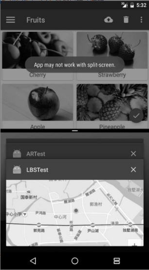

# 第13章 高级技巧

## 全局获取Context的技巧

回想这么久以来我们所学的内容，你会发现有很多地方都需要用到Context，弹出Toast的时候需要，启动活动的时候需要，发送广播的时候需要，操作数据库的时候需要，使用通知的时候需要......

或许目前你还没有为得不到Context而发愁过，因为我们很多的操作都是在活动中进行的，而活动本身就是一个Context对象。但是，当应用程序的架构逐渐开始复杂起来的时候，很多的逻辑代码都将脱离Activity类，但此时你又恰恰需要使用Context，也许这个时候你就会感到有些伤脑筋了。

举个例子来说，在第9章的最佳实践环节，我们编写了一个HttpUtil类，在这里将一些通用的网络操作封装了起来，代码如下所示：

```java
public class HttpUtil {
    public static void sendHttpRequest(final String address,final HttpCallbackListener listener) {
        new Thread(new Runnable() {
            @Override
            public void run() {
                HttpURLConnection connection = null;
                try {
                    URL url = new URL(address);
                    connection = (HttpURLConnection) url.openConnection();
                    connection.setRequestMethod("GET");
                    connection.setConnectTimeout(8000);
                    connection.setReadTimeout(8000);
                    connection.setDoInput(true);
                    connection.setDoOutput(true);
                    InputStream inputStream = connection.getInputStream();
                    BufferedReader reader = new BufferedReader(new InputStreamReader(inputStream));
                    StringBuilder response = new StringBuilder();
                    String line;
                    while ((line = reader.readLine()) != null) {
                        response.append(line);
                    }
                    if (listener != null) {
                        // 回调onFinish()方法
                        listener.onFinish(response.toString());
                    }
                } catch (Exception e) {
                    e.printStackTrace();
                    // 回调onError()方法
                    listener.onError(e);
                } finally {
                    if (connection != null) {
                        connection.disconnect();
                    }
                }
            }
        }).start();
    }
}
```

这里使用`sendHttpRequest()`方法来发送HTTP请求显然是没有问题的，并且我们还可以在回调方法中处理服务器返回的数据。但现在我们想对`sendHttpRequest()`方法进行一些优化，当检测到网络不存在的时候就给用户一个Toast提示，并且不再执行后面的代码。看似一个挺简单的功能，可是却存在一个让人头疼的问题，弹出Toast提示需要一个Context参数，而我们在HttpUtil类中显然是获取不到Context对象的。

要想快速解决这个问题也很简单，在`sendHttpRequest()`方法中添加一个Context参数就行，将HttpUtil中的代码进行如下修改：

```java
public class HttpUtil {
    public static void sendHttpRequest(final Context context,final String address,final HttpCallbackListener listener) {
        if (! isNetworkAvailable()) {
            Toast.makeText(context,"network is unavailable",Toast.LENGT SHORT).show();
            return;
        }
        new Thread(new Runnable() {
            @Override
            public void run() {
               ...
            }
        }).start();
    }
    private static boolean isNetworkAvailable() {
        ...
    }
}
```

可以看到，这里在方法中添加了一个Context参数，并且假设有一个`isNetworkAvailable()`方法用于判断当前网络是否可用，如果网络不可用的话就弹出Toast提示，并将方法return掉。

虽然说这确实是一种解决方案，但是我们将获取Context的任务转移给了`sendHttpRequest()`方法的调用方，至于调用方能不能得到Context对象，那我们就不得而知了。

由此可以看出，在某些情况下，获取Context并非是那么容易的一件事。下面我们就来学习一种技巧，让我们在项目的任何地方都能够轻松获取到Context。

Android提供了一个**Application类**，每当应用程序启动的时候，系统就会自动将这个类进行初始化。而我们可以定制一个自己的Application类，以便于管理程序内一些全局的状态信息，比如说全局Context。

首先我们创建一个MyApplication类继承自Application，代码如下所示：

```java
public class MyApplication extends Application {
	private static Context context;
	@Override
	public void onCreate() {
		context = getApplicationContext();
	}
	public static Context getContext() {
		return context;
	}
 }
```

这里我们重写了父类的onCreate()方法，并通过调用`getApplicationContext()`方法得到了一个应用程序级别的Context，然后又提供了一个静态的`getContext()`方法，在这里将刚才获取到的Context进行返回。

接下来我们需要告知系统，当程序启动的时候应该初始化MyApplication类，而不是默认的Application类。在AndroidManifest.xml文件的`<application>`标签下进行指定就可以了，代码如下所示：

```xml
<manifest xmlns:android="http://schemas.android.com/apk/res/android"
	package="com.example.networktest"
	android:versionCode="1"
	android:versionName="1.0">
	...
	<application
		android:name="com.example.networktest.MyApplication"
		...>
		...
	</application>
</manifest>
```

注意，这里在指定MyApplication的时候一定要加上完整的包名，不然系统将无法找到这个类。

这样我们就已经实现了一种全局获取Context的机制，之后不管你想在项目的任何地方使用Context，只需要调用一下`MyApplication.getContext()`就可以了。那么接下来我们再对`sendHttpRequest()`方法进行优化，代码如下所示：

```java
public static void sendHttpRequest(final String address,final HttpCallbackListener listener) {
	if (! isNetworkAvailable()) {
		Toast.makeText(MyApplication.getContext(),"network is unavailable",Toast.LENGTH_SHORT).show();
		return;
	}
	...
}
```

可以看到，`sendHttpRequest()`方法不需要再通过传参的方式来得到Context对象，而是调用一下`MyApplication.getContext()`方法就可以了。

然后我们再回顾一下6.5.2小节学过的内容，当时为了让LitePal可以正常工作，要求必须在AndroidManifest.xml中配置如下内容：

```xml
<application
	android:name="org.litepal.LitePalApplication"
    ...>
    ...
</application>
```

其实道理也是一样的，因为经过这样的配置之后，LitePal就能在内部自动获取到Context了。

不过这里你可能又会产生疑问，如果我们已经配置过了自己的Application怎么办？这样岂不是和LitePalApplication冲突了？没错，**任何一个项目都只能配置一个Application**，对于这种情况，LitePal提供了很简单的解决方案，那就是在我们自己的Application中去调用LitePal的初始化方法就可以了，如下所示：

```java
public class MyApplication extends Application {
	private static Context context;
	@Override
	public void onCreate() {
		context = getApplicationContext();
		LitePal.initialize(context);
	}
	public static Context getContext() {
		return context;
	}
 }
```

使用这种写法，就相当于我们把全局的Context对象通过参数传递给了LitePal，效果和在AndroidManifest.xml中配置LitePalApplication是一模一样的。

## 使用Intent传递对象

回顾我们之前使用过Inent的地方：启动活动、发送广播、启动服务等。在进行上述操作的时候，我们还可以在Intent中添加一些附加数据，以达到传值的效果，比如在FirstActivity中添加如下代码：

```java
Intent intent = new Intent(FirstActivity.this,SecondActivity.class);
intent.putExtra("string_data","hello");
intent.putExtra("int_data",100);
startActivity(intent);
```

这里调用了Intent的`putExtra()`方法来添加要传递的数据，之后在SecondActivity中就可以得到这些值了，代码如下所示：

```java
getIntent().getStringExtra("string_data");
getIntent().getIntExtra("int_data",0);
```

但是`putExtra()`方法中所支持的数据类型是有限的，虽然常用的一些数据类型它都会支持，但是当你想去传递一些自定义对象的时候，就会发现无从下手。下面我们就学习一下使用Intent来传递对象的技巧。

### Serializable方式

使用Intent来传递对象通常有两种实现方式：Serializable和Parcelable，本小节中学习第一种实现方式：

**Serializable**是序列化的意思，表示将一个对象转换成可存储或可传输的状态。序列化后的对象可以在网络上进行传输，也可以存储到本地。至于序列化的方法也很简单，只需要让一个类去实现Serializable这个接口就可以了。比如说有一个Person类，其中包含了name和age这两个字段，想要将它序列化就可以这样写：

```java
public class Person implements Serializable {
	private String name;
	private int age;
	public String getName() {
		return name;
	}
	public void setName(String name) {
		this.name = name;
	}
	public int getAge() {
		return age;
	}
	public void setAge(int age) {
		this.age = age;
	}
}
```

其中，get、set方法都是用于赋值和读取字段数据的，最重要的部分是在第一行。这里让Person类去实现了Serializable接口，这样所有的Person对象就都是可序列化的了。接下来在FirstActivity中的写法如下：

```java
Person person = new Person();
person.setName("Tom");
person.setAge(20);
Intent intent = new Intent(FirstActivity.this,SecondActivity.class);
intent.putExtra("person_data",person);
startActivity(intent);
```

可以看到，这里我们创建了一个Person的实例，然后就直接将它传入到putExtra()方法中了。由于Person类实现了Serializable接口，所以才可以这样写。接下来在SecondActivity中获取这个对象也很简单，写法如下：

```java
Person person = (Person) getIntent.getSerializableExtra("person_data");
```

这里调用了`getSerializableExtra()`方法来获取通过参数传递过来的序列化对象，接着再将它向下转型成Person对象，这样我们就成功实现了使用Intent来传递对象的功能了。

### Parcelable方式

除了Serializable之外，使用Parcelable也可以实现相同的效果，不过不同于将对象进行序列化，**Parcelable方式的实现原理是将一个完整的对象进行分解，而分解后的每一部分都是Intent所支持的数据类型**，这样也就实现传递对象的功能了。下面我们来看一下Parcelable的实现方式，修改Person中的代码，如下所示：

```java
public class Person implements Parcelable {
	private String name;
	private int age;
	...
	@Override
	public int describeContents() {
		return 0;
	}
	@Override
	public void writeToParcel(Parcel dest,int flags) {
		dest.writeString(name);//写出name
		dest.writeInt(age);//写出age
	}
	public static final Parcelable.Creator<Person> CREATOR = new Parcelable.Creator<Person>() {
		@Override
		public Person createFromParcel(Parcel source) {
			Person person = new Person();
			person.name = source.readString();//读取name
			person.age = source.readInt();//读取age
			return person;
		}
		@Override
		public Person[] newArray(int size) {
			return new Person[size]
		}
	}
}
```

Parcelable的实现方式要稍微复杂一些。可以看到，首先我们让Person类去实现了Parcelable接口，这样就必须重写`describeContents()`和`writeToParcel()`这两个方法。其中`describeContents()`方法直接返回0就可以了，而`writeToParcel()`方法中我们需要调用Parcel的writeXxx()方法，将Person类中的字段一一写出。注意，字符串型数据就调用`writeString()`方法，整型数据就调用`writeInt()`方法，以此类推。

除此之外，我们还必须在Person类中提供一个名为**CREATOR**的常量，这里创建了Parcelable.Creator接口的一个实现，并将泛型指定为Person。接着需要重写`createFromParcel()`和`newArray()`这两个方法，在`createFromParcel()`方法中我们要去读取刚才写出的name和age字段，并创建一个Person对象进行返回，其中name和age都是调用Parcel的readXxx()方法读取到的，**注意这里读取的顺序一定要和刚才写出的顺序完全相同**。而`newArray()`方法中的实现就简单多了，只需要new出一个Person数组，并使用方法中传入的size作为数组大小就可以了。

接下来，在FirstActivity中我们仍然可以使用相同的代码来传递Person对象，只不过在SecondActivity中获取对象的时候需要稍加改动，如下所示：

```java
Person person = (Person) getIntent().getParcelableExtra("person_data");
```

这里我们调用`getParcelableExtra()`方法来获取传递过来的对象。

**对比一下，Serializable的方式较为简单，但由于会把整个对象进行序列化，因此效率会比Parcelable方式低一些，**所以在通常情况下还是更加推荐使用Parcelable的方式来实现Intent传递对象的功能。

## 定制自己的日志工具

虽然Android中自带的日志工具功能非常强大，但也不能说是完全没有缺点，例如在打印日志的控制方面就做得不够好。

打个比方，你正在编写一个比较庞大的项目，期间为了方便调试，在代码的很多地方都打印了大量的日志。最近项目已经基本完成了，但是却有一个非常让人头疼的问题，之前用于调试的那些日志，在项目正式上线之后仍然会照常打印，这样不仅会降低程序的运行效率，还有可能将一些机密性的数据泄露出去。

那该怎么办呢？难道要一行一行地把所有打印日志的代码都删掉？显然这不是什么好点子，不仅费时费力，而且以后你继续维护这个项目的时候可能还会需要这些日志。因此，最理想的情况是能够自由地控制日志的打印，当程序处于开发阶段时就让日志打印出来，当程序上线了之后就把日志屏蔽掉。看起来好像是挺高级的一个功能，其实并不复杂，我们只需要定制一个自己的日志工具就可以轻松完成了。比如新建一个LogUtil类，代码如下所示：

```java
public class LogUtil {
	public static final int VERBOSE = 1;
	public static final int DEBUG =2;
	public static final int INFO = 3;
	public static final int WARN = 4;
	public static final int ERROR = 5;
	public static final int NOTHING = 6;
	public static int level = VERBOSE;

	public static void v (String tag,String msg) {
		if (level <= VERBOSE) {
			Log.v (tag,msg);
		}
	}
	public static void d (String tag,String msg) {
		if (level <= DEBUG) {
			Log.d (tag,msg);
		}
	}
	public static void i (String tag,String msg) {
		if (level <= INFO) {
			Log.i (tag,msg);
			
		}
	}
	public static void w (String tag,String msg) {
		if (level <=WARN) {
			Log.w (tag,msg);
		}
	}
	public static void e(String tag,String msg) {
		if (level <= ERROR) {
			Log.e (tag,msg);
		}
	}
}
```

可以看到，我们在LogUtil中先是定义了VERBOSE、DEBUG、INFO、WARN、ERROR、NOTHING这6个整型常量，并且它们对应的值都是递增的。然后又定义了一个静态变量level，可以将它的值指定为上面6个常量中的任意一个。

接下来我们提供了v()、d()、i()、w()、e()这5个自定义的日志方法，在其内部分别调用了Log.v()、Log.d()、Log.i()、Log.w()、Log.e()这5个方法来打印日志，只不过在这些自定义的方法中我们都加入了一个if判断，**只有当level的值小于或等于对应日志级别值**的时候，才会将日志打印出来。

这样就把一个自定义的日志工具创建好了，之后在项目里我们可以像使用普通的日志工具一样使用LogUtil，比如打印一行DEBUG级别的日志就可以这样写：

```java
LogUtil.d("TAG","debug log");
```

打印一行WARN级别的日志就可以这样写：

```java
LogUtil.w("TAG","warn log");
```

然后，只需要修改level变量的值，就可以自由地控制日志的打印行为了。比如让level等于VERBOSE就可以把所有的日志都打印出来，让level等于WARN就可以只打印警告以上级别的日志，让level等于NOTHING就可以把所有日志都屏蔽掉。

使用了这种方法之后，刚才所说的那个问题就不复存在了，你只需要在开发阶段将level指定成VERBOSE，当项目正式上线的时候将level指定成NOTHING就可以了。

## 调试Android程序

当开发过程中遇到一些奇怪的bug，但又迟迟定位不出来原因是什么的时候，最好的解决办法就是调试了。调试允许我们逐行地执行代码，并可以实时观察内存中的数据，从而能够比较轻易地查出问题的原因。

那么本节中我们就来学习一下使用Android Studio来调试Android程序的技巧。（以第5章的最佳实践环节中，程序中有一个登录功能，比如说现在登录出现了问题，我们就可以通过调试来定位问题的原因。）

调试工作的第一步是添加断点，只需要在相应代码行的左边点击一下就可以了。点击之后会出现一个红色实心圆，表示你在这行代码添加了一个断点。如图：


如果想要取消这个断点，对着它再次点击就可以了。添加好了断点，接下来就可以对程序进行调试了，点击Android Studio顶部工具栏中的Debug按钮（下图中最右侧按钮），就会使用调试模式来启动程序：


等到程序运行起来的时候，首先会看到一个提示框，如图：


这个框很快就会自动消失，然后在输入框里输入账号和密码，并点击Login按钮，这时Android Studio就会自动打开Debug窗口，如图：


接下来每按一次F8健，代码就会向下执行一行，并且通过Variables视图还可以看到内存中的数据，如图：


可以看到，我们从输入框里获取到的账号密码分别是admin和123。而程序里要求正确的账号密码是admin和123456，所以登录才会出现问题。这样我们就通过调试的方式轻松地把问题定位出来了，调试完成之后点击Debug窗口中的Stop按钮来结束调试即可。

这种调试方式虽然完全可以正常工作，但在调试模式下，程序的运行效率将会大大地降低，如果你的断点加在一个比较靠后的位置，需要执行很多的操作才能运行到这个断点，那么前面这些操作就都会有一些卡顿的感觉。

Android还提供了另外一种调试的方式，可以让程序随时进入到调试模式，下面我们就来尝试一下。

这次不需要选择调试模式来启动程序了，就使用正常的方式来启动程序。由于现在不是在调试模式下，程序的运行速度比较快，可以先把账号和密码输入好。然后点击Android Studio顶部工具栏的`Attach debugger to Androidprocess`按钮：


此时会弹出一个进程选择提示框，如图：


这里目前只列出了一个进程，也就是我们当前程序的进程。选中这个进程，然后点击OK按钮，就会让这个进程进入到调试模式了。

接下来在程序中点击Login按钮，Android Studio同样也会自动打开Debug窗口，之后的流程就都是相同的了。相比起来，第二种调试方式会比第一种更加灵活，也更加常用。

## 创建定时任务

Android中的定时任务一般有两种实现方式：

- 一种是使用Java API里提供的Timer类；

  Timer有一个明显的短板，它并不太适用于那些需要长期在后台运行的定时任务。我们都知道，为了能让电池更加耐用，每种手机都会有自己的休眠策略，Android手机就会在长时间不操作的情况下自动让CPU进入到睡眠状态，这就有可能导致Timer中的定时任务无法正常运行。

- 一种是使用Android的Alarm机制；

  Alarm则具有唤醒CPU的功能，它可以保证在大多数情况下需要执行定时任务的时候CPU都能正常工作。需要注意，这里唤醒CPU和唤醒屏幕完全不是一个概念，千万不要产生混淆。

### Alarm机制

那么首先我们来看一下Alarm机制的用法，主要就是借助了AlarmManager类来实现的。这个类和NotificationManager有点类似，都是通过调用Context的`getSystemService()`方法来获取实例的，只是这里需要传入的参数是`Context.ALARM_ SERVICE`。因此，获取一个AlarmManager的实例就可以写成：

```java
AlarmManager manager = (AlarmManager) getSystemService(Context.ALARM_SERVICE);
```

接下来调用AlarmManager的`set()`方法就可以设置一个定时任务了，比如说想要设定一个任务在10秒钟后执行，就可以写成：

```java
Long triggerAtTime = SystemClock.elapsedRealtime() + 10 * 1000;
manager.set(AlarmManager.ELAPSED_REALTIME_WAKEUP,triggerAtTime,pendingIntent);
```

`set()`方法中需要传入的3个参数：

- 第一个参数是一个整型参数，用于指定AlarmManager的工作类型，有4种值可选，分别是ELAPSED_REALTIME、ELAPSED_REALTIME_WAKEUP、RTC和RTC_WAKEUP。
  - ELAPSED_REALTIME表示让定时任务的触发时间从系统开机开始算起，但不会唤醒CPU。
  - ELAPSED_REALTIME_WAKEUP同样表示让定时任务的触发时间从系统开机开始算起，但会唤醒CPU。-
  - RTC表示让定时任务的触发时间从1970年1月1日0点开始算起，但不会唤醒CPU。
  - RTC_WAKEUP同样表示让定时任务的触发时间从1970年1月1日0点开始算起，但会唤醒CPU。

使用`SystemClock.elapsedRealtime()`方法可以获取到系统开机至今所经历时间的毫秒数，使用`System.currentTimeMillis()`方法可以获取到1970年1月1日0点至今所经历时间的毫秒数。

- 第二个参数就是定时任务触发的时间，以毫秒为单位。

如果第一个参数使用的是ELAPSED_REALTIME或ELAPSED_REALTIME_WAKEUP，则这里传入开机至今的时间再加上延迟执行的时间。如果第一个参数使用的是RTC或RTC_WAKEUP，则这里传入1970年1月1日0点至今的时间再加上延迟执行的时间。

- 第三个参数是一个PendingIntent。

这里我们一般会调用`getService()`方法或者`getBroadcast()`方法来获取一个能够执行服务或广播的Pending-Intent。这样当定时任务被触发的时候，服务的`onStartCommand()`方法或广播接收器的`onReceive()`方法就可以得到执行。了解了set()方法的每个参数之后，你应该能想到，设定一个任务在10秒钟后执行也可以写成：

```java
Long triggerAtTime = System.currentTimeMillis() + 10 * 1000；
manager.set (AlarmManager.RTC_WAKEUP,triggerAtTime,pendingIntent);
```

那么，如果我们要实现一个长时间在后台定时运行的服务该怎么做呢？

首先新建一个普通的服务，比如把它命名为LongRunningService，然后将触发定时任务的代码写到`onStartCommand()`方法中，如下所示：

```java
public class LongRunningService extends Service {
	@Override
	public IBinder onBind(Intent intent) {
		return null;
	}
	@Override
	public int onStartCommand(Intent intent,int flags,int startId) {
		new Thread(new Runnable() {
			@Override
			public void run() {
				//这里执行具体的逻辑操作
			}
		}).start();
		AlarmManager manager = (AlarmManager) getSystemService(ALARM_SERVICE);
		int anHour = 60 * 60 * 1000;
		Long triggerAtTime = SystemClock.elapsedRealtime() + anHour;
		Intent i = new Intent(this,LongRunningService.class);
		pendingIntent pi = pendingIntent.getService(this,0,i,0);
		manager.set(AlarmManager.ELAPSED_REALTIME_WAKEUP,triggerAtTime,pi);
		return super.onStartCommand(intent,flags,startId);
	}
}
```

可以看到，我们先是在`onStartCommand()`方法中开启了一个子线程，这样就可以在这里执行具体的逻辑操作了。之所以要在子线程里执行逻辑操作，是因为逻辑操作也是需要耗时的，如果放在主线程里执行可能会对定时任务的准确性造成轻微的影响。

创建线程之后的代码就是我们刚刚讲解的Alarm机制的用法了，先是获取到了AlarmManager的实例，然后定义任务的触发时间为一小时后，再使用PendingIntent指定处理定时任务的服务为LongRunningService，最后调用`set()`方法完成设定。

这样我们就将一个长时间在后台定时运行的服务成功实现了。因为一旦启动了LongRunningService，就会在`onStartCommand()`方法里设定一个定时任务，这样一小时后将会再次启动LongRunningService，从而也就形成了一个永久的循环，保证LongRunningService的`onStartCommand()`方法可以每隔一小时就执行一次。

最后，只需要在你想要启动定时服务的时候调用如下代码即可：

```java
Intent intent = new Intent(context,LongRunningService.class);
context.startService(intent);
```

另外需要注意的是，从Android 4.4系统开始，Alarm任务的触发时间将会变得不准确，有可能会延迟一段时间后任务才能得到执行。这并不是个bug，而是系统在耗电性方面进行的优化。系统会自动检测目前有多少Alarm任务存在，然后将触发时间相近的几个任务放在一起执行，这就可以大幅度地减少CPU被唤醒的次数，从而有效延长电池的使用时间。

当然，如果你要求Alarm任务的执行时间必须准确无误，Android仍然提供了解决方案。使用AlarmManager的`setExact()`方法来替代set()方法，就基本上可以保证任务能够准时执行了。

### Doze模式

虽然Android的每个系统版本都在手机电量方面努力进行优化，不过一直没能解决后台服务泛滥、手机电量消耗过快的问题。于是在Android 6.0系统中，谷歌加入了一个全新的Doze模式，从而可以极大幅度地延长电池的使用寿命。

什么是Doze模式。 当用户的设备是Android 6.0或以上系统时，如果该设备未插接电源，处于静止状态（Android 7.0中删除了这一条件），且屏幕关闭了一段时间之后，就会进入到Doze模式。在Doze模式下，系统会对CPU、网络、Alarm等活动进行限制，从而延长了电池的使用寿命。

当然，系统并不会一直处于Doze模式，而是会间歇性地退出Doze模式一小段时间，在这段时间中，应用就可以去完成它们的同步操作、Alarm任务，等等。下图完整描述了Doze模式的工作过程。


可以看到，随着设备进入Doze模式的时间越长，间歇性地退出Doze模式的时间间隔也会越长。因为如果设备长时间不使用的话，是没必要频繁退出Doze模式来执行同步等操作的，Android在这些细节上的把控使得电池寿命进一步得到了延长。

具体看一看在Doze模式下有哪些功能会受到限制：

- 网络访问被禁止。
- 系统忽略唤醒CPU或者屏幕操作。
- 系统不再执行WIFI扫描。
- 系统不再执行同步服务。
- Alarm任务将会在下次退出Doze模式的时候执行。

注意：其中的最后一条，也就是说，在Doze模式下，我们的Alarm任务将会变得不准时。当然，这在大多数情况下都是合理的，因为只有当用户长时间不使用手机的时候才会进入Doze模式，通常在这种情况下对Alarm任务的准时性要求并没有那么高。

不过，如果你真的有非常特殊的需求，要求Alarm任务即使在Doze模式下也必须正常执行，Android还是提供了解决方案。调用AlarmManager的`setAndAllowWhileIdle()`或`setExactAndAllowWhileIdle()`方法就能让定时任务即使在Doze模式下也能正常执行了，这两个方法之间的区别和`set()`、`setExact()`方法之间的区别是一样的。

## 多窗口模式编程

由于手机屏幕大小的限制，传统情况下一个手机只能同时打开一个应用程序，无论是Android、iOS还是Windows Phone都是如此。而**Android 7.0系统**中却引入了一个非常有特色的功能——多窗口模式，它允许我们在同一个屏幕中同时打开两个应用程序。

### 进入多窗口模式

首先你需要知道，我们不用编写任何额外的代码来让应用程序支持多窗口模式。事实上，本书中所编写的所有项目都是支持多窗口模式的。但是这并不意味着我们就不需要对多窗口模式进行学习，因为系统化地了解这些知识点才能编写出在多窗口模式下兼容性更好的程序。

那么先来看一下如何才能进入到多窗口模式。手机的导航栏上面一共有3个按钮，如图：


其中左边的Back按钮和中间的Home按钮，右边的Overview按钮，这个按钮的作用是打开一个最近访问过的活动或任务的列表界面，从而能够方便地在多个应用程序之间进行切换，如图：


可以通过以下两种方式进入多窗口模式。

- 在Overview列表界面长按任意一个活动的标题，将该活动拖动到屏幕突出显示的区域，则可以进入多窗口模式。
- 打开任意一个程序，长按Overview按钮，也可以进入多窗口模式。比如说我们首先打开了MaterialTest程序，然后长按Overview按钮，效果如图：


可以看到，现在整个屏幕被分成了上下两个部分，MaterialTest程序占据了上半屏，下半屏仍然还是一个Overview列表界面，另外Overview按钮的样式也有了变化。现在我们可以从Overview列表中选择任意一个其他程序，比如说这里点击LBSTest，效果如图：


还可以将模拟器旋转至水平方向，这样上下分屏的多窗口模式会自动切换成左右分屏的多窗口模式，如图：


可以看出，在多窗口模式下，整个应用的界面会缩小很多，那么编写程序时就应该多考虑使用match_parent属性、RecyclerView、ListView、ScrollView等控件，来让应用的界面能够更好地适配各种不同尺寸的屏幕，尽量不要出现屏幕尺寸变化过大时界面就无法正常显示的情况。

### 多窗口模式下的生命周期

多窗口模式下的生命周期。其实多窗口模式并不会改变活动原有的生命周期，只是会将用户最近交互过的那个活动设置为运行状态，而将多窗口模式下另外一个可见的活动设置为暂停状态。如果这时用户又去和暂停的活动进行交互，那么该活动就变成运行状态，之前处于运行状态的活动变成暂停状态。

下面我们还是通过一个例子来更加直观地理解多窗口模式下活动的生命周期。首先打开MaterialTest项目，修改MainActivity中的代码，如下所示：

```java
public class MainActivity extends AppCompatActivity {
	private static final String TAG = "MainActivity";
	...
	@Override
	protected void onCreate(Bundle savedInstanceState) {
		super.onCreate(savedInstanceState);
		Log.d(TAG,"onCreate");
		...
	}
	@Override
	protected void onStart(Bundle savedInstanceState) {
		super.onStart(savedInstanceState);
		Log.d(TAG,"onStart");
	}
	@Override
	protected void onResume(Bundle savedInstanceState) {
		super.onResume(savedInstanceState);
		Log.d(TAG,"onResume");
	}
	@Override
	protected void onPause(Bundle savedInstanceState) {
		super.onPause(savedInstanceState);
		Log.d(TAG,"onPause");
	}
	@Override
	protected void onStop(Bundle savedInstanceState) {
		super.onStop(savedInstanceState);
		Log.d(TAG,"onSop");
	}
	@Override
	protected void onDestroy(Bundle savedInstanceState) {
		super.onDestroy(savedInstanceState);
		Log.d(TAG,"onDestroy");
	}
	@Override
	protected void onRestart(Bundle savedInstanceState) {
		super.onRestart(savedInstanceState);
		Log.d(TAG,"onRestart");
	}
	...
}
```

这里我们在Activity的7个生命周期回调方法中分别打印了一句日志。然后点击Android Studio导航栏上的File→Open Recent→LBSTest，重新打开LBSTest项目。修改MainActivity的代码，如下所示：

```java
public class MainActivity extends AppCompatActivity {
	private static final String TAG = "LBSTest";
	...
	@Override
	protected void onCreate() {
		super.onCreate();
		Log.d(TAG,"onCreate");
		...
	}
	...
	@Override
	protected void onStart() {
		super.onStart();
		Log.d(TAG,"onStart");
	}
	@Override
	protected void onResume() {
		super.onResume();
		Log.d(TAG,"onResume");
		mapView.onResume();
	}
	@Override
	protected void onPause() {
		super.onPause();
		Log.d(TAG,"onPause");
		mapView.onPause();
	}
	@Override
	protected void onStop() {
		super.onStop();
		Log.d(TAG,"onSop");
	}
	@Override
	protected void onDestroy() {
		super.onDestroy();
		Log.d(TAG,"onDestroy");
		mLocationClient.stop();
		baiduMap.setMyLocationEnabled(false);
	}
	@Override
	protected void onRestart() {
		super.onRestart();
		Log.d(TAG,"onRestart");
	}
	...
}
```

这里同样也是在Activity的7个生命周期回调方法中分别打印了一句日志。注意这两处日志的TAG是不一样的，方便我们进行区分。

现在，先将MaterialTest和LBSTest这两个项目的最新代码都运行到模拟器上，然后启动MaterialTest程序。这时观察logcat中的打印日志（注意要将logcat的过滤器选择为No Filters），如图：


可以看到，onCreate()、onStart()和onResume()方法会依次得到执行，这个也是在我们意料之中的。然后长按Overview按钮，进入多窗口模式，此时的打印信息如图：


会发现，MaterialTest中的MainActivity经历了一个重新创建的过程。其实这个是正常现象，因为进入多窗口模式后活动的大小发生了比较大的变化，此时默认是会重新创建活动的。

除此之外，像横竖屏切换也是会重新创建活动的。进入多窗口模式后，MaterialTest变成了暂停状态。接着在Overview列表界面选中LBSTest程序，打印信息如图：


可以看到，现在LBSTest的onCreate()、onStart()和onResume()方法依次得到了执行，说明现在LBSTest变成了运行状态。接下来我们可以随意操作一下MaterialTest程序，然后观察logcat中的打印日志，如图：


现在LBSTest的onPause()方法得到了执行，而MaterialTest的onResume()方法得到了执行，说明LBSTest变成了暂停状态，MaterialTest则变成了运行状态，这和我们在本小节开头所分析的生命周期行为是一致的。

了解了多窗口模式下活动的生命周期规则，那么我们在编写程序的时候，就可以将一些关键性的点考虑进去了。

**比如说，在多窗口模式下，用户仍然可以看到处于暂停状态的应用，那么像视频播放器之类的应用在此时就应该能继续播放视频才对。因此，我们最好不要在活动的onPause()方法中去处理视频播放器的暂停逻辑，而是应该在onStop()方法中去处理，并且在onStart()方法恢复视频的播放。**

另外，针对于进入多窗口模式时活动会被重新创建，如果你想改变这一默认行为，可以在AndroidManifest.xml中对活动进行如下配置：

```xml
<activity
          android:name=".MainActivity"
          android:lable="Fruits"
          android:configChanges="orientation|keyboardHidden|screenSize|screenLayout">
    ...
</activity>
```

加入了这行配置之后，不管是进入多窗口模式，还是横竖屏切换，活动都不会被重新创建，而是会将屏幕发生变化的事件通知到Activity的`onConfigurationChanged()`方法当中。因此，如果你想在屏幕发生变化的时候进行相应的逻辑处理，那么在活动中重写`onConfigurationChanged()`方法即可。

### 禁用多窗口模式

多窗口模式虽然功能非常强大，但是未必就适用于所有的程序。比如说，手机游戏就非常不适合在多窗口模式下运行，很难想象我们如何一边玩着游戏，一边又操作着其他应用。因此，Android给我们提供了禁用多窗口模式的选项，如果你非常不希望自己的应用能够在多窗口模式下运行，那么就可以将这个功能关闭掉。

禁用多窗口模式只需要在AndroidManifest.xml的`<application>`或`<activity>`标签中加入如下属性即可：

```xml
android:resizeableActivity=["true" | "false"]
```

其中，true表示应用支持多窗口模式，false表示应用不支持多窗口模式，如果不配置这个属性，那么默认值为true。现在我们将MaterialTest程序设置为不支持多窗口模式，如下所示：

```xml
<application
             ...
             android:resizeableActivity="false">
			 ...
</application>
```

重新运行程序，然后长按Overview按钮，结果如图：


可以看到，现在是无法进入到多窗口模式的，而且屏幕下方还会弹出一个Toast提示来告知用户，当前应用不支持多窗口模式。

虽说`android:resizeableActivity`这个属性的用法很简单，但是它还存在着一个问题，就是这个属性只有当项目的targetSdkVersion指定成24或者更高的时候才会有用，否则这个属性是无效的。那么比如说我们将项目的targetSdkVersion指定成23，这个时候尝试进入多窗口模式，结果如图：



可以看到，虽说界面上弹出了一个提示，告知我们此应用在多窗口模式下可能无法正常工作，但还是进入了多窗口模式。

针对这种情况，还有一种解决方案。Android规定，如果项目指定的targetSdkVersion低于24，并且活动是不允许横竖屏切换的，那么该应用也将不支持多窗口模式。

默认情况下，我们的应用都是可以随着手机的旋转自由地横竖屏切换的，如果想要让应用不允许横竖屏切换，那么就需要在AndroidManifest.xml的`<activity>`标签中加入如下配置：

```xml
android:screenOrientation=["portrait"|"landscape"]
```

其中，portrait表示活动只支持竖屏，landscape表示活动只支持横屏。当然android:screenOrientation属性中还有很多其他可选值，不过最常用的就是portrait和landscape了。现在我们将MaterialTest的MainActivity设置为只支持竖屏，如下所示：

```xml
<activity
          android:name=".MainActivity"
          android:lable="Fruits"
          android:screenOrientation="portrait">
    ...
</activity>
```

重新运行程序之后你会发现MaterialTest现在不支持横竖屏切换了，此时长按Overview按钮会弹出禁用多窗口模式的提示。

## Lambda表达式

Java 8中着实引入了一些非常有特色的功能，如Lambda表达式、streamAPI、接口默认实现，等等。

虽然刚才已经提到了几个Java 8中的新特性，不过现在能够立即应用到项目当中的也就只有Lambda表达式而已，因为stream API和接口默认实现等特性都只支持Android 7.0及以上的系统，我们显然不可能为了使用这些新特性而放弃兼容众多低版本的Android手机。而Lambda表达式却最低兼容到Android2.3系统，基本上可以算是覆盖所有的Android手机了。

Lambda表达式本质上是一种匿名方法，它既没有方法名，也即没有访问修饰符和返回值类型，使用它来编写代码将会更加简洁，也更加易读。

如果想要在Android项目中使用Lambda表达式或者Java 8的其他新特性，首先我们需要在app/build.gradle中添加如下配置：

```xml
compileOptions {
    sourceCompatibility JavaVersion.VERSION_1_8
    targetCompatibility JavaVersion.VERSION_1_8
}
```

注意，不要加入:

```xml
 jackOptions.enable = true
```

原因是Jack已不被支持。

之后就可以开始使用Lambda表达式来编写代码了，比如说传统情况下开启一个子线程的写法如下：

```java
new Thread(new Runnable() {
	@Override
	public void run() {
		//处理具体逻辑
	}
}).start();
```

而使用Lambda表达式则可以这样写：

```java
new Thread(() -> {
	//处理具体逻辑
}).start();
```

不管是从代码行数上还是缩进结构上来看，Lambda表达式的写法明显要更加精简。

那么为什么我们可以使用这么神奇的写法呢？这是因为Thread类的构造函数接收的参数是一个Runnable接口，并且该接口中只有一个待实现方法。我们查看一下Runnable接口的源码，如下所示：

```java
public interface Runnable {
	/**
	 * Start executing the active part of the class' code. This method is
	 * called when a thread is started that has been created with a class which
	 * implements {@code Runnable}
	*/
	public void run();
}
```

凡是这种只有一个待实现方法的接口，都可以使用Lambda表达式的写法。比如说，通常创建一个类似于上述接口的匿名类实现需要这样写：

```java
Runnable runnable = new Runnable() {
	@Override
	public void run() {
		//添加具体逻辑
	}
};
//而有了Lambda表达式之后，我们就可以这样写了：
Runnable runnable = () -> {
	//添加具体逻辑
};
```

接下来我们尝试自定义一个接口，然后再使用Lambda表达式的方式进行实现。新建一个MyListener接口，代码如下所示：

```java
public interface MyListener {
	String doSomething(String a,int b);
}
```

MyListener接口中也只有一个待实现方法，这和Runnable接口的结构是基本一致的。唯一不同的是，MyListener中的`doSomething()`方法是有参数并且有返回值的，那么我们就来看一看这种情况下该如何使用Lambda表达式进行实现。其实写法也是比较相似的，使用Lambda表达式创建MyListener接口的匿名实现写法如下：

```java
MyListener listener = (String a,int b) -> {
	String result = a + b;
	return result;
};
```

可以看到，`doSomething()`方法的参数直接写在括号里面就可以了，而返回值则仍然像往常一样，写在具体实现的最后一行即可。另外，Java还可以根据上下文自动推断出Lambda表达式中的参数类型，因此上面的代码也可以简化成如下写法：

```java
MyListener listener = (a ,b) -> {
	String result = a + b;
	return result;
}
```

Java将会自动推断出参数a是String类型，参数b是int类型，从而使得我们的代码变得更加精简了。接下来举个具体的例子，比如说现在有一个方法是接收MyListener参数的，如下所示：

```java
public void hello (MyListener listener) {
	String a = "Hello Lambda";
	int b = 1024;
	Stirng result = listener.doSomething(a,b);
	Log.d("TAG",result);
}
```

在调用`hello()`这个方法的时候就可以这样写：

```java
hello((a,b) -> {
	String result a + b;
	return result;
})
```

那么`doSomething()`方法就会将a和b两个参数进行相加，从而最终的打印结果就会是“Hello Lambda1024”。

接下来我们看一看在Android当中有哪些常用的功能是可以使用Lambda表达式进行替换的。

其实只要是符合接口中只有一个待实现方法这个规则的功能，都是可以使用Lambda表达式来编写的。除了刚才举例说明的开启子线程之外，还有像设置点击事件之类的功能也是非常适合使用Lambda表达式的。

传统情况下，我们给一个按钮设置点击事件需要这样写：

```java
Button button = (Button) findViewById(R.id.button);
button.setOnClickListener(new View.OnClickListener() {
	@Override
	public void onClick(View v) {
		// 处理点击事件
	}
});
```

而使用Lambda表达式之后，就可以将代码简化成这个样子了：

```java
Button button = (Button) findViewById(R.id.button);
button.setOnClickListener((v) -> {
	// 处理点击事件
});
```

另外，当接口的待实现方法有且只有一个参数的时候，我们还可以进一步简化，将参数外面的括号去掉，如下所示：

```java
Button button = (Button) findViewById(R.id.button);
button.setOnClickListener(v -> {
	// 处理点击事件
});
```

