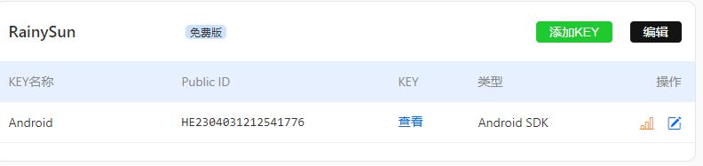
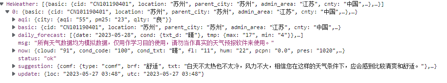
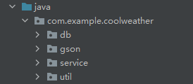

# 第14章  开发酷欧天气

在本章将编写一个功能较为完整的天气预报程序。

## 功能需求及技术可行性分析

在开始编码之前，需要先对程序进行需求分析，想一想酷欧天气中应该具备哪些功能。将这些功能全部整理出来：

- 可以罗列出全国所有的省、市、县；
- 可以查看全国任意城市的天气信息；
- 可以自由地切换城市，去查看其他城市的天气；
- 提供手动更新以及后台自动更新天气的功能。

虽然看上去只有4个主要的功能点，但如果想要实现这些功能需要用到UI、网络、数据存储、服务等技术。

分析完了需求之后，接下来就要进行技术可行性分析了。

首先需要考虑的一个问题就是，我们如何才能得到全国省市县的数据信息，以及如何才能获取到每个城市的天气信息。这里我们使用和风天气这个天气预报服务，每天3000次的免费请求对于学习而言已经是相当充足了。

解决了天气数据的问题，接下来还需要解决全国省市县数据的问题。现在网上也没有一个稳定的接口可以使用，我们将使用作者提供的接口来进行学习。那么下面我们来看一下这些接口的具体用法。比如要想罗列出中国所有的省份，只需访问如下地址：

http://guolin.tech/api/china

服务器会返回我们一段JSON格式的数据，其中包含了中国所有的省份名称以及省份id，如下所示：

```json
[{"id":1,"name":"北京"},{"id":2,"name":"上海"},{"id":3,"name":"天津"},
 {"id":4,"name":"重庆"},{"id":5,"name":"香港"},{"id":6,"name":"澳门"},
 {"id":7,"name":"台湾"},{"id":8,"name":"黑龙江"},{"id":9,"name":"吉林"},{"id":10,"name":"辽宁"},{"id":11,"name":"内蒙古"},{"id":12,"name":"河北"},{"id":13,"name":"河南"},{"id":14,"name":"山西"},{"id":15,"name":"山东"},{"id":16,"name":"江苏"},{"id":17,"name":"浙江"},{"id":18,"name":"福建"},{"id":19,"name":"江西"},{"id":20,"name":"安徽"},{"id":21,"name":"湖北"},{"id":22,"name":"湖南"},{"id":23,"name":"广东"},{"id":24,"name":"广西"},{"id":25,"name":"海南"},{"id":26,"name":"贵州"},{"id":27,"name":"云南"},{"id":28,"name":"四川"},{"id":29,"name":"西藏"},{"id":30,"name":"陕西"},{"id":31,"name":"宁夏"},{"id":32,"name":"甘肃"},{"id":33,"name":"青海"},{"id":34,"name":"新疆"}]
```

可以看到，这是一个JSON数组，数组中的每一个元素都代表着一个省份。其中，北京的id是1，上海的id是2。那么如何才能知道某个省内有哪些城市呢？其实也很简单，比如江苏的id是16，访问如下地址即可：

http://guolin.tech/api/china/16

```json
[{"id":113,"name":"南京"},{"id":114,"name":"无锡"},{"id":115,"name":"镇江"},{"id":116,"name":"苏州"},{"id":117,"name":"南通"},{"id":118,"name":"扬州"},{"id":119,"name":"盐城"},{"id":120,"name":"徐州"},{"id":121,"name":"淮安"},{"id":122,"name":"连云港"},{"id":123,"name":"常州"},{"id":124,"name":"泰州"},{"id":125,"name":"宿迁"}]
```

这样我们就得到江苏省内所有城市的信息了，可以看到，现在返回的数据格式和刚才查看省份信息时返回的数据格式是一样的。相信此时你已经可以举一反三了，比如说苏州的id是116，那么想要知道苏州市下又有哪些县和区的时候，只需访问如下地址：

http://guolin.tech/api/china/16/116

```json
[{"id":937,"name":"苏州","weather_id":"CN101190401"},{"id":938,"name":"常熟","weather_id":"CN101190402"},{"id":939,"name":"张家港","weather_id":"CN101190403"},{"id":940,"name":"昆山","weather_id":"CN101190404"},{"id":941,"name":"吴中","weather_id":"CN101190405"},{"id":942,"name":"吴江","weather_id":"CN101190407"},{"id":943,"name":"太仓","weather_id":"CN101190408"}]
```

通过这种方式，我们就能把全国所有的省、市、县都罗列出来了。那么解决了省市县数据的获取，我们又怎样才能查看到具体的天气信息呢？这就必须要用到每个地区对应的天气id了。观察上面返回的数据，你会发现每个县或区都会有一个weather_id，拿着这个id再去访问和风天气的接口，就能够获取到该地区具体的天气信息了。

接下来我们看一下和风天气的接口该如何使用。首先你需要注册一个自己的账号，注册地址是：

[登录 | 和风天气 (qweather.com)](https://id.qweather.com/#/login?redirect=https%3A%2F%2Fconsole.qweather.com)

注册好了之后使用这个账号登录，在控制台点击项目管理，新建项目并选择免费开发版。新建完成之后如下图所示



有了API Key，再配合刚才的weather_id，我们就能获取到任意城市的天气信息了。比如说苏州的weather_id是CN101190401，那么访问如下接口即可查看苏州的天气信息：

```java
http://guolin.tech/api/weather?cityid=CN101190401&&key=你的key
```

其中，cityid部分填入的就是待查看城市的weather_id, key部分填入的就是我们申请到的API Key。这样，服务器就会把苏州详细的天气信息以JSON格式返回给我们了。格式大概如下所示：

```json
{
    "HeWeather":[
        {
            "status":ok,
            "basic":{},
            "aqi":{},
            "now":{},
            "suggestion":{},
            "daily_forecast":[]
        }
    ]
}
```



返回数据的格式大体上就是这个样子了，其中status代表请求的状态，ok表示成功。basic中会包含城市的一些基本信息，aqi中会包含当前空气质量的情况，now中会包含当前的天气信息，suggestion中会包含一些天气相关的生活建议，daily_forecast中会包含未来几天的天气信息。

## 创建数据库和表

在com.coolweather.android包下再新建几个包，如图：



其中，

- db包用于存放数据库模型相关的代码；
- gson包用于存放GSON模型相关的代码；
- service包用于存放服务相关的代码；
- util包用于存放工具相关的代码。

根据前面小节进行的技术可行性分析，第一阶段我们要做的就是创建好数据库和表，这样从服务器获取到的数据才能够存储到本地。关于数据库和表的创建方式，我们在第6章中已经学过了。

为了简化数据库的操作，这里我们准备使用LitePal来管理酷欧天气的数据库。首先需要将项目所需的各种依赖库进行声明，编辑app/build.gradle文件，在dependencies闭包中添加如下内容：

```
dependencies {
	implementation fileTree(dir: 'libs', include: ['*.jar'])
    implementation 'androidx.appcompat:appcompat:1.6.1'
    implementation 'androidx.constraintlayout:constraintlayout:2.1.4'
    implementation 'org.litepal.guolindev:core:3.2.2'
    implementation "com.squareup.okhttp3:okhttp:4.9.0"
    implementation 'com.google.code.gson:gson:2.8.6'
    implementation 'com.github.bumptech.glide:glide:4.11.0'
    implementation "androidx.swiperefreshlayout:swiperefreshlayout:1.0.0"
    testImplementation 'junit:junit:4.12'
    androidTestImplementation 'androidx.test:runner:1.3.0'
    androidTestImplementation 'androidx.test.espresso:espresso-core:3.3.0'
    implementation 'androidx.drawerlayout:drawerlayout:1.1.1'
}
```

LitePal用于对数据库进行操作，OkHttp用于进行网络请求，GSON用于解析JSON数据，Glide用于加载和展示图片。

然后，来设计一下数据库的表结构。这里我准备建立3张表：province、city、county，分别用于存放省、市、县的数据信息。对应到实体类中的话，就应该建立Province、City、County这3个类。

在db包下新建一个Province类，代码如下所示：

```java
package com.coolweather.android.db;

import org.litepal.crud.LitePalSupport;

//书中继承的是DataSupport(已经弃用)
public class Province extends LitePalSupport {
    //id是每个实体类中都应该有的字段
    private int id;
    //provinceName记录省的名字
    private String provinceName;
    //provinceCode记录省的代号
    private int provinceCode;

    public int getId() {
        return id;
    }

    public void setId(int id) {
        this.id = id;
    }

    public String getProvinceName() {
        return provinceName;
    }

    public void setProvinceName(String provinceName) {
        this.provinceName = provinceName;
    }

    public int getProvinceCode() {
        return provinceCode;
    }

    public void setProvinceCode(int provinceCode) {
        this.provinceCode = provinceCode;
    }
}
```

接着，在db包下新建一个City类，代码如下所示：

```java
package com.coolweather.android.db;

import org.litepal.crud.LitePalSupport;

public class City extends LitePalSupport {
    private int id;
    //cityName记录市的名字
    private String cityName;
    //cityCode记录市的代号
    private int cityCode;
    //provinceId记录当前市所属省的id值
    private int provinceId;

    public int getId() {
        return id;
    }

    public void setId(int id) {
        this.id = id;
    }

    public String getCityName() {
        return cityName;
    }

    public void setCityName(String cityName) {
        this.cityName = cityName;
    }

    public int getCityCode() {
        return cityCode;
    }

    public void setCityCode(int cityCode) {
        this.cityCode = cityCode;
    }

    public int getProvinceId() {
        return provinceId;
    }

    public void setProvinceId(int provinceId) {
        this.provinceId = provinceId;
    }
}
```

然后，在db包下新建一个County类，代码如下所示：

```java
package com.coolweather.android.db;

import org.litepal.crud.LitePalSupport;

public class County extends LitePalSupport {
    private int id;
    //countyName记录县的名字
    private String countyName;
    //weatherId记录县所对应的天气id
    private String weatherId;
    //cityId记录当前县所属市的id值
    private int cityId;

    public int getId() {
        return id;
    }

    public void setId(int id) {
        this.id = id;
    }

    public String getCountyName() {
        return countyName;
    }

    public void setCountyName(String countyName) {
        this.countyName = countyName;
    }

    public String getWeatherId() {
        return weatherId;
    }

    public void setWeatherId(String weatherId) {
        this.weatherId = weatherId;
    }

    public int getCityId() {
        return cityId;
    }

    public void setCityId(int cityId) {
        this.cityId = cityId;
    }
}
```

可以看到，实体类的内容都非常简单，就是声明了一些需要的字段，并生成相应的getter和setter方法就可以了。接下来需要配置litepal.xml文件。

右击app/src/main目录→New→Directory，创建一个assets目录，然后在assets目录下再新建一个litepal.xml文件，接着编辑litepal.xml文件中的内容，如下所示：

```xml
<?xml version="1.0" encoding="utf-8"?>
<litepal>
    <dbname value="cool_weather" />
    <version value="1" />
    <list>
        <mapping class="com.coolweather.android.db.Province"/>
        <mapping class="com.coolweather.android.db.City"/>
        <mapping class="com.coolweather.android.db.County"/>
    </list>
</litepal>
```

这里将数据库名指定成cool_weather，数据库版本指定成1，并将Province、City和County这3个实体类添加到映射列表当中。

最后，还需要再配置一下LitePalApplication，修改AndroidManifest.xml中的代码，如下所示：

```xml
<?xml version="1.0" encoding="utf-8"?>
<manifest xmlns:android="http://schemas.android.com/apk/res/android"
    package="com.coolweather.android">

    <application
        android:name="org.litepal.LitePalApplication"
        android:allowBackup="true"
        android:icon="@mipmap/ic_launcher"
        android:label="@string/app_name"
        android:roundIcon="@mipmap/ic_launcher_round"
        android:supportsRtl="true"
        android:theme="@style/Theme.CoolWeather">
        ...
    </application>

</manifest>
```

这样我们就将所有的配置都完成了，数据库和表会在首次执行任意数据库操作的时候自动创建。

## 遍历全国省市县数据

在这一小节中，我们将加入遍历全国省市县的功能。

我们已经知道，全国所有省市县的数据都是从服务器端获取到的，因此这里和服务器的交互是必不可少的，所以我们可以在util包下先增加一个HttpUtil类，代码如下所示：

```java
package com.coolweather.android.util;

import okhttp3.OkHttpClient;
import okhttp3.Request;

public class HttpUtil {
    public static void sendOkHttpRequest(String address,okhttp3.Callback callback) {
        OkHttpClient client = new OkHttpClient();
        Request request = new Request.Builder().url(address).build();
        client.newCall(request).enqueue(callback);
    }
}
```

由于OkHttp的出色封装，这里和服务器进行交互的代码非常简单，仅仅3行就完成了。

现在，我们发起一条HTTP请求只需要调用`sendOkHttpRequest()`方法，传入请求地址，并注册一个回调来处理服务器响应就可以了。

另外，由于服务器返回的省市县数据都是JSON格式的，所以我们最好再提供一个工具类来解析和处理这种数据。在util包下新建一个Utility类，代码如下所示：

```java
package com.coolweather.android.util;

import android.text.TextUtils;

import com.coolweather.android.db.City;
import com.coolweather.android.db.County;
import com.coolweather.android.db.Province;

import org.json.JSONArray;
import org.json.JSONException;
import org.json.JSONObject;

public class Utility {
    /**
     * 解析和处理服务器返回的省级数据
     */
    public static boolean handleProvinceResponse(String response) {
        if (! TextUtils.isEmpty(response)) {
            try {
                JSONArray allProvinces = new JSONArray(response);
                for (int i = 0;i < allProvinces.length();i++) {
                    JSONObject provinceObject = allProvinces.getJSONObject(i);
                    Province province = new Province();
                    province.setProvinceName(provinceObject.getString("name"));
                    province.setProvinceCode(provinceObject.getInt("id"));
                    province.save();
                }
                return true;
            } catch (JSONException e) {
                e.printStackTrace();
            }
        }
        return false;
    }
    /**
     * 解析和处理服务器返回的市级数据
     */
    public static boolean handleCityResponse(String response,int provinceId) {
        if (! TextUtils.isEmpty(response)) {
            try {
                JSONArray allCities = new JSONArray(response);
                for (int i = 0; i < allCities.length(); i++) {
                    JSONObject cityObject = allCities.getJSONObject(i);
                    City city = new City();
                    city.setCityName(cityObject.getString("name"));
                    city.setCityCode(cityObject.getInt("id"));
                    city.setProvinceId(provinceId);
                    city.save();
                }
                return true;
            } catch (JSONException e) {
                e.printStackTrace();
            }
        }
        return false;
    }
    /**
     * 解析和处理服务器返回的县级数据
     */
    public static boolean handleCountyResponse(String response,int cityId) {
        if (! TextUtils.isEmpty(response)) {
            try {
                JSONArray allCounties = new JSONArray(response);
                for (int i = 0; i < allCounties.length(); i++) {
                    JSONObject countyObject = allCounties.getJSONObject(i);
                    County county = new County();
                    county.setCountyName(countyObject.getString("name"));
                    county.setWeatherId(countyObject.getString("weather_id"));
                    county.setCityId(cityId);
                    county.save();
                }
                return true;
            } catch (JSONException e) {
                e.printStackTrace();
            }
        }
        return false;
    }
}
```

可以看到，我们提供了`handleProvinceResponse()`、`handleCityResponse()`、`handleCountyResponse()`这3个方法，分别用于解析和处理服务器返回的省级、市级和县级数据。处理的方式都是类似的，先使用JSONArray和JSONObject将数据解析出来，然后组装成实体类对象，再调用`save()`方法将数据存储到数据库当中。

由于遍历全国省市县的功能我们在后面还会**复用**，因此就不写在活动里面了，而是写在**碎片**里面，这样需要复用的时候直接在布局里面引用碎片就可以了。

在res/layout目录中新建choose_area.xml布局，代码如下所示：

```xml
<?xml version="1.0" encoding="utf-8"?>
<LinearLayout xmlns:android="http://schemas.android.com/apk/res/android"
    android:orientation="vertical"
    android:layout_width="match_parent"
    android:layout_height="match_parent"
    android:background="#fff">
    <RelativeLayout
        android:layout_width="match_parent"
        android:layout_height="?attr/actionBarSize"
        android:background="?attr/colorPrimary">
        <TextView
            android:layout_width="wrap_content"
            android:layout_height="wrap_content"
            android:id="@+id/title_text"
            android:layout_centerInParent="true"
            android:textColor="#fff"
            android:textSize="20sp"/>
        <Button
            android:layout_width="25dp"
            android:layout_height="25dp"
            android:id="@+id/back_button"
            android:layout_marginLeft="10dp"
            android:layout_alignParentLeft="true"
            android:layout_centerVertical="true"
            android:background="@drawable/ic_back"/>
    </RelativeLayout>
    <ListView
        android:layout_width="match_parent"
        android:layout_height="match_parent"
        android:id="@+id/list_view"/>
</LinearLayout>
```

这里我们先是定义了一个头布局来作为标题栏，将布局高度设置为actionBar的高度，背景色设置为colorPrimary。然后在头布局中放置了一个TextView用于显示标题内容，放置了一个Button用于执行返回操作，注意我已经提前准备好了一张ic_back.png图片用于作为按钮的背景图。这里之所以要自己定义标题栏，是因为碎片中最好不要直接使用ActionBar或Toolbar，不然在复用的时候可能会出现一些你不想看到的效果。

接下来，在头布局的下面定义了一个ListView，省市县的数据就将显示在这里。**之所以这次使用了ListView，是因为它会自动给每个子项之间添加一条分隔线**，而如果使用RecyclerView想实现同样的功能则会比较麻烦。

接下来也是最关键的一步，我们需要编写用于遍历省市县数据的碎片了。新建ChooseAreaFragment继承自Fragment，代码如下所示：

```java
public class ChooseAreaFragment extends Fragment {
    public static final int LEVEL_PROVINCE = 0;
    public static final int LEVEL_CITY = 1;
    public static final int LEVEL_COUNTY = 2;
    private ProgressDialog progressDialog;
    private TextView titleText;
    private Button backButton;
    private ListView listView;
    private ArrayAdapter<String> adapter;
    private List<String> dataList = new ArrayList<>();
    /**
     * 省列表
     */
    private List<Province> provinceList;
    /**
     * 市列表
     */
    private List<City> cityList;
    /**
     * 县列表
     */
    private List<County> countyList;
    /**
     * 选中的省份
     */
    private Province selectedProvince;
    /**
     * 选中的市
     */
    private City selectedCity;
    /**
     * 当前选中的级别
     */
    private int currentLevel;

    @Nullable
    @Override
    public View onCreateView(@NonNull LayoutInflater inflater, @Nullable ViewGroup container, @Nullable Bundle savedInstanceState) {
        //在onCreateView()方法中先是获取到了一些控件的实例，然后去初始化了ArrayAdapter，并将它设置为ListView的适配器。
        View view = inflater.inflate(R.layout.choose_area,container,false);
        titleText = (TextView) view.findViewById(R.id.title_text);
        backButton = (Button) view.findViewById(R.id.back_button);
        listView = (ListView) view.findViewById(R.id.list_view);
        adapter = new ArrayAdapter<>(getContext(),android.R.layout.simple_list_item_1,dataList);
        listView.setAdapter(adapter);
        return view;
    }

    @Override
    public void onActivityCreated(@Nullable Bundle savedInstanceState) {
        //在onActivityCreated()方法中给ListView和Button设置了点击事件
        super.onActivityCreated(savedInstanceState);
        listView.setOnItemClickListener(new AdapterView.OnItemClickListener() {
        /**
         * 当你点击了某个省的时候会进入到ListView的onItemClick()方法中，
         * 这个时候会根据当前的级别来判断是去调用queryCities()方法还是queryCounties()方法，
         * queryCities()方法是去查询市级数据，而queryCounties()方法是去查询县级数据，
         * 这两个方法内部的流程和queryProvinces()方法基本相同
         */
            @Override
            public void onItemClick(AdapterView<?> parent, View view, int position, long id) {
                if (currentLevel == LEVEL_PROVINCE) {
                    selectedProvince = provinceList.get(position);
                    queryCities();
                } else if (currentLevel == LEVEL_CITY) {
                    selectedCity = cityList.get(position);
                    queryCounties();
                }
            }
    	});
        /**
         * 在返回按钮的点击事件里，会对当前ListView的列表级别进行判断。
         * 如果当前是县级列表，那么就返回到市级列表，
         * 如果当前是市级列表，那么就返回到省级表列表。
         * 当返回到省级列表时，返回按钮会自动隐藏，从而也就不需要再做进一步的处理了。
         */
        backButton.setOnClickListener(new View.OnClickListener() {
            @Override
            public void onClick(View view) {
                if (currentLevel == LEVEL_COUNTY) {
                    queryCities();
                } else if (currentLevel == LEVEL_CITY) {
                    queryProvince();
                }
            }
        });
        //调用了queryProvinces()方法，也就是从这里开始加载省级数据的。
        queryProvince();
    }

    /**
     * 查询全国所有的省，优先从数据库查询，如果没有查询到再去服务器查询
     */
    private void queryProvince() {
        //queryProvinces()方法中首先会将头布局的标题设置成中国，将返回按钮隐藏起来，因为省级列表已经不能再返回了。
        titleText.setText("中国");
        backButton.setVisibility(View.GONE);
        //调用LitePal的查询接口来从数据库中读取省级数据，如果读取到了就直接将数据显示到界面上，
        //如果没有读取到就按照14.1节讲述的接口组装出一个请求地址，然后调用queryFromServer()方法来从服务器上查询数据。
        provinceList = LitePal.findAll(Province.class);
        if (provinceList.size() > 0) {
            dataList.clear();
            for (Province province : provinceList) {
                dataList.add(province.getProvinceName());
            }
            adapter.notifyDataSetChanged();
            listView.setSelection(0);
            currentLevel = LEVEL_PROVINCE;
        } else {
            String address = "http://guolin.tech/api/china";
            queryFromService(address,"province");
        }
    }
    /**
     * 查询全国所有的市，优先从数据库查询，如果没有查询到再去服务器查询
     */
    private void queryCities() {
        titleText.setText(selectedProvince.getProvinceName());
        backButton.setVisibility(View.VISIBLE);
        cityList = LitePal.where("provinceid = ?",String.valueOf(selectedProvince.getId())).find(City.class);
        if (cityList.size() > 0) {
            dataList.clear();
            for (City city : cityList) {
                dataList.add(city.getCityName());
            }
            adapter.notifyDataSetChanged();
            listView.setSelection(0);
            currentLevel = LEVEL_CITY;
        } else {
            int provinceCode = selectedProvince.getProvinceCode();
            String address = "http://guolin.tech/api/china/" + provinceCode;
            queryFromService(address,"city");
        }
    }
    /**
     * 查询全国所有的县，优先从数据库查询，如果没有查询到再去服务器查询
     */
    private void queryCounties() {
        titleText.setText(selectedCity.getCityName());
        backButton.setVisibility(View.VISIBLE);
        countyList = LitePal.where("cityid = ?",String.valueOf(selectedCity.getId())).find(County.class);
        if (countyList.size() > 0) {
            dataList.clear();
            for (County county : countyList) {
                dataList.add(county.getCountyName());
            }
            adapter.notifyDataSetChanged();
            listView.setSelection(0);
            currentLevel = LEVEL_COUNTY;
        } else {
            int provinceCode = selectedProvince.getProvinceCode();
            int cityCode = selectedCity.getCityCode();
            String address = "http://guolin.tech/api/china/" + provinceCode + "/" + cityCode;
            queryFromService(address,"county");
        }
    }
    /**
     * 根据传入的地址和类型从服务器上查询省市县的数据
     * queryFromServer()方法中会调用HttpUtil的sendOkHttpRequest()方法来向服务器发送请求，
     * 响应的数据会回调到onResponse()方法中，然后去调用Utility的handleProvincesResponse()方法,
     * 来解析和处理服务器返回的数据，并存储到数据库中。
     */
    private void queryFromService(String address,final String type) {
        showProgressDialog();
        HttpUtil.sendOkHttpRequest(address, new Callback() {
            @Override
            public void onResponse(@NonNull Call call, @NonNull Response response) throws IOException {
                String responseText = response.body().string();
                boolean result = false;
                if ("province".equals(type)) {
                    result = Utility.handleProvinceResponse(responseText);
                } else if ("city".equals(type)) {
                    result = Utility.handleCityResponse(responseText,selectedProvince.getId());
                } else if ("county".equals(type)) {
                    result = Utility.handleCountyResponse(responseText,selectedCity.getId());
                }
                /**
                 * 在解析和处理完数据之后，再次调用了queryProvinces()方法来重新加载省级数据，
                 * 由于queryProvinces()方法牵扯到了UI操作，因此必须要在主线程中调用，
                 * 这里借助了runOnUiThread()方法来实现从子线程切换到主线程。
                 * 现在数据库中已经存在了数据，因此调用queryProvinces()就会直接将数据显示到界面上了。
                 */
                if (result) {
                    getActivity().runOnUiThread(new Runnable() {
                        @Override
                        public void run() {
                            closeProgressDialog();
                            if ("province".equals(type)) {
                                queryProvince();
                            } else if ("city".equals(type)) {
                                queryCities();
                            } else if ("county".equals(type)) {
                                queryCounties();
                            }
                        }
                    });
                }
            }
            @Override
            public void onFailure(@NonNull Call call, @NonNull IOException e) {
                //通过runOnUiThread()方法回到主线程处理逻辑
                getActivity().runOnUiThread(new Runnable() {
                    @Override
                    public void run() {
                        closeProgressDialog();
                        Toast.makeText(getContext(), "加载失败", Toast.LENGTH_SHORT).show();
                    }
                });
            }
        });
    }

    /**
     * 显示进度条对话框
     */
    private void showProgressDialog() {
        if (progressDialog == null) {
            progressDialog = new ProgressDialog(getActivity());
            progressDialog.setMessage("正在加载...");
            progressDialog.setCanceledOnTouchOutside(false);
        }
        progressDialog.show();
    }

    /**
     * 关闭进度条
     */
    private void closeProgressDialog() {
        if (progressDialog != null) {
            progressDialog.dismiss();
        }
    }
}
```

这样我们就把遍历全国省市县的功能完成了。但是碎片是不能直接显示在界面上的，因此我们还需要把它添加到活动里才行。修改activity_main.xml中的代码，如下所示：

```xml
<?xml version="1.0" encoding="utf-8"?>
<FrameLayout xmlns:android="http://schemas.android.com/apk/res/android"
    android:layout_width="match_parent"
    android:layout_height="match_parent">
    <fragment
        android:layout_width="match_parent"
        android:layout_height="match_parent"
        android:id="@+id/choose_area_fragment"
        android:name="com.example.coolweather.ChooseAreaFragment"/>
</FrameLayout>
```

布局文件很简单，只是定义了一个FrameLayout，然后将ChooseAreaFragment添加进来，并让它充满整个布局。另外，我们刚才在碎片的布局里面已经自定义了一个标题栏，因此就不再需要原生的ActionBar了，修改res/values/themes.xml中的代码，如下所示：

```xml
<resources xmlns:tools="http://schemas.android.com/tools">
    <!-- Base application theme. -->
    <style name="Theme.CoolWeather" parent="Theme.AppCompat.Light.NoActionBar">
        ...
</resources>
```

接着，要声明程序所需要的权限。修改AndroidManifest.xml中的代码，如下所示：

```xml
<?xml version="1.0" encoding="utf-8"?>
<manifest xmlns:android="http://schemas.android.com/apk/res/android"
    package="com.coolweather.android">
    <uses-permission android:name="android.permission.INTERNET"/>
    ...
</manifest>
```

由于我们是通过网络接口来获取全国省市县数据的，因此必须要添加访问网络的权限才行。

现在运行一下程序，可以看到，全国所有省级数据都显示出来了。还可以点击继续查看市级数据和县级数据。

## 显示天气信息

在第三阶段中，我们将要实现展示天气信息的功能。由于和风天气返回的JSON数据结构非常复杂，如果还使用JSONObject来解析就会很麻烦，这里我们准备借助GSON来对天气信息进行解析。

### 定义GSON实体类

GSON的用法很简单，解析数据只需要一行代码就能完成了，但前提是要先将数据对应的实体类创建好。由于和风天气返回的数据内容非常多，这里我们不可能将所有的内容都利用起来，因此我筛选了一些比较重要的数据来进行解析。首先我们回顾一下返回数据的大致格式：

```json
{
    "HeWeather": [
        {
            "status": "ok",
            "basic": {},
            "aqi": {},
            "now": {},
            "suggestion": {},
            "daily_forecast" :[]
        }
    ]
}
```

其中，basic、aqi、now、suggestion和daily_forecast的内部又都会有具体的内容，那么我们就可以将这5个部分定义成5个实体类。

下面开始来一个个看，basic中具体内容如下所示：

```json
"basic": {
    "city":"苏州"，
    "id":"CN101190401",
    "update":{
    	"loc":"2016-08-08 21:58"
	}
}
```

其中，city表示城市名，id表示城市对应的天气id, update中的loc表示天气的更新时间。我们按照此结构就可以在gson包下建立一个Basic类，代码如下所示：

```java
package com.coolweather.android.gson;

import com.google.gson.annotations.SerializedName;

public class Basic {
    @SerializedName("city")
    public String cityName;
    @SerializedName("id")
    public String weatherId;
    public Update update;
    public class Update {
        @SerializedName("loc")
        public String updateTime;
    }
}
```

**由于JSON中的一些字段可能不太适合直接作为Java字段来命名，因此这里使用了@SerializedName注解的方式来让JSON字段和Java字段之间建立映射关系。**

这样就将Basic类定义好了，其余的几个实体类也是类似的，使用同样的方式来定义就可以了。比如aqi中的具体内容如下如示：

```json
"aqi":{
    "city":{
        "aqi":"44",
        "pm25":"13"
    }
}
```

那么，在gson包下新建一个AQI类，代码如下所示：

```java
package com.coolweather.android.gson;

public class AQI {
    public AQICity city;
    public class AQICity {
        public String aqi;
        public String pm25;
    }
}
```

now中的具体内容如下所示：

```json
"now":{
    "tmp":"29",
    "cond":{
        "txt":"阵雨"
    }
}
```

那么，在gson包下新建一个Now类，代码如下所示：

```java
package com.coolweather.android.gson;

import com.google.gson.annotations.SerializedName;

public class Now {
    @SerializedName("tmp")
    public String temperature;
    @SerializedName("cond")
    public More more;
    public class More {
        @SerializedName("txt")
        public String info;
    }
}
```

suggestion中的具体内容如下所示：

```json
"suggestion":{
    "comf":{
        "txt":"白天天气较热，虽然有雨，但仍然无法消弱较高气温给人们带来的暑意，这种天气会让您感到不是很舒适。"
    },
    "cw":{
        "txt":"不宜洗车，未来24小时内有雨，如果在此期间洗车，雨水和路上的泥水可能弄脏您的爱车。"
    },
    "sport":{
        "txt":"有降雨，且风力较强，推荐您在室内进行低强度运动，若坚持户外运动，请选择避雨防风的地点。"
    }
}
```

那么，在gson包下新建一个Suggestion类，代码如下所示：

```java
package com.coolweather.android.gson;

import com.google.gson.annotations.SerializedName;

public class Suggestion {
    @SerializedName("comf")
    public Comfort comfort;
    @SerializedName("cw")
    public CarWash carWash;
    public Sport sport;
    public class Comfort{
        @SerializedName("txt")
        public String info;
    }
    public class CarWash {
        @SerializedName("txt")
        public String info;
    }
    public class Sport {
        @SerializedName("txt")
        public String info;
    }
}
```

接下来的一项数据就有点特殊了，daily_forecast中的具体内容如下所示：

```json
"daily_forecast":[
    {
        "date":"2016-08-08",
        "cond":{
            "txt_d":"阵雨"
        },
        "tmp":{
            "max":"34",
            "min":"27"
        }
    },
    {
        "date":"2016-08-09",
        "cond":{
            "txt_d":"多云"
        },
        "tmp":{
            "max":"35",
            "min":"29"
        }
    },
    ...
]
```

可以看到，daily_forecast中包含的是一个**数组**，数组中的每一项都代表着未来一天的天气信息。针对于这种情况，我们只需要定义出单日天气的实体类就可以了，然后在声明实体类引用的时候使用集合类型来进行声明。那么在gson包下新建一个Forecast类，代码如下所示：

```java
package com.coolweather.android.gson;

import com.google.gson.annotations.SerializedName;

public class Forecast {
    public String date;
    @SerializedName("tmp")
    public Temperature temperature;
    @SerializedName("cond")
    public More more;
    public class Temperature {
        public String max;
        public String min;
    }
    public class More {
        @SerializedName("txt_d")
        public String info;
    }
}
```

这样我们就把basic、aqi、now、suggestion和daily_forecast对应的实体类全部都创建好了，接下来还需要再创建一个总的实例类来引用刚刚创建的各个实体类。在gson包下新建一个Weather类，代码如下所示：

```java
package com.coolweather.android.gson;

import com.google.gson.annotations.SerializedName;
import java.util.List;

public class Weather {
    public String status;
    public Basic basic;
    public AQI aqi;
    public Now now;
    public Suggestion suggestion;
    @SerializedName("daily_forecast")
    public List<Forecast> forecastList;
}
```

在Weather类中，我们对Basic、AQI、Now、Suggestion和Forecast类进行了引用。其中，由于daily_forecast中包含的是一个数组，因此这里使用了List集合来引用Forecast类。

另外，返回的天气数据中还会包含一项status数据，成功返回ok，失败则会返回具体的原因，那么这里也需要添加一个对应的status字段。现在所有的GSON实体类都定义好了，接下来我们开始编写天气界面。

### 编写天气界面

首先创建一个用于显示天气信息的活动。右击com.coolweather.android包→New→Activity→Empty Activity，创建一个WeatherActivity，并将布局名指定成activity_weather.xml。

**由于所有的天气信息都将在同一个界面上显示，因此activity_weather.xml会是一个很长的布局文件。**

那么，为了让里面的代码不至于混乱不堪，这里我准备使用3.4.1小节学过的引入布局技术，即将界面的不同部分写在不同的布局文件里面，再通过引入布局的方式集成到activity_weather.xml中，这样整个布局文件就会显得非常工整。

右击res/layout→New→Layout resource file，新建一个title.xml作为头布局，代码如下所示：

```xml
<?xml version="1.0" encoding="utf-8"?>
<RelativeLayout xmlns:android="http://schemas.android.com/apk/res/android"
    android:layout_width="match_parent"
    android:layout_height="?attr/actionBarSize">
    <TextView
        android:layout_width="wrap_content"
        android:layout_height="wrap_content"
        android:id="@+id/title_city"
        android:layout_centerInParent="true"
        android:textColor="#fff"
        android:textSize="20sp"/>
    <TextView
        android:layout_width="wrap_content"
        android:layout_height="wrap_content"
        android:id="@+id/title_update_time"
        android:layout_marginRight="10dp"
        android:layout_alignParentRight="true"
        android:layout_centerVertical="true"
        android:textColor="#fff"
        android:textSize="16sp"/>
</RelativeLayout>
```

头布局中放置了两个TextView，一个居中显示城市名，一个居右显示更新时间。然后，新建一个now.xml作为当前天气信息的布局，代码如下所示：

```xml
<?xml version="1.0" encoding="utf-8"?>
<LinearLayout xmlns:android="http://schemas.android.com/apk/res/android"
    android:orientation="vertical"
    android:layout_width="match_parent"
    android:layout_height="match_parent"
    android:layout_margin="15dp">
    <TextView
        android:layout_width="wrap_content"
        android:layout_height="wrap_content"
        android:id="@+id/degree_text"
        android:layout_gravity="end"
        android:textColor="#fff"
        android:textSize="60sp"/>
    <TextView
        android:layout_width="wrap_content"
        android:layout_height="wrap_content"
        android:id="@+id/weather_info_text"
        android:layout_gravity="end"
        android:textColor="#fff"
        android:textSize="20sp"/>
</LinearLayout>
```

当前天气信息的布局中也是放置了两个TextView，一个用于显示当前气温，一个用于显示天气概况。然后新建forecast.xml作为未来几天天气信息的布局，代码如下所示：

```xml
<?xml version="1.0" encoding="utf-8"?>
<LinearLayout xmlns:android="http://schemas.android.com/apk/res/android"
    android:orientation="vertical"
    android:layout_width="match_parent"
    android:layout_height="wrap_content"
    android:layout_margin="15dp"
    android:background="#8000">
    <TextView
        android:layout_width="wrap_content"
        android:layout_height="wrap_content"
        android:layout_marginLeft="15dp"
        android:layout_marginTop="15dp"
        android:text="预报"
        android:textColor="#fff"
        android:textSize="20sp"/>
    <LinearLayout
        android:layout_width="match_parent"
        android:layout_height="wrap_content"
        android:orientation="vertical"
        android:id="@+id/forecast_layout"/>
</LinearLayout>
```

最外层使用LinearLayout定义了一个半透明的背景，然后使用TextView定义了一个标题，接着又使用一个LinearLayout定义了一个用于显示未来几天天气信息的布局。不过这个布局中并没有放入任何内容，因为这是要根据服务器返回的数据在代码中动态添加的。

为此，我们还需要再定义一个未来天气信息的子项布局，创建forecast_item.xml文件，代码如下所示：

```xml
<?xml version="1.0" encoding="utf-8"?>
<LinearLayout xmlns:android="http://schemas.android.com/apk/res/android"
    android:layout_width="match_parent"
    android:layout_height="wrap_content"
    android:layout_margin="15dp">
    <TextView
        android:layout_width="0dp"
        android:layout_height="wrap_content"
        android:layout_gravity="center_vertical"
        android:id="@+id/date_text"
        android:layout_weight="2"
        android:textColor="#fff"/>
    <TextView
        android:layout_width="0dp"
        android:layout_height="wrap_content"
        android:layout_gravity="center_vertical"
        android:id="@+id/info_text"
        android:layout_weight="1"
        android:gravity="center"
        android:textColor="#fff"/>
    <TextView
        android:layout_width="0dp"
        android:layout_height="wrap_content"
        android:layout_gravity="center"
        android:id="@+id/max_text"
        android:layout_weight="1"
        android:gravity="right"
        android:textColor="#fff"/>
    <TextView
        android:layout_width="0dp"
        android:layout_height="wrap_content"
        android:layout_gravity="center"
        android:id="@+id/min_text"
        android:layout_weight="1"
        android:gravity="right"
        android:textColor="#fff"/>
</LinearLayout>
```

子项布局中放置了4个TextView，一个用于显示天气预报日期，一个用于显示天气概况，另外两个分别用于显示当天的最高温度和最低温度。然后，新建aqi.xml作为空气质量信息的布局，代码如下所示：

```xml
<?xml version="1.0" encoding="utf-8"?>
<LinearLayout xmlns:android="http://schemas.android.com/apk/res/android"
    android:orientation="vertical"
    android:layout_width="match_parent"
    android:layout_height="wrap_content"
    android:layout_margin="15dp"
    android:background="#8000">
    <TextView
        android:layout_width="wrap_content"
        android:layout_height="wrap_content"
        android:layout_marginLeft="15dp"
        android:layout_marginTop="15dp"
        android:text="空气质量"
        android:textColor="#fff"
        android:textSize="20sp"/>
    <LinearLayout
        android:layout_width="match_parent"
        android:layout_height="wrap_content"
        android:layout_margin="15dp">
        <RelativeLayout
            android:layout_width="0dp"
            android:layout_height="match_parent"
            android:layout_weight="1">
            <LinearLayout
                android:layout_width="match_parent"
                android:layout_height="wrap_content"
                android:orientation="vertical"
                android:layout_centerInParent="true">
                <TextView
                    android:layout_width="wrap_content"
                    android:layout_height="wrap_content"
                    android:id="@+id/aqi_text"
                    android:layout_gravity="center"
                    android:textColor="#fff"
                    android:textSize="40sp"/>
                <TextView
                    android:layout_width="wrap_content"
                    android:layout_height="wrap_content"
                    android:layout_gravity="center"
                    android:text="AQI指数"
                    android:textColor="#fff"/>
            </LinearLayout>
        </RelativeLayout>
        <RelativeLayout
            android:layout_width="0dp"
            android:layout_height="match_parent"
            android:layout_weight="1">
            <LinearLayout
                android:layout_width="match_parent"
                android:layout_height="wrap_content"
                android:orientation="vertical"
                android:layout_centerInParent="true">
                <TextView
                    android:layout_width="wrap_content"
                    android:layout_height="wrap_content"
                    android:id="@+id/pm25_text"
                    android:layout_gravity="center"
                    android:textColor="#fff"
                    android:textSize="40sp"/>
                <TextView
                    android:layout_width="wrap_content"
                    android:layout_height="wrap_content"
                    android:layout_gravity="center"
                    android:text="PM2.5指数"
                    android:textColor="#fff"/>
            </LinearLayout>
        </RelativeLayout>
    </LinearLayout>
</LinearLayout>
```

使用LinearLayout定义了一个半透明的背景，然后使用TextView定义了一个标题。接下来，这里使用LinearLayout和RelativeLayout嵌套的方式实现了一个左右平分并且居中对齐的布局，分别用于显示AQI指数和PM 2.5指数。然后,新建suggestion.xml作为生活建议信息的布局，代码如下所示：

```xml
<?xml version="1.0" encoding="utf-8"?>
<LinearLayout xmlns:android="http://schemas.android.com/apk/res/android"
    android:layout_width="match_parent"
    android:layout_height="wrap_content"
    android:orientation="vertical"
    android:background="#8000"
    android:layout_margin="15dp">
    <TextView
        android:layout_width="wrap_content"
        android:layout_height="wrap_content"
        android:layout_marginLeft="15dp"
        android:layout_marginTop="15dp"
        android:text="生活建议"
        android:textColor="#fff"
        android:textSize="20sp"/>
    <TextView
        android:layout_width="wrap_content"
        android:layout_height="wrap_content"
        android:id="@+id/comfort_text"
        android:layout_margin="15dp"
        android:textColor="#fff"/>
    <TextView
        android:layout_width="wrap_content"
        android:layout_height="wrap_content"
        android:id="@+id/car_wash_text"
        android:layout_margin="15dp"
        android:textColor="#fff"/>
    <TextView
        android:layout_width="wrap_content"
        android:layout_height="wrap_content"
        android:id="@+id/sport_text"
        android:layout_margin="15dp"
        android:textColor="#fff"/>
</LinearLayout>
```

同样也是先定义了一个半透明的背景和一个标题，然后下面使用了3个TextView分别用于显示舒适度、洗车指数和运动建议的相关数据。

这样，我们就把天气界面上每个部分的布局文件都编写好了，接下来的工作就是将它们引入到activity_weather.xml当中，如下所示：

```xml
<?xml version="1.0" encoding="utf-8"?>
<FrameLayout xmlns:android="http://schemas.android.com/apk/res/android"
    android:layout_width="match_parent"
    android:layout_height="match_parent"
    android:background="@color/colorPrimary">
    <ScrollView
        android:layout_width="match_parent"
        android:layout_height="match_parent"
        android:id="@+id/weather_layout"
        android:scrollbars="none"
        android:overScrollMode="never">
        <LinearLayout
            android:layout_width="match_parent"
            android:layout_height="wrap_content"
            android:orientation="vertical">
            <include layout="@layout/title"/>
            <include layout="@layout/now"/>
            <include layout="@layout/forecast"/>
            <include layout="@layout/aqi"/>
            <include layout="@layout/suggestion"/>
        </LinearLayout>
    </ScrollView>
</FrameLayout>
```

可以看到，首先最外层布局使用了一个FrameLayout，并将它的背景色设置成`@color/colorPrimary`。然后，在FrameLayout中嵌套了一个ScrollView，这是因为天气界面中的内容比较多，使用ScrollView可以允许我们通过滚动的方式查看屏幕以外的内容。

由于ScrollView的内部只允许存在一个直接子布局，因此这里又嵌套了一个垂直方向的LinearLayout，然后在LinearLayout中将刚才定义的所有布局逐个引入。这样我们就将天气界面编写完成了，接下来开始编写业务逻辑，将天气显示到界面上。

### 将天气显示到界面上

首先需要在Utility类中添加一个用于解析天气JSON数据的方法，如下所示：

```java
public class Utility {
    ...
    /**
     * 将返回的JSON数据解析成Weather实体类
     */
    public static Weather handleWeatherResponse(String response) {
        try {
            JSONObject jsonObject = new JSONObject(response);
            JSONArray jsonArray = jsonObject.getJSONArray("HeWeather");
            String weatherContent = jsonArray.getJSONObject(0).toString();
            return new Gson().fromJson(weatherContent,Weather.class);
        } catch (Exception e) {
            e.printStackTrace();
        }
        return null;
    }
}
```

可以看到，`handleWeatherResponse()`方法中先是通过JSONObject和JSONArray将天气数据中的主体内容解析出来，即如下内容：

```json
{
    "status":"ok",
    "basic":{},
    "aqi":{},
    "now":{},
    "suggestion":{},
    "daily_forecast":[]
}
```

由于我们之前已经按照上面的数据格式定义过相应的GSON实体类，因此只需要通过调用`fromJson()`方法就能直接将JSON数据转换成Weather对象了。

接下来的工作是我们如何在活动中去请求天气数据，以及将数据展示到界面上。修改WeatherActivity中的代码，如下所示：

```java
public class WeatherActivity extends AppCompatActivity {
    private ScrollView weatherLayout;
    private TextView titleCity;
    private TextView titleUpdateTime;
    private TextView degreeText;
    private TextView weatherInfoText;
    private LinearLayout forecastLayout;
    private TextView aqiText;
    private TextView pm25Text;
    private TextView comfortText;
    private TextView carWashText;
    private TextView sportText;
    @Override
    protected void onCreate(Bundle savedInstanceState) {
        super.onCreate(savedInstanceState);
        setContentView(R.layout.activity_weather);
        //初始化各种控件
        weatherLayout = (ScrollView) findViewById(R.id.weather_layout);
        titleCity = (TextView) findViewById(R.id.title_city);
        titleUpdateTime = (TextView) findViewById(R.id.title_update_time);
        degreeText = (TextView) findViewById(R.id.degree_text);
        weatherInfoText =(TextView) findViewById(R.id.weather_info_text);
        forecastLayout = (LinearLayout) findViewById(R.id.forecast_layout);
        aqiText = (TextView) findViewById(R.id.aqi_text);
        pm25Text = (TextView) findViewById(R.id.pm25_text);
        comfortText = (TextView) findViewById(R.id.comfort_text);
        carWashText = (TextView) findViewById(R.id.car_wash_text);
        sportText = (TextView) findViewById(R.id.sport_text);
        //尝试从本地读缓存
        SharedPreferences prefs = PreferenceManager.getDefaultSharedPreferences(this);
        String weatherString = prefs.getString("weather",null);
        if (weatherString != null) {
            //有缓存是直接解析天气数据
            Weather weather = Utility.handleWeatherResponse(weatherString);
            showWeatherInfo(weather);
        } else {
            //无缓存时去服务器查询天气
            String weatherId = getIntent().getStringExtra("weather_id");
            weatherLayout.setVisibility(View.INVISIBLE);
            requestWeather(weatherId);
        }
    }

    /**
     * 根据天气id请求城市天气信息
     * @param weatherId
     */
    public void requestWeather(final String weatherId) {
        String weatherUrl = "http://guolin.tech/api/weather?cityid=" + 
                weatherId + "&key=你申请的KEY值";
        HttpUtil.sendOkHttpRequest(weatherUrl, new Callback() {
            @Override
            public void onFailure(@NonNull Call call, @NonNull IOException e) {
                Toast.makeText(WeatherActivity.this, "获取天气信息失败", Toast.LENGTH_SHORT).show();
            }

            @Override
            public void onResponse(@NonNull Call call, @NonNull Response response) throws IOException {
                final String responseText = response.body().string();
                final Weather weather = Utility.handleWeatherResponse(responseText);
                runOnUiThread(new Runnable() {
                    @Override
                    public void run() {
                        if (weather != null && "ok".equals(weather.status)) {
                            SharedPreferences.Editor editor = PreferenceManager.getDefaultSharedPreferences(WeatherActivity.this).edit();
                            editor.putString("weather",responseText);
                            editor.apply();
                            showWeatherInfo(weather);
                        } else {
                            Toast.makeText(WeatherActivity.this, "获取天气信息失败", Toast.LENGTH_SHORT).show();
                        }
                    }
                });
            }
        });
    }

    /**
     * 处理并展示Weather实体类中的数据
     * @param weather
     */
    private void showWeatherInfo(Weather weather) {
        String cityName = weather.basic.cityName;
        String updateTime = weather.basic.update.updateTime.split(" ")[1];
        String degree = weather.now.temperature + "℃";
        String weatherInfo = weather.now.more.info;
        titleCity.setText(cityName);
        degreeText.setText(degree);
        weatherInfoText.setText(weatherInfo);
        titleUpdateTime.setText(updateTime);
        forecastLayout.removeAllViews();
        for (Forecast forecast : weather.forecastList) {
            View view = LayoutInflater.from(this).inflate(R.layout.forecast_item,forecastLayout,false);
            TextView dateText = (TextView) view.findViewById(R.id.date_text);
            TextView infoText = (TextView) view.findViewById(R.id.info_text);
            TextView maxText = (TextView) view.findViewById(R.id.max_text);
            TextView minText = (TextView) view.findViewById(R.id.min_text);
            dateText.setText(forecast.date);
            infoText.setText(forecast.more.info);
            maxText.setText(forecast.temperature.max);
            minText.setText(forecast.temperature.min);
            forecastLayout.addView(view);
        }
        if (weather.aqi != null) {
            aqiText.setText(weather.aqi.city.aqi);
            pm25Text.setText(weather.aqi.city.pm25);
        }
        String comfort = "舒适度：" + weather.suggestion.comfort.info;
        String carWash = "洗车指数：" + weather.suggestion.carWash.info;
        String sport = "运动建议:" + weather.suggestion.sport.info;
        comfortText.setText(comfort);
        carWashText.setText(carWash);
        sportText.setText(sport);
        weatherLayout.setVisibility(View.VISIBLE);
    }
}
```

在`onCreate()`方法中仍然先是去获取一些控件的实例，然后会尝试从本地缓存中读取天气数据。那么第一次肯定是没有缓存的，因此就会从Intent中取出天气id，并调用`requestWeather()`方法来从服务器请求天气数据。**注意，请求数据的时候先将ScrollView进行隐藏，不然空数据的界面看上去会很奇怪**。

`requestWeather()`方法中先是使用了参数中传入的天气id和我们之前申请好的API Key拼装出一个接口地址，接着调用`HttpUtil.sendOkHttpRequest()`方法来向该地址发出请求，服务器会将相应城市的天气信息以JSON格式返回。然后我们在`onResponse()`回调中先调用`Utility.handleWeatherResponse()`方法将返回的JSON数据转换成Weather对象，再将当前线程切换到主线程。然后进行判断，如果服务器返回的status状态是ok，就说明请求天气成功了，此时将返回的数据缓存到SharedPreferences当中，并调用`showWeatherInfo()`方法来进行内容显示。

`showWeatherInfo()`方法就是从Weather对象中获取数据，然后显示到相应的控件上。注意：在未来几天天气预报的部分我们使用了一个for循环来处理每天的天气信息，在循环中动态加载forecast_item.xml布局并设置相应的数据，然后添加到父布局当中。设置完了所有数据之后，记得要将ScrollView重新变成可见。

当下一次再进入WeatherActivity时，由于缓存已经存在了，因此会直接解析并显示天气数据，而不会再次发起网络请求了。处理完了WeatherActivity中的逻辑，接下来我们要做的，就是如何从省市县列表界面跳转到天气界面了，修改ChooseAreaFragment中的代码，如下所示：

```java
public class ChooseAreaFragment extends Fragment {
    ...
    @Override
    public void onActivityCreated(@Nullable Bundle savedInstanceState) {
        super.onActivityCreated(savedInstanceState);
        listView.setOnItemClickListener(new AdapterView.OnItemClickListener() {
            @Override
            public void onItemClick(AdapterView<?> parent, View view, int position, long id) {
                if (currentLevel == LEVEL_PROVINCE) {
                    selectedProvince = provinceList.get(position);
                    queryCities();
                } else if (currentLevel == LEVEL_CITY) {
                    selectedCity = cityList.get(position);
                    queryCounties();
                } else if (currentLevel == LEVEL_COUNTY) {
                    String weatherId = countyList.get(position).getWeatherId();
                    Intent intent = new Intent(getActivity(), WeatherActivity.class);
                    intent.putExtra("weather_id",weatherId);
                    startActivity(intent);
                    getActivity().finish();
                }
            }
        });
       		...
	}
    ...
}
```

可以看到，这里在`onCreate()`方法的一开始先从SharedPreferences文件中读取缓存数据，如果不为null就说明之前已经请求过天气数据了，那么就没必要让用户再次选择城市，而是直接跳转到WeatherActivity即可。

### 获取必应每日一图

出色的天气软件不会像我们现在这样使用一个固定的背景色，而是会根据不同的城市或者天气情况展示不同的背景图片。

当然实现这个功能并不复杂，最重要的是需要有服务器的接口支持。

必应是一个由微软开发的搜索引擎网站。这个网站除了提供强大的搜索功能之外，还有一个非常有特色的地方，就是它每天都会在首页展示一张精美的背景图片，如图：


由于这些图片都是由必应精挑细选出来的，并且每天都会变化，如果我们使用它们来作为天气界面的背景图，不仅可以让界面变得更加美观，而且解决了界面一成不变、过于单调的问题。

为此我专门准备了一个获取必应每日一图的接口：http://guolin.tech/api/bing_pic。

访问这个接口，服务器会返回今日的必应背景图链接：http://cn.bing.com/az/hprichbg/rb/ChicagoHarborLH_ZH-CN9974330969_1920x1080.jpg。

然后我们再使用Glide去加载这张图片就可以了。

**注意：该接口已经失效了！下面我将讲述我是怎么实现的**。

必应提供了一个图片的接口，我们可以通过访问这个接口来获取每日更新的图片，接口链接如下所示：`https://cn.bing.com/HPImageArchive.aspx?format=js&idx=0&n=1`
通过浏览器访问该链接可以得到以下所示数据

```json
{"images":[{"startdate":"20230530","fullstartdate":"202305301600","enddate":"20230531","url":"/th?id=OHR.WorldOtterDay_ZH-CN8607141093_1920x1080.jpg&rf=LaDigue_1920x1080.jpg&pid=hp","urlbase":"/th?id=OHR.WorldOtterDay_ZH-CN8607141093","copyright":"海獭宝宝，威廉王子湾，美国阿拉斯加州 (© Donald M. Jones/Minden Pictures)","copyrightlink":"https://www.bing.com/search?q=%E6%B5%B7%E7%8D%AD&form=hpcapt&mkt=zh-cn","title":"一脸好奇的海獭宝宝","quiz":"/search?q=Bing+homepage+quiz&filters=WQOskey:%22HPQuiz_20230530_WorldOtterDay%22&FORM=HPQUIZ","wp":true,"hsh":"7587ad34681c6c1b96eb601208f5e0ab","drk":1,"top":1,"bot":1,"hs":[]}],"tooltips":{"loading":"正在加载...","previous":"上一个图像","next":"下一个图像","walle":"此图片不能下载用作壁纸。","walls":"下载今日美图。仅限用作桌面壁纸。"}}
```

其中，url标签后的内容即为我们所需图片的地址，通过访问`http://cn.bing.com`+该地址就可以得到我们想要的图片，例如，上面得到的url为
`/th?id=OHR.WorldOtterDay_ZH-CN8607141093_1920x1080.jpg&rf=LaDigue_1920x1080.jpg&pid=hp`
那我们访问`http://cn.bing.com//th?id=OHR.WorldOtterDay_ZH-CN8607141093_1920x1080.jpg&rf=LaDigue_1920x1080.jpg&pid=hp`就可以得到我们想要的图片。

接下来我们将在项目中使用该方法去获取必应每日一图。

首先修改activity_weather.xml中的代码，如下所示：

```xml
<?xml version="1.0" encoding="utf-8"?>
<FrameLayout xmlns:android="http://schemas.android.com/apk/res/android"
    android:layout_width="match_parent"
    android:layout_height="match_parent"
    android:background="@color/design_default_color_primary">
    <ImageView
        android:layout_width="match_parent"
        android:layout_height="match_parent"
        android:id="@+id/pic_img"
        android:scaleType="centerCrop"/>
    <ScrollView
        ...
    </ScrollView>
</FrameLayout>
```

在FrameLayout中添加了一个ImageView，并且将它的宽和高都设置成match_parent。由于FrameLayout默认情况下会将控件都放置在左上角，因此ScrollView会完全覆盖住ImageView，从而ImageView也就成为背景图片了。接着修改WeatherActivity中的代码，如下所示：

```java
public class WeatherActivity extends AppCompatActivity {
    ...
    private ImageView bingPicImg;
    @Override
    protected void onCreate(Bundle savedInstanceState) {
        super.onCreate(savedInstanceState);
        setContentView(R.layout.activity_weather);
        //初始化各种控件
        bingPicImg = (ImageView) findViewById(R.id.pic_img);
        ...
        String bingPic = prefs.getString("bing_pic",null);
        if (bingPic != null) {
            Glide.with(this).load(bingPic).into(bingPicImg);
        } else {
            loadBingPic();
        }
    }

    /**
     * 加载必应每日一图，书上的接口已失效，这里展示我的做法
     */
    private void loadBingPic()
    {
        String requestBingPic = "https://cn.bing.com/HPImageArchive.aspx?format=js&idx=0&n=1";
        HttpUtil.sendOkHttpRequest(requestBingPic, new Callback() {
            @Override
            public void onFailure(@NotNull Call call, @NotNull IOException e) {
                e.printStackTrace();
    //                Log.e("noImage",e+"");
            }

            @Override
            public void onResponse(@NotNull Call call, @NotNull Response response) throws IOException {

                final String bingPic = response.body().string();
                Log.e("WeatherActivity",bingPic);
                parseJSONWithJSONObject(bingPic);
            }
        })
    }
	
    private void parseJSONWithJSONObject(String jsonData) {
        try {
            // JSONArray jsonArray = new JSONArray(jsonData);
            JSONArray jsonArray = new JSONObject(jsonData).getJSONArray("images");
            JSONObject jsonObject = jsonArray.getJSONObject(0);
            String url = jsonObject.getString("url");

            Log.d("WeatherActivity", "url is " + url);
            String url1="http://cn.bing.com"+url;
            SharedPreferences.Editor editor = PreferenceManager.getDefaultSharedPreferences(WeatherActivity.this).edit();
            editor.putString("bing_pic",url1);
            editor.apply();
            showResponse(url1);
    //            for (int i = 0; i < jsonArray.length(); i++) {
    //                JSONObject jsonObject = jsonArray.getJSONObject(i);
    //
    //            }
        } catch (Exception e) {
            e.printStackTrace();
        }
	}

    private void showResponse(final String response) {
        runOnUiThread(new Runnable() {
            @Override
            public void run() {
                // 在这里进行UI操作，将结果显示到界面上
                Glide.with(WeatherActivity.this).load(response).into(bingPicImg);
                //  text.setText(response);
                Log.i("123",response);
            }
        });
    }
    
    /**
     * 根据天气id请求城市天气信息
     * @param weatherId
     */
    public void requestWeather(final String weatherId) {
        ...
        loadBingPic();
    }
}
```

可以看到，首先在onCreate()方法中获取了新增控件ImageView的实例，然后尝试从SharedPreferences中读取缓存的背景图片。如果有缓存的话就直接使用Glide来加载这张图片，如果没有的话就调用`loadBingPic()`方法去请求今日的必应背景图。

`loadBingPic()`方法中先是调用了`HttpUtil.sendOkHttpRequest()`方法访问接口，并将访问得到的json数据存储到字符串bingPic中。然后调用parseJSONWithJSONObject()方法，传入bingPic。

在`parseJSONWithJSONObject()`方法中，我们通过android自带的JSONArray和JSONObject来进行json的解析，并将解析到的结果和`http://cn.bing.com`拼接起来，得到我们想要的图片的链接，并将其存储在字符串url1中，然后将这个链接缓存到SharedPreferences当中。

最后调用 `showResponse()`方法，将当前线程切换到主线程，使用Glide来加载这张图片。

另外需要注意，在`requestWeather()`方法的最后也需要调用一下`loadBingPic()`方法，这样在每次请求天气信息的时候同时也会刷新背景图片。

运行程序，可能会出现如下异常信息

`javax.net.ssl.SSLHandshakeException: Chain validation failed`

可以参考[javax.net.ssl.SSLHandshakeException: Chain validation failed 异常解决](https://blog.csdn.net/weixin_39397471/article/details/103877854)这篇博客解决。

重新运行程序，发现我们的背景图并没有和状态栏融合到一起，这样的话视觉体验就还是没有达到最佳的效果。虽说我们在12.7.2小节已经学习过如何将背景图和状态栏融合到一起，但当时是借助Design Support库完成的，而我们这个项目中并没有引入Design Support库。

当然，如果还是模仿12.7.2小节的做法，引入Design Support库，然后嵌套CoordinatorLayout、AppBarLayout、CollapsingToolbarLayout等布局，也能实现背景图和状态栏融合到一起的效果，不过这样做就过于麻烦了，这里我们使用另外一种更简单的实现方式。修改WeatherActivity中的代码，如下所示：

```java
public class WeatherActivity extends AppCompatActivity {
    ...
    @Override
    protected void onCreate(Bundle savedInstanceState) {
        super.onCreate(savedInstanceState);
        if (Build.VERSION.SDK_INT >= 21) {
            View decorView = getWindow().getDecorView();
            decorView.setSystemUiVisibility(
                    View.SYSTEM_UI_FLAG_LAYOUT_FULLSCREEN|View.SYSTEM_UI_FLAG_LAYOUT_STABLE);
            getWindow().setStatusBarColor(Color.TRANSPARENT);
        }
        setContentView(R.layout.activity_weather);
        ...
    }
    ...
}
```

由于这个功能是Android 5.0及以上的系统才支持的，因此我们先在代码中做了一个系统版本号的判断，只有当版本号大于或等于21，也就是5.0及以上系统时才会执行后面的代码。

接着，调用了`getWindow().getDecorView()`方法拿到当前活动的DecorView，再调用它的`setSystemUiVisibility()`方法来改变系统UI的显示，这里传入`View.SYSTEM_UI_FLAG_LAYOUT_FULLSCREEN`和`View.SYSTEM_UI_FLAG_LAYOUT_STABLE`就表示活动的布局会显示在状态栏上面，最后调用一下`setStatusBarColor()`方法将状态栏设置成透明色。

这样我们就实现了让背景图和状态栏融合到一起的效果。不过，你会发现天气界面的头布局几乎和系统状态栏紧贴到一起了，这是由于系统状态栏已经成为我们布局的一部分，因此没有单独为它留出空间。当然，这个问题也是非常好解决的，借助android:fitsSystemWindows属性就可以了。修改activity_weather.xml中的代码，如下所示：

```xml
<?xml version="1.0" encoding="utf-8"?>
<FrameLayout xmlns:android="http://schemas.android.com/apk/res/android"
    android:layout_width="match_parent"
    android:layout_height="match_parent"
    android:background="@color/design_default_color_primary">
    ...
    <ScrollView
        android:layout_width="match_parent"
        android:layout_height="match_parent"
        android:id="@+id/weather_layout"
        android:scrollbars="none"
        android:overScrollMode="never">
        <LinearLayout
            android:layout_width="match_parent"
            android:layout_height="wrap_content"
            android:orientation="vertical"
            android:fitsSystemWindows="true">
            <include layout="@layout/title"/>
            <include layout="@layout/now"/>
            <include layout="@layout/forecast"/>
            <include layout="@layout/aqi"/>
            <include layout="@layout/suggestion"/>
        </LinearLayout>
    </ScrollView>
</FrameLayout>
```

这里在ScrollView的LinearLayout中增加了android:fitsSystemWindows属性，设置成true就表示会为系统状态栏留出空间。

## 手动更新天气和切换城市

经过第三阶段的开发，现在酷欧天气的主体功能已经有了。但是，当你选中了某一个城市之后，就没法再去查看其他城市的天气了，即使退出程序，下次进来的时候还会直接跳转到WeatherActivity。

因此，在第四阶段中我们要加入切换城市的功能，并且为了能够实时获取到最新的天气，我们还会加入手动更新天气的功能。

### 手动更新天气

先来实现一下手动更新天气的功能。由于我们在上一节中对天气信息进行了缓存，目前每次展示的都是缓存中的数据，因此现在需要一种方式能够让用户手动更新天气信息。这里我们准备采用下拉刷新的方式来实现。

首先，在应用或模块的 build.gradle 文件中添加所需工件的依赖项：

```xml
dependencies {
    implementation "androidx.swiperefreshlayout:swiperefreshlayout:1.0.0"  
}
```

其次，修改activity_weather.xml中的代码，如下所示：

```xml
<?xml version="1.0" encoding="utf-8"?>
<FrameLayout xmlns:android="http://schemas.android.com/apk/res/android"
    android:layout_width="match_parent"
    android:layout_height="match_parent"
    android:background="@color/design_default_color_primary">
    ...
    <androidx.swiperefreshlayout.widget.SwipeRefreshLayout
        android:layout_width="match_parent"
        android:layout_height="match_parent"
        android:id="@+id/swipe_refresh">
    <ScrollView
        ...
    </ScrollView>
    </androidx.swiperefreshlayout.widget.SwipeRefreshLayout>
</FrameLayout>
```

这里在ScrollView的外面又嵌套了一层SwipeRefreshLayout，这样ScrollView就自动拥有下拉刷新功能了。

然后，修改WeatherActivity中的代码，加入更新天气的处理逻辑，如下所示：

```java
public class WeatherActivity extends AppCompatActivity {
    ...
    public SwipeRefreshLayout swipeRefreshLayout;
    private String mWeatherId;
    @Override
    protected void onCreate(Bundle savedInstanceState) {
        super.onCreate(savedInstanceState);
        if (Build.VERSION.SDK_INT >= 21) {
            View decorView = getWindow().getDecorView();
            decorView.setSystemUiVisibility(
                    View.SYSTEM_UI_FLAG_LAYOUT_FULLSCREEN|View.SYSTEM_UI_FLAG_LAYOUT_STABLE);
            getWindow().setStatusBarColor(Color.TRANSPARENT);
        }
        setContentView(R.layout.activity_weather);
        //初始化各种控件
        ...
        swipeRefreshLayout = (SwipeRefreshLayout) findViewById(R.id.swipe_refresh);
        swipeRefreshLayout.setColorSchemeResources(com.google.android.material.R.color.design_default_color_primary);
        SharedPreferences prefs = PreferenceManager.getDefaultSharedPreferences(this);
        String weatherString = prefs.getString("weather",null);
        String bingPic = prefs.getString("bing_pic",null);
        if (bingPic != null) {
            Glide.with(this).load(bingPic).into(bingPicImg);
        } else {
            loadBingPic();
        }
        if (weatherString != null) {
            //有缓存是直接解析天气数据
            Weather weather = Utility.handleWeatherResponse(weatherString);
            mWeatherId = weather.basic.weatherId;
            showWeatherInfo(weather);
        } else {
            //无缓存时去服务器查询天气
            mWeatherId = getIntent().getStringExtra("weather_id");
            weatherLayout.setVisibility(View.INVISIBLE);
            requestWeather(mWeatherId);
        }
        swipeRefreshLayout.setOnRefreshListener(new SwipeRefreshLayout.OnRefreshListener() {
            @Override
            public void onRefresh() {
                requestWeather(mWeatherId);
            }
        });
    }
	...

    /**
     * 根据天气id请求城市天气信息
     * @param weatherId
     */
    public void requestWeather(final String weatherId) {
        String weatherUrl = "http://guolin.tech/api/weather?cityid=" +
                weatherId + "&key=你的KEY的值";
        HttpUtil.sendOkHttpRequest(weatherUrl, new Callback() {
            @Override
            public void onFailure(@NonNull Call call, @NonNull IOException e) {
                Toast.makeText(WeatherActivity.this, "获取天气信息失败", Toast.LENGTH_SHORT).show();
                swipeRefreshLayout.setRefreshing(false);
            }

            @Override
            public void onResponse(@NonNull Call call, @NonNull Response response) throws IOException {
                final String responseText = response.body().string();
                final Weather weather = Utility.handleWeatherResponse(responseText);
                runOnUiThread(new Runnable() {
                    @Override
                    public void run() {
                        if (weather != null && "ok".equals(weather.status)) {
                            SharedPreferences.Editor editor = PreferenceManager.getDefaultSharedPreferences(WeatherActivity.this).edit();
                            editor.putString("weather",responseText);
                            editor.apply();
                            mWeatherId = weather.basic.weatherId;  //添加
                            showWeatherInfo(weather);
                        } else {
                            Toast.makeText(WeatherActivity.this, "获取天气信息失败", Toast.LENGTH_SHORT).show();
                        }
                        swipeRefreshLayout.setRefreshing(false);  //添加
                    }
                });
            }
        });
        loadBingPic();
    }
	...
}
```

首先，在onCreate()方法中获取到了SwipeRefreshLayout的实例，然后调用`setColorSchemeResources()`方法来设置下拉刷新进度条的颜色.。接着，定义了一个mWeatherId变量，用于记录城市的天气id，然后调用`setOnRefreshListener()`方法来设置一个下拉刷新的监听器，当触发了下拉刷新操作的时候，就会回调这个监听器的onRefresh()方法，我们在这里去调用`requestWeather()`方法请求天气信息就可以了。

当请求结束后，还需要调用SwipeRefreshLayout的`setRefreshing()`方法并传入false，用于表示刷新事件结束，并隐藏刷新进度条。

### 切换城市

既然是要切换城市，那么就肯定需要遍历全国省市县的数据，而这个功能我们早在14.4节就已经完成了，并且当时考虑为了方便后面的复用，特意选择了在碎片当中实现。因此，我们其实只需要在天气界面的布局中引入这个碎片，就可以快速集成切换城市功能了。

但是我们不能让引入的碎片把天气界面遮挡住，所以我们要将碎片放入到滑动菜单中，正常情况下它不会占据主界面的任何空间，想要切换城市的时候只需要通过滑动的方式将菜单显示出来就可以了。

下面我们就按照这种思路来实现。首先按照Material Design的建议，我们需要在头布局中加入一个切换城市的按钮，不然的话用户可能根本就不知道屏幕的左侧边缘是可以拖动的。修改title.xml中的代码，如下所示：

```xml
<?xml version="1.0" encoding="utf-8"?>
<RelativeLayout xmlns:android="http://schemas.android.com/apk/res/android"
    android:layout_width="match_parent"
    android:layout_height="?attr/actionBarSize">
    <Button
        android:layout_width="30dp"
        android:layout_height="30dp"
        android:id="@+id/nav_button"
        android:layout_marginLeft="10dp"
        android:layout_alignParentLeft="true"
        android:layout_centerVertical="true"
        android:background="@drawable/ic_home"/>
    ...
</RelativeLayout>
```

这里添加了一个Button作为切换城市的按钮，并且让它居左显示。另外，我提前准备好了一张图片来作为按钮的背景图。接着修改activity_weather.xml布局来加入滑动菜单功能，如下所示：

```xml
<?xml version="1.0" encoding="utf-8"?>
<FrameLayout xmlns:android="http://schemas.android.com/apk/res/android"
    android:layout_width="match_parent"
    android:layout_height="match_parent"
    android:background="@color/design_default_color_primary">
    ...
    <androidx.drawerlayout.widget.DrawerLayout
        android:layout_width="match_parent"
        android:layout_height="match_parent"
        android:id="@+id/drawer_layout">
        <androidx.swiperefreshlayout.widget.SwipeRefreshLayout
            android:layout_width="match_parent"
            android:layout_height="match_parent"
            android:id="@+id/swipe_refresh">
        	...
        </androidx.swiperefreshlayout.widget.SwipeRefreshLayout>
        <fragment
            android:id="@+id/choose_area_fragment"
            android:name="com.coolweather.android.ChooseAreaFragment"
            android:layout_width="match_parent"
            android:layout_height="match_parent"
            android:layout_gravity="start" />
    </androidx.drawerlayout.widget.DrawerLayout>
</FrameLayout>
```

在SwipeRefreshLayout的外面又嵌套了一层DrawerLayout。DrawerLayout中的第一个子控件用于作为主屏幕中显示的内容，第二个子控件用于作为滑动菜单中显示的内容，因此这里我们在第二个子控件的位置添加了用于遍历省市县数据的碎片。

接下来，需要在WeatherActivity中加入滑动菜单的逻辑处理，修改WeatherActivity中的代码，如下所示：

```java
public class WeatherActivity extends AppCompatActivity {
    ...
    public DrawerLayout drawerLayout;
    private Button navButton;
    @Override
    protected void onCreate(Bundle savedInstanceState) {
        super.onCreate(savedInstanceState);
        ...
        drawerLayout = (DrawerLayout) findViewById(R.id.drawer_layout);
        navButton = (Button) findViewById(R.id.nav_button);
        ...
        navButton.setOnClickListener(new View.OnClickListener() {
            @Override
            public void onClick(View view) {
                drawerLayout.openDrawer(GravityCompat.START);
            }
        });
    }
    ...
}
```

首先在`onCreate()`方法中获取到新增的DrawerLayout和Button的实例，然后在Button的点击事件中调用DrawerLayout的`openDrawer()`方法来打开滑动菜单就可以了。

不过现在我们还需要处理切换城市后的逻辑才行。这个工作就必须要在ChooseAreaFragment中进行了，因为之前选中了某个城市后是跳转到WeatherActivity的，而现在由于我们本来就是在WeatherActivity当中的，因此并不需要跳转，只是去请求新选择城市的天气信息就可以了。

这里我们根据ChooseAreaFragment的不同状态来进行不同的逻辑处理，修改ChooseAreaFragment中的代码，如下所示：

```java
public class ChooseAreaFragment extends Fragment {
    ...
    @Override
    public void onActivityCreated(@Nullable Bundle savedInstanceState) {
        super.onActivityCreated(savedInstanceState);
        listView.setOnItemClickListener(new AdapterView.OnItemClickListener() {
            @Override
            public void onItemClick(AdapterView<?> parent, View view, int position, long id) {
                if (currentLevel == LEVEL_PROVINCE) {
                    selectedProvince = provinceList.get(position);
                    queryCities();
                } else if (currentLevel == LEVEL_CITY) {
                    selectedCity = cityList.get(position);
                    queryCounties();
                } else if (currentLevel == LEVEL_COUNTY) {
                    String weatherId = countyList.get(position).getWeatherId();
                    if (getActivity() instanceof MainActivity) {
                        Intent intent = new Intent(getActivity(), WeatherActivity.class);
                        intent.putExtra("weather_id",weatherId);
                        startActivity(intent);
                        getActivity().finish();
                    } else if (getActivity() instanceof WeatherActivity) {
                        WeatherActivity activity = (WeatherActivity) getActivity();
                        activity.drawerLayout.closeDrawers();
                        activity.swipeRefreshLayout.setRefreshing(true);
                        activity.requestWeather(weatherId);
                    }
                }
            }
        });
        ...
    }
    ...
}
```

这里使用了一个Java中的小技巧，**instanceof**关键字可以用来判断一个对象是否属于某个类的实例。

在碎片中调用`getActivity()`方法，然后配合instanceof关键字，就能轻松判断出该碎片是在MainActivity当中，还是在WeatherActivity当中。如果是在MainActivity当中，那么处理逻辑不变。如果是在WeatherActivity当中，那么就关闭滑动菜单，显示下拉刷新进度条，然后请求新城市的天气信息。这样我们就把切换城市的功能完成了。

## 后台自动更新天气

为了要让酷欧天气更加智能，在第五阶段我们准备加入后台自动更新天气的功能，这样就可以尽可能地保证用户每次打开软件时看到的都是最新的天气信息。

要想实现上述功能，就需要创建一个长期在后台运行的定时任务，这个功能肯定是难不倒你的，因为我们在13.5节中就已经学习过了。

首先在service包下新建一个服务，右击com.coolweather.android.service→New→Service→Service，创建一个AutoUpdateService，并将Exported和Enabled这两个属性都勾中。然后修改AutoUpdateService中的代码，如下所示：

```java
public class AutoUpdateService extends Service {
    @Override
    public IBinder onBind(Intent intent) {
        // TODO: Return the communication channel to the service.
        //throw new UnsupportedOperationException("Not yet implemented");
        return null;
    }

    @Override
    public int onStartCommand(Intent intent, int flags, int startId) {
        updateWeather();
        updateBingPic();
        AlarmManager manager = (AlarmManager) getSystemService(ALARM_SERVICE);
        int anHour = 8 * 60 * 60 * 1000;//8小时的毫秒数
        long triggerAtTime = SystemClock.elapsedRealtime() + anHour;
        Intent i = new Intent(this,AutoUpdateService.class);
        PendingIntent pi;
        if (android.os.Build.VERSION.SDK_INT >= android.os.Build.VERSION_CODES.S) {
            pi = PendingIntent.getService(this,0,i,PendingIntent.FLAG_MUTABLE);
        } else {
            pi = PendingIntent.getService(this,0,i,0);
        }
        manager.cancel(pendingIntent);
        manager.set(AlarmManager.ELAPSED_REALTIME_WAKEUP,triggerAtTime,pendingIntent);
        return super.onStartCommand(intent,flags,startId);
    }

    /**
     * 更新必应每日一图
     */
    private void updateBingPic() {
        String requestBingPic = "https://cn.bing.com/HPImageArchive.aspx?format=js&idx=0&n=1";
        HttpUtil.sendOkHttpRequest(requestBingPic, new Callback() {
            @Override
            public void onFailure(@NotNull Call call, @NotNull IOException e) {
                e.printStackTrace();
            }
            
            @Override
            public void onResponse(@NotNull Call call, @NotNull Response response) throws IOException {
                final String bingPic = response.body().string();
                Log.e("WeatherActivity",bingPic);
                parseJSONWithJSONObject(bingPic);
            }
        });
    }
    
	
    private void parseJSONWithJSONObject(String jsonData) {
        try {
            JSONArray jsonArray = new JSONObject(jsonData).getJSONArray("images");
            JSONObject jsonObject = jsonArray.getJSONObject(0);
            String url = jsonObject.getString("url");
            Log.d("WeatherActivity", "url is " + url);
            String url1="http://cn.bing.com"+url;
            SharedPreferences.Editor editor = PreferenceManager.getDefaultSharedPreferences(WeatherActivity.this).edit();
            editor.putString("bing_pic",url1);
            editor.apply();
        } catch (Exception e) {
            e.printStackTrace();
        }
	}

    /**
     * 更新天气信息
     */
    private void updateWeather() {
        SharedPreferences prefs = PreferenceManager.getDefaultSharedPreferences(this);
        String weatherString = prefs.getString("weather",null);
        if (weatherString != null) {
            //有缓存时直接解析天气数据
            Weather weather = Utility.handleWeatherResponse(weatherString);
            String weatherId = weather.basic.weatherId;
            String weatherUrl = "http://guolin.tech/api/weather?cityid=" +
                    weatherId + "key=你申请的KEY值";
            HttpUtil.sendOkHttpRequest(weatherUrl, new Callback() {
                @Override
                public void onFailure(@NonNull Call call, @NonNull IOException e) {
                    e.printStackTrace();
                }
                @Override
                public void onResponse(@NonNull Call call, @NonNull Response response) throws IOException {
                    String responseText = response.body().string();
                    Weather weather = Utility.handleWeatherResponse(responseText);
                    if (weather != null && "ok".equals(weather.status)) {
                        SharedPreferences.Editor editor = PreferenceManager.getDefaultSharedPreferences(AutoUpdateService.this).edit();
                        editor.putString("weather",responseText);
                        editor.apply();
                    }
                }
            });
        }
    }
}
```

注意！在`onStartCommand()`方法中，我们对PendingIntent对象的创建做了处理。原因是Android 12之后创建的每个PendingIntent对象必须使用`PendingIntent.FLAG_MUTABLE`或`PendingIntent.FLAG_IMMUTABLE`标志指定可变性，以提高应用的安全性。

可以看到，在`onStartCommand()`方法中先是调用了`updateWeather()`方法来更新天气，然后调用了`updateBingPic()`方法来更新背景图片。这里我们将更新后的数据直接存储到SharedPreferences文件中就可以了，因为打开WeatherActivity的时候都会优先从SharedPreferences缓存中读取数据。

为了保证软件不会消耗过多的流量，这里将时间间隔设置为8小时，8小时后AutoUpdateReceiver的`onStartCommand()`方法就会重新执行，这样也就实现后台定时更新的功能了。

现在我们需要在代码某处去激活AutoUpdateService这个服务才行。修改WeatherActivity中的代码，如下所示：

```java
public class WeatherActivity extends AppCompatActivity {
    ...
    /**
     * 处理并展示Weather实体类中的数据
     * @param weather
     */
    private void showWeatherInfo(Weather weather) {
        ...
        weatherLayout.setVisibility(View.VISIBLE);
        Intent intent = new Intent(this, AutoUpdateService.class);
        startService(intent);
    }
}
```

可以看到，这里在`showWeatherInfo()`方法的最后加入启动AutoUpdateService这个服务的代码，这样只要一旦选中了某个城市并成功更新天气之后，AutoUpdateService就会一直在后台运行，并保证每8小时更新一次天气。

## 修改图标和名称

目前的酷欧天气一直使用Android Studio自动生成的图标，是时候需要换一下了。

理论上来讲，我们应该给这个图标提供几种不同分辨率的版本，然后分别放入到相应分辨率的mipmap目录下，这里简单起见，我就都使用同一张图了。将这张图片命名成ic_launcher.png，放入到所有以mipmap开头的目录下，然后修改AndroidManifest.xml中的代码，如下所示：

```xml
<?xml version="1.0" encoding="utf-8"?>
<manifest xmlns:android="http://schemas.android.com/apk/res/android"
    package="com.coolweather.android">

    <uses-permission android:name="android.permission.INTERNET" />

    <application
        android:name="org.litepal.LitePalApplication"
        android:allowBackup="true"
        android:icon="@mipmap/ic_launcher"
        android:label="@string/app_name"
        android:supportsRtl="true"
        android:theme="@style/Theme.CoolWeather">
        ...
    </application>
</manifest>
```

这里将`<application>`标签的`android:icon`属性指定成`@mipmap/ic_launcher`就可以修改程序图标了。

接下来我们还需要修改一下程序的名称，打开res/values/string.xml文件，其中`app_name`对应的就是程序名称，将它修改成酷欧天气即可，如下所示：

```xml
<resources>
    <string name="app_name">酷欧天气</string>
</resources>
```

运行程序，查看效果。OK，大功告成！这样我们就完成了一个简单的天气预报app的开发。
