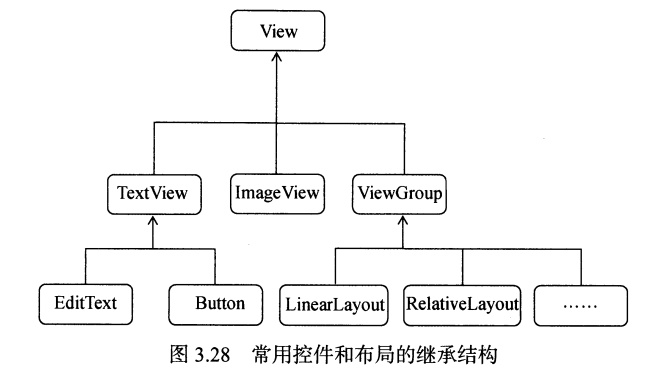

# 第03章 UI开发

## 3.2  常用控件

初学暂时使用的布局

```xml
<?xml version="1.0" encoding="utf-8"?>
<LinearLayout xmlns:android="http://schemas.android.com/apk/res/android"
    android:orientation="vertical"
    android:layout_width="match_parent"
    android:layout_height="match_parent">
</LinearLayout>
```

### 1.TextView

TextView可以说是Android中最简单的一个控件，它主要用于在界面上显示一段文本信息，比如第一章中的HelloWorld。下面是TextView的更多用法：

```xml
<!--
这里我们利用TextView做一个跑马灯
android:singleLine:内容单行显示
android:focusable:是否可以获取焦点
android:focusableInTouchMode:用于控制视图在触摸模式下是否可以聚焦
android:ellipsize:在哪里省略文本(marquee滚动、start省略号在前面、end省略号在后面、middle省略号在中间、none)
android:marqueeRepeatLimit:字幕动画重复的次数marquee_forever无限次数
 以下代码实现跑马灯
-->
    <TextView
        android:id="@+id/text_view"
        android:layout_width="match_parent"
        android:layout_height="100dp"
        android:gravity="center"
        android:text="HelloWorldHelloWorldHelloWorldHelloWorldHelloWorldHelloWorld"
        android:background="#BBC8C3"
        android:textStyle="italic"
        android:textSize="24sp"
        android:textColor="#229000FF"
        android:shadowColor="@color/purple_700"
        android:shadowDx="15.0"
        android:shadowDy="15.0"
        android:shadowRadius="10.0"
        android:singleLine="true"
        android:focusable="true"
        android:focusableInTouchMode="true"
        android:ellipsize="marquee"
        android:marqueeRepeatLimit="marquee_forever"/>

```

| 属性                  | 含义                                                         | 值                                                           |
| --------------------- | ------------------------------------------------------------ | ------------------------------------------------------------ |
| android:id            | 该组件的唯一标识符                                           |                                                              |
| android:layout_width  | 宽                                                           | match_parent(当前控件的大小和父布局一样)、fill_parent（意思同上）、wrap_content(当前控件的大小刚好包含住里面的内容) |
| android:layout_height | 高                                                           | 同上                                                         |
| android:text          | 指定在TextView中显示的文本内容(文字默认是居左上角对齐)       |                                                              |
| android:gravity       | 指定组件内文字的对齐方式                                     | 可选top\bottom\left\right\center等;可以用"\|"*来同时指定多个值；*center的效果等同于center_vertical |
| android:textSize      | 设置文字的大小（sp为单位）                                   |                                                              |
| android:textColor     | 设置文字颜色                                                 |                                                              |
| android:textStyle     | 设置字体风格                                                 | italic(斜体)，bold(加粗)，normal(默认)                       |
| android:background    | 设置控件的背景颜色                                           |                                                              |
| android:shadowColor   | 设置阴影颜色，需要与shadowRadius一起使用                     |                                                              |
| android:shadowDx      | 设置阴影再说水平方向的偏移，就是水平方向阴影开始的横坐标位置 |                                                              |
| android:shadowDy      | 设置阴影再说竖直方向的偏移，就是水平方向阴影开始的纵坐标位置 |                                                              |
| android:shadowRadius  | 设置阴影的模糊程序，                                         | 设为0.1就变成字体颜色，建议使用3.0                           |

### 2.Button

Button是程序用于用户进行交互的一个重要控件

```xml
<!--
注意系统会对Button中的所有英文字母自动进行大写转换，可以使用android:textAllCaps="false"禁止这个特性
-->
<?xml version="1.0" encoding="utf-8"?>
<LinearLayout
    xmlns:android="http://schemas.android.com/apk/res/android"
    xmlns:app="http://schemas.android.com/apk/res-auto"
    android:layout_width="match_parent"
    android:layout_height="match_parent"
    android:orientation="vertical">
    <Button
        android:id="@+id/button1"
        android:text="Button"
        android:textColor="@color/black"
        android:layout_width="wrap_content"
        android:layout_height="wrap_content"
        android:textAllCaps="false"
/>
</LinearLayout>
```

为了响应点击事件，我们要在MainActivity中为Button的点击事件注册监听器

```java
//1、点击事件 2、长按事件 3、触摸事件
package com.example.test;
import androidx.appcompat.app.AppCompatActivity;
import android.os.Bundle;
import android.util.Log;
import android.view.MotionEvent;
import android.view.View;
import android.widget.Button;

public class MainActivity extends AppCompatActivity {

    public static final String TAG="MainActivity";
    @Override
    protected void onCreate(Bundle savedInstanceState) {
        super.onCreate(savedInstanceState);
        setContentView(R.layout.activity_main);
        Button button1= (Button)findViewById(R.id.button1);
        //1、点击事件
        button1.setOnClickListener(new View.OnClickListener() {
            @Override
            public void onClick(View view) {
                Log.d(TAG, "onClick: ");
            }
        });
        //2、长按事件
        button1.setOnLongClickListener(new View.OnLongClickListener() {
            @Override
            public boolean onLongClick(View view) {
                Log.d(TAG, "onLongClick: ");
                return false;
            }
        });
        //3、触摸事件
        button1.setOnTouchListener(new View.OnTouchListener() {
            @Override
            public boolean onTouch(View view, MotionEvent motionEvent) {
                Log.d(TAG, "onTouch: ");
                return false;
            }
        });
    }
}
```

如果你不喜欢使用匿名类的方式来注册监听器

```java
public class MainActivity extends AppCompatActivity implements View.OnClickListener{
    @Override
    protected void onCreate(Bundle savedInstanceState) {
        super.onCreate(savedInstanceState);
        setContentView(R.layout.activity_main);
        Button button1= (Button)findViewById(R.id.button1);
        //点击事件
        button1.setOnClickListener(this);
    }
    @Override
    public void onClick(View v){
		switch(v.getId()){
            case R.id.button1:
                //在此添加逻辑
                break;
            default:
                break;
        }
    }
}
```

### 3.EditText

EditText是程序用于和用户进行交互的另一个重要控件，它允许用户在控件里输入和编辑内容，并可以在程序中对这些内容进行处理。

```xml
<!--
android:hint:指定了输入框中的提示性文本
android:textColorHint输入提示文字的颜色
android:InputType输入类型
android:maxLines:指定最大行数，当输入内容超过最大行数时，文本就会向上滚动
android:drawableXXX在输入框的指定方位添加图片
android:drawablePadding设置图片与输入内容的间距
android:background背景色
andorid:paddingXXX:与整个输入框的距离
-->
    <EditText
        android:id="@+id/edit_text"
        android:layout_width="match_parent"
        android:layout_height="wrap_content"
        android:hint="提示文本"
        android:maxLines="2"/>

```

结合使用EditText与Button：点击按钮来获取EditText中输入的内容。修改MainActivity代码：

```java
//MainActivity.java
import androidx.appcompat.app.AppCompatActivity;
import android.os.Bundle;
import android.view.View;
import android.widget.Button;
import android.widget.EditText;
import android.widget.Toast;

public class MainActivity extends AppCompatActivity {
    private EditText editText;
    @Override
    protected void onCreate(Bundle savedInstanceState) {
        super.onCreate(savedInstanceState);
        setContentView(R.layout.activity_main);
        /*
        * 通过点击按钮来获取EditText中输入的内容
        * */
        Button button=(Button) findViewById(R.id.button1);
        editText=(EditText) findViewById(R.id.edit_text);
        button.setOnClickListener(new View.OnClickListener() {
            @Override
            public void onClick(View view) {
                switch (view.getId()){
                    case R.id.button1:
                        //通过EditText的getText方法后去输入的内容
                        String inputText=editText.getText().toString();	             					          		   Toast.makeText(MainActivity.this,inputText,Toast.LENGTH_SHORT).show();
                        break;
                    default:
                        break;
                }
            }
        });
    }
}
```

### 4.ImageView

ImageView是用于在界面上展示图片的一个控件，它可以让我们的程序界面变得更加丰富多彩。我们所要展示的图片通常存放在以“drawable”开头的目录下，目前项目中有一个drawable目录，但是这个目录没有指定分辨率，所以一般不使用它来放置图片，这里在res目录下新建一个drawable-xhdpi目录，然后将我们要展示的照片复制到该目录中。

```xml
<!--ImageView每个只能显示一张图片
android:src:图片存放的路径，设置图片资源
android:scaleType:设置图片缩放类型
	fitStart：保持宽高比缩放图片直到较长的边与image的边长相等，缩放完成（imageview左上角）
	fitCenter:默认值，同上，缩放后位于中间
 	fitXY:对图像的横纵方向进行独立缩放，使得该图片完全使用ImageView,但图片的宽高比可能会改变
	center:保持原图的大小，显示在imageView的中心，当原图大小大于imageview时会进行裁剪处理
	centerCrop:保持宽高比缩放图片，直到完全覆盖ImageView，可能会出现图片的显示不完全
	centerInside:保持宽高比缩放图片，直到ImageView能够完全的显示图片
	matrix:不改变原图的大小，从ImageView的左上角开始绘制原图，原图超过imageView的部分裁剪处理

以下三个设置当有一边达到最大宽度或者高度时，另外一边等比缩放
android:maxHeight:最大高度
android:maxWidth:最大宽度
android:adjustViewBounds="true"调整View的界限
   -->
    <ImageView
        android:id="@+id/image_view"
        android:layout_width="wrap_content"
        android:layout_height="wrap_content"
        android:src="@drawable/img1" />
```

动态更改ImageView中的图片

```
//先获取ImageView实例
imageView=(ImageView) findViewById(R.id.image_view);
//在需要更改照片的事件中添加： 
imageView.setImageResource(R.drawable.img2)
```

### 5.ProgressBar

ProgressBar用于在界面上显示一个进度条，表明程序正在加载一些数据，运行之后会看到屏幕中有一个圆形的进度条正在旋转。

```xml
<!--
 android:visibility:控制是否可见visible(可见)，invisible(不可见但仍然占据原来的位置)，gone(不可见且不占用屏幕空间)
 style="@style/Widget.AppCompat.ProgressBar.Horizontal":设置水平进度条
android:max="100":进度条的最大值
android:progress:进度条已完成进度值
android:indeterminate:如果设置成true，则进度条不精确显示进度
style="?android:attr/progressBarStyleHorizontal"水平进度条
  -->
    <ProgressBar
        android:id="@+id/progress"
        android:layout_width="match_parent"
        android:layout_height="wrap_content"
        android:visibility="visible"
        style="?android:attr/progressBarStyleHorizontal"
        android:max="100"/>
```

```java
//设置进度条显示
progressBar=(ProgressBar)findViewById(R.id.progress);
progressBar.setVisibility(View.VISIBLE);
```

```java
progressBar=(ProgressBar)findViewById(R.id.progress);
button.setOnClickListener(new View.OnClickListener() {
    @Override
    public void onClick(View view) {
        switch (view.getId()){
            case R.id.button1:
                //动态修改水平进度条数据,每点击一次按钮进度条就加10
                int projress=progressBar.getProgress();
                projress=projress+10;
                progressBar.setProgress(projress);
                break;
            default:
                break;
        }
    }	
});
```

### 6.AlertDialog

AlertDialog可以在当前的界面弹出一个对话框，这个对话框是置顶于所以界面元素之上的，能够屏蔽掉其他控件的交互能力，因此AlertDialog一般都是用于提示一些非常重要的内容或者警告信息，比如为了防止用户误删重要内容，在删除前弹出一个确认对话框

使用方式介绍

| AlertDialog.Builder builder=new AlertDialog.Builder(context); | 创建AlertDialog实例      |
| ------------------------------------------------------------ | ------------------------ |
| Builder.setIcon(int iconid);                                 | 添加ICON                 |
| Builder.setTitle(CharSequence title);                        | 添加标题                 |
| Builder.setMessage(CharSequence message);                    | 添加消息                 |
| Builder.setView(View view);                                  | 设置自定义布局           |
| Builder.create();                                            | 创建Dialog               |
| Builder.show();                                              | 显示对话框               |
| Builder.setCancelable();                                     | 设置是否可以用back键返回 |
| setPositiveButton                                            | 确定按钮                 |
| setNegativeButton                                            | 取消按钮                 |
| setNeutralButton                                             | 中间按钮                 |

代码示例：

```java
	@Override
    protected void onCreate(Bundle savedInstanceState) {
        super.onCreate(savedInstanceState);
        setContentView(R.layout.activity_main); 
        Button button=(Button) findViewById(R.id.button1);
        button.setOnClickListener(new View.OnClickListener() {
            @Override
            public void onClick(View view) {
/*
   首先通过AlertDialog.Builder创建一个AlertDialog的实例，然后可以为这个话题框设置标题、内容、
   可否使用back键关闭对话框等属性，接下来调用setPositiveButton()方法为对话框设置确定按钮的点击事件
  调用setNegativeButton()方法设置取消按钮的点击事件，最后调用show()方法将对话框显示出来
*/
                switch(view.getId()){
                    case R.id.button1:
                        AlertDialog.Builder dialog=new AlertDialog.Builder(MainActivity.this);
                        dialog.setTitle("This is a dialog");
                        dialog.setMessage("Something important.");
                        //设置是否可以用back键返回
                        dialog.setCancelable(false);
                        dialog.setPositiveButton("OK", new DialogInterface.OnClickListener() {
                            @Override
                            public void onClick(DialogInterface dialogInterface, int i) {
                            }
                        });
                        dialog.setNegativeButton("Cancel", new DialogInterface.OnClickListener() {
                            @Override
                            public void onClick(DialogInterface dialogInterface, int i) {
                            }
                        });
                        dialog.show();
                        break;
                    default:
                        break;
                }
            }
        });

    }
}
```

进阶做法：自定义对话框内的内容

```xml
布局文件一（主布局）activity_second.xml
<?xml version="1.0" encoding="utf-8"?>
<LinearLayout
    xmlns:android="http://schemas.android.com/apk/res/android"
    android:layout_height="match_parent"
    android:layout_width="match_parent"
    android:orientation="vertical">
    <Button
        android:id="@+id/bu1"
        android:layout_width="wrap_content"
        android:layout_height="wrap_content"
        android:text="显示对话框"
        android:onClick="xyClick"/>
</LinearLayout>

布局文件二：
dialog_view.xml
<?xml version="1.0" encoding="utf-8"?>
<LinearLayout
    xmlns:android="http://schemas.android.com/apk/res/android"
    android:layout_width="match_parent"
    android:layout_height="match_parent"
    android:orientation="vertical"
    android:background="#ffff00">

    <ImageView
        android:src="@mipmap/ic_launcher"
        android:layout_width="wrap_content"
        android:layout_height="wrap_content"/>

    <TextView
        android:layout_width="wrap_content"
        android:layout_height="wrap_content"
        android:text="哈哈哈，天气很好"/>
</LinearLayout>
```

```java
package com.example.test;
import androidx.appcompat.app.AlertDialog;
import androidx.appcompat.app.AppCompatActivity;
import androidx.appcompat.widget.Toolbar;
import android.content.DialogInterface;
import android.content.Intent;
import android.os.Bundle;
import android.util.Log;
import android.view.View;

public class SecondActivity extends AppCompatActivity {
    private static final String TAG="SecondActivity";
    @Override
    protected void onCreate(Bundle savedInstanceState) {
        super.onCreate(savedInstanceState);
        setContentView(R.layout.activity_second);
    }
	//点击事件的逻辑，需要放在"button.setOnClickListener(new View.OnClickListener() {}"里
    public void xyClick(View view){
        //添加自定义布局
        View dialogview=getLayoutInflater().inflate(R.layout.dialog_view,null);

        //1、构建各种参数
       AlertDialog.Builder builder= new AlertDialog.Builder(this);
       builder.setIcon(R.mipmap.ic_launcher)
               .setTitle("这是对话框")//点击按钮显示的内容的标题
               .setMessage("天气预报")//显示的内容
               .setView(dialogview)//显示新的布局,这里我们设置了对话框的视图
               //确定
               .setPositiveButton("确定", new DialogInterface.OnClickListener() {
                   @Override
                   public void onClick(DialogInterface dialogInterface, int i) {
                       Log.d(TAG, "onClick: 点击确定");
                   }
               })
               //取消
               .setNegativeButton("取消", new DialogInterface.OnClickListener() {
                   @Override
                   public void onClick(DialogInterface dialogInterface, int i) {
                       Log.d(TAG, "onClick: 点击取消");
                   }
               })
               //中间
               .setNeutralButton("中间", new DialogInterface.OnClickListener() {
                   @Override
                   public void onClick(DialogInterface dialogInterface, int i) {
                       Log.d(TAG, "onClick: 点击中间");
                   }
               })
               .create()
               .show();
    }
}
```

### 7.ProgressDialog

ProgressDialog和AlertDialog有点类似，都可以在界面上弹出一个对话框，都能够屏蔽掉其他控件的交互能力。不同的是，ProgressDialog会在对话框中显示一个进度条，一般用于标识当前操作比较耗时，让用户耐心地等待。

```java
@Override
    protected void onCreate(Bundle savedInstanceState) {
        super.onCreate(savedInstanceState);
        setContentView(R.layout.activity_main);
        Button button=(Button) findViewById(R.id.button1);
        editText=(EditText) findViewById(R.id.edit_text);
        progressBar=(ProgressBar)findViewById(R.id.progress);
        button.setOnClickListener(new View.OnClickListener() {
            @Override
            public void onClick(View view) {
                /*
                * 这里也是先构建一个ProgressDialog对象，然后同样可以设置标题，内容
                * 可否取消等属性最后调用show()方法显示出来
                * progressDialog.setCancelable(true)
               	* 如果填了false则不能通过back键取消，需要在数据加载完成后
               	* 调用ProgressDialog的dismiss()方法来关闭对话框，否则ProgressDialog会一直在
                * */
                switch(view.getId()){
                    case R.id.button1:
                        ProgressDialog progressDialog=new ProgressDialog(MainActivity.this);
                        progressDialog.setTitle("This is ProgressDialog");
                        progressDialog.setMessage("Loading......");
                        progressDialog.setCancelable(true);
                        progressDialog.show();
                        break;
                    default:
                        break;
                }
            }
        });
    }
```

### 8.ListView

当我们的程序中有大量的数据需要展示时，就可以借助ListView来实现。

#### ListView的简单用法

activity_main.xml：

```xml
<LinearLayout
    xmlns:android="http://schemas.android.com/apk/res/android"
    android:layout_width="match_parent"
    android:layout_height="match_parent">

    <ListView
        android:id="@+id/list_view"
        android:layout_width="match_parent"
        android:layout_height="match_parent" />

</LinearLayout>
```

MainActivity：

```java
public class MainActivity extends AppCompatActivity {
 
    private String[] data ={"Apple","Banana","Orange","Watermelon","Pear","Grape","Pineapple","Strawberry","Cherry","Mango","Apple","Banana","Orange","Watermelon","Pear","Grape","Pineapple","Strawberry","Cherry","Mango"};
 
    @Override
    protected void onCreate(Bundle savedInstanceState) {
        super.onCreate(savedInstanceState);
        setContentView(R.layout.activity_main);
        //数组中的数据是无法直接传递给ListView的,需要借助适配器来完成。
        //适配器构造函数中依次传入当前上下文、ListView子项的布局id，以及要适配的数据
        ArrayAdapter<String> adapter = new ArrayAdapter<>(MainActivity.this, android.R.layout.simple_list_item_1, data);
        ListView listView = findViewById(R.id.list_view);
        listView.setAdapter(adapter);
    }
}
```

#### 定制LsitView的界面 

示例

新建类Fruit，作为ListView适配器的适配类型

```java
package com.example.listviewtest;

public class Fruit {

    private String name;
    private int imageId;

    public Fruit(String name, int imageId) {
        this.name = name;
        this.imageId = imageId;
    }

    public String getName() {
        return name;
    }

    public int getImageId() {
        return imageId;
    }

}
```

为ListView的子项指定一个我们自定义的布局，在layout目录下新建fruit_item.xml

```xml
<?xml version="1.0" encoding="utf-8"?>
<LinearLayout xmlns:android="http://schemas.android.com/apk/res/android"
	android:orientation="horizontal"
	android:layout_width="match_parent"
	android:layout_height="match_parent">

	<ImageView
		android:id="@+id/fruit_image"
		android:layout_width="wrap_content"
		android:layout_height="wrap_content" />

	<TextView
		android:id="@+id/fruit_name"
		android:layout_width="wrap_content"
		android:layout_height="wrap_content"
		android:layout_gravity="center_vertical"
		android:layout_marginLeft="10dp" />

</LinearLayout>
```

创建一个自定义的适配器FruitAdapter

```java
public class FruitAdapter extends ArrayAdapter<Fruit> {

    private int resourceId;
    //重写父类的构造函数
    //将上下文、ListView子项布局的id和数据都传递进来
    public FruitAdapter(Context context, int textViewResourceId,
                        List<Fruit> objects) {
        super(context, textViewResourceId, objects);
        resourceId = textViewResourceId;
    }

    @Override
    public View getView(int position, View convertView, ViewGroup parent) {
        // 获取当前项的Fruit实例
        Fruit fruit = getItem(position); 
        //LayoutInflater.from(this);  获取LayoutInflater实例
        //使用LayoutInflater为子项加载我们传入的布局
        //inflate的三个参数：要转换的xml布局、给加载好的布局再添加一个父布局、
        //是否让父布局的layout属性失效
        View view = LayoutInflater.from(getContext()).inflate(resourceId, parent, false);
        TextView fruitName = view.findViewById(R.id.fruit_name);
        ImageView fruitImage = view.findViewById(R.id.fruit_image);
        fruitName.setText(fruit.getFruitName());
        fruitImage.setImageResource(fruit.getImageId());
        return view;
}
```

修改MainActivity

```java
public class MainActivity extends AppCompatActivity {

    private List<Fruit> fruitList = new ArrayList<>();
//    private String[] data = {"Apple","Banana","Oraneg","Watermelon","Pear","Grape","Pineapple","Strawberry","Cherry","Mango","Apple","Banana","Oraneg","Watermelon","Pear","Grape","Pineapple","Strawberry","Cherry","Mango"};

    @Override
    protected void onCreate(Bundle savedInstanceState) {
        super.onCreate(savedInstanceState);
        setContentView(R.layout.activity_main);
        //初始化水果数据
        initFruits();
        FruitAdapter adapter = new FruitAdapter(
                MainActivity.this, R.layout.fruit_item,fruitList
        );
        ListView listView = (ListView) findViewById(R.id.list_view);
        listView.setAdapter(adapter);
    }

    private void initFruits() {
        for (int i = 0; i < 2; i++) {
            Fruit apple = new Fruit("Apple", R.drawable.apple_pic);
            fruitList.add(apple);
            Fruit banana = new Fruit("Banana", R.drawable.banana_pic);
            fruitList.add(banana);
            Fruit orange = new Fruit("Orange", R.drawable.orange_pic);
            fruitList.add(orange);
            Fruit watermelon = new Fruit("Watermelon", R.drawable.watermelon_pic);
            fruitList.add(watermelon);
            Fruit pear = new Fruit("Pear", R.drawable.pear_pic);
            fruitList.add(pear);
            Fruit grape = new Fruit("Grape", R.drawable.grape_pic);
            fruitList.add(grape);
            Fruit pineapple = new Fruit("Pineapple", R.drawable.pineapple_pic);
            fruitList.add(pineapple);
            Fruit strawberry = new Fruit("Strawberry", R.drawable.strawberry_pic);
            fruitList.add(strawberry);
            Fruit cherry = new Fruit("Cherry", R.drawable.cherry_pic);
            fruitList.add(cherry);
            Fruit mango = new Fruit("Mango", R.drawable.mango_pic);
            fruitList.add(mango);
        }
    }
}
```

#### 提升ListView的运行效率

修改FruitAdapter

```java
@Override
//convertView用于将之前加载好的布局进行缓存
public View getView(int position, View convertView, ViewGroup parent) {
	Fruit fruit = getItem(position); // 获取当前项的Fruit实例
	View view;
	ViewHolder viewHolder;
	if (convertView == null) {
		view = LayoutInflater.from(getContext()).inflate(resourceId, parent, false);
		viewHolder = new ViewHolder();
		viewHolder.fruitImage = (ImageView) view.findViewById (R.id.fruit_image);
		viewHolder.fruitName = (TextView) view.findViewById (R.id.fruit_name);
		view.setTag(viewHolder); // 将ViewHolder存储在View中
	} else {
		view = convertView;
		viewHolder = (ViewHolder) view.getTag(); // 重新获取ViewHolder
	}
	viewHolder.fruitImage.setImageResource(fruit.getImageId());
	viewHolder.fruitName.setText(fruit.getName());
	return view;
}
//新建一个内部类ViewHolder，用于对控件的实例进行缓存
class ViewHolder {
	ImageView fruitImage;
	TextView fruitName;
}
```

#### ListView的点击事件

修改MainActivty

```java
@Override
protected void onCreate(Bundle savedInstanceState) {
	super.onCreate(savedInstanceState);
	setContentView(R.layout.activity_main);
	initFruits();
	FruitAdapter adapter = new FruitAdapter(
			MainActivity.this, R.layout.fruit_item,fruitList
	);
	ListView listView = (ListView) findViewById(R.id.list_view);
	listView.setAdapter(adapter);
    //使用setOnItemClickListener()方法为ListView注册一个监听器，当用户点击了
    //ListView中的任何一个子项是，就会回调onItemClick()方法
	listView.setOnItemClickListener(new AdapterView.OnItemClickListener() {
		@Override
		public void onItemClick(AdapterView<?> adapterView, View view, int position, long id) {
			Fruit fruit = fruitList.get(position);
			Toast.makeText(MainActivity.this,fruit.getName(),Toast.LENGTH_SHORT).show();
		}
	});
}
```

### 9.RecyclerView

#### RecyclerView的基础用法

导入依赖：

```
implementation 'androidx.recyclerview:recyclerview:1.2.8'
```

修改activity_main.xml中的代码：

```xml
<androidx.recyclerview.widget.RecyclerView
    android:id="@+id/recycler_view"
    android:layout_width="match_parent"
    android:layout_height="match_parent"
/>
```

这里我们直接从ListView项目中把照片、Fruit类和fruit_item.xml复制过来（具体代码可以看ListView部分的代码）

接下来为RecyclerView准备一个适配器，新建FruitAdapter类，让这个适配器继承自RecyclerView.Adapter，并将泛型指定为FruitAdapter.ViewHolder。

```java
public class FruitAdapter extends RecyclerView.Adapter<FruitAdapter.ViewHolder> {
    private List<Fruit> mFruitList;
    
    static class ViewHolder extends RecyclerView.ViewHolder {
        ImageView fruitImage;
        TextView fruitName;
 
        public ViewHolder(@NonNull View itemView) {
            super(itemView);
            fruitImage = itemView.findViewById(R.id.fruit_image);
            fruitName = itemView.findViewById(R.id.fruit_name);
        }
    }
 	
    public FruitAdapter(List<Furit> FruitList){
        mFruitList = FruitList
    }
    
    @NonNull
    @Override
    public ViewHolder onCreateViewHolder(@NonNull ViewGroup parent, int viewType) {
        View view = LayoutInflater.from(parent.getContext()).inflate(R.layout.fruit_item, parent, false);
        ViewHolder holder = new ViewHolder(view);
        return holder;
    }
 
    @Override
    public void onBindViewHolder(@NonNull ViewHolder holder, int position) {
        Fruit fruit = mFruitList.get(position);
        holder.fruitName.setText(fruit.getFruitName());
        holder.fruitImage.setImageResource(fruit.getFruitImage());
    }
 
    @Override
    public int getItemCount() {
        return fruitList.size();
    }
}
```

修改MainActivity

```java
public class MainActivity extends AppCompatActivity {
 
    private List fruitList = new ArrayList<Fruit>();
 
    @Override
    protected void onCreate(Bundle savedInstanceState) {
        super.onCreate(savedInstanceState);
        setContentView(R.layout.activity_main);
        initFruits();
        RecyclerView recyclerView = findViewById(R.id.recycler_view);
        //指定RecyclerView的布局方式，此处是线性布局
        LinearLayoutManager linearLayoutManager = new LinearLayoutManager(this);
        recyclerView.setLayoutManager(linearLayoutManager);
        FruitAdapter adapter = new FruitAdapter(fruitList);
        recyclerView.setAdapter(adapter);
    }
 
    private void initFruits(){
        for (int i = 0; i < 2; i++) {
            Fruit apple = new Fruit("Apple", R.drawable.apple_pic);
            fruitList.add(apple);
            Fruit banana = new Fruit("Banana", R.drawable.banana_pic);
            fruitList.add(banana);
            Fruit orange = new Fruit("Orange", R.drawable.orange_pic);
            fruitList.add(orange);
            Fruit watermelon = new Fruit("Watermelon", R.drawable.watermelon_pic);
            fruitList.add(watermelon);
            Fruit pear = new Fruit("Pear", R.drawable.pear_pic);
            fruitList.add(pear);
            Fruit grape = new Fruit("Grape", R.drawable.grape_pic);
            fruitList.add(grape);
            Fruit pineapple = new Fruit("Pineapple", R.drawable.pineapple_pic);
            fruitList.add(pineapple);
            Fruit strawberry = new Fruit("Strawberry", R.drawable.strawberry_pic);
            fruitList.add(strawberry);
            Fruit cherry = new Fruit("Cherry", R.drawable.cherry_pic);
            fruitList.add(cherry);
            Fruit mango = new Fruit("Mango", R.drawable.mango_pic);
            fruitList.add(mango);
        }
    }
}
```

运行程序可以看到RecyclerView实现了和ListView几乎一模一样的效果。

#### 实现横向滚动和瀑布流布局

**横向滚动**

RecyclerView不仅能实现纵向滚动，还能实现ListView做不到的横向滚动。

首先我们对fruit_item布局进行修改：将LinearLayout改成垂直方向排列，并把宽度设为100dp

```xml
<LinearLayout xmlns:android="http://schemas.android.com/apk/res/android"
    android:orientation="vertical"
    android:layout_width="100dp"
    android:layout_height="wrap_content">
 
    <ImageView
        android:id="@+id/fruit_image"
        android:layout_width="wrap_content"
        android:layout_height="wrap_content"
        android:layout_gravity="center_horizontal"/>
 
    <TextView
        android:id="@+id/fruit_name"
        android:layout_width="wrap_content"
        android:layout_height="wrap_content"
        android:layout_gravity="center_horizontal"
        android:layout_marginTop="10dp"
        />
 
</LinearLayout>
```

修改MainActivity：

```JAVA
RecyclerView recyclerView = (RecyclerView) findViewById(R.id.recycler_view);
LinearLayoutManager linearLayoutManager = new LinearLayoutManager(this);
linearLayoutManager.setOrientation(LinearLayoutManager.HORIZONTAL);
recyclerView.setLayoutManager(linearLayoutManager);
```

**瀑布流布局(StaggeredGridLayoutManager)**

瀑布流布局应该将fruit_item.xml中的LinearLayout的宽度改为match_parent，因为瀑布流布局的宽度应该是根据布局的列数来自动适配的，而不是一个固定值。

修改fruit_item.xml

```xml
<!--宽度改为match_parent-->
<LinearLayout xmlns:android="http://schemas.android.com/apk/res/android"
    android:orientation="vertical"
    android:layout_width="match_parent"  
    android:layout_height="wrap_content"
    android:layout_margin="5dp">

    <ImageView
        android:id="@+id/fruit_image"
        android:layout_width="wrap_content"
        android:layout_height="wrap_content"
        android:layout_gravity="center_horizontal"/>

    <TextView
        android:id="@+id/fruit_name"
        android:layout_width="wrap_content"
        android:layout_height="wrap_content"
        android:layout_gravity="left"
        android:layout_marginTop="10dp" />

</LinearLayout>
```

修改MainActivity

在onCreate()方法中，我们创建了一个StaggeredGridLayoutManager的实例。StaggeredGridLayoutManager的构造函数接收两个参数，第一个参数用于指定布局的列数，传入3表示会把布局分为3列；第二个参数用于指定布局的排列方式，传入StaggeredGridLayoutManager.VERTICAL表示会让布局纵向排列，最后再把创建好的实例设置到RecyclerView当中。

```java
RecyclerView recyclerView = (RecyclerView) findViewById(R.id.recycler_view);
StaggeredGridLayoutManager layoutManager = new StaggeredGridLayoutManager(3,StaggeredGridLayoutManager.VERTICAL);
recyclerView.setLayoutManager(linearLayoutManager);
```

由于瀑布流布局需要各个子项的高度不一致才能看出明显的效果，为此我们增加getRandomLengthName()方法去创造不同长度的水果名，这样子项的高度也就各不相同了。

```java
private String getRandomLengthName(String name) {
	Random random = new Random();
	int length = random.nextInt(20) + 1;
	StringBuilder builder = new StringBuilder();
	for (int i = 0; i < length; i++) {
		builder.append(name);
	}
	return builder.toString();
}
```

在初始化水果数据的时候，我们应该按照下面的方式来创建水果对象

```java
for (int i = 0; i < 2; i++) {
	Fruit apple = new Fruit(getRandomLengthName("Apple"), R.drawable.apple_pic);
	fruitList.add(apple);
	Fruit banana = new Fruit(getRandomLengthName("Banana"), R.drawable.banana_pic);
	fruitList.add(banana);
}
```

#### RecyclerView的点击事件

不同于ListView，RecyclerView没有提供类似于setOnItemClickListener()的注册监听器方法，需要我们自己给子项具体的View去注册点击事件。

修改FruitAdapter中的代码

在ViewHolder 中添加了fruitView变量来保存子项最外层布局的实例，然后在onCreateViewHolder()方法中注册点击事件。

```java
static class ViewHolder extends RecyclerView.ViewHolder {
	View fruitView;
	ImageView fruitImage;
	TextView fruitName;

	public ViewHolder(View view) {
		super(view);
		fruitView = view;
		fruitImage = (ImageView) view.findViewById(R.id.fruit_image);
		fruitName = (TextView) view.findViewById(R.id.fruit_name);
	}
}
```

为最外层布局和ImageView注册点击事件

```java
public ViewHolder onCreateViewHolder(@NonNull ViewGroup parent, int viewType) {
    View view = LayoutInflater.from(parent.getContext()).inflate(R.layout.fruit_item, parent, false);
    final ViewHolder viewHolder = new ViewHolder(view);
    viewHolder.fruitView.setOnClickListener(new View.OnClickListener() {
        @Override
        public void onClick(View v) {
            int position = viewHolder.getAdapterPosition();
            Fruit fruit = mFruitList.get(position);
            Toast.makeText(v.getContext(),"你点击了"+fruit.getFruitName()+"子项外层布局",Toast.LENGTH_SHORT).show();
        }
    });
    viewHolder.fruitImage.setOnClickListener(new View.OnClickListener() {
        @Override
        public void onClick(View v) {
            int position = viewHolder.getAdapterPosition();
            Fruit fruit = mFruitList.get(position);
            Toast.makeText(v.getContext(),"你点击了"+fruit.getFruitName()+"图片部分",Toast.LENGTH_SHORT).show();
        }
    });
    return viewHolder;
}
```

## 3.3  4种基本布局

**布局是一种可用于放置很多控件的容器，它可以按照一定的规律调整内部控件的位置，从而编写出精美的界面，布局里面除了放置控件之外，还可以放置布局，通过多层布局的嵌套，可以完成一些比较复杂的界面实现**。


### 线性布局LinearLayout

这个布局会将它所包含的控件在线性方向上依次排列(android:orientation=“vertical”垂直方向上的线性排列)，（android:orientation=“horizontal”水平方向上的线性排列），注意如果是水平线性排列的话内部控件的宽度不能为match_parent，不然单独一个控件会将整个水平方向占满。

代码示例：

```xml
<!--LinearLayout布局-->
<!--
android:orientation="horizontal",设置方向为水平方向(vertical为垂直方向)
android:layout_gravity，只有垂直方向的对齐方式才会生效(top,bottom,center_vertical)
android:layout_weight:这个属性允许我们使用比例的方式来指定控件的大小(系统根据总加起来的值再给每部分占比)
    当有layout_weight属性时，layout_width中要设置为0dp，这是一种比较规范的写法。
-->
<?xml version="1.0" encoding="utf-8"?>
<LinearLayout xmlns:android="http://schemas.android.com/apk/res/android"
    android:orientation="horizontal"
    android:layout_width="match_parent"
    android:layout_height="match_parent"
>
    <EditText 
    	android:id="@+id/input_message"
		android:layout_width="0dp"
		android:layout_height="wrap_content"
         android:layout_weight="1"
		android:hint="Type something"/>
    <Button
		android:id="@+id/send"
		android:layout_width="wrap_content"
		android:layout_height="wrap_content"
		android:text="Send"/>
</LinearLayout>
```
常见属性

| **orientation**     | **布局中组件的排列方式**                                     |
| ------------------- | ------------------------------------------------------------ |
| gravity             | 控制组件所包含的子元素的对齐方式，可多个组合(center\|bottom、center、center_vertical等等) |
| layout_gravity      | 控制该组件在父容器里的对齐方式                               |
| background          | 为该组件设置一个背景图片，或者是直接用颜色覆盖               |
| divider             | 分割线                                                       |
| showDividers        | 设置分割线所在的位置，none(无)，beginning(开始)，end(结束)，middle(每两个组件间) |
| dividerPadding      | 设置分割线的padding                                          |
| layout_weight(权重) | 该属性是用来等比例的划分区域，权重分配的是剩余空间，如果有一个组件属性为match_parent，则其他会被覆盖，如果为垂直方向则设置高，如果为水平方向则设置宽 |


### 相对布局RelativeLayout

和LinearLayout的排列规则不同，RelativeLayout会随意一些，它可以通过相对定位的方式让控件出现在布局的任何位置。

代码示例：

```xml
<?xml version="1.0" encoding="utf-8"?>
<RelativeLayout
    xmlns:android="http://schemas.android.com/apk/res/android"
    android:layout_width="match_parent"
    android:layout_height="match_parent"
    android:padding="100dp">
   <Button
		android:id="@+id/button1"
		android:layout_width="wrap_content"
		android:layout_height="wrap_content"
		android:layout_alignParentLeft="true"
		android:layout_alignParentTop="true"
		android:text="Button1"/>

    <Button
		android:id="@+id/button2"
		android:layout_width="wrap_content"
		android:layout_height="wrap_content"
		android:layout_alignParentRight="true"
		android:layout_alignParentTop="true"
		android:text="Button 1"/>
    
    <Button
		android:id="@+id/button2"
		android:layout_width="wrap_content"
		android:layout_height="wrap_content"
		android:layout_alignParentRight="true"
		android:layout_alignParentTop="true"
		android:text="Button 2"/>
    
    <Button
		android:id="@+id/button3"
		android:layout_width="wrap_content"
		android:layout_height="wrap_content"
		android:layout_centerInParent="true"
		android:text="Button 3"/>
    
    <Button
		android:id="@+id/button4"
		android:layout_width="wrap_content"
		android:layout_height="wrap_content"
		android:layout_alignParentLeft="true"
		android:layout_alignParentBottom="true"
		android:text="Button 4"/>
    
    <Button
		android:id="@+id/button4"
		android:layout_width="wrap_content"
		android:layout_height="wrap_content"
		android:layout_alignParentRight="true"
		android:layout_alignParentBottom="true"
		android:text="Button 5"/>
</RelativeLayout>
```

常见属性：

| 根据父容器定位属性       | 作用     |
| ------------------------ | -------- |
| layout_alignParentLeft   | 左对齐   |
| layout_alignParentRight  | 右对齐   |
| layout_alignParentTop    | 顶部对齐 |
| layout_alignParentBottom | 底部对齐 |
| layout_centerHorizontal  | 水平居中 |
| layout_centerVertical    | 垂直居中 |
| layout_centerInParent    | 中间位置 |

| 根据兄弟组件定位   | 作用                 |
| ------------------ | -------------------- |
| layout_toLeftOf    | 放置于参考组件的左边 |
| layout_toRightOf   | 放置于参考组件的右边 |
| layout_above       | 放置于参考组件的上面 |
| layout_below       | 放置于参考组件的下面 |
| layout_alignTop    | 对齐参考组件的上边界 |
| layout_alignBottom | 对齐参考组件的下边界 |
| layout_alignLeft   | 对齐参考组件的左边界 |
| layout_alignRight  | 对齐参考组件的右边界 |

| 通用属性            | 作用         |
| ------------------- | ------------ |
| layout_margin       | 上下左右偏移 |
| layout_marginLeft   | 左偏移       |
| layout_marginRight  | 右偏移       |
| layout_marginBottom | 下偏移       |
| layout_marginTop    | 上偏移       |

| 设置组件内部元素的边距 | 作用         |
| ---------------------- | ------------ |
| padding                | 上下左右边距 |
| paddingBottom          | 下边距       |
| paddingLeft            | 左边距       |
| paddingRight           | 右边距       |
| paddingTop             | 上边距       |

### 帧布局FrameLayout

这种布局所有的控件都会摆放在布局的左上角。我们也可以使用layout_gravity属性来指定控件在布局中的对齐方式

代码示例：

```xml
<?xml version="1.0" encoding="utf-8"?>
<FrameLayout xmlns:android="http://schemas.android.com/apk/res/android"
    android:layout_width="match_parent"
    android:layout_height="match_parent">
	<TextView
		android:id="@+id/text_view"
		android:layout_width="wrap_content"
		android:layout_height="wrap_content"
		android:layout_gravity="left"
		android:text="This is TextView"/>
    
    <ImageView
		android:id="@+id/button"
		android:layout_width="wrap_content"
		android:layout_height="wrap_content"
		android:layout_gravity="right"
		android:src="@mipmap/ic_launcher"/>
    
</FrameLayout>
```

###  百分比布局

在这种布局中，我们可以不再使用wrap_content、match_parent等方式来指定控件的大小，而是允许直接指定控件在布局中所占的百分比。

要使用百分比布局，首先我们要在项目的build.gradle中添加百分比布局库的依赖。打开app/build.gradle文件，在dependencies闭包中添加如下内容：

```
implementation 'androidx.percentlayout:percentlayout:1.0.0'
```

代码示例：

```xml
<?xml version="1.0" encoding="utf-8"?>
<!--PercentFrameLayout布局-->
<androidx.percentlayout.widget.PercentFrameLayout
    xmlns:android="http://schemas.android.com/apk/res/android"
    xmlns:app="http://schemas.android.com/apk/res-auto"
    android:layout_width="match_parent"
    android:layout_height="match_parent">

    <Button
        android:id="@+id/button1"
        android:text="button1"
        android:layout_width="0dp"
        android:layout_height="0dp"
        android:layout_gravity="left|top"
        app:layout_widthPercent="50%"
        app:layout_heightPercent="50%"/>

    <Button
        android:id="@+id/button2"
        android:layout_width="0dp"
        android:layout_height="0dp"
        app:layout_widthPercent="50%"
        app:layout_heightPercent="50%"
        android:text="button2"
        android:layout_gravity="right|top" />
    <Button
        android:id="@+id/button3"
        android:layout_width="0dp"
        android:layout_height="0dp"
        app:layout_widthPercent="50%"
        app:layout_heightPercent="50%"
        android:text="button3"
        android:layout_gravity="left|bottom"/>
    <Button
        android:id="@+id/button4"
        android:layout_width="0dp"
        android:layout_height="0dp"
        app:layout_widthPercent="50%"
        app:layout_heightPercent="50%"
        android:text="button4"
        android:layout_gravity="right|bottom"/>

</androidx.percentlayout.widget.PercentFrameLayout>


<?xml version="1.0" encoding="utf-8"?>
<!--PercentRelativeLayout布局-->
<androidx.percentlayout.widget.PercentRelativeLayout
    xmlns:android="http://schemas.android.com/apk/res/android"
    xmlns:app="http://schemas.android.com/apk/res-auto"
    android:layout_width="match_parent"
    android:layout_height="match_parent">

    <Button
        android:id="@+id/button1"
        android:text="button1"
        android:layout_width="0dp"
        android:layout_height="0dp"
        android:layout_alignParentBottom="true"
        app:layout_widthPercent="20%"
        app:layout_heightPercent="20%"/>

    <Button
        android:id="@+id/button2"
        android:layout_width="0dp"
        android:layout_height="0dp"
        app:layout_widthPercent="20%"
        app:layout_heightPercent="20%"
        android:text="button2"
        android:layout_above="@id/button1"/>
    <Button
        android:id="@+id/button3"
        android:layout_width="0dp"
        android:layout_height="0dp"
        app:layout_widthPercent="20%"
        app:layout_heightPercent="20%"
        android:text="button3"
        android:layout_above="@id/button2"/>

</androidx.percentlayout.widget.PercentRelativeLayout>
```

## 3.4  创建自定义控件

空间和布局的继承结构



### 引入布局

引入布局可以解决代码的大量重复问题

#### 创建一个自定义的标题栏

新建一个布局title.xml

```xml
<?xml version="1.0" encoding="utf-8"?>
<LinearLayout xmlns:android="http://schemas.android.com/apk/res/android"
    android:layout_width="match_parent"
    android:layout_height="wrap_content"
    android:background="@drawable/title_bg">

    <Button
        android:id="@+id/title_back"
        android:layout_width="wrap_content"
        android:layout_height="wrap_content"
        android:layout_gravity="center"
        android:layout_margin="5dp"
        android:background="@drawable/back_bg"
        android:text="Back"
        android:textColor="#fff" />

    <TextView
        android:id="@+id/title_text"
        android:layout_width="0dp"
        android:layout_height="wrap_content"
        android:layout_gravity="center"
        android:layout_weight="1"
        android:gravity="center"
        android:text="Title Text"
        android:textColor="#fff"
        android:textSize="24sp" />

    <Button
        android:id="@+id/title_edit"
        android:layout_width="wrap_content"
        android:layout_height="wrap_content"
        android:layout_gravity="center"
        android:layout_margin="5dp"
        android:background="@drawable/edit_bg"
        android:text="Edit"
        android:textColor="#fff" />

</LinearLayout>
```

#### 修改activity_main.xml,通过include语句将标题栏布局引入

```xml
<LinearLayout
	xmlns:android="http://schemas.android.com/apk/res/android"
	android:layout_width="match_parent"
	android:layout_height="wrap_content">
	<include layout="@layout/title"/>
</LinearLayout>
```

修改MainActivity，将系统自带的标题栏隐藏掉

```java
//调用getSupportActionBar()方法来获得ActionBar实例
ActionBar actionbar = getSupportActionBar();
if(actionbar != null){
    //隐藏标题栏
	actionbar.hide();
}
```

### 创建自定义控件

引入的布局中有一些控件要求能够响应事件，但是如果在每个活动都注册一遍响应事件，就会增加重复代码，使用自定义控件可以解决该问题。

新建TitleLayout继承LinearLayout

```java
public class TitleLayout extends LinearLayout {
    //重写构造函数
    public TitleLayout(Context context, AttributeSet attrs) {
        super(context, attrs);
        /*借助LayoutInflater来实现对标题栏动态加载。
         *通过LayoutInflater的from()方法构造LayoutInflater对象
         *调用inflate()方法动态加载布局文件，inflate()方法接受两个参数，第一个参数
         *是要加载的布局文件的id，这里我们传入R.layout.title，第二个参数是
         *给加载好的布局再添加一个父布局，这里我们想要指定TitleLayout，所以直接传入this
        */
        LayoutInflater.from(context).inflate(R.layout.title, this);
        Button titleBack = (Button) findViewById(R.id.title_back);
        Button titleEdit = (Button) findViewById(R.id.title_edit);
        titleBack.setOnClickListener(new OnClickListener() {
            @Override
            public void onClick(View v) {
                ((Activity) getContext()).finish();
            }
        });
        titleEdit.setOnClickListener(new OnClickListener() {
            @Override
            public void onClick(View v) {
                Toast.makeText(getContext(), "You clicked Edit button",
                        Toast.LENGTH_SHORT).show();
            }
        });
    }
}
```

这就创建好了自定义控件，接下来我们需要在布局文件中添加这个自定义控件，修改activity_main.xml：

```xml
<com.example.uicustomviews.TitleLayout
	android:layout_width="match_parent"
	android:layout_height="wrap_content"
/>
```

注意需要指明控件的完整类名

## 3.7编写界面的最佳实践

创建一个名为UIBestPractice项目

### 制作Nine-Patch图片

将图片设置为LinearLayout的背景图片，修改activity_main.xml中的代码

```xml
<LinearLayout xmlns:android="http://schemas.android.com/apk/res/android"
    android:layout_width="match_parent" 
    android:layout_height="wrap_content"
    android:background="@draw/message_left">
</LinearLayout>
```

但是由于图片的宽度不足以填满整个屏幕的宽度，整张图片就被均匀的拉伸了，这时就需要Nine-Patch图片来进行改善。sdk的目录下有一个tools文件夹，在这个文件夹总中找到draw9patch.bat文件，我们就是用他来制作Nine-Patch图片。（不过要打开这个文件，必须要讲JDK的bin目录配置到环境变变量当中才行，比如你使用的是Android Studio内置的jdk，那么要配置的路径就是<Android Studio 安装路径>/jre/bin）

详情见原书P133-134

### 编写精美的聊天界面

由于要用到RecyclerView，因此需要添加依赖库

```
dependencies{
	implementation 'androidx.recyclerview:recyclerview:1.2.8'
}
```

编写主界面，修改activity_main.xml中的代码

```xml
<?xml version="1.0" encoding="utf-8"?>
<LinearLayout xmlns:android="http://schemas.android.com/apk/res/android"
    android:orientation="vertical"
    android:layout_width="match_parent"
    android:layout_height="match_parent"
    android:background="#d8e0e8" >
	
    <!--用于显示聊天的消息内容-->
    <androidx.recyclerview.widget.RecyclerView
        android:id="@+id/msg_recycler_view"
        android:layout_width="match_parent"
        android:layout_height="0dp"
        android:layout_weight="1"/>
    
	<!--用于输入和发送信息-->
    <LinearLayout
        android:layout_width="match_parent"
        android:layout_height="wrap_content" >

        <EditText
            android:id="@+id/input_text"
            android:layout_width="0dp"
            android:layout_height="wrap_content"
            android:layout_weight="1"
            android:hint="Type something here"
            android:maxLines="2" />

        <Button
            android:id="@+id/send"
            android:layout_width="wrap_content"
            android:layout_height="wrap_content"
            android:text="Send" />

    </LinearLayout>

</LinearLayout>
```

定义消息的实体类，新建Msg

```
//然后定义一个消息的实体类
public class Msg {
    public static final int TYPE_RECEIVED = 0;
    public static final int TYPE_SEND = 1;
    private int type;    //消息的类别，0是接收，1是发送
    private String content;   //表示消息内容
    
    public Msg(String content ,int type) {
        this.content = content;
        this.type = type;
    }
    public String getContent() {
        return content;
    }
    public int getType() {
        return type;
    }
}
```

编写RecyclerView子项的布局，新建msg_item.xml

```xml
<?xml version="1.0" encoding="utf-8"?>
<LinearLayout
    xmlns:android="http://schemas.android.com/apk/res/android"
    android:layout_width="match_parent"
    android:layout_height="wrap_content"
    android:padding="10dp">
    <LinearLayout
        android:id="@+id/left_layout"
        android:layout_width="match_parent"
        android:layout_height="wrap_content"
        android:layout_gravity="left"
        android:background="@drawable/message_left">

        <TextView
            android:id="@+id/left_msg"
            android:layout_width="wrap_content"
            android:layout_height="wrap_content"
            android:layout_gravity="center"
            android:layout_margin="10dp"
            android:textColor="#fff"/>

    </LinearLayout>

    <LinearLayout
        android:id="@+id/right_layout"
        android:layout_width="wrap_content"
        android:layout_height="wrap_content"
        android:layout_gravity="right"
        android:background="@drawable/message_right">

        <TextView
            android:id="@+id/right_msg"
            android:layout_width="wrap_content"
            android:layout_height="wrap_content"
            android:layout_gravity="center"
            android:layout_margin="10dp"
            />

    </LinearLayout>
</LinearLayout>
```

创建RecyclerView的适配类，新建类MsgAdapter

```java
public class MsgAdapter extends RecyclerView.Adapter<MsgAdapter.ViewHolder> {
    private List<Msg> mMsgList;

    static class ViewHolder extends RecyclerView.ViewHolder{
        LinearLayout leftLayout;
        LinearLayout rightLayout;
        TextView leftMsg;
        TextView rightMsg;

        public ViewHolder(View view){
            super(view);
            leftLayout = (LinearLayout) view.findViewById(R.id.left_layout);
            rightLayout = (LinearLayout) view.findViewById(R.id.right_layout);
            leftMsg = (TextView) view.findViewById(R.id.left_msg);
            rightMsg = (TextView) view.findViewById(R.id.right_msg);
        }
    }

    public MsgAdapter(List<Msg> msgList){
        mMsgList = msgList;
    }

    @Override
    public ViewHolder onCreateViewHolder(ViewGroup parent, int viewType) {
        View view = LayoutInflater.from(parent.getContext()).inflate(R.layout.msg_item,parent,false);
        return new ViewHolder(view);
    }

    @Override
    public void onBindViewHolder(ViewHolder holder,int position){
        Msg msg = mMsgList.get(position);
        if(msg.getType() == Msg.TYPE_RECEIVED){
            holder.leftLayout.setVisibility(View.VISIBLE);
            holder.rightLayout.setVisibility(View.GONE);
            holder.leftMsg.setText(msg.getContent());
        }else if(msg.getType() == Msg.TYPE_SENT){
            holder.rightLayout.setVisibility(View.VISIBLE);
            holder.leftLayout.setVisibility(View.GONE);
            holder.rightMsg.setText(msg.getContent());
        }
    }

    @Override
    public int getItemCount(){
        return mMsgList.size();
    }

}
```

修改MainActivity中的代码，为RecyclerView初始化一些数据，并给发送按钮加入事件响应

```java
public class MainActivity extends AppCompatActivity {

    private List<Msg> msgList = new ArrayList<>();
    private EditText inputText;
    private Button send;
    private RecyclerView msgRecyclerView;
    private MsgAdapter adapter;


    @Override
    protected void onCreate(Bundle savedInstanceState) {
        super.onCreate(savedInstanceState);
        setContentView(R.layout.activity_main);
        initMsgs(); //初始化数据
        inputText = (EditText) findViewById(R.id.input_text);
        send = (Button) findViewById(R.id.send);
        msgRecyclerView = (RecyclerView) findViewById(R.id.msg_recycler_view);
        LinearLayoutManager layoutManager = new LinearLayoutManager(this);
        msgRecyclerView.setLayoutManager(layoutManager);
        adapter = new MsgAdapter(msgList);
        msgRecyclerView.setAdapter(adapter);
        //发送按钮的点击事件，如果内容不为空则创建出一个新的Msg对象，并把它添加到msgList中
        //调用notifyItemInserted()方法通知列表有新的数据插入
        //接着调用RecyclerView的scrollToPosition()方法将显示的数据定位到最后一行
        //最后调用EditText的setText()方法将输入的内容清空
        send.setOnClickListener(new View.OnClickListener() {
            @Override
            public void onClick(View view) {
                String content = inputText.getText().toString();
                if(!"".equals(content)){
                    Msg msg = new Msg(content,Msg.TYPE_SENT);
                    msgList.add(msg);
                    adapter.notifyItemInserted(msgList.size()-1);
                    msgRecyclerView.scrollToPosition(msgList.size()-1);
                    inputText.setText("");
                }
            }
        });

    }

    private void initMsgs(){
        Msg msg1 = new Msg("Hello guy",Msg.TYPE_RECEIVED);
        msgList.add(msg1);
        Msg msg2 = new Msg("Hello.Who is that?",Msg.TYPE_SENT);
        msgList.add(msg2);
        Msg msg3 = new Msg("This is Ton. Nice to talking to you.",Msg.TYPE_RECEIVED);
        msgList.add(msg3);
    }

}
```

