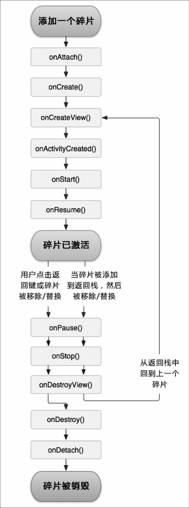

# 第04章 探究碎片

碎片（fragment）是一种可以嵌入在活动当中的UI片段，可以让程序更加合理和充分地应用大屏幕的空间。在平板上应用得非常广泛。

## 碎片的使用

简单用法

1. 新建碎片布局
2. 创建Fragment的子类
3. 在活动中引入碎片

示例：

新建一个左侧碎片布局left_fragment.xml

```xml
<LinearLayout xmlns:android="http://schemas.android.com/apk/res/android"
    android:orientation="vertical" 
    android:layout_width="match_parent"
    android:layout_height="match_parent">
    <Button
        android:id="@+id/button"
        android:layout_width="wrap_content"
        android:layout_height="wrap_content"
        android:layout_gravity="center_horizontal"
        android:text="button"/>
</LinearLayout>
```

新建一个右侧碎片布局right_fragment.xml

```xml
<LinearLayout xmlns:android="http://schemas.android.com/apk/res/android"
    android:orientation="vertical" 
    android:background="#00ff00"
    android:layout_width="match_parent"
    android:layout_height="match_parent">
    <TextView
        android:layout_width="wrap_content"
        android:layout_height="wrap_content"
        android:layout_gravity="center_horizontal"
        android:textSize="20sp"
        android:text="This is right fragment"/>
</LinearLayout>
```

新建一个LeftFragment类继承自Fragment类：

```java
public class LeftFragment extends Fragment {
    @Override
    public View onCreateView(@NonNull LayoutInflater inflater, 
    @Nullable ViewGroup container, @Nullable Bundle savedInstanceState) {
        View view=inflater.inflate(R.layout.left_fragment,container,false);
        //将left_fragment布局动态加载进来
        return view;
    }
}
```

新建一个RightFragment类继承自Fragment类

```java
public class RightFragment extends Fragment {
    @Override
    public View onCreateView(@NonNull LayoutInflater inflater, 
    @Nullable ViewGroup container, @Nullable Bundle savedInstanceState) {
        View view=inflater.inflate(R.layout.right_fragment,container,false);
        //将right_fragment布局动态加载进来
        return view;
    }
}
```

修改Activity_main.xml，通过fragment标签引入碎片

```xml
<?xml version="1.0" encoding="utf-8"?>
<LinearLayout
    xmlns:android="http://schemas.android.com/apk/res/android"
    android:layout_width="match_parent"
    android:layout_height="match_parent"
    >
    <fragment
        android:layout_width="0dp"
        android:layout_height="match_parent"
        android:layout_weight="1"
        android:id="@+id/left_fragment"
        android:name="com.example.fragmenttest.LeftFragment"
        />
    <fragment
        android:layout_width="0dp"
        android:layout_height="match_parent"
        android:layout_weight="1"
        android:id="@+id/right_fragment"
        android:name="com.example.fragmenttest.RightFragment"
        />
</LinearLayout>
```

注意这里我们通过android:name属性来显示指明要添加的碎片类名，类名要把类的包名也加上。

## 动态添加碎片

新建一个another_right_fragment，用于替换右边的碎片

```xml
<LinearLayout xmlns:android="http://schemas.android.com/apk/res/android"
    android:background="#ffff00"
    android:orientation="vertical" 
    android:layout_width="match_parent"
    android:layout_height="match_parent">
    <TextView
        android:layout_width="wrap_content"
        android:layout_height="wrap_content"
        android:layout_gravity="center_horizontal"
        android:textSize="20sp"
        android:text="This is another right fragment"/>
</LinearLayout>
```

新建AnotherRightFragment类

```java
public class AnotherRightFragment extends Fragment {
    @Override
    public View onCreateView(@NonNull LayoutInflater inflater, 
    @Nullable ViewGroup container, @Nullable Bundle savedInstanceState) {
        View view=inflater.inflate(R.layout.another_right_fragment,container,false);
        //将right_fragment布局动态加载进来
        return view;
    }
```

修改activity_main.xml

```xml
<?xml version="1.0" encoding="utf-8"?>
<LinearLayout
    xmlns:android="http://schemas.android.com/apk/res/android"
    android:layout_width="match_parent"
    android:layout_height="match_parent"
    >
    <fragment
        android:layout_width="0dp"
        android:layout_height="match_parent"
        android:layout_weight="1"
        android:id="@+id/left_fragment"
        android:name="com.example.fragmenttest.LeftFragment"
        />
    <FrameLayout
        android:layout_width="0dp"
        android:layout_height="match_parent"
        android:layout_weight="1"
        android:id="@+id/right_fragment"
        />
</LinearLayout>
```

修改MainActivity中的代码

当点击左侧碎片的按钮时，调用replaceFragment()方法将右侧碎片替换成AnotherRighFragment

```java
public class MainActivity extends AppCompatActivity implements View.OnClickListener {
    @Override
    protected void onCreate(Bundle savedInstanceState) {
        super.onCreate(savedInstanceState);
        setContentView(R.layout.activity_main);
        Button button=(Button) findViewById(R.id.button);
        button.setOnClickListener(this);
        replaceFragment(new RightFragment());
    }
    @Override
    public void onClick(View v) {
        switch (v.getId())
        { 
            case R.id.button:
            	replaceFragment(new AnotherRightFragment());//1.创建待添加的碎片实例
                break;
            default:
                break;
        }
    }
    private void replaceFragment(Fragment fragment){
        //2.获取FragmentManager，在活动中调用getSupportFragmentManager()得到
        FragmentManager fragmentManager=getSupportFragmentManager();
        //3.通过调用beginTransaction()开启一个事务
        FragmentTransaction transaction=fragmentManager.beginTransaction();
        //4.向容器内添加或替换碎片，使用replace（）方法，传入iD
        transaction.replace(R.id.right_layout,fragment);//传入要替换的碎片id
        transaction.addToBackStack(null);//模拟返回栈，即不会一按下back键就退出整个程序。
        transaction.commit();//commit()5.方法提交}
}
```

碎片与活动之间的通信：

```java
//通过调用FragmentManager里面的findFragmentById可以获得碎片实例
RightFragment rightFragment=(RightFragment) getSupportFragmentManager().findFragmentById(R.id.right_fragment);
//getActivity()方法可以获取与当前碎片相关联的活动实例
MainActivity activity=(MainActivity)getActivity();
```

## 碎片的生命周期

碎片的4种状态：

运行状态

暂停状态

停止状态

销毁状态

1. onAttach() 碎片和活动建立关联时调用
2. onCreate() 活动第一次被创建时调用
3. onCreateView() 为碎片加载布局时调用
4. onActivityCreated() 确保与碎片相关联的活动一定已经创建完毕时调用
5. onstart() 活动由不可见变为可见时调用
6. onResume() 活动准备好和用户交汇时调用
7. onPause() 系统准备去启动或恢复另一个活动时调用
8. onStop() 活动完全不可见时调用
9. onDestoyView() 与碎片关联的视图被移除时调用
10. onDestory() 活动销毁之前调用
11. onDetach() 碎片和活动解除关联时调用
    




##  动态加载布局

### 使用限定符

如果想让不同屏幕大小的设备都能使用程序并且不用完全重构代码，则只需要加上限定符。
例如：layout布局下的activity_main.xml都是给手机屏幕使用的，如果想要使用大屏幕设备，则只需要在res目录下新建一个目录，名为layout-large，再使用同名的布局名称，修改布局文件，则可以被不同设备使用。
常见的一些限定符：

| 屏幕特征 | 限定符 | 描述                         |
| -------- | ------ | ---------------------------- |
| 大小     | small  | 提供给小屏幕设备的资源       |
|          | normal | 提供给中等屏幕设备的资源     |
|          | large  | 提供给大屏幕屏幕设备的资源   |
|          | xlarge | 提供给超大屏幕设备的资源     |
| 分辨率   | ldpi   | 提供给低分辨率设备的资源     |
|          | mdpi   | 提供给中等分辨率设备的资源   |
|          | hdpi   | 提供给高分辨率设备的资源     |
|          | xhdpi  | 提供给超高分辨率设备的资源   |
|          | xxhdpi | 提供给超超高分辨率设备的资源 |
| 方向     | land   | 提供给横屏设备的资源         |
|          | port   | 提供给竖屏设备的资源         |

### 使用最小宽度限定符

​	如果要明确让屏幕宽度大于600dp的设备使用另一种布局，则只需要加一个目录名为layout-sw600dp，再使用同名的布局名称，修改布局文件，则可以被不同设备使用。
​	
​	

## 碎片的最佳实践

实现一个简易版的可以同时兼容手机和平板的的新闻应用程序

​	对单页模式和双页模式来讲，最大的不同在于单页模式中的新闻列表和新闻内容是存在于两个界面中的，而双页模式的新闻标题和内容界面是存在于一个界面中的，因此在双页模式中必须采用碎片的方式才可以完成。
​	单页模式和双页模式所运行的主界面XML也不同，因此在活动运行的过程中，需要使用最小宽度限定符来解决单页双页的判断问题。

由于编写新闻列表的时候会用到RecyclerView，因此首先需要在app/build.gradle当中添加依赖库

```
implementation 'androidx.recyclerview:recyclerview:1.2.8'
```

### 1.News类

新建一个新闻的实体类

```java
public class News {
    private String title;//新闻标题
    private String content;//新闻内容

    public String getTitle() {
        return title;
    }
    public void setTitle(String title){
        this.title=title;
    }
    public String getContent(){
        return content;
    }
    public void setContent(String content){
        this.content=content;
    }
}
```

### 2.news_content_frag.xml

新建布局文件news_content_frag.xml，用于作为新闻内容的布局

```xml
<RelativeLayout xmlns:android="http://schemas.android.com/apk/res/android"
    android:layout_width="match_parent"
    android:layout_height="match_parent">

    <LinearLayout
        android:id="@+id/visibility_layout"
        android:layout_width="match_parent"
        android:layout_height="match_parent"
        android:orientation="vertical"
        android:visibility="invisible">

        <TextView
            android:id="@+id/news_title"
            android:layout_width="match_parent"
            android:layout_height="wrap_content"
            android:gravity="center"
            android:padding="10dp"
            android:textSize="20sp"/>
        <View
            android:layout_width="match_parent"
            android:layout_height="1dp"
            android:background="@color/black"/>
        <TextView
            android:id="@+id/news_content"
            android:layout_width="match_parent"
            android:layout_height="0dp"
            android:layout_weight="1"
            android:padding="15dp"
            android:textSize="18sp"/>
    </LinearLayout>
    <View
        android:layout_width="1dp"
        android:layout_height="match_parent"
        android:layout_alignParentLeft="true"
        android:background="#000"/>

</RelativeLayout>
```

布局当中用了一个相对布局，最下面的View作用是将新闻列表与新闻(新闻标题和新闻内容)进行分隔开，用一个靠左的竖线分隔开，当然，这里面并未对新闻列表进行布局，单纯的只是对新闻标题和新闻内容进行一个布局，然后新闻标题和新闻内容用一个横线隔开。

### 3.NewsContentFragment

碎片xml布局建立好以后，我们还需要为其建立一个布局加载类，以便将刚才定义的news_content_frag动态加载进来，新建一个NewsContentFragment类，继承自Fragment

```java
public class NewsContentFragment extends Fragment {
    private View view;
    //重写Fragment的onCreateView()方法，在这个方法中通过inflate()将定义的新闻内容布局动态加载进来
    @Override
    public View onCreateView(LayoutInflater inflater, ViewGroup container, Bundle saveInstanceState){
        view=inflater.inflate(R.layout.news_content_frag,container,false);
        return view;
    }

    //将新闻的标题和内容显示在界面上
    public void refresh(String newsTitle,String newsContent){
        //找到新闻内容线性布局id
        View visibilityLayout=view.findViewById(R.id.visibility_layout);
        //设置为布局可见
        visibilityLayout.setVisibility(View.VISIBLE);
        //获取到新闻标题和内容的控件
        TextView newsTitleText=view.findViewById(R.id.news_title);
        TextView newsContentText=view.findViewById(R.id.news_content);
        //将传递进来的标题和内容添加到控件当中去
        newsTitleText.setText(newsTitle);//刷新新闻的标题
        newsContentText.setText(newsContent);//刷新新闻的内容
    }
}
```

### 4.单页模式

按照上面的步骤我们就把新闻内容的碎片和布局都创建好了，但是它都是在双页模式中使用的，如果想在单页模式中使用的话，我们还需要再创建一个活动。右击com.example.fragmentbestpractice包->New->Activity->Empty Activity，新建一个NewsContentActivity，并将布局名指定成news_content，然后修改news_content.xml中的代码

```xml
<LinearLayout xmlns:android="http://schemas.android.com/apk/res/android"
    android:layout_width="match_parent"
    android:layout_height="match_parent"
    android:orientation="vertical">

    <fragment
        android:id="@+id/news_content_fragment"
        android:name="com.example.fragmentbestpractice.NewsContentFragment"
        android:layout_width="match_parent"
        android:layout_height="match_parent"/>
</LinearLayout>
```

修改NewsContentActivity中的代码

```java
public class NewsContentActivity extends AppCompatActivity {

    @Override
    protected void onCreate(Bundle savedInstanceState) {
        super.onCreate(savedInstanceState);
        setContentView(R.layout.news_content);
        String newsTitle=getIntent().getStringExtra("news_title");//获取传入的新闻标题
        String newsContent=getIntent().getStringExtra("news_content");//获取传入的新闻内容
        //在活动中调用碎片的方法，能够在活动中得到相应碎片的实例，然后就可以调用碎片里面的方法
        //这里是获得了碎片单页模式碎片的实例
        //getFragmentManager()所得到的是所在fragment 的父容器的管理器
        NewsContentFragment newsContentFragment=(NewsContentFragment)
                getSupportFragmentManager().findFragmentById(R.id.news_content_fragment);
        //刷新NewsContentFragment界面
        newsContentFragment.refresh(newsTitle,newsContent);
    }

    public static void actionStart(Context context,String newsTitle,String newsContent){
        Intent intent=new Intent(context,NewsContentActivity.class);
        intent.putExtra("news_title",newsTitle);
        intent.putExtra("news_content",newsContent);
        context.startActivity(intent);
    }
}
```

### 5.news_title_frag.xml

接下来还需要在创建一个用于显示新闻列表的布局，新建news_title_frag.xml

```xml
<LinearLayout xmlns:android="http://schemas.android.com/apk/res/android"
    android:layout_width="match_parent"
    android:layout_height="match_parent"
    android:orientation="vertical">

    <android.support.v7.widget.RecyclerView
        android:id="@+id/news_title_recycler_view"
        android:layout_width="match_parent"
        android:layout_height="match_parent"/>
</LinearLayout>
```

新建news_item.xml作为RecyclerView子项的布局

```xml
<TextView xmlns:android="http://schemas.android.com/apk/res/android"
    android:id="@+id/news_title"
    android:layout_width="match_parent"
    android:layout_height="wrap_content"
    android:singleLine="true"
    android:ellipsize="end"
    android:textSize="18sp"
    android:paddingLeft="10dp"
    android:paddingRight="10dp"
    android:paddingTop="15dp"
    android:paddingBottom="15dp"/>
```

新闻列表和子项的布局都已经创建好了，接下来我们就需要一个用于展示新闻列表的地方。新建NewsTitleFragment作为展示新闻列表的碎片。

```java
public class NewsTitleFragment extends Fragment {
	private boolean isTwoPane;
    public View onCreateView(LayoutInflater inflater, ViewGroup container, Bundle savedInstanceState){
        View view=inflater.inflate(R.layout.news_title_frag,container,false);
        RecyclerView recyclerView=(RecyclerView) view.findViewById(R.id.news_title_recycler_view);
        return view;
    }
    public void onActivityCreated(Bundle savedINstanceState){
        super.onActivityCreated(savedINstanceState);
        //获得和碎片相关联的活动的实例
        if(getActivity().findViewById(R.id.news_content_layout)!=null){
            isTwoPane=true;//可以找到news_content_layout布局时，为双页模式
        }else{
            isTwoPane=false;//找不到此布局时为单页模式
        }
    }
}
```

修改activity_main.xml

```xml
<FrameLayout xmlns:android="http://schemas.android.com/apk/res/android"
    android:id="@+id/news_title_layout"
    android:layout_width="match_parent"
    android:layout_height="match_parent">

    <fragment
        android:id="@+id/news_title_fragment"
        android:name="com.shuting.news_fragment.Fragment.NewsTitleFragment"
        android:layout_width="match_parent"
        android:layout_height="match_parent"/>

</FrameLayout>
```

上述代码表示，在单页模式下，只会加载一个新闻标题的碎片

新建layout-sw600dp文件夹，在这个文件夹下再新建一个activity_main.xml

```xml
<LinearLayout xmlns:android="http://schemas.android.com/apk/res/android"
    android:orientation="horizontal"
    android:layout_width="match_parent"
    android:layout_height="match_parent">

    <fragment
        android:id="@+id/news_title_fragment"
        android:name="com.example.fragmentbestpractice.NewsTitleFragment"
        android:layout_width="0dp"
        android:layout_height="match_parent"
        android:layout_weight="1"/>
    
	<FrameLayout
    	android:id="@+id/news_content_layout"
    	android:layout_width="0dp"
    	android:layout_height="match_parent"
         android:layout_weight="3">

        <fragment
            android:id="@+id/news_content_fragment"
            android:name="com.example.fragmentbestpractice.NewsContentFragment"
            android:layout_width="match_parent"
            android:layout_height="match_parent"/>
	</FrameLayout>
    
</LinearLayout>
```

在双页模式我们同时引入了两个碎片，并将新闻内容的碎片放在了一个FrameLayout布局下。

为了在NewsTitleFragment中通过RecyclerView将新闻列表展示出来。我们在NewsTitleFragment中新建一个内部类NewsAdapter来作为RecyclerView的适配器

```java
public class NewsTitleFragment extends Fragment {
    private boolean isTwoPane;
	//...
	
    class NewsAdapter extends RecyclerView.Adapter<NewsAdapter.ViewHolder>{
		private List<News> mNewsList；
        
        class ViewHolder extends RecyclerView.ViewHolder{
            TextView newsTitleText;

            public ViewHolder(View view){
                super(view);
                newsTitleText=(TextView)view.findViewById(R.id.news_title);
            }
        }
		
		public NewsAdapter(List<News> newsList){
			mNewsList=newsList
		}
		
		@Override
		public ViewHolder onCreateViewHolder(ViewGroup parent,int viewType){
			View view=LayoutInflater.from(parent.getContext())
					.inflate(R.layout.news_item,parent,false);
			final ViewHolder holder=new ViewHolder(view);
			view.setOnClickListener(new View.OnClickListener() {
				@Override
				public void onClick(View v) {
					News news=mNewsList.get(holder.getAdapterPosition());
					if(isTwoPane){
						//如果是双页模式，则刷新NewsContentFragment中的内容
						NewsContentFragment newsContentFragment=
								(NewsContentFragment)getFragmentManager()
								.findFragmentById(R.id.news_content_fragment);
						newsContentFragment.refresh(news.getTitle(),news.getContent());
					}else{
						//如果是单页模式，则直接启动NewsContentActivity
						//采用getActivity()来得到和当前碎片相关联的活动实例
						NewsContentActivity.actionStart(getActivity(),news.getTitle(),news.getContent());
					}
				}
			});
			return holder;
		}
		
		@Override
		public void onBindViewHolder(ViewHolder holder,int position){
			News news = mNewsList.getPosition(position);
			holder.newsTitleText.setText(news.getTitle);
		}
		
		@Override
		public int getItemCount() {
			return mNewsList.size();
		}
}
```

向RecycleView中填充数据，修改NewsTitleFragment

```java
public class NewsTitleFragment extends Fragment {
    private boolean isTwoPane;
	//...
	
	public View onCreateView(LayoutInflater inflater, ViewGroup container, Bundle savedInstanceState){
        View view=inflater.inflate(R.layout.news_title_frag,container,false);
        //获取RecyclerView实例
        RecyclerView newsTitleRecycler=(RecyclerView) view.findViewById(R.id.news_title_recycler_view);
        LinearLayoutManager layoutManager=new LinearLayoutManager(getActivity());
        recyclerView.setLayoutManager(layoutManager);
        NewsAdapter adapter=new NewsAdapter(getNews());
        recyclerView.setAdapter(adapter);
        return view;
    }
	
	public List<News> getNews(){
        List<News> newList = new ArrayList<>();
		for(int i=1;i<=50;i++){
			News news=new News();
			news.setTitle("This is news title"+i);
			news.setContent(getRandomLengthContent("This is news content"+i+"."));
			newsList.add(news);
		}
        return newList;
    }
    private String getRandomLengthContent(String content){
        Random random=new Random();
        int length=random.nextInt(20)+1;//长度为1-20
        StringBuilder builder=new StringBuilder();
        for(int i=0;i<length;i++){
            builder.append(content);
        }
        return builder.toString();
    }

}
```

