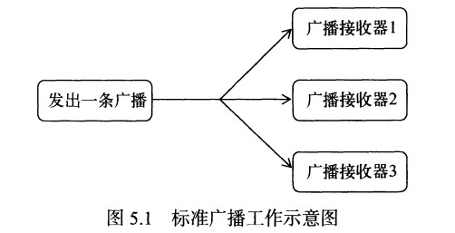
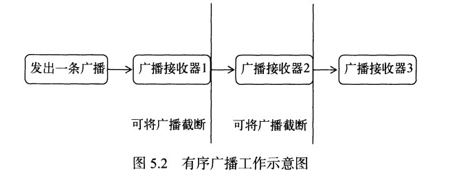

# 第05章 详解广播机制

## 5.1  新建广播机制简介

Android中的广播主要分为两种类型：标准广播和有序广播。

**标准广播**(Normal broadcasts)是一种完全异步执行的广播，在广播发出之后，所有的广播接收器几乎都会在同一时刻接收到这条广播消息，因此它们之间没有任何先后顺序可言。这种广播的效率会比较高，但同时也意味着它是**无法被截断的**

特点：广播效率高、没有任何先后顺序、无法被拦截



**有序广播**( Ordered broadcasts)是一种同步执行的广播，在广播发出之后，同一时刻只会有一个广播接收器能够收到这条广播消息，当这个广播接收器中的逻辑执行完毕后，广播才会继续传递。所以此时的广播接收器是有先后顺序的，优先级高的广播接收器就可以先收到广播消息，并且前面的广播接收器还**可以截断正在传递的广播**，这样后面的广播接收器就无法收到广播消息了。

特点：广播接收器有先后顺序，优先级高的广播接收器先收到广播消息，可以被优先级高的广播接收器拦截。



## 5.2  接收系统广播

Android 内置了很多系统级别的广播，我们可以在应用程序中通过监听这些广播来得到系统状态信息。例如：

- 开机广播
- 电池电量发生变化广播
- 时间或时区发生改变广播

### 动态注册监听网络变化

广播接收器可以自由地对自己感兴趣的广播进行注册。注册的方式有两种：

- 代码中注册（也称为动态注册）
- AndroidManifest.xml中注册（也称为静态注册）

Q:如何创建一个广播接收器呢?
其实只需要新建一个类，让它继承自Broadcast-Receiver，并重写父类的 onReceive()方法就行了。这样当有广播到来时,onReceive()方法就会得到执行。

动态注册示例（监听网络变化）

新建一个BroadcastTest，修改MainActivity中的代码

```java
public class MainActivity extends AppCompatActivity {

    private IntentFilter intentFilter;

    private NetworkChangeReceiver networkChangeReceiver;

    @Override
    protected void onCreate(Bundle savedInstanceState) {
        super.onCreate(savedInstanceState);
        setContentView(R.layout.activity_main);
        intentFilter = new IntentFilter();
        //创建了IntentFilter的实例，添加值为"android.net.conn.CONNECTIVITY_CHANGE"的action
        //因为当网络状态发生变化的时候，系统发出的正是一条值为"android.net.conn.CONNECTIVITY_CHANGE"
        //也就是说我们广播接收器要监听什么广播，就要添加相应的action
        intentFilter.addAction("android.net.conn.CONNECTIVITY_CHANGE");
        networkChangeReceiver = new NetworkChangeReceiver();
        registerReceiver(networkChangeReceiver,intentFilter);
    }

    @Override
    protected void onDestroy() {
        super.onDestroy();
        unregisterReceiver(networkChangeReceiver);
    }
    //定义了一个内部类，每当网络发生变化的时候，就会调用onReceive方法；
    class NetworkChangeReceiver extends BroadcastReceiver{

        @Override
        public void onReceive(Context context, Intent intent){
            //系统服务类，专门用于管理网络连接
            ConnectivityManager connectivityManager = (ConnectivityManager)getSystemService(Context.CONNECTIVITY_SERVICE);
            NetworkInfo networkInfo = connectivityManager.getActiveNetworkInfo();
            if (networkInfo != null && networkInfo.isAvailable()){
                Toast.makeText(context,"network is available",Toast.LENGTH_SHORT).show();
            }else {
                Toast.makeText(context,"network is unavailable",Toast.LENGTH_SHORT).show();
        }
    }

}
```

在onCreate()方法中：

1. 创建一个IntentFilter的实例添加一个值为 android.net.conn.CONNECTIVITY_CHANGE的action，当网络状态发生变化时,系统发出的正是一条值为 android.net.conn.CONNECTIVITY_CHANGE的广播，也就是说广播接收器想要监听什么广播，就在这添加相应的action。
2. 接下来创建一个NetworkChangeReceiver 的实例，然后调用registerReceiver()方法进行注册，将NetworkChangeReceiver的实例和IntentFilter的实例都传进去。
3. 通过getSystemService()方法得到了ConnectivityManager的实例，这是一个系统服务类，专门用于管理网络连接的。调用它的getActiveNetworkInfo()方法可以得到NetworkInfo的实例，接着调用NetworkInfo的isAvailable()方法，就可以判断出当前是否有网络了，最后我们还是通过Toast的方式对用户进行提示。
4. 动态注册的广播接收器一定都要取消注册，在onDestroy()方法中调用unregisterReceiver()方法实现。

Android系统为了保护用户设备的安全隐私，做了严格的规定：如果程序需要进行一些对用户来说比较敏感的操作，就必须在配置文件中声明权限才可以，否则程序将直接崩溃。比如这里系统的网络状态就是需要声明的，打开AndroidManifest.xml文件，在里面加入以下权限就可以访问系统网络状态了

```xml
<manifest xmlns:android="http://schemas.android.com/apk/res/android">
	<uses-permission android:name="android.permission.ACCESS_NETWORK_STATE" />
	<!--...-->
</manifest>
```

### 静态注册实现开机启动

如果想要在程序未启动的时候就接收到广播，就需要使用静态注册。

使用Android Studio的快捷方式创建广播接收器，右击com.example.broadcasttest包–>New–>Other–>Broadcast Receiver，将广播接收器命名为BootCompleteReceiver，在之后弹出的窗口中，Exported属性表示是否允许广播接收器接收本程序之外的广播，Enabled属性表示是否启用这个广播接收器。勾选这两个属性，点击Finish完成创建

修改BootCompleteReceiver中的代码

```java
public class BootCompleteReceiver extends BroadcastReceiver {
    @Override
    public void onReceive(Context context, Intent intent) {
        Toast.makeText(context,"Boot Complete",Toast.LENGTH_SHORT).show();
    }
}
```

由于我们的广播接收器使用的是Android studio的快捷方式创建的，所以会自动在配置文件中对广播接收器进行注册。打开AndroidManifest.xml文件，代码如下

```xml
<receiver
    android:name=".BootCompleteReceiver"
    android:enabled="true"
    android:exported="true">
</receiver>
```

不过目前BootCompleteReceiver还是不能接收到开机广播的。由于在Android系统启动完成后会发出一个值为android.intent.action.BOOT_COMPLETED的广播。因此我们需要在< intent-filter>标签中添加相应的action。除此之外，系统开机广播也是需要权限的，需要添加android.permission.RECEIVE_BOOT_COMPLETED权限。

修改AndroidManifest.xml

```xml
<manifest xmlns:android="http://schemas.android.com/apk/res/android"
    xmlns:tools="http://schemas.android.com/tools">
    <uses-permission android:name="android.permission.ACCESS_NETWORK_STATE" />
    <uses-permission android:name="android.permission.RECEIVE_BOOT_COMPLETED" />  <!--添加android.permission.RECEIVE_BOOT_COMPLETED权限-->

    <application
        android:allowBackup="true"
        android:dataExtractionRules="@xml/data_extraction_rules"
        android:fullBackupContent="@xml/backup_rules"
        android:icon="@mipmap/ic_launcher"
        android:label="@string/app_name"
        android:supportsRtl="true"
        android:theme="@style/Theme.BroadcastTest"
        tools:targetApi="31">
	    <!--...-->
        <receiver
            android:name=".BootCompleteReceiver"
            android:enabled="true"
            android:exported="true">
             <!--在< intent-filter>标签中添加相应的action-->
            <intent-filter>
                <action android:name="android.intent.action.BOOT_COMPLETED" />
            </intent-filter>
        </receiver>
    </application>

</manifest>
```

## 5.3  发送自定义广播

#### 发送标准广播

新建一个广播接收器MyBroadcaseReceiver

```java
public class MyBroadcastReceiver extends BroadcastReceiver {

    @Override
    public void onReceive(Context context, Intent intent) {
        Toast.makeText(context, "received in MyBroadcastReceiver", Toast.LENGTH_SHORT).show();
    }
}
```

修改AndroidManifest.xml，在application标签中添加如下代码

```xml
<!--这里我们让MyBroadcastReceiver接收一条值为com.example.broadcasttest.MY_BROADCAST的广播。-->
<receiver
	android:name=".MyBroadcastReceiver"
	android:enabled="true"
	android:exported="true">
	<intent-filter>
		<action android:name="com.example.broadcasttest.MY_BROADCAST"/>
	</intent-filter>
</receiver>
```

修改activity_main.xml

```xml
<LinearLayout xmlns:android="http://schemas.android.com/apk/res/android"
    android:orientation="vertical"
    android:layout_width="match_parent"
    android:layout_height="match_parent">

    <Button
        android:id="@+id/button"
        android:layout_width="match_parent"
        android:layout_height="wrap_content"
        android:text="Send Broadcast"/>
</LinearLayout>
```

修改MainActivity.java

```java
@Override
protected void onCreate(Bundle savedInstanceState) {
	super.onCreate(savedInstanceState);
	setContentView(R.layout.activity_main);
	Button button = (Button) findViewById(R.id.button);
	button.setOnClickListener(new View.OnClickListener() {
		@Override
		public void onClick(View view) {
			Intent intent = new Intent("com.example.broadcasttest.MY_BROADCAST");
             //调用Context的sendBroadcast()方法将广播器发送出去
			sendBroadcast(intent);
		}
	});
}
```

#### 发送有序广播

广播是一种可以跨进程的通信方式，因此我们在应用程序内发出的广播，其他的应用程序应该是可以收到的。

新建一个BroadcastTest2项目，定义一个广播接收器，用于接收上一小节的自定义广播

```java
public class AnotherBroadcastReceiver extends BroadcastReceiver {

    @Override
    public void onReceive(Context context, Intent intent) {
        Toast.makeText(context, "received in AnotherBroadcastReceiver", Toast.LENGTH_SHORT).show();
    }
}
```

修改AndroidMenifest.xml

```xml
<manifest xmlns:android="http://schemas.android.com/apk/res/android"
    package="com.example.broadcasttest2">

    <application
        android:allowBackup="true"
        android:icon="@mipmap/ic_launcher"
        android:label="@string/app_name"
        android:supportsRtl="true"
        android:theme="@style/Theme.BroadcastTest2">
        <receiver
            android:name=".AnotherBroadcastReceiver"
            android:enabled="true"
            android:exported="true">

            <intent-filter>
                <action android:name="com.example.broadcasttest.MY_BROADCAST"/>
            </intent-filter>
        </receiver>

        <activity android:name=".MainActivity">
            <intent-filter>
                <action android:name="android.intent.action.MAIN" />
                <category android:name="android.intent.category.LAUNCHER" />
            </intent-filter>
        </activity>
    </application>

</manifest>
```

这样AnotherBroadcastReceiver同样可以接收到com.example.broadcasttest.MY_BROADCAST的广播。不过现在程序里发出的都还是标准广播。

发送有序广播只需要改动一行代码，即将sendBroadcast()方法改成sendOrderBroadcast方法。

修改BroadcastTest项目的MainActivity中的代码

```java
@Override
public void onClick(View view) {
	Intent intent = new Intent("com.example.broadcasttest.MY_BROADCAST");
	sendOrderedBroadcast(intent,null);
}
```

sendOrderedBroadcast()方法接受两个参数，第一个参数是Intent，第二个参数是一个与权限相关的字符串，一般传入null就行

设置广播接收器的先后顺序，修改AndroidManifest.xml

```xml
<intent-filter android:priority="100">
	<action android:name="com.example.broadcasttest.MY_BROADCAST"/>
</intent-filter>
```

通过android:priority属性给广播接收器设置了优先级，优先级比较高的接收器就可以先收到广播

截断广播

修改MyBroadcastReceiver，调用abortBroadcast()函数选择是否允许广播继续传递。

```java
public class MyBroadcastReceiver extends BroadcastReceiver{
	@Override
	public void onReceive(Context context,Intent intent){
		Toast.makeText(context,"received in MyBroadcastReceiver",Toast.LENGTH_SHORT).show();
		abortBroadcast();
	}
}
```

## 5.4  使用本地广播

主要是使用了localBroadcastManager来对广播进行管理，并提供了发送广播和注册广播接收器的方法。

修改MainActivity中的代码

```java
public class MainActivity extends AppCompatActivity {

    private IntentFilter intentFilter;

    private LocalReceiver localReceiver;

    private LocalBroadcastManager localBroadcastManager;

    @Override
    protected void onCreate(Bundle savedInstanceState) {
        super.onCreate(savedInstanceState);
        setContentView(R.layout.activity_main);
        //获取LocalBroadcastManager实例
        localBroadcastManager = LocalBroadcastManager.getInstance(this);
        Button button = (Button) findViewById(R.id.button);
        button.setOnClickListener(new View.OnClickListener() {
            @Override
            public void onClick(View view) {
                Intent intent = new Intent("com.example.broadcasttest.LOCAL_BROADCAST");
                localBroadcastManager.sendBroadcast(intent);  //发送本地广播
            }
        });
        intentFilter = new IntentFilter();
        intentFilter.addAction("com.example.broadcasttest.LOCAL_BROADCAST");
        localReceiver = new LocalReceiver();
        localBroadcastManager.registerReceiver(localReceiver,intentFilter);  //注册本地广播监听器
    }

    @Override
    protected void onDestroy(){
        super.onDestroy();
        localBroadcastManager.unregisterReceiver(localReceiver);
    }

    class LocalReceiver extends BroadcastReceiver{
        @Override
        public void onReceive(Context context,Intent intent){
            Toast.makeText(context,"received local broadcast",Toast.LENGTH_SHORT).show();
        }
    }

}
```

## 5.5  实现强制下线功能

新建一个ActivityCollector类用于管理所有的活动，代码如下

```java
public class ActivityCollector {
    public static List<Activity> activities = new ArrayList<>();

    public static void addActivity(Activity activity){
        activities.add(activity);
    }

    public static void removeActivity(Activity activity){
        activities.remove(activity);
    }

    public static void finishAll(){
        for(Activity activity : activities){
            if(!activity.isFinishing()){
                activity.finish();
            }
        }
    }

}
```

创建BaseActivity类作为所有活动的父类

```java
public class BaseActivity extends AppCompatActivity {
    @Override
    protected void onCreate( Bundle savedInstanceState) {
        super.onCreate(savedInstanceState);
        ActivityCollector.addActivity(this);
    }

    @Override
    protected void onDestroy() {
        super.onDestroy();
        ActivityCollector.removeActivity(this);
    }
}
```

新建LoginActivity，编辑布局文件activity_login.xml，代码如下

```xml
<LinearLayout xmlns:android="http://schemas.android.com/apk/res/android"
    android:layout_width="match_parent"
    android:layout_height="match_parent"
    android:orientation="horizontal">

    <LinearLayout
        android:orientation="horizontal"
        android:layout_width="match_parent"
        android:layout_height="60dp" >

        <TextView
            android:layout_width="90dp"
            android:layout_height="wrap_content"
            android:layout_gravity="center_vertical"
            android:textSize="18sp"
            android:text="Account:" />

        <EditText
            android:id="@+id/account"
            android:layout_width="0dp"
            android:layout_height="wrap_content"
            android:layout_weight="1"
            android:layout_gravity="center_vertical"/>

    </LinearLayout>

    <LinearLayout
        android:orientation="horizontal"
        android:layout_width="match_parent"
        android:layout_height="60dp">

        <TextView
            android:layout_width="90dp"
            android:layout_height="wrap_content"
            android:layout_gravity="center_vertical"
            android:textSize="18sp"
            android:text="Password:" />

        <EditText
            android:id="@+id/password"
            android:layout_width="0dp"
            android:layout_height="wrap_content"
            android:layout_weight="1"
            android:layout_gravity="center_vertical"
            android:inputType="textPassword"/>

    </LinearLayout>

    <Button
        android:id="@+id/login"
        android:layout_width="match_parent"
        android:layout_height="60dp"
        android:text="Login"/>

</LinearLayout>
```

修改LoginActivity中的代码

```java
public class LoginActivity extends BaseActivity {

    private EditText accountEdit;

    private EditText passwordEdit;

    private Button login;

    @Override
    protected void onCreate(Bundle savedInstanceState) {
        super.onCreate(savedInstanceState);
        setContentView(R.layout.activity_login);
        accountEdit = (EditText) findViewById(R.id.account);
        passwordEdit = (EditText) findViewById(R.id.password);
        login = (Button) findViewById(R.id.login);
        login.setOnClickListener(new View.OnClickListener() {
            @Override
            public void onClick(View view) {
                String account = accountEdit.getText().toString();  //获取编辑框的文字
                String password = passwordEdit.getText().toString();
                if(account.equals("admin") && password.equals("123456")){
                    Intent intent = new Intent(LoginActivity.this,MainActivity.class);
                    startActivity(intent);
                    finish();
                }else{
                    Toast.makeText(LoginActivity.this,"账号或密码错误",Toast.LENGTH_SHORT).show();
                }
            }
        });
    }
}
```

修改activity_main中的代码

```xml
<LinearLayout xmlns:android="http://schemas.android.com/apk/res/android"
    android:orientation="vertical"
    android:layout_width="match_parent"
    android:layout_height="match_parent">

    <Button
        android:id="@+id/force_offline"
        android:layout_width="match_parent"
        android:layout_height="wrap_content"
        android:text="Send force offline broadcast" />

</LinearLayout>
```

修改MainActivity

```java
public class MainActivity extends BaseActivity {

    @Override
    protected void onCreate(Bundle savedInstanceState) {
        super.onCreate(savedInstanceState);
        setContentView(R.layout.activity_main);
        Button forceOffline = (Button) findViewById(R.id.force_offline);
        forceOffline.setOnClickListener(new View.OnClickListener() {
            @Override
            public void onClick(View view) {
                Intent intent = new Intent("com.example.broadcastbestpractice.FORCE_OFFLINE");
                sendBroadcast(intent);
            }
        });
    }
}
```

修改BaseActivity中的代码，为所有活动动态注册一个广播接收器

```java
public class BaseActivity extends AppCompatActivity {

    private ForceOfflineReceiver receiver;

    @Override
    protected void onCreate( Bundle savedInstanceState) {
        super.onCreate(savedInstanceState);
        ActivityCollector.addActivity(this);
    }

    @Override
    protected void onResume() {
        super.onResume();
        IntentFilter intentFilter = new IntentFilter();
        intentFilter.addAction("com.example.broadcastbestpractice.FORCE_OFFLINE");
        receiver = new ForceOfflineReceiver();
        registerReceiver(receiver,intentFilter);
    }

    @Override
    protected void onPause() {
        super.onPause();
        if(receiver != null){
            unregisterReceiver(receiver);
        }
    }

    @Override
    protected void onDestroy() {
        super.onDestroy();
        ActivityCollector.removeActivity(this);
    }

    private class ForceOfflineReceiver extends BroadcastReceiver {
        @Override
        public void onReceive(final Context context, Intent intent) {
            AlertDialog.Builder builder = new AlertDialog.Builder(context);
            builder.setTitle("Warning");
            builder.setMessage("您已下线，请重新登陆！");
            builder.setCancelable(false);
            builder.setPositiveButton("OK", new DialogInterface.OnClickListener() {
                @Override
                public void onClick(DialogInterface dialogInterface, int i) {
                    ActivityCollector.finishAll();  //销毁所有活动
                    Intent intent = new Intent(context,LoginActivity.class);
                    context.startActivity(intent); //重新启动LoginActivity
                }
            });
            builder.show();
        }
    }
}
```

修改AndroidManifest.xml，将主活动设置为LoginActivity

```xml
<activity
	android:name=".LoginActivity"
	android:exported="true" >
	<intent-filter>
		<action android:name="android.intent.action.MAIN" />
		<category android:name="android.intent.category.LAUNCHER" />
	</intent-filter>
</activity>

<activity
	android:name=".MainActivity"
	android:exported="false">
</activity>
```

