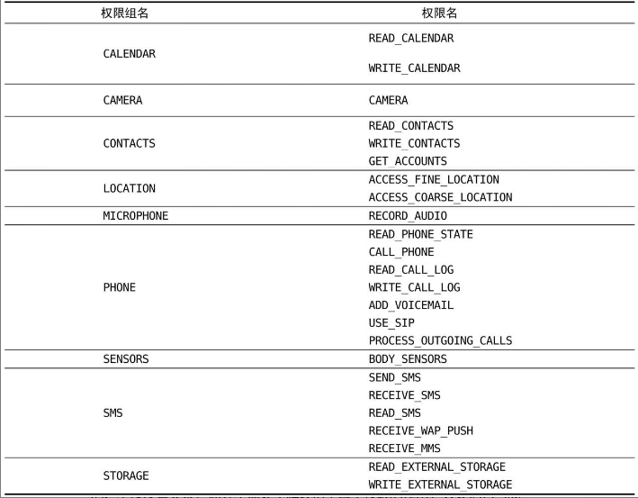
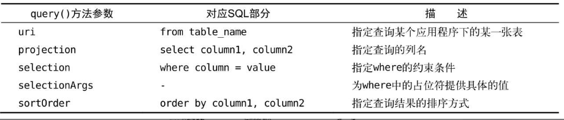

# 第07章  内容提供器

在上一章中我们学了Android数据持久化的技术，包括文件存储、SharedPreferences存储以及数据库存储。使用这些持久化技术所保存的数据都只能在当前应用程序中访问。

虽然文件和SharedPreferences存储中提供了`MODE_WORLD_READABLE`和`MODE_WORLD_WRITEABLE`这两种操作模式，用于供给其他的应用程序访问当前应用的数据，但这两种模式在**Android 4.2**版本中都已被废弃了。原因是Android官方已经不再推荐使用这种方式来实现跨程序数据共享的功能，而是应该使用更加安全可靠的内容提供器技术。

## 内容提供器简介

内容提供器（Content Provider）主要用于在不同的应用程序之间实现数据共享的功能，它提供了一套完整的机制，允许一个程序访问另一个程序中的数据，同时还能保证被访数据的安全性。

目前，使用内容提供器是Android实现跨程序共享数据的标准方式。不同于文件存储和SharedPreferences存储中的两种全局可读写操作模式，**内容提供器可以选择只对哪一部分数据进行共享，从而保证我们程序中的隐私数据不会有泄漏的风险。**

不过在正式开始学习内容提供器之前，我们需要先掌握另外一个非常重要的知识——**Android运行时权限**，因为待会的内容提供器示例中会使用到运行时权限的功能。

## 运行时权限

Android的权限机制，从系统的第一个版本开始就已经存在了。但其实之前Android的权限机制在保护用户安全和隐私等方面起到的作用比较有限，尤其是一些大家都离不开的常用软件，非常容易“店大欺客”。为此，Android开发团队在Android 6.0系统中引用了运行时权限这个功能，从而更好地保护了用户的安全和隐私。

### Android权限机制详解

首先来回顾一下过去Android的权限机制是什么样的。在第5章写BroadcastTest项目的时候第一次接触了Android权限相关的内容，当时为了要访问系统的网络状态以及监听开机广播，于是在AndroidManifest.xml文件中添加了这样两句权限声明：

```xml
<manifest xmlns:android="http://schemas.android.com/apk/res/android"
    package="com.example.broadcasttest">
    <uses-permission android:name="android.permission.ACCESS_NETWORK_STATE" />
    <uses-permission android:name="android.permission.RECEIVE_BOOT_COMPLETED" />
    ...
</manifest>
```

因为访问系统的网络状态以及监听开机广播涉及了用户设备的安全性，因此必须在AndroidManifest.xml中加入权限声明，否则我们的程序就会崩溃。

前面提到很多我们常用的软件“店大欺客”，普遍存在着滥用权限的情况，也就是不管到底用不用得到，反正先把权限申请了再说。为此Android开发团队在6.0系统中加入了运行时权限功能。也就是说，用户不需要在安装软件的时候一次性授权所有申请的权限，而是可以在软件的使用过程中再对某一项权限申请进行授权。比如说一款相机应用在运行时申请了地理位置定位权限，就算我拒绝了这个权限，但是我应该仍然可以使用这个应用的其他功能，而不是像之前那样直接无法安装它。

当然，并不是所有权限都需要在运行时申请，对于用户来说，不停地授权也很烦琐。

Android现在将所有的权限归成了两类，一类是**普通权限**，一类是**危险权限**。准确地讲，其实还有第三类**特殊权限**，不过这种权限使用得很少，我们在此先不进行讨论。

- **普通权限：**指的是那些不会直接威胁到用户的安全和隐私的权限，对于这部分权限申请，系统会自动帮我们进行授权，而不需要用户再去手动操作了，比如在BroadcastTest项目中申请的两个权限就是普通权限。
- **危险权限：**则表示那些可能会触及用户隐私或者对设备安全性造成影响的权限，如获取设备联系人信息、定位设备的地理位置等，对于这部分权限申请，必须要由用户手动点击授权才可以，否则程序就无法使用相应的功能。

下表列出了Android中所有的危险权限，一共是9组24个权限。



除了危险权限之外，剩余的就都是普通权限了。

需要注意的是，表格中每个危险权限都属于一个权限组，我们在进行运行时权限处理时使用的是权限名，但是用户一旦同意授权了，那么该权限所对应的权限组中所有的其他权限也会同时被授权。

### 在程序运行时申请权限

新建一个RuntimePermissionTest项目，使用`CALL_PHONE`权限作为示例来展示如何在程序运行时申请权限。

`CALL_PHONE`这个权限是编写拨打电话功能的时候需要声明的，因为拨打电话会涉及用户手机的资费问题，因而被列为了危险权限。

修改activity_main.xml布局文件

```xml
<LinearLayout xmlns:android="http://schemas.android.com/apk/res/android"
    android:layout_width="match_parent"
    android:layout_height="match_parent">

    <Button
        android:id="@+id/make_call"
        android:layout_width="match_parent"
        android:layout_height="wrap_content"
        android:text="Make Call"/>
</LinearLayout>
```

修改MainActivity中的代码

```java
public class MainActivity extends AppCompatActivity {

    @Override
    protected void onCreate(Bundle savedInstanceState) {
        super.onCreate(savedInstanceState);
        setContentView(R.layout.activity_main);
        Button makeCall = (Button) findViewById(R.id.make_call);
        makeCall.setOnClickListener(new View.OnClickListener() {
            @Override
            public void onClick(View v) {
                //判断用户是否已经给过我们授权了
                if(ContextCompat.checkSelfPermission(MainActivity.this,android.Manifest.
                        permission.CALL_PHONE)!= PackageManager.PERMISSION_GRANTED){
                    ActivityCompat.requestPermissions(MainActivity.this,new String[]{android.Manifest.permission.CALL_PHONE},1);
                }else{
                    call();
                }
            }
        });
    }
    
    private void call(){
        try{
            Intent intent = new Intent(Intent.ACTION_CALL);
            intent.setData(Uri.parse("tel:10086"));
            startActivity(intent);
        }catch(SecurityException e){
            e.printStackTrace();
        }
    }

    @Override
    public void onRequestPermissionsResult(int requestCode,String[] permissions,int [] grantResult) {
        switch (requestCode) {
            case 1:
                if (grantResult.length > 0 && grantResult[0] == PackageManager.PERMISSION_GRANTED) {
                    call();
                } else {
                    Toast.makeText(this, "You denied the permission", Toast.LENGTH_SHORT).show();
                }
                break;
            default:
        }
    }
}
```

`ContextCompat.checkSelfPermission()`方法接收两个参数，第一个参数是Context，第二个参数是具体的权限名，比如打电话的权限名就是`Manifest.permission.CALL_PHONE`，然后我们使用方法的返回值和`PackageManager.PERMISSION_GRANTED`做比较，相等就说明用户已经授权，不等就表示用户没有授权。

- 如果已经授权的话就简单了，直接去执行拨打电话的逻辑操作就可以了，这里我们把拨打电话的逻辑封装到了call()方法当中。
- 如果没有授权的话，则需要调用`ActivityCompat.requestPermissions()`方法来向用户申请授权，`requestPermissions()`方法接收3个参数，第一个参数要求是Activity的实例，第二个参数是一个String数组，我们把要申请的权限名放在数组中即可，第三个参数是请求码，只要是唯一值就可以了，这里传入了1。

调用完了`requestPermissions()`方法之后，系统会弹出一个权限申请的对话框，然后用户可以选择同意或拒绝我们的权限申请，不论是哪种结果，最终都会回调到`onRequestPermissionsResult()`方法中，而授权的结果则会封装在grantResults参数当中。这里我们只需要判断一下最后的授权结果，如果用户同意的话就调用call()方法来拨打电话，如果用户拒绝的话我们只能放弃操作，并且弹出一条失败提示。

用户随时都可以将授予程序的危险权限进行关闭，只需要打开设置->应用，找到你想要关闭权限的应用，点进去关闭权限即可。

## 访问其他程序中的数据

内容提供器的用法一般有两种：

- 一种是使用现有的内容提供器来读取和操作相应程序中的数据。
- 一种是创建自己的内容提供器给我们程序的数据提供外部访问接口。

如果一个应用程序通过内容提供器对其数据提供了外部访问接口，那么任何其他的应用程序就都可以对这部分数据进行访问。

Android系统中自带的电话簿、短信、媒体库等程序都提供了类似的访问接口，这就使得第三方应用程序可以充分地利用这部分数据来实现更好的功能。下面我们就来看一看，内容提供器到底是如何使用的。

### ContentResolver的基本用法

对于每一个应用程序来说，如果想要访问内容提供器中共享的数据，就一定要借助`ContentResolver`类，可以通过Context中的`getContentResolver()`方法获取到该类的实例。

`ContentResolver`中提供了一系列的方法用于对数据进行CRUD操作，其中insert()方法用于添加数据，update()方法用于更新数据，delete()方法用于删除数据，query()方法用于查询数据。

不同于`SQLiteDatabase`, `ContentResolver`中的增删改查方法都是不接收表名参数的，而是使用一个Uri参数代替，这个参数被称为内容URI。

内容URI给内容提供器中的数据建立了唯一标识符，它主要由两部分组成：**authority**和**path**。

- authority是用于对不同的应用程序做区分的，一般为了避免冲突，都会采用程序包名的方式来进行命名。比如某个程序的包名是`com.example.app`，那么该程序对应的authority就可以命名为`com.example.app.provider`。
- path则是用于对同一应用程序中不同的表做区分的，通常都会添加到authority的后面。比如某个程序的数据库里存在两张表：table1和table2，这时就可以将path分别命名为/table1和/table2，然后把authority和path进行组合，内容URI就变成了`com.example.app.provider/table1`和`com.example.app.provider/table2`。

不过，目前还很难辨认出这两个字符串就是两个内容URI，我们还需要在字符串的头部加上协议声明。因此，内容URI最标准的格式写法如下：

```
content://com.example.app.provider/table1
content://com.example.app.provider/table2
```

内容URI可以非常清楚地表达出我们想要访问哪个程序中哪张表里的数据。也正是因此，ContentResolver中的增删改查方法才都接收Uri对象作为参数，因为如果使用表名的话，系统将无法得知我们期望访问的是哪个应用程序里的表。

在得到了内容URI字符串之后，我们还需要将它解析成Uri对象才可以作为参数传入。解析的方法也相当简单，代码如下所示：

```java
Uri uri = Uri.parse("content://com.example.app.provider/table1")
```

只需要调用Uri.parse()方法，就可以将内容URI字符串解析成Uri对象了。

**使用ContentResolver实现增删改查**

**查询数据**

**ContentResolver的query()方法**

使用上文的Uri对象来查询table1表中的数据，代码如下所示：

```java
Cursor cursor = getContentResolver().query(
		uri,
		projection,
		selection,
		selectionArgs,
		sortOrder);
```

这些参数和SQLiteDatabase中query()方法里的参数很像，但总体来说要简单一些，毕竟这是在访问其他程序中的数据，没必要构建过于复杂的查询语句。下表对使用到的这部分参数进行了详细的解释。



查询完成后返回的仍然是一个Cursor对象，这时就可以将数据从Cursor对象中逐个读取出来了。读取的思路仍然是通过移动游标的位置来遍历Cursor的所有行，然后再取出每一行中相应列的数据，代码如下所示：

```java
if (cursor != null) {
    while (cursor.moveToNext()) {
        String column1 = cursor.getString(cursor.getColumnIndex("column1"));
        int column2 = cursor.getInt(cursor.getColumnIndex("column2"));
    }
    cursor.close();
}
```

**添加数据**

**ContentResolver的insert()方法**

向table1表中添加一条数据，代码如下所示：

```java
ContentValues values = new ContentValues();
values.put("column1","text");
values.put("column2",1);
getContentResolver().insert(uri,values);
```

**更新数据**

**ContentResolver的update()方法**

更新刚刚添加的数据，把column1的值清空

```java
ContentValues values = new ContentValues();
values.put("column1","");
getContentResolver().update(uri,values,"column1 = ? and column2 = ? ",new String[] {"text","1"});
```

删除数据

**ContentResolver的delete()方法**

```java
getContentResolver().delete(uri,"column2 = ? ",new String[] {"1"});
```

### 实战——读取系统联系人

先在电话簿手动添加两个联系人；新建一个ContactsTest项目

修改activity_main.xml中的代码

```xml
<?xml version="1.0" encoding="utf-8"?>
<LinearLayout xmlns:android="http://schemas.android.com/apk/res/android"
    android:orientation="vertical"
    android:layout_width="match_parent"
    android:layout_height="match_parent">

    <ListView
        android:id="@+id/contacts_view"
        android:layout_width="match_parent"
        android:layout_height="match_parent"/>
</LinearLayout>
```

ListView用于展示读取出来的联系人信息

修改MainActivity中的代码

```java
public class MainActivity extends AppCompatActivity {
    ArrayAdapter<String> adapter;

    List<String> contactsList = new ArrayList<>();
    @Override
    protected void onCreate(Bundle savedInstanceState) {
        super.onCreate(savedInstanceState);
        setContentView(R.layout.activity_main);
        ListView contactsView = (ListView) findViewById(R.id.contacts_view);
        adapter = new ArrayAdapter<String>(this, android.R.layout.simple_list_item_1,contactsList);
        contactsView.setAdapter(adapter);
        //运行时权限的处理逻辑
        if(ContextCompat.checkSelfPermission(this,android.Manifest.permission.READ_CONTACTS)!= PackageManager.PERMISSION_GRANTED){
            ActivityCompat.requestPermissions(this,new String[]{android.Manifest.permission.READ_CONTACTS},1);
        }else{
            readContacts();
        }
    }
    private void readContacts() {
        Cursor cursor = null;
        try {
            // 查询联系人数据
            cursor = getContentResolver().query(ContactsContract.CommonDataKinds.Phone.CONTENT_URI, null, null, null, null);
            if (cursor != null) {
                while (cursor.moveToNext()) {
                    // 获取联系人姓名
                    String displayName = cursor.getString(cursor.getColumnIndex(ContactsContract.CommonDataKinds.Phone.DISPLAY_NAME));
                    // 获取联系人手机号
                    String number = cursor.getString(cursor.getColumnIndex(ContactsContract.CommonDataKinds.Phone.NUMBER));
                    contactsList.add(displayName + "\n" + number);
                }
                //通知刷新一下ListView
                adapter.notifyDataSetChanged();
            }
        } catch (Exception e) {
            e.printStackTrace();
        } finally {
            if (cursor != null) {
                cursor.close();
            }
        }
    }

    @Override
    public void onRequestPermissionsResult(int requestCode, String[] permissions, int[] grantResults) {
        switch (requestCode) {
            case 1:
                if (grantResults.length > 0 && grantResults[0] == PackageManager.PERMISSION_GRANTED) {
                    readContacts();
                } else {
                    Toast.makeText(this, "You denied the permission", Toast.LENGTH_SHORT).show();
                }
                break;
            default:
        }
    }
}
```

修改AndroidManifest.xml中的代码，声明读取系统联系人的权限

```xml
<manifest xmlns:android="http://schemas.android.com/apk/res/android"
    package="com.example.contactstest">
    <uses-permission android:name="android.permission.READ_CONTACTS"/>
    ...
</manifest>
```

## 创建自己的内容提供器

本节主要学习提供外部访问接口的应用程序如何实现内容提供器的功能

### 创建内容提供器的步骤

通过新建一个类去继承ContentProvider的方式来创建一个自己的内容提供器。

ContentProvider类中有6个抽象方法，我们在使用子类继承它的时候，需要将这6个方法全部重写。新建MyProvider继承自ContentProvider

```java
public class MyProvider extends ContentProvider {
    @Override
    public boolean onCreate() {
        return false;
    }

    @Nullable
    @Override
    public Cursor query(@NonNull Uri uri, @Nullable String[] strings, @Nullable String s, @Nullable String[] strings1, @Nullable String s1) {
        return null;
    }

    @Nullable
    @Override
    public String getType(@NonNull Uri uri) {
        return null;
    }

    @Nullable
    @Override
    public Uri insert(@NonNull Uri uri, @Nullable ContentValues contentValues) {
        return null;
    }

    @Override
    public int delete(@NonNull Uri uri, @Nullable String s, @Nullable String[] strings) {
        return 0;
    }

    @Override
    public int update(@NonNull Uri uri, @Nullable ContentValues contentValues, @Nullable String s, @Nullable String[] strings) {
        return 0;
    }
}
```

1. onCreate()
   初始化内容提供器的时候调用。通常会在这里完成对数据库的创建和升级等操作，返回true表示内容提供器初始化成功，返回false则表示失败。

2. query()
   从内容提供器中查询数据。使用uri参数来确定查询哪张表，projection参数用于确定查询哪些列，selection和selectionArgs参数用于约束查询哪些行，sortOrder参数用于对结果进行排序，查询的结果存放在Cursor对象中返回。

3. insert()
   向内容提供器中添加一条数据。使用uri参数来确定要添加到的表，待添加的数据保存在values参数中。添加完成后，返回一个用于表示这条新记录的URI。

4. update()
   更新内容提供器中已有的数据。使用uri参数来确定更新哪一张表中的数据，新数据保存在values参数中，selection和selectionArgs参数用于约束更新哪些行，受影响的行数将作为返回值返回。

5. delete()
   从内容提供器中删除数据。使用uri参数来确定删除哪一张表中的数据，selection和selectionArgs参数用于约束删除哪些行，被删除的行数将作为返回值返回。
6. getType()
   根据传入的内容URI来返回相应的MIME类型。

```java
content://com.example.app.provider/table1
```

```java
content://com.example.app.provider/table1/1
```

内容URI的格式主要就只有以上两种，以路径结尾就表示期望访问该表中所有的数据，以id结尾就表示期望访问该表中拥有相应id的数据。我们可以使用通配符的方式来分别匹配这两种格式的内容URI，规则如下。

- 星号（*） 表示匹配任意长度的任意字符。
- 井号（#） 表示匹配任意长度的数字。

一个能够匹配任意表的内容URI格式就可以写成：

```java
content://com.example.app.provider/*
```

而一个能够匹配table1表中任意一行数据的内容URI格式就可以写成：

```java
content://com.example.app.provider/table1/#
```

接着，再借助UriMatcher这个类就可以轻松地实现匹配内容URI的功能。UriMatcher中提供了一个`addURI()`方法，这个方法接收3个参数，可以分别把authority、path和一个自定义代码传进去。这样，当调用UriMatcher的`match()`方法时，就可以将一个Uri对象传入，返回值是某个能够匹配这个Uri对象所对应的自定义代码，利用这个代码，我们就可以判断出调用方期望访问的是哪张表中的数据了。修改MyProvider中的代码，如下所示：

```java
public class MyProvider extends ContentProvider {
    public static final int TABLE1_DIR = 0;
    public static final int TABLE1_ITEM = 1;
    public static final int TABLE2_DIR = 2;
    public static final int TABLE2_ITEM = 3;
    private static UriMatcher uriMatcher;
    static {
        uriMatcher = new UriMatcher(UriMatcher.NO_MATCH);
        uriMatcher.addURI("com.example.app.provider","table1",TABLE1_DIR);
        uriMatcher.addURI("com.example.app.provider","table1/#",TABLE1_ITEM);
        uriMatcher.addURI("com.example.app.provider","table2",TABLE2_DIR);
        uriMatcher.addURI("com.example.app.provider","table2/#",TABLE2_ITEM);
    }
    ...
    @Nullable
    @Override
    public Cursor query(@NonNull Uri uri, @Nullable String[] strings, @Nullable String s, @Nullable String[] strings1, @Nullable String s1) {
        switch (uriMatcher.match(uri)) {
            case TABLE1_DIR:
                //查询table1表中的所有数据
                break;
            case TABLE1_ITEM:
                //查询table1表中的单条数据
                break;
            case TABLE2_DIR:
                //查询table2表中的所有数据
                break;
            case TABLE2_ITEM:
                //查询table2表中的单条数据
                break;
            default:
                break;
        }
      ...
    }
    ...
}
```

在静态代码块里我们创建了UriMatcher的实例，并调用`addURI()`方法，将期望匹配的内容URI格式传递进去，注意这里传入的路径参数是可以使用通配符的。然后，当`query()`方法被调用的时候，就会通过UriMatcher的`match()`方法对传入的Uri对象进行匹配，如果发现UriMatcher中某个内容URI格式成功匹配了该Uri对象，则会返回相应的自定义代码，

`getType()`方法是所有的内容提供器都必须提供的一个方法，用于获取Uri对象所对应的MIME类型。一个内容URI所对应的MIME字符串主要由3部分组成，Android对这3个部分做了如下格式规定。

- 必须以vnd开头。
- 如果内容URI以路径结尾，则后接`android.cursor.dir/`，如果内容URI以id结尾，则后接`android.cursor.item/`。
- 最后接上`vnd.<authority>.<path>`。

对于`content://com.example.app.provider/table1`这个内容URI，它所对应的MIME类型就可以写成：

```java
vnd.android.cursor.dir/vnd.com.example.app.provider.table1
```

对于`content://com.example.app.provider/table1/1`这个内容URI，它所对应的MIME类型就可以写成：

```java
vnd.android.cursor.item/vnd.com.example.app.provider.table1
```

继续修改MyProvider中的内容，实现`getType()`方法中的逻辑

```java
public class MyProvider extends ContentProvider {          
    ...
    @Nullable
    @Override
    public String getType(@NonNull Uri uri) {
        switch (uriMatcher.match(uri)) {  
            case TABLE1_DIR:
                return "vnd.android.cursor.dir/vnd.com.example.app.provider.table1";
            case TABLE1_ITEM:
                return "vnd.android.cursor.item/vnd.com.example.app.provider.table1";
            case TABLE2_DIR:
                return "vnd.android.cursor.dir/vnd.com.example.app.provider.table2";
            case TABLE2_ITEM:
                return "vnd.android.cursor.item/vnd.com.example.app.provider.table2";
            default:
                  break;
        }
        return null;
    } 
}}
```

到这里，一个完整的内容提供器就创建完成了，现在任何一个应用程序都可以使用ContentResolver来访问我们程序中的数据。

那么,如何才能保证隐私数据不会泄漏出去呢？

内容提供器的良好机制使得这个问题在不知不觉中已经被解决了。因为所有的CRUD操作都一定要匹配到相应的内容URI格式才能进行的，而我们不可能向UriMatcher中添加隐私数据的URI，所以这部分数据根本无法被外部程序访问到，安全问题也就不存在了。

### 实现跨程序数据共享

在上一章中DatabaseTest项目的基础上继续开发，通过内容提供器来给它加入外部访问接口。

打开DatabaseTest项目，首先将MyDatabaseHelper中使用Toast弹出创建数据库成功的提示去除掉，因为跨程序访问时我们不能直接使用Toast。

然后，创建一个内容提供器，右击`com.example.databasetest`包→New→Other→Content Provider。

将内容提供器命名为DatabaseProvider。authority指定为`com.example.databasetest.provider`。

修改DatabaseProvider中的代码

```java
public class DatabaseProvider extends ContentProvider {
    public static final int BOOK_DIR = 0;
    public static final int BOOK_ITEM = 1;
    public static final int CATEGORY_DIR = 2;
    public static final int CATEGORY_ITEM = 3;
    public static final String AUTHORITY = "com.example.databasetest.provider";
    private static UriMatcher uriMatcher;
    private MyDatabaseHelper dbHelper;
    static {
        uriMatcher = new UriMatcher(UriMatcher.NO_MATCH);
        uriMatcher.addURI(AUTHORITY,"book",BOOK_DIR);
        uriMatcher.addURI(AUTHORITY,"book/#",BOOK_ITEM);
        uriMatcher.addURI(AUTHORITY,"category",CATEGORY_DIR);
        uriMatcher.addURI(AUTHORITY,"category/#",CATEGORY_ITEM);
    }
    public DatabaseProvider() {
    }

    @Override
    public int delete(Uri uri, String selection, String[] selectionArgs) {
        //删除数据
        SQLiteDatabase db = dbHelper.getWritableDatabase();
        int deleteRows = 0;
        switch (uriMatcher.match(uri)) {
            case BOOK_DIR:
                deleteRows = db.delete("Book",selection,selectionArgs);
                break;
            case BOOK_ITEM:
                String bookId = uri.getPathSegments().get(1);
                deleteRows = db.delete("Book","id = ?",new String[] { bookId });
                break;
            case CATEGORY_DIR:
                deleteRows = db.delete("Category",selection,selectionArgs);
                break;
            case CATEGORY_ITEM:
                String categoryId = uri.getPathSegments().get(1);
                deleteRows = db.delete("Category","id = ?",new String[] { categoryId });
                break;
            default:
                break;
        }
        return  deleteRows;
    }

    @Override
    public String getType(Uri uri) {
        switch (uriMatcher.match(uri)) {
            case BOOK_DIR:
                return "vnd.android.cursor.dir/vnd.com.example.databasetest.provider.book";
            case BOOK_ITEM:
                return "vnd.android.cursor.item/vnd.com.example.database.provider.book";
            case CATEGORY_DIR:
                return "vnd.android.cursor.dir/vnd.com.example.databasetest.provider.category";
            case CATEGORY_ITEM:
                return "vnd.android.cursor.item/vnd.com.example.databasetest.provider.category";
        }
        return null;
    }

    @Override
    public Uri insert(Uri uri, ContentValues values) {
        //添加数据
        SQLiteDatabase db = dbHelper.getWritableDatabase();
        Uri uriReturn = null;
        switch (uriMatcher.match(uri)) {
            case BOOK_DIR:
            case BOOK_ITEM:
                long newBookId = db.insert("Book",null,values);
                uriReturn = Uri.parse("content://" + AUTHORITY + "/book/" + newBookId);
                break;
            case CATEGORY_DIR:
            case CATEGORY_ITEM:
                long newCategoryId = db.insert("Category",null,values);
                uriReturn = Uri.parse("content://" + AUTHORITY + "/category/" + newCategoryId);
                break;
            default:
                break;
        }
        return uriReturn;
    }

    @Override
    public boolean onCreate() {
        dbHelper = new MyDatabaseHelper(getContext(),"BookStore.db",null,2);
        return true;
    }

    @Override
    public Cursor query(Uri uri, String[] projection, String selection,
                        String[] selectionArgs, String sortOrder) {
        //查询数据
        SQLiteDatabase db = dbHelper.getReadableDatabase();
        Cursor cursor = null;
        switch (uriMatcher.match(uri)) {
            case BOOK_DIR:
                cursor = db.query("Book",projection,selection,selectionArgs,null,null,sortOrder);
                break;
            case BOOK_ITEM:
                String bookId = uri.getPathSegments().get(1);
                cursor = db.query("Book",projection,"id = ?",new String[]{ bookId },null,null,sortOrder);
                break;
            case CATEGORY_DIR:
                cursor = db.query("Category",projection,selection,selectionArgs,null,null,sortOrder);
                break;
            case CATEGORY_ITEM:
                String categoryId = uri.getPathSegments().get(1);
                cursor = db.query("Category",projection,"id = ?",new String[]{ categoryId },null,null,sortOrder);
                break;
            default:
                break;
        }
        return cursor;
    }

    @Override
    public int update(Uri uri, ContentValues values, String selection,
                      String[] selectionArgs) {
        //更新数据
        SQLiteDatabase db = dbHelper.getWritableDatabase();
        int updateRows = 0;
        switch (uriMatcher.match(uri)) {
            case BOOK_DIR:
                updateRows = db.update("Book",values,selection,selectionArgs);
                break;
            case BOOK_ITEM:
                String bookId = uri.getPathSegments().get(1);
                updateRows = db.update("Book",values,"id = ?",new String[] { bookId });
                break;
            case CATEGORY_DIR:
                updateRows = db.update("Category",values,selection,selectionArgs);
                break;
            case CATEGORY_ITEM:
                String categoryId = uri.getPathSegments().get(1);
                updateRows = db.update("Category",values,"id = ?",new String[] { categoryId });
                break;
            default:
                break;
        }
        return updateRows;
    }
}
```

首先在类的一开始，同样是定义了4个常量，分别用于表示访问Book表中的所有数据、访问Book表中的单条数据、访问Category表中的所有数据和访问Category表中的单条数据。

然后，在静态代码块里对UriMatcher进行了初始化操作，将期望匹配的几种URI格式添加了进去。

- `onCreate()`方法，这个方法的代码很短，就是创建了一个MyDatabaseHelper的实例，然后返回true表示内容提供器初始化成功，这时数据库就已经完成了创建或升级操作。
- `query()`方法，在这个方法中先获取到了SQLiteDatabase的实例，然后根据传入的Uri参数判断出用户想要访问哪张表，再调用SQLiteDatabase的query()进行查询，并将Cursor对象返回就好了。

注意，当访问单条数据的时候有一个细节，这里调用了Uri对象的`getPathSegments()`方法，它会将内容URI权限之后的部分以“/”符号进行分割，并把分割后的结果放入到一个字符串列表中，那这个列表的第0个位置存放的就是路径，第1个位置存放的就是id了。得到了id之后，再通过selection和selectionArgs参数进行约束，就实现了查询单条数据的功能。

- `insert()`方法，同样它也是先获取到了SQLiteDatabase的实例，然后根据传入的Uri参数判断出用户想要往哪张表里添加数据，再调用SQLiteDatabase的insert()方法进行添加就可以了。

注意insert()方法，要求返回一个能够表示这条新增数据的URI，所以我们还需要调用Uri.parse()方法来将一个内容URI解析成Uri对象，当然这个内容URI是以新增数据的id结尾的。

- `update()`方法，也是先获取SQLiteDatabase的实例，然后根据传入的Uri参数判断出用户想要更新哪张表里的数据，再调用SQLiteDatabase的update()方法进行更新就好了，受影响的行数将作为返回值返回。
- `delete()`方法，仍然是先获取到SQLiteDatabase的实例，然后根据传入的Uri参数判断出用户想要删除哪张表里的数据，再调用SQLiteDatabase的delete()方法进行删除就好了，被删除的行数将作为返回值返回。
- `getType()`方法，这个方法中的代码完全是按照上一节中介绍的格式规则编写的，这样我们就将内容提供器中的代码全部编写完了。

注意，内容提供器一定要在AndroidManifest.xml文件中注册才可以使用。但由于我们是使用Android Studio的快捷方式创建的内容提供器，因此注册这一步已经被自动完成了。打开AndroidManifest.xml文件,可以看到如下代码：

```xml
<provider
    android:name=".DatabaseProvider"
    android:authorities="com.example.databasetest.provider"
    android:enabled="true"
    android:exported="true">
</provider>
```

现在这个项目就已经拥有了跨程序共享数据的功能。

创建一个新项目ProviderTest，我们将通过这个程序去访问DatabaseTest中的数据。

修改activity_main.xml中的代码

```xml
<?xml version="1.0" encoding="utf-8"?>
<LinearLayout xmlns:android="http://schemas.android.com/apk/res/android"
    android:orientation="vertical"
    android:layout_width="match_parent"
    android:layout_height="match_parent">

    <Button
        android:layout_width="match_parent"
        android:layout_height="wrap_content"
        android:id="@+id/add_data"
        android:text="Add To Book"/>
    
    <Button
        android:layout_width="match_parent"
        android:layout_height="wrap_content"
        android:id="@+id/query_data"
        android:text="Query From Book"/>
    
    <Button
        android:layout_width="match_parent"
        android:layout_height="wrap_content"
        android:id="@+id/update_data"
        android:text="Update Book"/>
    
    <Button
        android:layout_width="match_parent"
        android:layout_height="wrap_content"
        android:id="@+id/delete_data"
        android:text="Delete From Book"/>
</LinearLayout>
```

这里我们放置了4个按钮，分别用于添加、查询、修改和删除数据。

修改MainActivity中的代码

```java
public class MainActivity extends AppCompatActivity {
    private String newId;
    @Override
    protected void onCreate(Bundle savedInstanceState) {
        super.onCreate(savedInstanceState);
        setContentView(R.layout.activity_main);
        Button addData = (Button) findViewById(R.id.add_data);
        addData.setOnClickListener(new View.OnClickListener() {
            @Override
            public void onClick(View view) {
                //添加数据
                Uri uri = Uri.parse("content://com.example.databasetest.provider/book");
                ContentValues values = new ContentValues();
                values.put("name","A Clash of Kings");
                values.put("author","George Martin");
                values.put("pages","1024");
                values.put("price","22.85");
                Uri newUri = getContentResolver().insert(uri,values);
                newId = newUri.getPathSegments().get(1);
            }
        });
        Button queryData = (Button) findViewById(R.id.query_data);
        queryData.setOnClickListener(new View.OnClickListener() {
            @Override
            public void onClick(View view) {
                //查询数据
                Uri uri = Uri.parse("content://com.example.databasetest.provider/book");
                Cursor cursor = getContentResolver().query(uri,null,null,null,null);
                if (cursor != null) {
                    while (cursor.moveToNext()) {
                        @SuppressLint("Range") String name = cursor.getString(cursor.getColumnIndex("name"));
                        @SuppressLint("Range") String author = cursor.getString(cursor.getColumnIndex("author"));
                        @SuppressLint("Range") int pages = cursor.getInt(cursor.getColumnIndex("pages"));
                        @SuppressLint("Range") double price = cursor.getDouble(cursor.getColumnIndex("price"));
                        Log.d("MainActivity","book name is " + name);
                        Log.d("MainActivity","book author is " + author);
                        Log.d("MainActivity","book pages is " + pages);
                        Log.d("MainActivity","book price is " + price);
                    }
                    cursor.close();
                }
            }
        });
        Button updateData = (Button) findViewById(R.id.update_data);
        updateData.setOnClickListener(new View.OnClickListener() {
            @Override
            public void onClick(View view) {
                //更新数据
                Uri uri = Uri.parse("content://com.example.databasetest.provider./book" + newId);
                ContentValues values = new ContentValues();
                values.put("name","A Storm of Swords");
                values.put("pages",1216);
                values.put("price","77.77");
                getContentResolver().update(uri,values,null,null);
            }
        });
        Button deleteData = (Button) findViewById(R.id.delete_data);
        deleteData.setOnClickListener(new View.OnClickListener() {
            @Override
            public void onClick(View view) {
                //删除数据
                Uri uri = Uri.parse("content://com.example.databasetest.book" + newId);
                getContentResolver().delete(uri,null,null);
            }
        });
    }
}
```

需要注意的是：要将DatabaseTest程序从模拟器中删除掉，以防止上一章中产生的遗留数据对我们造成干扰。然后再运行一下项目，将DatabaseTest程序重新安装在模拟器上。

