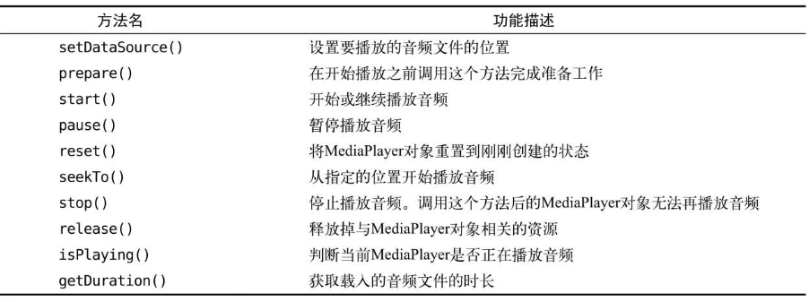
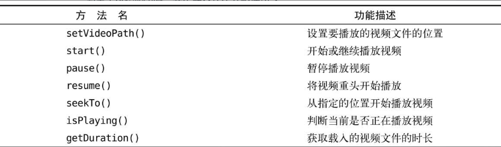

# 第08章  运用手机多媒体

## 使用通知

通知（Notification）是Android系统中比较有特色的一个功能，当某个应用程序希望向用户发出一些提示信息，而该应用程序又不在前台运行时，就可以借助通知来实现。发出一条通知后，手机最上方的状态栏中会显示一个通知的图标，下拉状态栏后可以看到通知的详细内容。

### 通知的基本用法

通知的用法还是比较灵活的，既可以**在活动里创建**，也可以**在广播接收器里创建**，还可以在下一章中即将学习的**在服务里创建**。相比于广播接收器和服务，在活动里创建通知的场景还是比较少的，因为一般只有当程序进入到后台的时候我们才需要使用通知。

无论是在哪里创建通知，整体的步骤都是相同的。首先需要一个`NotificationManager`来对通知进行管理，可以调用Context的`getSystemService()`方法获取到。`getSystemService()`方法接收一个字符串参数用于确定获取系统的哪个服务，这里我们传入`Context.NOTIFICATION_SERVICE`即可。因此，获取`NotificationManager`的实例就可以写成：

```java
NotificationManager manager = (NotificationManager)getSystemService(Context.NOTIFICATION_SERVICE);
```

接下来，需要使用一个Builder构造器来创建Notification对象，但问题在于，几乎Android系统的每一个版本都会对通知这部分功能进行或多或少的修改，API不稳定性问题在通知上面突显得尤其严重。

那么该如何解决这个问题呢？

其实解决方案我们之前已经见过好几回了，就是使用support库中提供的兼容API。`support-v4`库中提供了一个`NotificationCompat`类，使用这个类的构造器来创建Notification对象，就可以保证我们的程序在所有Android系统版本上都能正常工作了，代码如下所示：

```java
Notification notification = new NotificationCompat.Builder(context).build();
```

但是，在Android O 版本后，`NotificationCompat.Builder()`方法被弃用了。

书中的方法需要用以下方法取代

```java
NotificationManager manager = (NotificationManager) getSystemService(NOTIFICATION_SERVICE);
//高版本需要渠道
if (Build.VERSION.SDK_INT >= android.os.Build.VERSION_CODES.O) {
    //在Android O之上需要渠道，这里的第一个参数是渠道id，第二个参数是渠道名
    NotificationChannel notificationChannel = new NotificationChannel("1", "name", NotificationManager.IMPORTANCE_HIGH);
    manager.createNotificationChannel(notificationChannel);
}
Notification notification = new NotificationCompat.Builder(MainActivity.this, "1")
        .setContentTitle("This is content title")
        .setContentText("This is content text")
        .setWhen(System.currentTimeMillis())
        .setSmallIcon(R.mipmap.ic_launcher)
        .setLargeIcon(BitmapFactory.decodeResource(getResources(),
                R.mipmap.ic_launcher))
        .build();
manager.notify(1, notification);
```

首先我们先判断Android的版本，如果大于O，那么我们需要开启渠道才能显示通知。否则我们使用`NotificationCompat.Builder()`方法。

我们链式调用了5个设置方法：

- `setContentTitle()`方法用于指定通知的标题内容，下拉系统状态栏就可以看到这部分内容。
- `setContentText()`方法用于指定通知的正文内容，同样下拉系统状态栏就可以看到这部分内容。
- `setWhen()`方法用于指定通知被创建的时间，以毫秒为单位，当下拉系统状态栏时，这里指定的时间会显示在相应的通知上。
- `setSmallIcon()`方法用于设置通知的小图标，注意只能使用纯alpha图层的图片进行设置，小图标会显示在系统状态栏上。
- `setLargeIcon()`方法用于设置通知的大图标，当下拉系统状态栏时，就可以看到设置的大图标了。

接着我们调用`NotificationManager`的`notify()`方法就可以让通知显示出来了。`notify()`方法接收两个参数，第一个参数是id，要保证为每个通知所指定的id都是不同的。第二个参数则是Notification对象，这里直接将我们刚刚创建好的Notification对象传入即可。

使用通知示例：

新建一个NotificationTest项目，修改activity_main.xml中的代码

```xml
<LinearLayout xmlns:android="http://schemas.android.com/apk/res/android"
    android:orientation="vertical"
    android:layout_width="match_parent"
    android:layout_height="match_parent">
    <Button
        android:layout_width="wrap_content"
        android:layout_height="wrap_content"
        android:id="@+id/send_notice"
        android:text="Send notice"/>
</LinearLayout>
```

这里我们放置了一个按钮用于发出一条通知

修改MainActivity中的代码

```java
public class MainActivity extends AppCompatActivity implements View.OnClickListener {

    @Override
    protected void onCreate(Bundle savedInstanceState) {
        super.onCreate(savedInstanceState);
        setContentView(R.layout.activity_main);
        Button sendNotice = (Button) findViewById(R.id.send_notice);
        sendNotice.setOnClickListener(this);
    }
    @Override
    public void onClick(View view) {
        switch (view.getId()) {
            case R.id.send_notice:
                NotificationManager manager = (NotificationManager)getSystemService(NOTIFICATION_SERVICE);
                if (Build.VERSION.SDK_INT >= Build.VERSION_CODES.O) {
                    String channelId = "1";
                    String channelName = "默认通知";
                    manager.createNotificationChannel(new NotificationChannel(channelId, channelName, NotificationManager.IMPORTANCE_HIGH));
                }
                Notification notification = new NotificationCompat.Builder(MainActivity.this,"default")
                        .setContentTitle("This is content title")
                        .setContentText("This is content text")
                        .setWhen(System.currentTimeMillis())
                        .setSmallIcon(R.mipmap.ic_launcher)
                        .setLargeIcon(BitmapFactory.decodeResource(getResources(),
                R.mipmap.ic_launcher))
                    	.build();
                manager.notify(1,notification);
                break;
            default:
                break;
        }
    }
}
```

我们在Send notice按钮的点击事件里面完成了通知的创建。

但是当你下拉系统状态栏并点击这条通知的时候，会发现没有任何效果。

要想实现通知的点击效果，还需要在代码中进行相应的设置，这就涉及了一个新的概念：PendingIntent。

PendingIntent从名字上看起来就和Intent有些类似，它们之间也确实存在着不少共同点。比如它们都可以去指明某一个“意图”，都可以用于启动活动、启动服务以及发送广播等。不同的是，Intent更加倾向于去立即执行某个动作，而PendingIntent更加倾向于在某个合适的时机去执行某个动作。所以，也可以把PendingIntent简单地理解为延迟执行的Intent。

PendingIntent的用法同样很简单，它主要提供了几个静态方法用于获取PendingIntent的实例，可以根据需求来选择是使用`getActivity()`方法、`getBroadcast()`方法，还是`getService()`方法。这几个方法所接收的参数都是相同的：

- 第一个参数依旧是Context，不用多做解释。
- 第二个参数一般用不到，通常都是传入0即可。
- 第三个参数是一个Intent对象，我们可以通过这个对象构建出PendingIntent的“意图”。
- 第四个参数用于确定PendingIntent的行为，有`FLAG_ONE_SHOT`、`FLAG_NO_CREATE`、`FLAG_CANCEL_CURRENT`和`FLAG_UPDATE_CURRENT`这4种值可选，每种值的具体含义你可以查看文档，通常情况下这个参数传入0就可以了。

我们再回过头来看一下`NotificationCompat.Builder`。这个构造器还可以再连缀一个`setContentIntent()`方法，接收的参数正是一个PendingIntent对象。因此，这里就可以通过PendingIntent构建出一个延迟执行的“意图”，当用户点击这条通知时就会执行相应的逻辑。

现在我们来优化一下NotificationTest项目，给刚才的通知加上点击功能，让用户点击它的时候可以启动另一个活动。首先需要准备好另一个活动，右击`com.example.notificationtest`包→New→Activity→Empty Activity，新建NotificationActivity，布局起名为notification_layout。然后修改notification_layout.xml中的代码

```xml
<RelativeLayout xmlns:android="http://schemas.android.com/apk/res/android"
    android:layout_width="match_parent"
    android:layout_height="match_parent">
    <TextView
        android:layout_width="wrap_content"
        android:layout_height="wrap_content"
        android:layout_centerInParent="true"
        android:textSize="24sp"
        android:text="This is notification layout"/>
</RelativeLayout>
```

接下来修改MainActivity中的代码，给通知加入点击功能

```java
public class MainActivity extends AppCompatActivity implements View.OnClickListener {

    @Override
    protected void onCreate(Bundle savedInstanceState) {
        super.onCreate(savedInstanceState);
        setContentView(R.layout.activity_main);
        Button sendNotice = (Button) findViewById(R.id.send_notice);
        sendNotice.setOnClickListener(this);
    }
    @Override
    public void onClick(View view) {
        switch (view.getId()) {
            case R.id.send_notice:
                Intent intent = new Intent(this,NotificationActivity.class);
                PendingIntent pendingIntent = PendingIntent.getActivity(this,0,intent,0);
                NotificationManager manager = (NotificationManager)getSystemService(NOTIFICATION_SERVICE);
                if (Build.VERSION.SDK_INT >= Build.VERSION_CODES.O) {
                    String channelId = "1";
                    String channelName = "默认通知";
                    manager.createNotificationChannel(new NotificationChannel(channelId, channelName, NotificationManager.IMPORTANCE_HIGH));
                }
                Notification notification = new NotificationCompat.Builder(MainActivity.this,"default")
                        .setContentTitle("My notification")
                        .setContentText("Hello World!")
                        .setWhen(System.currentTimeMillis())
                        .setSmallIcon(R.mipmap.ic_launcher)
                        .setLargeIcon(BitmapFactory.decodeResource(getResources(), R.mipmap.ic_launcher))
                        .setContentIntent(pendingIntent)
                        .build();
                manager.notify(1,notification);
                break;
            default:
                break;
        }
    }
}
```

可以看到，这里先是使用Intent表达出我们想要启动NotificationActivity的“意图”，然后将构建好的Intent对象传入到PendingIntent的`getActivity()`方法里，以得到PendingIntent的实例，接着在`NotificationCompat.Builder`中调用`setContentIntent()`方法，把它作为参数传入即可。

当我们点击通知之后，系统状态上的通知图标并没有消失。如果我们没有在代码中对该通知进行取消，它就会一直显示在系统的状态栏上。

解决的方法有两种，一种是在`NotificationCompat.Builder`中再连缀一个`setAutoCancel()`方法，一种是显式地调用NotificationManager的`cancel()`方法将它取消，两种方法我们都学习一下。

第一种方法写法如下：

```java
Notification notification = new NotificationCompat.Builder(MainActivity.this,"default")
                        ...
                        .setAutoCancel(true)
                        .build();
```

`setAutoCancel()`方法传入true，就表示当点击了这个通知的时候，通知会自动取消掉。

第二种方法写法如下：

```java
public class NotificationActivity extends AppCompatActivity {

    @Override
    protected void onCreate(Bundle savedInstanceState) {
        super.onCreate(savedInstanceState);
        setContentView(R.layout.notification_layout);
        NotificationManager manager = (NotificationManager) getSystemService(NOTIFICATION_SERVICE);
        manager.cancel(1);
    }
}
```

这个1就是我们给这条通知设置的id。因此，如果你想取消哪条通知，在cancel()方法中传入该通知的id就行了。

注意，这里我们是在NotificationActivity中（不是MainActivity）取消通知的。

### 通知的进阶技巧

上一小节中创建的通知属于最基本的通知，实际上，`NotificationCompat.Builder`中提供了非常丰富的API来让我们创建出更加多样的通知效果。

先来看看`setSound()`方法，它可以在通知发出的时候播放一段音频，这样就能够更好地告知用户有通知到来。`setSound()`方法接收一个Uri参数，所以在指定音频文件的时候还需要先获取到音频文件对应的URI。比如说，每个手机的`/system/media/audio/ringtones`目录下都有很多的音频文件，我们可以从中随便选一个音频文件，那么在代码中就可以这样指定：

```java
Notification notification = new NotificationCompat.Builder(this)
        ...
        .setSound(Uri.fromFile(new File("/system/media/audio/ringtones/Luna.ogg")))
        .build();
```

我们还可以在通知到来的时候让手机进行振动，使用的是`vibrate`这个属性。它是一个长整型的数组，用于设置手机静止和振动的时长，以毫秒为单位。下标为0的值表示手机静止的时长，下标为1的值表示手机振动的时长，下标为2的值又表示手机静止的时长，以此类推。所以，如果想要让手机在通知到来的时候立刻振动1秒，然后静止1秒，再振动1秒，代码就可以写成：

```java
Notification notification = new NotificationCompat.Builder(this)
        ...
        .setVibrate(new long[] {0, 1000, 1000, 1000 })
        .build();
```

需要注意的是，要控制手机振动还需要声明权限。因此，我们还得编辑AndroidManifest.xml文件，加入如下声明：

```xml
<manifest xmlns:android="http://schemas.android.com/apk/res/android"
    package="com.example.notificationtest"
    android:versionCode="1"
    android:versionName="1.0">
    <uses-permission android:name="android.permission.VIBRATE"/>
    ...
</manifest>

```

通知到来时，如果想要实现LED灯以绿色的灯光一闪一闪的效果，就可以写成：

```java
Notification notification = new NotificationCompat.Builder(this)
        ...
        .setLights(Color.GREEN, 1000, 1000)
        .build();
```

如果你不想进行那么多繁杂的设置，也可以直接使用通知的默认效果，它会根据当前手机的环境来决定播放什么铃声，以及如何振动，写法如下：

```java
Notification notification = new NotificationCompat.Builder(this)
        ...
        .setDefaults(NotificationCompat.DEFAULT_ALL)
        .build();
```

注意，以上所涉及的这些进阶技巧都要在手机上运行才能看得到效果。

### 通知的高级功能

接下来我们继续学习`NotificationCompat.Builder`中一些更加强大的API的用法，从而构建出更加丰富的通知效果。

**`setStyle()`方法**，这个方法允许我们构建出富文本的通知内容。也就是说通知中不光可以有文字和图标，还可以包含更多的东西。`setStyle()`方法接收一个`NotificationCompat.Style`参数，这个参数就是用来构建具体的富文本信息的，如长文字、图片等。

在开始使用`setStyle()`方法之前，我们先来做一个试验，之前的通知内容都比较短，如果设置成很长的文字会是什么效果呢？比如这样写：

```java
Notification notification = new NotificationCompat.Builder(MainActivity.this,"default")
                        .setContentTitle("My notification")
                        .setContentText("Learn how to build notifications,send and sync data, and use voice actions.Get the official Android IDE and developer tools to build apps for Android.")
                        ...
                        .build();
```

程序运行的效果是：通知内容是无法显示完整的，多余的部分会用省略号来代替。但是如果你真的非常需要在通知当中显示一段长文字，Android也是支持的，通过`setStyle()`方法就可以做到，具体写法如下：

```java
Notification notification = new NotificationCompat.Builder(MainActivity.this,"default")
                        .setContentTitle("My notification")
                        .setStyle(new NotificationCompat.BigTextStyle().bigText("Learn how to build notifications,send and sync data, and use voice actions.Get the official Android IDE and developer tools to build apps for Android."))
                        ...
                        .build();
```

在lifestyle()`方法中创建了一个`NotificationCompat.BigTextStyle`对象，这个对象就是用于封装长文字信息的，我们调用它的`bigText()`方法并将文字内容作为参数传入。

除了显示长文字之外，通知里还可以显示一张大图片，具体用法也是基本相似的：

```java
Notification notification = new NotificationCompat.Builder(this, "1")
		.setContentTitle("这是一个内容标题")
		...
		.setStyle(new NotificationCompat.BigPictureStyle().bigPicture(BitmapFactory.decodeResource(getResources(), R.drawable.big_image)))
		.setPriority(NotificationCompat.PRIORITY_MAX)
		.build();
```

在`setStyle()`方法中创建了一个`NotificationCompat.BigPictureStyle`对象，这个对象就是用于设置大图片的，然后调用它的`bigPicture()`方法并将图片作为参数传入。图片资源需要通过BitmapFactory的`decodeResource()`方法解析成Bitmap对象，再传入到`bigPicture()`方法中。

**`setPriority()`方法**，它可以用于设置通知的重要程度。`setPriority()`方法接收一个整型参数用于设置这条通知的重要程度，一共有5个常量值可选：

- `PRIORITY_DEFAULT`表示默认的重要程度，和不设置效果是一样的；
- `PRIORITY_MIN`表示最低的重要程度，系统可能只会在特定的场景才显示这条通知，比如用户下拉状态栏的时候；
- `PRIORITY_LOW`表示较低的重要程度，系统可能会将这类通知缩小，或改变其显示的顺序，将其排在更重要的通知之后；
- `PRIORITY_HIGH`表示较高的重要程度，系统可能会将这类通知放大，或改变其显示的顺序，将其排在比较靠前的位置；
- `PRIORITY_MAX`表示最高的重要程度，这类通知消息必须要让用户立刻看到，甚至需要用户做出响应操作。

具体写法如下：

```xml
Notification notification = new NotificationCompat.Builder(MainActivity.this,"default")
                        ...
                        .setPriority(NotificationCompat.PRIORITY_MAX)
                        .build();
```

这里我们将通知的重要程度设置成了最高，表示这是一条非常重要的通知，要求用户必须立刻看到。

## 调用摄像头和相册

本节我们将学习调用摄像头和相册方面的知识。

### 调用摄像头拍照

现在很多的应用都会要求用户上传一张图片来作为头像，这时打开摄像头拍张照是最简单快捷的。下面就让我们通过一个例子来学习一下，如何才能在应用程序里调用手机的摄像头进行拍照。

新建一个CameraAlbumTest项目，然后修改activity_main.xml中的代码，如下所示：

```xml
<?xml version="1.0" encoding="utf-8"?>
<LinearLayout xmlns:android="http://schemas.android.com/apk/res/android"
    android:orientation="vertical"
    android:layout_width="match_parent"
    android:layout_height="match_parent">
    <Button
        android:layout_width="match_parent"
        android:layout_height="wrap_content"
        android:id="@+id/take_photo"
        android:text="Take Photo"/>
    <ImageView
        android:layout_width="wrap_content"
        android:layout_height="wrap_content"
        android:id="@+id/picture"
        android:layout_gravity="center_horizontal"/>
</LinearLayout>
```

布局文件中只有两个控件，一个Button和一个ImageView。Button是用于打开摄像头进行拍照的，而ImageView则是用于将拍到的图片显示出来。

然后开始编写调用摄像头的具体逻辑，修改MainActivity中的代码

```java
package com.example.cameraalbumtest;
...

public class MainActivity extends AppCompatActivity {
    public static final int TAKE_PHOTO = 1;
    private ImageView picture;
    private Uri imageUri;
    @Override
    protected void onCreate(Bundle savedInstanceState) {
        super.onCreate(savedInstanceState);
        setContentView(R.layout.activity_main);
        Button takePhoto = (Button) findViewById(R.id.take_photo);
        takePhoto.setOnClickListener(new View.OnClickListener() {
            @Override
            public void onClick(View view) {
                //创建File对象，用于存储拍照后的照片
                File outputImage = new File(getExternalCacheDir(),"output_image.jpg");
                try {
                    if (outputImage.exists()) {
                        outputImage.delete();
                    }
                    outputImage.createNewFile();
                } catch (IOException e) {
                    e.printStackTrace();
                }
                if (Build.VERSION.SDK_INT >= 24) {
                    imageUri = FileProvider.getUriForFile(MainActivity.this,"" +
                            "com.example.cameraalbumtest.fileprovider",outputImage);
                } else {
                    imageUri = Uri.fromFile(outputImage);
                }
                //启动相机程序
                Intent intent = new Intent("android.media.action.IMAGE_CAPTURE");
                intent.putExtra(MediaStore.EXTRA_OUTPUT,imageUri);
                startActivityForResult(intent,TAKE_PHOTO);
            }
        });
    }

    @Override
    protected void onActivityResult(int requestCode, int resultCode, @Nullable Intent data) {
        super.onActivityResult(requestCode, resultCode, data);
        switch (requestCode) {
            case TAKE_PHOTO:
            if (requestCode == RESULT_OK) {
                try {
                    //将拍摄的照片显示出来
                    Bitmap bitmap = BitmapFactory.decodeStream(getContentResolver().openInputStream(imageUri));
                    picture.setImageBitmap(bitmap);
                } catch (FileNotFoundException e) {
                    e.printStackTrace();
                }
            }
            break;
            default:
                break;
        }
    }
}
```

我们重点看一下调用摄像头的这部分代码

首先这里创建了一个File对象，用于存放摄像头拍下的图片，这里我们把图片命名为output_image.jpg，并将它存放在手机SD卡的应用关联缓存目录下。

什么叫作应用关联缓存目录呢？就是指SD卡中专门用于存放当前应用缓存数据的位置，调用`getExternalCacheDir()`方法可以得到这个目录，具体的路径是`/sdcard/Android/data/<package name>/cache`。

那么为什么要使用应用关联缓存目录来存放图片呢？因为从Android 6.0系统开始，读写SD卡被列为了危险权限，如果将图片存放在SD卡的任何其他目录，都要进行运行时权限处理才行，而使用应用关联目录则可以跳过这一步。

接着会进行一个判断，如果运行设备的系统版本低于Android 7.0，就调用Uri的`fromFile()`方法将File对象转换成Uri对象，这个Uri对象标识着output_image.jpg这张图片的本地真实路径。否则，就调用FileProvider的`getUriForFile()`方法将File对象转换成一个封装过的Uri对象。`getUriForFile()`方法接收3个参数：

- 第一个参数要求传入Context对象；

- 第二个参数可以是任意唯一的字符串，

- 第三个参数则是我们刚刚创建的File对象。

之所以要进行这样一层转换，是因为从Android 7.0系统开始，直接使用本地真实路径的Uri被认为是不安全的，会抛出一个`FileUriExposedException`异常。而FileProvider则是一种特殊的内容提供器，它使用了和内容提供器类似的机制来对数据进行保护，可以选择性地将封装过的Uri共享给外部，从而提高了应用的安全性。

接下来构建出了一个Intent对象，并将这个Intent的action指定为`android.media. action.IMAGE_CAPTURE`，再调用Intent的`putExtra()`方法指定图片的输出地址，这里填入刚刚得到的Uri对象，最后调用`startActivityForResult()`来启动活动。

由于我们使用的是一个隐式Intent，系统会找出能够响应这个Intent的活动去启动，这样照相机程序就会被打开，拍下的照片将会输出到output_image.jpg中。

注意，刚才我们是使用`startActivityForResult()`来启动活动的，因此拍完照后会有结果返回到`onActivityResult()`方法中。如果发现拍照成功，就可以调用BitmapFactory的`decodeStream()`方法将output_image.jpg这张照片解析成Bitmap对象，然后把它设置到ImageView中显示出来。

接着我们要在AndroidManifest.xml中对FileProvider内容提供器进行注册

```xml
<?xml version="1.0" encoding="utf-8"?>
<manifest xmlns:android="http://schemas.android.com/apk/res/android"
    package="com.example.cameraalbumtest">

    <application
        android:allowBackup="true"
        android:icon="@mipmap/ic_launcher"
        android:label="@string/app_name"
        android:roundIcon="@mipmap/ic_launcher_round"
        android:supportsRtl="true"
        android:theme="@style/Theme.CameraAlbumTest">
        ...
        <!--android:name="android.support.v4.content.FileProvider"爆红
        解决办法，需要将其换成androidx.core.content.FileProvider-->
        <provider
            android:name="androidx.core.content.FileProvider"
            android:authorities="com.example.cameraalbumtest.fileprovider"
            android:exported="false"
            android:grantUriPermissions="true">
            <meta-data
                android:name="android.support.FILE_PROVIDER_PATHS"
                android:resource="@xml/file_paths"/>
		</provider> 
    </application>
</manifest>
```

`android:authorities`属性的值必须要和刚才`FileProvider.getUriForFile()`方法中的第二个参数一致。另外，这里还在`<provider>`标签的内部使用`<meta-data>`来指定Uri的共享路径，并引用了一个`@xml/file_paths`资源。

当然，这个资源现在还是不存在的，下面我们就来创建它。右击res目录→New→Directory，创建一个xml目录，接着右击xml目录→New→File，创建一个file_paths.xml文件。然后修改file_paths.xml文件中的内容，如下所示：

```xml
<?xml version="1.0" encoding="utf-8"?>
<paths xmlns:android="http://schemas.android.com/apk/res/android">
    <external-path name="my_images" path="" />
</paths>
```

其中，external-path就是用来指定Uri共享的，name属性的值可以随便填，path属性的值表示共享的具体路径。这里设置空值就表示将整个SD卡进行共享，你也可以仅共享我们存放output_image.jpg这张图片的路径。

**注意：**上面的path属性设置空值时，会有爆红，但是不会影响运行结果。如果不想爆红，可以填存放output_image.jpg这张图片的路径。

另外，还有一点要注意，在Android 4.4系统之前，访问SD卡的应用关联目录也是要声明权限的，从4.4系统开始不再需要权限声明。那么我们为了能够兼容老版本系统的手机，还需要在AndroidManifest.xml中声明一下访问SD卡的权限：

```xml
<?xml version="1.0" encoding="utf-8"?>
<manifest xmlns:android="http://schemas.android.com/apk/res/android"
    package="com.example.cameraalbumtest">
    <uses-permission android:name="android.permission.WRITE_EXTERNAL_STORAGE"/>
    ...
    </application>
</manifest>
```

### 从相册中选择照片

在真实的使用场景中，直接从相册里选取一张现有的照片会比打开相机拍一张照片更加常用。下面我们来学习一下如何实现从相册中选择照片的功能。

我们将在CameraAlbumTest项目的基础上进行修改，编辑activity_main.xml文件，在布局中添加一个按钮用于从相册中选择照片，代码如下所示：

```xml
<?xml version="1.0" encoding="utf-8"?>
<LinearLayout xmlns:android="http://schemas.android.com/apk/res/android"
    android:orientation="vertical"
    android:layout_width="match_parent"
    android:layout_height="match_parent">
    <Button
        android:layout_width="match_parent"
        android:layout_height="wrap_content"
        android:id="@+id/take_photo"
        android:text="Take Photo"/>
    <Button
        android:layout_width="match_parent"
        android:layout_height="wrap_content"
        android:id="@+id/choose_from_album"
        android:text="Choose From Album"/>
    <ImageView
        android:layout_width="wrap_content"
        android:layout_height="wrap_content"
        android:id="@+id/picture"
        android:layout_gravity="center_horizontal"/>
</LinearLayout>
```

然后修改MainActivity中的代码，加入从相册选择照片的逻辑，代码如下所示：

```java
package com.example.cameraalbumtest;

public class MainActivity extends AppCompatActivity {
    public static final int TAKE_PHOTO = 1;
    public static final int CHOOSE_PHOTO = 2;
    private ImageView picture;
    private Uri imageUri;

    @Override
    protected void onCreate(Bundle savedInstanceState) {
        super.onCreate(savedInstanceState);
        setContentView(R.layout.activity_main);
        Button takePhoto = (Button) findViewById(R.id.take_photo);
        Button chooseFromAlbum = (Button) findViewById(R.id.choose_from_album);
        picture = (ImageView) findViewById(R.id.picture);
        takePhoto.setOnClickListener(new View.OnClickListener() {
           ...
        });
        chooseFromAlbum.setOnClickListener(new View.OnClickListener() {
            @Override
            public void onClick(View view) {
                if (ContextCompat.checkSelfPermission(MainActivity.this, Manifest.permission.WRITE_EXTERNAL_STORAGE) != PackageManager.PERMISSION_GRANTED) {
                    ActivityCompat.requestPermissions(MainActivity.this, new String[]{ Manifest.permission.WRITE_EXTERNAL_STORAGE }, 1);
                } else {
                    openAlbum();
                }
            }
        });
    }

    private void openAlbum() {
        Intent intent = new Intent("android.intent.action.GET_CONTENT");
        intent.setType("image/*");
        startActivityForResult(intent, CHOOSE_PHOTO);//打开相册
    }

    @Override
    public void onRequestPermissionsResult(int requestCode, @NonNull String[] permissions, @NonNull int[] grantResults) {
        super.onRequestPermissionsResult(requestCode, permissions, grantResults);
        switch (requestCode) {
            case 1:
                if (grantResults.length > 0 && grantResults[0] == PackageManager.PERMISSION_GRANTED) {
                    openAlbum();
                } else {
                    Toast.makeText(this, "You denied the permission", Toast.LENGTH_SHORT).show();
                }
                break;
            default:
        }
    }

    @Override
    protected void onActivityResult(int requestCode, int resultCode, @Nullable Intent data) {
        super.onActivityResult(requestCode, resultCode, data);
        switch (requestCode) {
            case TAKE_PHOTO:
                if (resultCode == RESULT_OK) {
                    try {
                        //将拍摄的照片显示出来
                        Bitmap bitmap = BitmapFactory.decodeStream(getContentResolver().openInputStream(imageUri));
                        picture.setImageBitmap(bitmap);
                    } catch (FileNotFoundException e) {
                        e.printStackTrace();
                    }
                }
                break;
            case CHOOSE_PHOTO:
                if (resultCode == RESULT_OK) {
                    //判断手机系统版本号
                    if (Build.VERSION.SDK_INT >= 19) {
                        //4.4及以上系统使用这个方法处理图片
                        handleImageOnKitKat(data);
                    } else {
                        //4.4以下的系统使用这个方法处理图片
                        handleImageBeforeKitKat(data);
                    }
                }
                break;
            default:
                break;
        }
    }

        private void handleImageOnKitKat(Intent data){
            String imagePath = null;
            Uri uri = data.getData();
            if (DocumentsContract.isDocumentUri(this, uri)) {
                //如果是document类型的Uri，则通过document id处理
                String docId = DocumentsContract.getDocumentId(uri);
                if ("com.android.providers.media.documents".equals(uri.getAuthority())) {
                    String id = docId.split(":")[1];//解析出数字格式的id
                    String selection = MediaStore.Images.Media._ID + "=" + id;
                    imagePath = getImagePath(MediaStore.Images.Media.EXTERNAL_CONTENT_URI,selection);
                } else if ("com.android.providers.downloads.documents".equals(uri.getAuthority())) {
                    Uri contentUri = ContentUris.withAppendedId(Uri.parse("content://downloads/public downloads"),Long.valueOf(docId));
                    imagePath = getImagePath(contentUri,null);
                } else if ("content".equalsIgnoreCase(uri.getScheme())) {
                    //如果是file类型的Uri，直接获取图片路径即可
                    imagePath = uri.getPath();
                }
                displayImage(imagePath);//根据图片路径显示图片
        }
    }

    private void handleImageBeforeKitKat(Intent data) {
        Uri uri = data.getData();
        String imagePath = getImagePath(uri,null);
        displayImage(imagePath);
    }

    private String getImagePath(Uri uri, String selection) {
        String path = null;
        //通过Uri和Selection来获取真是的路径图片
        Cursor cursor = getContentResolver().query(uri,null,selection,null,null);
        if (cursor != null) {
            if (cursor.moveToFirst()) {
                path = cursor.getString(cursor.getColumnIndex(MediaStore.Images.Media.DATA));
            }
            cursor.close();
        }
        return path;
    }
    private void displayImage(String imagePath) {
        if (imagePath != null) {
            Bitmap bitmap = BitmapFactory.decodeFile(imagePath);
            picture.setImageBitmap(bitmap);
        } else {
            Toast.makeText(this,"failed to get image",Toast.LENGTH_SHORT).show();
        }
    }
}
```

在Choose From Album按钮的点击事件里我们先是进行了一个运行时权限处理，动态申请`WRITE_EXTERNAL_STORAGE`这个危险权限。由于相册中的照片都是存储在SD卡上的，要从SD卡中读取照片就需要申请这个权限。WRITE_EXTERNAL_STORAGE表示同时授予程序对SD卡读和写的能力。

当用户授权了权限申请之后会调用`openAlbum()`方法，这里先是构建出了一个Intent对象，并将它的action指定为`android.intent.action.GET_CONTENT`。接着给这个Intent对象设置一些必要的参数，然后调用`startActivityForResult()`方法就可以打开相册程序选择照片了。

接下来的逻辑就比较复杂了，首先为了兼容新老版本的手机，我们做了一个判断，如果是4.4及以上系统的手机就调用`handleImageOnKitKat()`方法来处理图片，否则就调用`handleImageBeforeKitKat()`方法来处理图片。之所以要这样做，是因为Android系统从4.4版本开始，选取相册中的图片不再返回图片真实的Uri了，而是一个封装过的Uri，因此如果是4.4版本以上的手机就需要对这个Uri进行解析才行。

在`handleImageOnKitKat()`方法中，如果返回的Uri是document类型的话，那就取出document id进行处理，如果不是的话，那就使用普通的方式处理。另外，如果Uri的authority是media格式的话，document id还需要再进行一次解析，要通过字符串分割的方式取出后半部分才能得到真正的数字id。取出的id用于构建新的Uri和条件语句，然后把这些值作为参数传入到`getImagePath()`方法当中，就可以获取到图片的真实路径了。拿到图片的路径之后，再调用`displayImage()`方法将图片显示到界面上。

相比于`handleImageOnKitKat()`方法，`handleImageBeforeKitKat()`方法中的逻辑就要简单得多了，因为它的Uri是没有封装过的，不需要任何解析，直接将Uri传入到`getImagePath()`方法当中就能获取到图片的真实路径了，最后同样是调用`displayImage()`方法来让图片显示到界面上。

不过，目前我们的实现还不算完美，因为某些照片即使经过裁剪后体积仍然很大，直接加载到内存中有可能会导致程序崩溃。更好的做法是根据项目的需求先对照片进行适当的**压缩**，然后再加载到内存中。

## 播放多媒体文件

Android在播放音频和视频方面做了相当不错的支持，它提供了一套较为完整的API，使得开发者可以很轻松地编写出一个简易的音频或视频播放器。下面我们来学习一下如何播放音频和视频。

#### 播放音频

在Android中播放音频文件一般都是使用MediaPlayer类来实现的，它对多种格式的音频文件提供了非常全面的控制方法，从而使得播放音乐的工作变得十分简单。下表列出了MediaPlayer类中一些较为常用的控制方法。



我们来梳理一下MediaPlayer的工作流程。首先需要创建出一个MediaPlayer对象，然后调用`setDataSource()`方法来设置音频文件的路径，再调用`prepare()`方法使MediaPlayer进入到准备状态，接下来调用`start()`方法就可以开始播放音频，调用`pause()`方法就会暂停播放，调用`reset()`方法就会停止播放。

下面我们通过一个具体的例子来学习一下，新建一个PlayAudioTest项目，然后修改activity_main.xml中的代码，如下所示：

```xml
<?xml version="1.0" encoding="utf-8"?>
<LinearLayout xmlns:android="http://schemas.android.com/apk/res/android"
    android:orientation="vertical"
    android:layout_width="match_parent"
    android:layout_height="match_parent">

    <Button
        android:layout_width="match_parent"
        android:layout_height="wrap_content"
        android:id="@+id/play"
        android:text="Play"/>
    <Button
        android:layout_width="match_parent"
        android:layout_height="wrap_content"
        android:id="@+id/pause"
        android:text="Pause"/>
    <Button
        android:layout_width="match_parent"
        android:layout_height="wrap_content"
        android:id="@+id/stop"
        android:text="Stop"/>

</LinearLayout>
```

布局文件中放置了3个按钮，分别用于对音频文件进行播放、暂停和停止操作。然后修改MainActivity中的代码，如下所示：

```java
package com.example.playaudiotest;

public class MainActivity extends AppCompatActivity implements View.OnClickListener {
    private MediaPlayer mediaPlayer = new MediaPlayer();
    @Override
    protected void onCreate(Bundle savedInstanceState) {
        super.onCreate(savedInstanceState);
        setContentView(R.layout.activity_main);
        Button play = (Button) findViewById(R.id.play);
        Button pause = (Button) findViewById(R.id.pause);
        Button stop = (Button) findViewById(R.id.stop);
        play.setOnClickListener(this);
        pause.setOnClickListener(this);
        stop.setOnClickListener(this);
        if (ContextCompat.checkSelfPermission(MainActivity.this, Manifest.permission.WRITE_EXTERNAL_STORAGE) != PackageManager.PERMISSION_GRANTED) {
            ActivityCompat.requestPermissions(MainActivity.this,new String[] { Manifest.permission.WRITE_EXTERNAL_STORAGE },1);
        } else {
            initMediaPlayer();//初始化MediaPlayer
        }
    }
    private void initMediaPlayer() {
        try {
            //"liang.mp3"是我通过adb命令放置到手机SD卡的根目录的，你也可以通过手机助手来完成该步骤
            File file = new File(Environment.getExternalStorageDirectory(),"liang.mp3");
            mediaPlayer.setDataSource(file.getPath());//指定音频文件的路径
            mediaPlayer.prepare();//让MediaPlayer进入到准备状态
        } catch (Exception e) {
            e.printStackTrace();
        }
    }

    @Override
    public void onRequestPermissionsResult(int requestCode, @NonNull String[] permissions, @NonNull int[] grantResults) {
        super.onRequestPermissionsResult(requestCode, permissions, grantResults);
        switch (requestCode) {
            case 1:
                if (grantResults.length > 0 && grantResults[0] == PackageManager.PERMISSION_GRANTED) {
                    initMediaPlayer();
                } else {
                    Toast.makeText(this,"拒绝权限将无法使用程序",Toast.LENGTH_SHORT).show();
                    finish();
                }
                break;
            default:
        }
    }

    @Override
    public void onClick(View view) {
        switch (view.getId()) {
            case R.id.play:
                if (! mediaPlayer.isPlaying()) {
                    mediaPlayer.start();//开始播放
                }
                break;
            case R.id.pause:
                if (mediaPlayer.isPlaying()) {
                    mediaPlayer.pause();//暂停播放
                }
                break;
            case R.id.stop:
                if (mediaPlayer.isPlaying()) {
                    mediaPlayer.reset();//停止播放
                    initMediaPlayer();
                }
                break;
            default:
                break;
        }
    }

    @Override
    protected void onDestroy() {
        super.onDestroy();
        if (mediaPlayer != null) {
            mediaPlayer.stop();
            mediaPlayer.release();
        }
    }
}
```

可以看到，在类初始化的时候我们就先创建了一个MediaPlayer的实例，然后在`onCreate()`方法中进行了运行时权限处理，动态申请`WRITE_EXTERNAL_STORAGE`权限。这是由于程序播放SD卡中的音频文件必须要拥有访问SD卡的权限才行。

注意，在`onRequestPermissionsResult()`方法中，如果用户拒绝了权限申请，那么就调用`finish()`方法将程序直接关掉，因为如果没有SD卡的访问权限，我们这个程序将什么都干不了。

用户同意授权之后就会调用`initMediaPlayer()`方法为MediaPlayer对象进行初始化操作。在`initMediaPlayer()`方法中，首先是通过创建一个File对象来指定音频文件的路径，从这里可以看出，我们需要事先在SD卡的根目录下放置一个名为liang.mp3的音频文件(SD卡的根目录路径应该是`/storage/emulated/0`)。后面依次调用了`setDataSource()`方法和`prepare()`方法，为MediaPlayer做好了播放前的准备。

接下来，我们看一下各个按钮的点击事件中的代码。

- 当点击Play按钮时会进行判断，如果当前MediaPlayer没有正在播放音频，则调用`start()`方法开始播放。
- 当点击Pause按钮时会判断，如果当前MediaPlayer正在播放音频，则调用`pause()`方法暂停播放。
- 当点击Stop按钮时会判断，如果当前MediaPlayer正在播放音频，则调用`reset()`方法将MediaPlayer重置为刚刚创建的状态，然后重新调用一遍`initMediaPlayer()`方法。

最后在`onDestroy()`方法中，我们还需要分别调用`stop()`方法和`release()`方法，将与MediaPlayer相关的资源释放掉。另外，千万不要忘记在AndroidManifest.xml文件中声明用到的权限，如下所示：

```xml
<?xml version="1.0" encoding="utf-8"?>
<manifest xmlns:android="http://schemas.android.com/apk/res/android"
    package="com.example.playaudiotest">
    <uses-permission android:name="android.permission.WRITE_EXTERNAL_STORAGE"/>
    ....
</manifest>
```

### 播放视频

播放视频文件其实并不比播放音频文件复杂，主要是使用VideoView类来实现的。这个类将视频的显示和控制集于一身，使得我们仅仅借助它就可以完成一个简易的视频播放器。VideoView的用法和MediaPlayer也比较类似，主要有以下常用方法：



我们再通过一个具体的例子来学习一下，新建一个PlayVideoTest项目，然后修改activity_main.xml中的代码，如下所示：

```xml
<?xml version="1.0" encoding="utf-8"?>
<LinearLayout xmlns:android="http://schemas.android.com/apk/res/android"
    android:orientation="vertical"
    android:layout_width="match_parent"
    android:layout_height="match_parent">
    <LinearLayout
        android:layout_width="match_parent"
        android:layout_height="wrap_content">
        <Button
            android:layout_width="0dp"
            android:layout_height="wrap_content"
            android:layout_weight="1"
            android:id="@+id/play"
            android:text="Play"/>
        <Button
            android:layout_width="0dp"
            android:layout_height="wrap_content"
            android:layout_weight="1"
            android:id="@+id/pause"
            android:text="Pause"/>
        <Button
            android:layout_width="0dp"
            android:layout_height="wrap_content"
            android:layout_weight="1"
            android:id="@+id/replay"
            android:text="Replay"/>
    </LinearLayout>
    <VideoView
        android:layout_width="match_parent"
        android:layout_height="wrap_content"
        android:id="@+id/video_view"/>
</LinearLayout>
```

在这个布局文件中，首先放置了3个按钮，分别用于控制视频的播放、暂停和重新播放。然后在按钮下面又放置了一个VideoView，我们的视频就将在这里显示。接下来修改MainActivity中的代码，如下所示：

```java
package com.example.playvideotest;

public class MainActivity extends AppCompatActivity implements View.OnClickListener {
    private VideoView videoView;
    @Override
    protected void onCreate(Bundle savedInstanceState) {
        super.onCreate(savedInstanceState);
        setContentView(R.layout.activity_main);
        videoView = (VideoView) findViewById(R.id.video_view);
        Button play = (Button) findViewById(R.id.play);
        Button pause = (Button) findViewById(R.id.pause);
        Button replay = (Button) findViewById(R.id.replay);

        play.setOnClickListener(this);
        pause.setOnClickListener(this);
        replay.setOnClickListener(this);

        if (ContextCompat.checkSelfPermission(MainActivity.this, Manifest.permission.WRITE_EXTERNAL_STORAGE) != PackageManager.PERMISSION_GRANTED) {
            ActivityCompat.requestPermissions(MainActivity.this,new String[] { Manifest.permission.WRITE_EXTERNAL_STORAGE },1);
        } else {
            initVideoPath();//初始化 VideoView
        }
    }

    private void initVideoPath() {
        //"kun.mp4"是我通过adb命令放置到手机SD卡的根目录的，你也可以通过手机助手来完成该步骤
        File file = new File(Environment.getExternalStorageDirectory(),"kun.mp4");
        videoView.setVideoPath(file.getPath());//指定视频文件的路径
    }

    @Override
    public void onRequestPermissionsResult(int requestCode, @NonNull String[] permissions, @NonNull int[] grantResults) {
        super.onRequestPermissionsResult(requestCode, permissions, grantResults);
        switch (requestCode) {
            case 1:
                if (grantResults.length > 0 && grantResults[0] == PackageManager.PERMISSION_GRANTED) {
                    initVideoPath();
                } else {
                    Toast.makeText(this,"拒绝权限将无法使用程序",Toast.LENGTH_SHORT).show();
                    finish();
                }
                break;
            default:
        }
    }

    @Override
    public void onClick(View view) {
        switch (view.getId()) {
            case R.id.play:
                if (! videoView.isPlaying()) {
                    videoView.start();//开始播放
                }
                break;
            case R.id.pause:
                if (videoView.isPlaying()) {
                    videoView.pause();//停止播放
                }
                break;
            case R.id.replay:
                    if (videoView.isPlaying()) {
                        videoView.resume();//重新播放
                    }
                break;
        }
    }

    @Override
    protected void onDestroy() {
        super.onDestroy();
        if (videoView != null) {
            videoView.suspend();
        }
    }
}
```

这部分代码和前面播放音频的代码非常类似。

首先在`onCreate()`方法中同样进行了一个运行时权限处理，因为视频文件将会放在SD卡上。当用户同意授权了之后就会调用`initVideoPath()`方法来设置视频文件的路径，这里我们需要事先在SD卡的根目录下放置一个名为：`kun.mp4`的视频文件。

下面看一下各个按钮的点击事件中的代码。

- 当点击Play按钮时会进行判断，如果当前并没有正在播放视频，则调用`start()`方法开始播放。

- 当点击Pause按钮时会判断，如果当前视频正在播放，则调用`pause()`方法暂停播放。

- 当点击Replay按钮时会判断，如果当前视频正在播放，则调用`resume()`方法从头播放视频。最后在

`onDestroy()`方法中，我们还需要调用一下`suspend()`方法，将VideoView所占用的资源释放掉。

另外，仍然始终要记得在AndroidManifest.xml文件中声明用到的权限，如下所示：

```xml
<?xml version="1.0" encoding="utf-8"?>
<manifest xmlns:android="http://schemas.android.com/apk/res/android"
    package="com.example.playvideotest">
    <uses-permission android:name="android.permission.WRITE_EXTERNAL_STORAGE"/>
    ...
</manifest>
```

为什么它的用法和MediaPlayer这么相似呢？其实VideoView只是帮我们做了一个很好的封装而已，它的背后仍然是使用MediaPlayer来对视频文件进行控制的。

需要注意，VideoView并不是一个万能的视频播放工具类，它在视频格式的支持以及播放效率方面都存在着较大的不足。所以，如果想要仅仅使用VideoView就编写出一个功能非常强大的视频播放器是不太现实的。但是如果只是用于播放一些游戏的片头动画，或者某个应用的视频宣传，使用VideoView还是绰绰有余的。