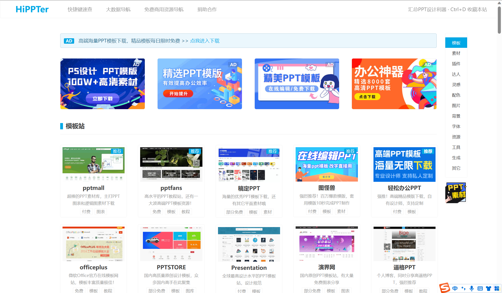
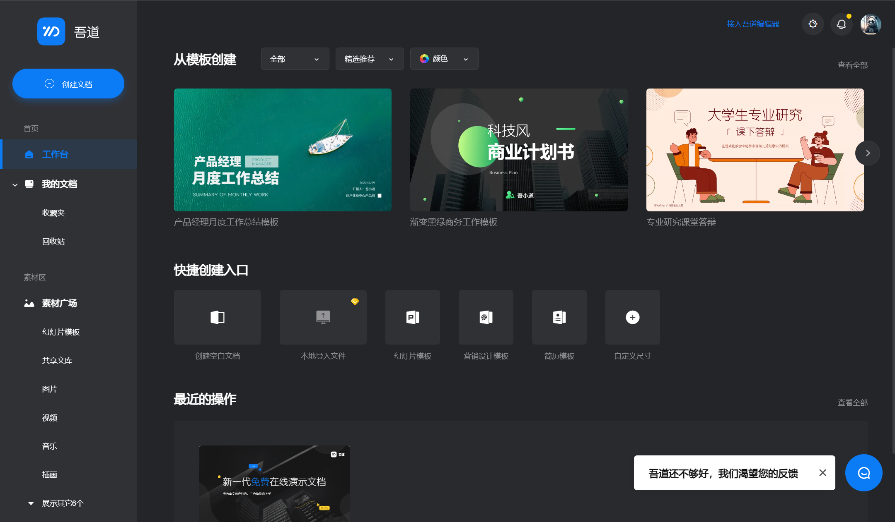
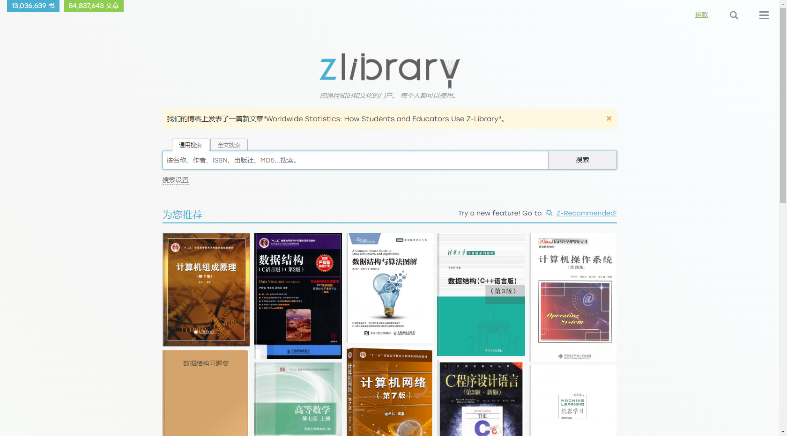
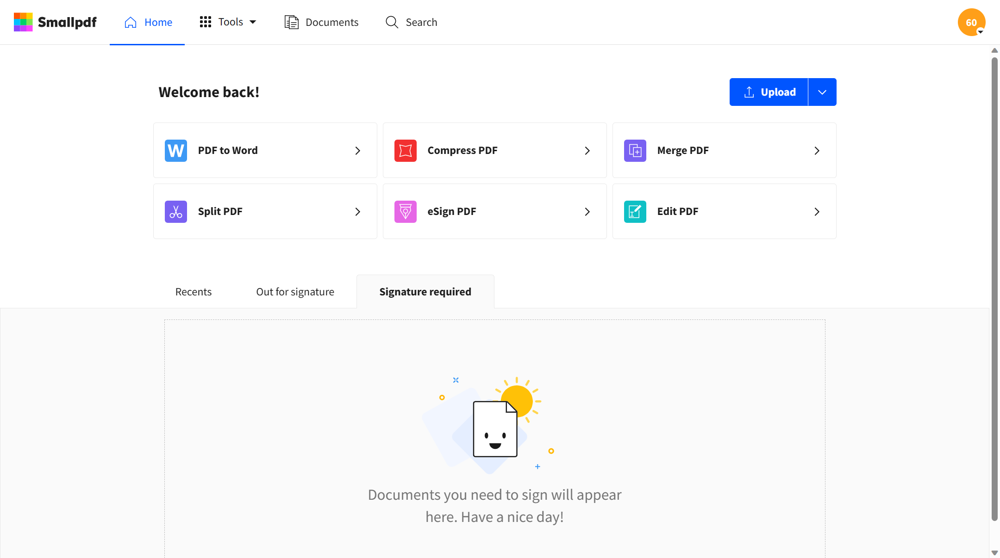

## 1.HiPPTer

HiPPTer是一个包含PPT模板等设计素材的导航网站。它提供了多个PPT资源的模板站，还有丰富的图片、字体、配色等资源网站。

## 2.吾道幻灯片

吾道幻灯片是一款在线PPT制作工具，用户可以通过吾道幻灯片创建出漂亮的幻灯片和演示文稿。它提供了多种PPT模板和主题，支持多种图片、图表、视频等素材的添加和编辑。同时，吾道幻灯片还提供了一些创新功能，比如智能排版、语音识别等，帮助用户更快、更方便地制作演示文稿。此外，吾道幻灯片还支持在线协作和分享，用户可以邀请多人同时编辑和查看幻灯片，方便团队协作。

## 3.zlibrary

Z-Library是一个免费的在线数字图书馆，提供了数百万本电子书、文章、期刊等资源供用户免费下载。Z-Library的图书资源涵盖了多个学科领域，包括自然科学、人文社科、计算机科学、医学等。用户可以通过搜索关键词或者ISBN号来查找需要的图书，并且大部分资源都是高质量的PDF格式。Z-Library还提供了多种语言的版本，支持用户在多个国家和地区使用。值得一提的是，Z-Library是一个非营利性的组织，其宗旨是促进知识共享和全球教育。

4.Smallpdf

Smallpdf是一款在线PDF处理工具，可以帮助用户轻松地对PDF文件进行转换、压缩、编辑、合并、拆分等操作。Smallpdf支持的文件格式包括PDF、Microsoft Office、图片等常见格式，用户可以直接将这些文件拖拽到Smallpdf网站上进行处理。此外，Smallpdf还提供了安全可靠的云存储服务，用户可以上传和分享PDF文件，同时保证文件的隐私和安全。Smallpdf具有简洁明了的用户界面和强大的功能，非常适合需要频繁处理PDF文件的用户使用。

